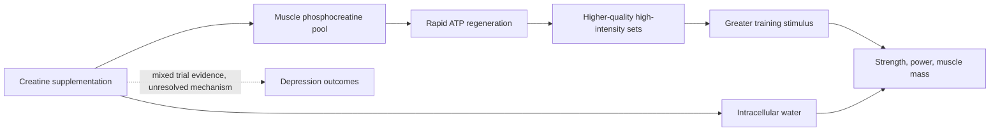

# Creatine

Creatine is a naturally occurring compound stored in muscle largely as phosphocreatine, where it acts as a phosphate donor — the fastest route to regenerating ATP during brief, high-intensity effort. Supplementation raises the muscle creatine pool, supporting repeated high-power contractions and, secondarily, cellular water content (muscle is roughly 70% water, and creatine's osmotic effect contributes to its mass and performance effects). (Peter Attia MD — "Building strength and muscle mass: optimize training & nutrition for longevity (AMA #71 rebroadcast)", 2026-07-06, [link](https://www.youtube.com/watch?v=CqNqfb37gig))

## Evidence

Multiple clinical trials and meta-analyses consistently show creatine improves strength, power, and muscle mass in people who train. Attia's attributed position is that it is one of the very few supplements he recommends almost universally to exercising patients — nearly unique in clearing that bar. The mechanism is substrate support for training quality rather than a direct anabolic signal, so benefits are realized through the training it enables. Evidence for non-muscular uses is far weaker and separately tracked: antidepressant trials are split (see [[creatine-for-depression]]). (Peter Attia MD — "Building strength and muscle mass: optimize training & nutrition for longevity (AMA #71 rebroadcast)", 2026-07-06, [link](https://www.youtube.com/watch?v=CqNqfb37gig))

A second evidence review places the routine dose at 3–5 g/day with resistance training and finds incremental improvements in body composition over training alone. Kaeberlein sees no good long-term evidence that the influencer-promoted 20 g/day maintenance dose outperforms 5 g/day; possible benefit during brain energetic stress, including sleep deprivation, remains less established than the muscular effect. (@matt.kaeberlein (Healthspan Medicine) — "Dr. Matt Ranks Longevity Supplements: The Winners and Total Scams", 2026-02-15, [link](https://www.youtube.com/watch?v=mD_DfRDXklc))

Women's-specific hypotheses should remain below that established ergogenic evidence. Smith-Ryan describes laboratory work in which creatine shifted fluid toward the intracellular compartment across menstrual phases and an ongoing perimenopause study using a five-day loading phase followed by 5 g/day. She regards creatine as useful but not magical or the first response to every midlife concern. Claims that 10 g/day is preferable for brain health or that creatine reliably relieves luteal bloating remain emerging and are not established here. (@PeterAttiaMD (Peter Attia MD) — "378 ‒ Women’s health & performance: how training, nutrition, & hormones interact across life stages", 2026-01-05, [link](https://www.youtube.com/watch?v=CDsH60jt34o)) (@PeterAttiaMD (Peter Attia MD) — "How Early Training Choices Shape Women’s Health for Life | Abbie Smith-Ryan, Ph.D.", 2026-01-09, [link](https://www.youtube.com/watch?v=bsw0pKcWf5c))

## Practical implications

- **For people doing resistance training: daily creatine monohydrate is one of the best-supported ergogenic supplements — strong for strength, power, and mass effects.** The source states the recommendation without specifying dose; the widely used standard is a small daily maintenance dose, and hydration should be adequate given creatine's osmotic effect. (Peter Attia MD — "Building strength and muscle mass: optimize training & nutrition for longevity (AMA #71 rebroadcast)", 2026-07-06, [link](https://www.youtube.com/watch?v=CqNqfb37gig))
- **Daily when chosen: 3–5 g is a well-supported maintenance range; do not assume 20 g/day adds long-term benefit — strong for the standard range, insufficient for chronic megadosing.** Pair it with resistance training rather than treating it as a stand-alone longevity therapy. (@matt.kaeberlein (Healthspan Medicine) — "Dr. Matt Ranks Longevity Supplements: The Winners and Total Scams", 2026-02-15, [link](https://www.youtube.com/watch?v=mD_DfRDXklc))
- **Do not extend the strength evidence to mood, cognition, or longevity claims — those uses remain contested or emerging.** [[creatine-for-depression]] [[supplement-evidence-and-safety]]

## Gaps & open questions

- What dose, timing, and cycling (if any) optimize response, and who are non-responders?
- Does creatine meaningfully preserve muscle or function in older adults or during caloric deficit independent of training quality?
- Do cognitive or mood effects replicate in well-controlled trials, and through what mechanism?

## Related

[[creatine-for-depression]] · [[resistance-training]] · [[womens-exercise-across-the-lifespan]] · [[muscle-strength-and-mortality]] · [[performance-nutrition-and-hydration]] · [[supplement-evidence-and-safety]] · [[practice-playbook]] · [[aging-model]]
