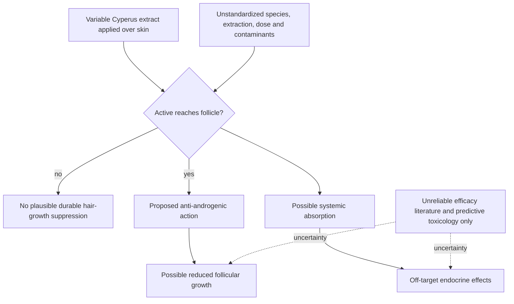

# Cyperus oil for hair removal

Cyperus oil is a variably prepared botanical promoted as a topical reducer of unwanted hair. A genuine long-lasting effect would require altering a living follicle below the surface rather than merely lubricating skin or breaking the exposed shaft. The proposed anti-androgenic explanation therefore creates a coupled efficacy–safety problem: enough penetration to suppress follicular androgen signaling could also produce systemic or off-target exposure, while failure to reach the follicle makes durable efficacy implausible. (@LabMuffinBeautyScience (Lab Muffin Beauty Science) — "Products I do not use (as a chemist)", 2025-12-23, [link](https://www.youtube.com/watch?v=qPonEF3EVcM))

## The efficacy–safety coupling

The “better than laser” claim rests in the staged source on two reports from one author rather than independent replication. Michelle Wong and a toxicologist she consulted identify duplicated before-and-after images across papers, inconsistent timelines and sample descriptions, repeated identical table values, implausibly uniform participant preferences, and many p-values reported as 0.00. These are serious integrity signals but not a formal misconduct finding. Traditional use establishes exposure history, not controlled efficacy, dose standardization, or comparative effectiveness. (@LabMuffinBeautyScience (Lab Muffin Beauty Science) — "Products I do not use (as a chemist)", 2025-12-23, [link](https://www.youtube.com/watch?v=qPonEF3EVcM))

Safety is also unresolved. Botanical source, extraction, active concentration, contamination, and seller quality can vary by batch. Predictive toxicology cited in the transcript flagged two proposed actives as concerning endocrine disruptors, but a model is not a measured human cancer outcome. The responsible conclusion is neither that cancer is proven nor that natural origin ensures safety: the effective dose, absorbed dose, receptor selectivity, tissue distribution, and therapeutic window have not been established. Regulated spironolactone cannot serve as a safety analogy because its molecule, pharmacology, manufacturing, contraindications, dose, and monitoring are characterized separately. (@LabMuffinBeautyScience (Lab Muffin Beauty Science) — "Products I do not use (as a chemist)", 2025-12-23, [link](https://www.youtube.com/watch?v=qPonEF3EVcM))

## Practical implications

- **Do not use cyperus oil as a repeated or large-area hair-removal treatment — strong precaution, absent reliable efficacy and human safety evidence.** No evidence-based dose or cadence exists.
- **Choose a method matched to the goal and skin type — established category, method-specific evidence.** Shaving and depilatories remove the exposed shaft; waxing removes it mechanically; laser or IPL targets pigment-dependent follicular structures; electrolysis destroys individual follicles. Clinician input is appropriate for pigmentary risk, scarring tendency, medication interactions, or hormonally driven hirsutism. (@LabMuffinBeautyScience (Lab Muffin Beauty Science) — "Products I do not use (as a chemist)", 2025-12-23, [link](https://www.youtube.com/watch?v=qPonEF3EVcM))
- **For new or rapidly progressive hirsutism: seek cause-directed assessment rather than escalating topical oils — strong diagnostic practice.** Polycystic ovary syndrome and other androgen disorders may require systemic evaluation and regulated treatment. (@LabMuffinBeautyScience (Lab Muffin Beauty Science) — "Products I do not use (as a chemist)", 2025-12-23, [link](https://www.youtube.com/watch?v=qPonEF3EVcM))

## Gaps & open questions

- Are the two published efficacy reports based on valid independent observations, and can a preregistered trial reproduce any effect?
- Which Cyperus species, extraction method, and chemical constituents are present in marketed products?
- What are dermal absorption, endocrine activity, reproductive toxicity, carcinogenicity, and dose–response in humans?
- Does any standardized preparation outperform placebo without systemic hormonal effects?

## Related

[[skincare-evidence-and-routine-design]] · [[hair-loss-diagnosis-and-scalp-health]] · [[experimental-peptides]] · [[supplement-evidence-and-safety]]
