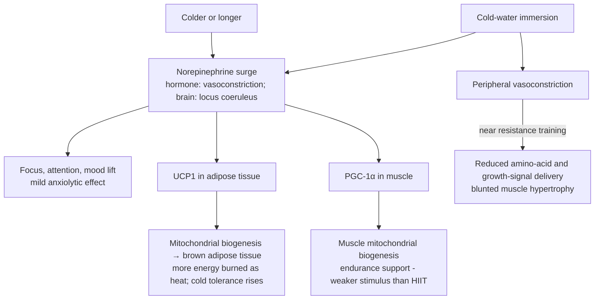

# Deliberate cold exposure

Deliberate cold exposure (cold-water immersion, cold showers, cryotherapy chambers) is a thermal stressor whose adaptations are dose- and duration-dependent, like heat's, but whose evidence base is mostly acute-physiology and small-cohort work rather than outcome epidemiology. Its best-characterized effects are a large catecholamine response with subjective alertness and mood effects, mitochondrial biogenesis in adipose and muscle tissue, and — running the other direction — a blunting of muscle hypertrophy when placed near resistance training. There is no cold-exposure counterpart to the Finnish sauna mortality cohorts; nothing here carries an outcome-level longevity claim. (@FoundMyFitness (FoundMyFitness) — "Dr. Rhonda Patrick: Maximizing Healthspan with Exercise, Sauna, & Cold Exposure", 2026-01-22, [link](https://www.youtube.com/watch?v=OCddz_0NrEE))

## Mechanisms and dose-response

**Norepinephrine.** One hour at 57°F (14°C) water raises circulating norepinephrine about five-fold; about two minutes at ~49–50°F (9–10°C), or ~20 seconds at 35°F (1.7°C), raises it about two-fold. Norepinephrine acts both as a hormone (vasoconstriction) and as a neurotransmitter, rising in the locus coeruleus, which is the proposed basis of the acute focus, attention, and mood effects users report. The dose–response means very short exposures at accessible temperatures capture a meaningful fraction of the response. (@FoundMyFitness (FoundMyFitness) — "Dr. Rhonda Patrick: Maximizing Healthspan with Exercise, Sauna, & Cold Exposure", 2026-01-22, [link](https://www.youtube.com/watch?v=OCddz_0NrEE))

**Mood and depression.** A small sham-controlled cryotherapy study in major depressive disorder (about 2 minutes at roughly −250°F air, five times weekly for two weeks, against a −58°F sham) reported a ~17-point improvement on the Hamilton depression scale — far above the ~2.5-point threshold usually treated as clinically relevant. The sham control matters because depression trials carry large placebo responses, but this remains one small short trial; cryotherapy is not an established depression treatment, and cold water and cold air are different exposures. (@FoundMyFitness (FoundMyFitness) — "Dr. Rhonda Patrick: Maximizing Healthspan with Exercise, Sauna, & Cold Exposure", 2026-01-22, [link](https://www.youtube.com/watch?v=OCddz_0NrEE))

**Brown adipose tissue and muscle mitochondria.** Norepinephrine signaling raises UCP1 and drives mitochondrial biogenesis in adipose tissue — the fat browning that lets the body burn stored fatty acids as heat. Young men wearing a 50°F cooling suit two hours daily for a month increased brown adipose tissue by nearly half, and about 15 minutes at 50°F water is the repeatedly cited exposure for mitochondrial biogenesis in both adipose and muscle tissue (muscle via PGC-1α, associating with less atrophy and better endurance performance). Two boundaries: high-intensity interval training is a substantially stronger muscle-mitochondrial stimulus than cold ([[exercise-intensity-and-health-outcomes]], [[mitochondrial-dysfunction]]), and the adaptation is transient — cold tolerance and presumably the tissue changes regress quickly once exposure stops. Browning is a drug-discovery target for metabolic health, but no human outcome evidence ties deliberate cold to weight loss or metabolic disease prevention. (@FoundMyFitness (FoundMyFitness) — "Dr. Rhonda Patrick: Maximizing Healthspan with Exercise, Sauna, & Cold Exposure", 2026-01-22, [link](https://www.youtube.com/watch?v=OCddz_0NrEE))

**Athletic performance.** Between-effort cooling improves subsequent endurance performance in studies of tennis players, rowers, and runners — an effect specific to endurance work, likely via core-temperature and recovery routes. (@FoundMyFitness (FoundMyFitness) — "Dr. Rhonda Patrick: Maximizing Healthspan with Exercise, Sauna, & Cold Exposure", 2026-01-22, [link](https://www.youtube.com/watch?v=OCddz_0NrEE))

## Emotion-regulation training: the transfer hypothesis

Cold exposure's newest proposed role is as autonomic emotion-regulation training. The neuroscientist Ralph Adolphs — an emotion researcher, not a cold-exposure advocate — reports the adaptation trajectory (first sessions a whole-body cold-pressor ordeal; weeks later, heart rate and breathing *drop* on entry, with relaxation arriving automatically) and adds a transfer observation he explicitly labels an experiment of one: after establishing an ice-bath practice, his previously reliable autonomic anger response to an unrelated psychological stressor (aggressive honking while he parked) was flat — an automatic, untrained-context downregulation he attributes to the practice. The proposed mechanism is training the strength and automaticity of autonomic control, so regulation runs without deliberate effort ([[emotion-regulation]]). Huberman's supporting context from special-operations collaborations: cold is prized as a stressor because it is uniquely *reliable* (adrenaline and brain norepinephrine rise every time), practiced users often show paradoxical cortisol reductions, and some published evidence supports improved resilience to subsequent stressors — his characterization of that literature is that the papers are okay rather than definitive. Efficiency is part of the appeal: minutes suffice, and a cold shower delivers a version. The state effects are consistent with the catecholamine physiology above; the generalized-transfer claim is an untested hypothesis resting on one self-report. (@hubermanlab (Andrew Huberman) — "Neuroscience of Emotions & Tools for Improving Emotion Regulation | Dr. Ralph Adolphs", 2026-08-17, [link](https://www.youtube.com/watch?v=P-h5WSQG1Sw))

## The hypertrophy interaction

Cold-water immersion after resistance training blunts the hypertrophy response. Multiple studies, most recently from Luc van Loon's group, show that post-lifting cold exposure — by causing vasoconstriction that reduces delivery of amino acids and anabolic signals to the worked muscle — yields measurably less hypertrophy than sham recovery. Growth still occurs, but less of it, so anyone prioritizing muscle gain should keep cold exposure away from resistance sessions: on rest days, on endurance-training days, or many hours separated from lifting. This is the same tension recorded on [[skeletal-muscle-hypertrophy]] between recovery modalities and the adaptive signal. (@FoundMyFitness (FoundMyFitness) — "Dr. Rhonda Patrick: Maximizing Healthspan with Exercise, Sauna, & Cold Exposure", 2026-01-22, [link](https://www.youtube.com/watch?v=OCddz_0NrEE))

Cold-water immersion can improve soreness and short-horizon readiness while moving the system away from inflammatory and perfusion signals that participate in resistance-training adaptation. Water immersion also adds hydrostatic pressure, which can shift fluid independently of temperature; this helps explain why cold water can outperform air-based cryotherapy for some recovery endpoints without proving faster structural repair. Individual autonomic responses vary: the transcript reports an acute sympathetic phase followed in some monitored athletes by higher HRV, but also cases of worse sleep or nervous-system symptoms. (@FoundMyFitness (FoundMyFitness) — "Dr. Andy Galpin: The Optimal Diet, Supplement, & Recovery Protocol for Peak Performance", 2025-04-28, [link](https://www.youtube.com/watch?v=DwtNC2A8gBk)) [[exercise-recovery-and-readiness]]

## Practical implications

- **For acute alertness, focus, or mood: ~2 minutes at ~49–50°F water (or ~20 seconds at 35°F), before cognitively demanding work — moderate for the acute catecholamine and subjective effects; emerging for any durable mood benefit.** Where a plunge is unavailable, winter cold showers deliver a version of the stimulus. (@FoundMyFitness (FoundMyFitness) — "Dr. Rhonda Patrick: Maximizing Healthspan with Exercise, Sauna, & Cold Exposure", 2026-01-22, [link](https://www.youtube.com/watch?v=OCddz_0NrEE))
- **For mitochondrial-biogenesis goals: ~15 minutes at ~50°F, worked up to gradually — emerging; biomarker and tissue-level evidence only, and HIIT is the stronger stimulus for muscle.** Discomfort eases past roughly the fourth minute and with repeated adaptation; the adaptation fades quickly when practice stops. (@FoundMyFitness (FoundMyFitness) — "Dr. Rhonda Patrick: Maximizing Healthspan with Exercise, Sauna, & Cold Exposure", 2026-01-22, [link](https://www.youtube.com/watch?v=OCddz_0NrEE))
- **Keep cold exposure away from resistance training when muscle gain matters — moderate, from repeated randomized comparisons on the hypertrophy endpoint.** Schedule it on recovery or endurance days, or many hours from lifting. (@FoundMyFitness (FoundMyFitness) — "Dr. Rhonda Patrick: Maximizing Healthspan with Exercise, Sauna, & Cold Exposure", 2026-01-22, [link](https://www.youtube.com/watch?v=OCddz_0NrEE))
- **Do not treat cold as a longevity intervention — strong as an evidence boundary.** No outcome data (mortality, disease incidence) exist for deliberate cold exposure; its case is acute-state and tissue-level. Cold-water immersion also carries real acute risks (cold-shock gasp reflex, arrhythmia in susceptible people); enter gradually, never alone in open water, and seek clinician guidance with cardiovascular disease. The safety sentence is a general precaution, not from this transcript. (@FoundMyFitness (FoundMyFitness) — "Dr. Rhonda Patrick: Maximizing Healthspan with Exercise, Sauna, & Cold Exposure", 2026-01-22, [link](https://www.youtube.com/watch?v=OCddz_0NrEE))
- **As emotion-regulation or stress-inoculation training: brief regular exposures (ice bath or cold shower), treating the induced arousal as practice material for staying calm — Investigational practice (n-of-1 transfer report plus limited stress-buffering literature; the acute catecholamine response itself is moderate).** Stop conditions and open-water/hyperventilation warnings above apply unchanged. (@hubermanlab (Andrew Huberman) — "Neuroscience of Emotions & Tools for Improving Emotion Regulation | Dr. Ralph Adolphs", 2026-08-17, [link](https://www.youtube.com/watch?v=P-h5WSQG1Sw))
- **For rapid return to competition: cold-water immersion can be chosen for soreness relief, but reassess sleep and neurologic response — moderate for soreness, uncertain for net recovery.** A favorable HRV response in selected athletes is not a universal timing rule. (@FoundMyFitness (FoundMyFitness) — "Dr. Andy Galpin: The Optimal Diet, Supplement, & Recovery Protocol for Peak Performance", 2025-04-28, [link](https://www.youtube.com/watch?v=DwtNC2A8gBk))

## Gaps & open questions

- Does any cold-exposure protocol change a health outcome (metabolic disease, depression relapse, mortality), rather than catecholamines, brown-fat imaging, or acute mood?
- Does the cryotherapy depression result replicate at scale, and does cold-water immersion reproduce it?
- How long does the hypertrophy-blunting window last after a resistance session, and does it also blunt strength (versus size) or endurance adaptations?
- Is cold-induced brown-fat expansion metabolically meaningful in adults at realistic exposures, or a transient imaging finding?
- Sex differences in cold tolerance and adaptation are essentially uncharacterized in this literature.
- Does trained autonomic downregulation in cold water transfer to psychological stressors in controlled designs — and does the practiced cortisol reduction replicate?

## Related

[[sauna-and-deliberate-heat-exposure]] · [[exercise-recovery-and-readiness]] · [[exercise-intensity-and-health-outcomes]] · [[skeletal-muscle-hypertrophy]] · [[mitochondrial-dysfunction]] · [[resistance-training]] · [[neuromodulators-and-state-control]] · [[emotion-regulation]] · [[rhonda-patrick]] · [[aging-model]] · [[practice-playbook]]
