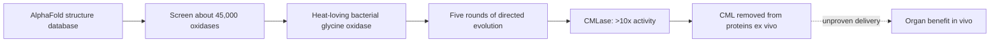

# Enzymatic deglycation

Enzymatic deglycation is an experimental damage-repair strategy: engineer a catalyst that removes a defined glycation adduct from an existing protein. Unlike lowering glucose exposure, it aims to reverse accumulated molecular damage rather than merely slow its formation. The current example, CMLase, targets CML and is preclinical. (@LongevityScienceNews (Longevity Science News) — "BREAKTHROUGH Skin Age Reversal: New Enzyme Removed 40 Years Of Damage", 2026-07-25, [link](https://www.youtube.com/watch?v=_Vf9pdoU3tU))

## Engineering mechanism

The developers searched predicted structures of roughly 45,000 glycine oxidases because CML resembles glycine with an added chemical group. Fewer than 50 candidates fit the desired binding geometry; a weak enzyme from *Calidethermus roseus* was then improved by selection in bacteria whose growth depended on converting CML back to lysine. Five mutation-and-selection rounds yielded 15 substitutions plus a deletion and more than tenfold activity, enabling action on full-length proteins. This combines structure prediction for search with directed evolution for function; the AI did not by itself validate a therapy. (@LongevityScienceNews (Longevity Science News) — "BREAKTHROUGH Skin Age Reversal: New Enzyme Removed 40 Years Of Damage", 2026-07-25, [link](https://www.youtube.com/watch?v=_Vf9pdoU3tU))

The selection mechanism couples catalytic function to bacterial survival: lysine-auxotrophic bacteria receive CML-modified peptides, express mutated oxidases in the periplasm, and grow only when an enzyme restores usable lysine. A second transcript identifies the starting glycine oxidase as coming from *Caldithrix rutilus* and describes 15 substitutions plus two deletions, conflicting with the prior transcript's *Calidethermus roseus* and single-deletion account. The source discrepancy is unresolved here and should be checked against the primary paper before either provenance or mutation count is treated as authoritative. (@TheSheekeyScienceShow (The Sheekey Science Show) — "can this new enzyme reverse aging?", 2026-07-26, [link](https://www.youtube.com/watch?v=fGjWaC5ZnPI))

Chemically, the engineered oxidase converts protein-bound CML back toward unmodified lysine while producing glyoxylic acid and hydrogen peroxide. Endogenous peroxide-handling systems make the by-product biologically manageable in principle, but local flux and tissue safety were not tested in the reported ex vivo sections. (@TheSheekeyScienceShow (The Sheekey Science Show) — "can this new enzyme reverse aging?", 2026-07-26, [link](https://www.youtube.com/watch?v=fGjWaC5ZnPI))

## Translation barriers

A roughly 40,000-Dalton enzyme is far above the approximately 500-Dalton rule of thumb for passive penetration through intact skin, so a simple cream is unlikely to reach dermal matrix. Thin-section activity does not establish penetration through dense intact tissue, and the observed partial removal may favor exposed CML while leaving buried or tightly folded sites. Microneedles or another delivery device could change access but would create a different development and regulatory pathway. A bacterial protein may also provoke immune responses, particularly with repeat dosing, and would require de-immunization. Claims to change tissue structure or reverse aging would generally make a topical product a drug rather than merely a cosmetic in the United States. (@LongevityScienceNews (Longevity Science News) — "BREAKTHROUGH Skin Age Reversal: New Enzyme Removed 40 Years Of Damage", 2026-07-25, [link](https://www.youtube.com/watch?v=_Vf9pdoU3tU)) (@TheSheekeyScienceShow (The Sheekey Science Show) — "can this new enzyme reverse aging?", 2026-07-26, [link](https://www.youtube.com/watch?v=fGjWaC5ZnPI))

## Practical implications

There is no actionable clinical protocol. Treat CMLase as hypothesis-generating laboratory evidence and wait for animal toxicology, delivery studies, and phased human trials; evidence for personal use is absent. A future protocol would require tissue-specific delivery and measurement of both target engagement and function, not a generic anti-aging claim. (@LongevityScienceNews (Longevity Science News) — "BREAKTHROUGH Skin Age Reversal: New Enzyme Removed 40 Years Of Damage", 2026-07-25, [link](https://www.youtube.com/watch?v=_Vf9pdoU3tU))

## Gaps & open questions

- What reaction products are created, and are they locally safe?
- Can immunogenicity be reduced without losing catalytic activity?
- Does repeated treatment improve tissue function, and is benefit durable?
- What local concentrations of glyoxylic acid and hydrogen peroxide result from therapeutically meaningful CML removal?
- Which bacterial source and engineered mutation count are correct in the primary report?

## Related

[[advanced-glycation-end-products]] · [[biological-age-reversal]] · [[aging-model]]
