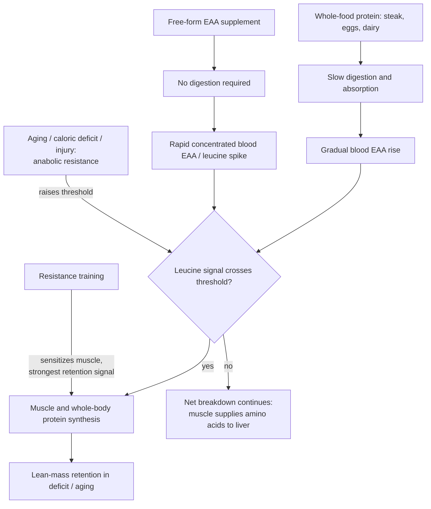

# Essential amino acid supplementation

Essential amino acids (EAAs) are the nine amino acids the body cannot synthesize and must obtain from food. Free-form EAA supplements deliver them without a protein matrix, requiring essentially no digestion, so blood amino-acid concentration spikes quickly. That kinetic difference is the entire mechanistic case for the category: muscle protein synthesis is triggered when circulating EAA concentration — leucine in particular — crosses a signaling threshold, and a rapid concentrated spike can cross it with a smaller absolute dose than food protein needs. The category is also heavily commercialized, and this page's principal source is a sponsored interview with Angelo Keely, co-founder of the supplement company Kion, on the podcast of a paid Kion partner; every quantitative claim below should be read with that conflict in view. (@maxlugavere (Max Lugavere) — "The Protein Expert: Fat Loss Gets EASIER When You Understand This - Angelo Keely", 2026-06-01, [link](https://www.youtube.com/watch?v=XTWDoFs4PE8))

## Mechanism: the leucine signal and anabolic resistance

With whole-food protein, roughly 2.5–3 g of leucine per eating occasion is the commonly cited threshold for efficiently switching on muscle protein synthesis — a figure derived from studies of intact protein foods, whose slow digestion means substantial leucine is needed to raise blood concentration far enough. Keely's account is that free-form EAAs need not meet the same threshold, because absorption without digestion produces the concentration spike directly; supporting evidence he cites is a study in women in their 60s where 3 g of a leucine-enriched EAA formula (40% leucine, so ~1.2 g leucine) stimulated muscle protein synthesis more than 20 g of whey protein (~3 g leucine). Aging is the modifier: the same comparison in women in their 20s shows roughly a threefold rather than sixfold potency ratio, reflecting **anabolic resistance** — older muscle needs a stronger amino-acid signal to mount the same synthetic response ([[skeletal-muscle-hypertrophy]]). The studies are described from memory in a commercial context and not identified; the anabolic-resistance construct itself and leucine's trigger role are established mechanistic physiology. (@maxlugavere (Max Lugavere) — "The Protein Expert: Fat Loss Gets EASIER When You Understand This - Angelo Keely", 2026-06-01, [link](https://www.youtube.com/watch?v=XTWDoFs4PE8))

Non-essential amino acids are not irrelevant — muscle is built from both, and whole-food protein supplies them so the body need not synthesize them from EAAs — but daily non-essential requirements are lower and less well quantified (interpretations rest partly on animal data), and excess non-essential amino acids are preferentially converted to urea or glucose. EAAs taken alongside a small whole-food protein serving are claimed to improve utilization of that meal's protein; taken between meals or during a fasting window, to stimulate synthesis when the body would otherwise draw amino acids from muscle. Both are mechanistic rationales without cited outcome trials. A related nuance Keely offers on calories: protein's thermic and anabolic costs mean its net caloric impact is below its labeled 4 kcal/g, and EAAs — being still more anabolically active per gram — have a smaller effective caloric footprint again; directionally standard nutrition science, quantitatively loose here. (@maxlugavere (Max Lugavere) — "The Protein Expert: Fat Loss Gets EASIER When You Understand This - Angelo Keely", 2026-06-01, [link](https://www.youtube.com/watch?v=XTWDoFs4PE8))

## Candidate use cases: stress-based physiology

The category's defensible positioning is not general muscle-building but states where anabolic signaling is blunted — what Keely groups as stress-based physiology: caloric restriction, age above roughly 40 and rising, injury, and the pre- and post-surgical period. In energy surplus or balance in a young trained person, the marginal case largely collapses: total protein intake and resistance training do the work, and he explicitly declines to recommend EAAs for a 16-year-old athlete trying to gain size, pointing to whey and creatine instead ([[creatine]]).

The caloric-deficit case rests on Department of Defense studies he describes in young adults, in which soldiers held at up to a 40% caloric deficit retained all of their muscle when supplemented with very large EAA doses (about 25 g per administration, larger than typical consumer use), while beyond roughly 40% restriction muscle loss became unavoidable regardless of supplementation. If accurate, this bounds the intervention twice over: it identifies a deficit range where EAAs may protect lean mass, and a deeper range where nothing tested prevents catabolism. The studies are cited from memory in a sponsored conversation, are in a young military population under a supervised protocol, and used doses well above what the source's own product provides at his stated personal intake of 15 g three times daily. (@maxlugavere (Max Lugavere) — "The Protein Expert: Fat Loss Gets EASIER When You Understand This - Angelo Keely", 2026-06-01, [link](https://www.youtube.com/watch?v=XTWDoFs4PE8)) [[caloric-restriction-and-meal-timing]]

## Where EAAs sit against the protein-intake question

The supplement case is downstream of an unsettled dose question. Keely accepts the emerging pushback that 1 g of protein per pound of body weight is oversold and that roughly 0.7–0.8 g/lb suffices for most younger people, with resistance training the larger lever — but argues the requirement rises with age and in a deficit precisely because of anabolic resistance, which is where a leucine-enriched, highly bioavailable source earns its place. Lugavere's boundary is that higher intakes are best supported for already-lean people pursuing further fat loss (athletes and bodybuilders around 10–12% body fat), and that carrying excess fat does not raise the requirement. Both positions are compatible: the same gram target means different things at different ages and energy states. The protein-timing corollary — splitting intake across three or four servings outperforms concentrating it in one evening meal — matches [[pre-sleep-protein-feeding]]'s treatment of total intake as the dominant term with distribution secondary. (@maxlugavere (Max Lugavere) — "The Protein Expert: Fat Loss Gets EASIER When You Understand This - Angelo Keely", 2026-06-01, [link](https://www.youtube.com/watch?v=XTWDoFs4PE8)) [[performance-nutrition-and-hydration]]

## Product-quality and marketing hazards

The commercial layer is a genuine consumer risk in this category, and both participants name specific patterns. Proprietary blends conceal the leucine content, which is the one number that determines whether the mechanism above applies at all. Ratio claims are routinely misrepresented: the marketing line that 5 g of an amino acid product equals 30 g of protein derives from the older-women study above — a roughly sixfold potency ratio measured for muscle protein synthesis, in women in their 60s, against whey — and is presented as a general equivalence when the ratio is closer to threefold in young adults and does not describe protein's other roles. Negative-framing marketing that disparages whole protein foods to sell extracts draws the sharpest objection: the circulating claim that 80% of whey is converted to sugar has no mechanistic basis, and whey remains among the highest-biological-value proteins available, leucine-rich and rich in cysteine-containing amino acids. Note that these criticisms come from a competitor with a direct interest in being seen as the transparent option. (@maxlugavere (Max Lugavere) — "The Protein Expert: Fat Loss Gets EASIER When You Understand This - Angelo Keely", 2026-06-01, [link](https://www.youtube.com/watch?v=XTWDoFs4PE8)) [[supplement-evidence-and-safety]] [[health-misinformation-and-media-incentives]]

## Practical implications

- **For most people in energy balance who meet their protein target from food: no EAA supplement is indicated — moderate-to-strong.** Total protein and resistance training carry the effect; the supplement's mechanism is about crossing a signaling threshold that ordinary meals already cross. (@maxlugavere (Max Lugavere) — "The Protein Expert: Fat Loss Gets EASIER When You Understand This - Angelo Keely", 2026-06-01, [link](https://www.youtube.com/watch?v=XTWDoFs4PE8))
- **If trialing EAAs during a sustained fat-loss phase, from roughly age 40 onward, or around surgery: take a leucine-enriched free-form product daily at a fixed time, and judge it on retained strength and lean mass over months — Investigational practice.** Consumer doses are far below the military-study doses; the mechanistic rationale is sound, direct outcome evidence in these populations is not established here, and the source is commercially conflicted. (@maxlugavere (Max Lugavere) — "The Protein Expert: Fat Loss Gets EASIER When You Understand This - Angelo Keely", 2026-06-01, [link](https://www.youtube.com/watch?v=XTWDoFs4PE8))
- **Buy only products disclosing leucine content per serving; treat proprietary blends and 5-g-equals-30-g-of-protein claims as disqualifying — strong consumer-protection reasoning.** (@maxlugavere (Max Lugavere) — "The Protein Expert: Fat Loss Gets EASIER When You Understand This - Angelo Keely", 2026-06-01, [link](https://www.youtube.com/watch?v=XTWDoFs4PE8))
- **Do not let an EAA or protein supplement displace whole-food protein or resistance training — strong.** In a deficit, resistance training is the primary signal telling the body to keep muscle; supplements act at the margin. [[resistance-training]] (@maxlugavere (Max Lugavere) — "The Protein Expert: Fat Loss Gets EASIER When You Understand This - Angelo Keely", 2026-06-01, [link](https://www.youtube.com/watch?v=XTWDoFs4PE8))

## Gaps & open questions

- Do EAA supplements change lean-mass, strength, or function outcomes over months in older adults or dieters, in trials not funded by manufacturers?
- What is the minimum effective leucine dose and daily EAA total for consumers, given that the supporting studies used 25 g doses or acute synthesis endpoints?
- Does acute muscle-protein-synthesis stimulation predict long-term lean-mass retention, or is it a surrogate that overstates the effect?
- Is the reduced leucine requirement for free-form EAAs replicated outside the small acute studies described, and does it hold across ages and training states?
- Are there costs to chronically stimulating protein synthesis with rapid amino-acid spikes — mTOR-pathway trade-offs are unexamined here ([[mtor-and-rapamycin]]).

## Related

[[skeletal-muscle-hypertrophy]] · [[resistance-training]] · [[performance-nutrition-and-hydration]] · [[pre-sleep-protein-feeding]] · [[muscle-strength-and-mortality]] · [[caloric-restriction-and-meal-timing]] · [[creatine]] · [[supplement-evidence-and-safety]] · [[energy-balance-and-calorie-counting]] · [[mtor-and-rapamycin]] · [[practice-playbook]] · [[aging-model]]