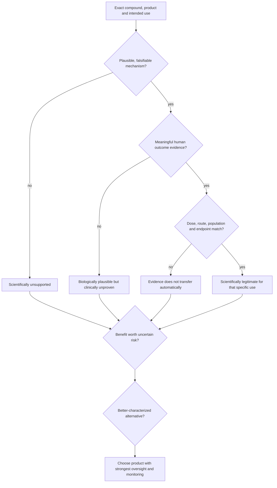
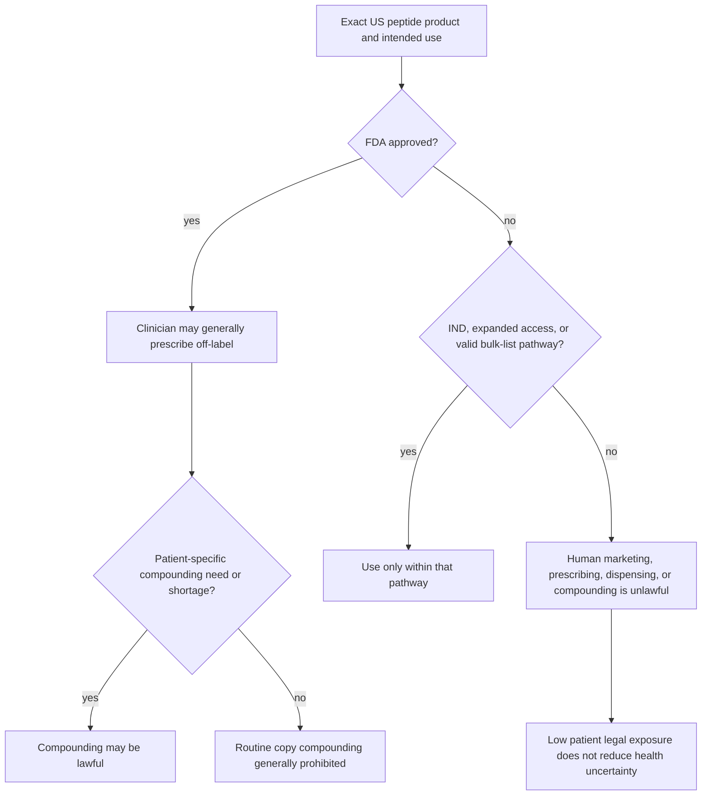

# Experimental peptides

Peptides are short amino-acid chains, a chemical class that includes approved medicines such as insulin and GLP-1 receptor agonists as well as unapproved products such as BPC-157 and TB-500. The label describes chemistry, not quality, safety, efficacy, or naturalness; many therapeutic peptides are synthetic and deliberately modified to change receptor binding, tissue exposure, or half-life. Compounding permission, clinician prescribing, and regulatory approval answer different questions and must not be treated as equivalent evidence. In the United States, naturally derived protein biologics and chemically synthesized peptides travel through different statutory frameworks, but both remain regulated products; molecular length does not create a supplement loophole. (@PeterAttiaMD (Peter Attia MD) — "403 ‒ Peptides: separating scientific promise from marketing hype", 2026-08-10, [link](https://www.youtube.com/watch?v=Km_01CLEkYU)) (@matt.kaeberlein (Healthspan Medicine) — "Why Some Doctors Are Breaking Rules To Prescribe Peptides", 2026-02-25, [link](https://www.youtube.com/watch?v=ZaDrrSQ864Y))

## Evidence and product quality

An evidence assessment should ask five questions in order: whether a defined molecular target and downstream pathway make the claim falsifiable; whether meaningful human outcomes improve; whether dose, route, pharmacokinetics, short- and long-term safety, and monitoring are characterized; whether likely benefit justifies risk for this person; and whether a better-characterized route reaches the same goal. Evidence belongs to a specific product, dose, route, population, indication, and endpoint—not to the molecule’s name in every setting. (@PeterAttiaMD (Peter Attia MD) — "403 ‒ Peptides: separating scientific promise from marketing hype", 2026-08-10, [link](https://www.youtube.com/watch?v=Km_01CLEkYU))

For the discussed experimental peptides, human safety and efficacy evidence is sparse and anecdotes conflict. Marcus Ranney reported no objective or subjective benefit in three self-experiments and no convincing biomarker change among a small number of patients, while other practitioners report benefits; neither form of uncontrolled observation separates treatment effects from placebo, selection, regression to the mean, or co-interventions. Matt Kaeberlein’s minority-to-marketing perspective is that any activity is likely incremental compared with diet, exercise, sleep, relationships, clinically indicated hormones, or established GLP-1 drugs. (@mkaeberlein (Matt Kaeberlein) — "Longevity Science Update: The Biggest Stories in Longevity Medicine — July 2026", 2026-07-31, [link](https://www.youtube.com/watch?v=A0xNnGsGAJg))

Australian laboratory testing of three online products found one labeled GHK-Cu product at about 48% of its claimed peptide amount, one TB-500 product with no TB-500, and excess free copper in another sample. Broader laboratory experience described inconsistent label matching. These examples demonstrate possible identity and contamination hazards but do not estimate their prevalence across the market. (@ABCNewsIndepth (ABC News In-depth) — "The health trends outpacing regulation and putting people at risk | Four Corners Documentary", 2026-07-20, [link](https://www.youtube.com/watch?v=77TTDkR3nbI))

Growth-hormone-pathway peptides can plausibly cause fluid retention, worsened glucose regulation, and stimulation of susceptible tumors; combination stacks add interaction uncertainty because the components are rarely tested together. (@ABCNewsIndepth (ABC News In-depth) — "The health trends outpacing regulation and putting people at risk | Four Corners Documentary", 2026-07-20, [link](https://www.youtube.com/watch?v=77TTDkR3nbI))

### BPC-157

BPC-157 has no established primary molecular target, known human pharmacokinetics, validated dose, or published peer-reviewed randomized human trial demonstrating accelerated healing. Its alleged parent gastric protein has not been fully characterized, proposed VEGF, angiogenesis, nitric-oxide, and neurotransmitter mechanisms have not been established in humans, and more than 80% of the positive published work reportedly comes from one associated research group with connected intellectual-property or commercial interests. That concentration does not invalidate the work, but three decades without independent human efficacy evidence makes the expanding injury, gut, inflammation, performance, and neurological claims weaker rather than broader. (@PeterAttiaMD (Peter Attia MD) — "403 ‒ Peptides: separating scientific promise from marketing hype", 2026-08-10, [link](https://www.youtube.com/watch?v=Km_01CLEkYU))

Claims that BPC-157 promotes healing through VEGF or angiogenesis also imply a plausible hazard: the same pathways can support abnormal vascular growth, tissue remodeling, and tumor biology. This does not show that BPC-157 causes cancer; it means the promoted mechanism creates a safety question that has not been answered by human dose-ranging and long-term studies. The evidence for clinical benefit is absent and the safety uncertainty is high, placing BPC-157 in the scientifically unsupported tier. (@PeterAttiaMD (Peter Attia MD) — "403 ‒ Peptides: separating scientific promise from marketing hype", 2026-08-10, [link](https://www.youtube.com/watch?v=Km_01CLEkYU))

### CJC-1295 and growth-hormone signaling

CJC-1295 is biologically active and can raise growth hormone and IGF-1, but changing a pathway is not equivalent to improving function. Growth-hormone replacement has defined value in true deficiency and certain specific conditions; in growth-hormone-replete adults, direct pathway stimulation has generally produced smaller or absent functional benefits relative to wellness claims. That experience raises the burden of proof for an indirect releasing-hormone analogue. CJC-1295 reached phase 2 development and was abandoned, while the related tesamorelin progressed through phase 3 and approval for a defined indication; this history is evidence against treating stalled development as proof that industry ignored an effective unpatentable molecule. (@PeterAttiaMD (Peter Attia MD) — "403 ‒ Peptides: separating scientific promise from marketing hype", 2026-08-10, [link](https://www.youtube.com/watch?v=Km_01CLEkYU))

### Elamipretide (SS-31)

Elamipretide localizes to mitochondria and interacts with cardiolipin. In some experimental contexts it reduces mitochondrial fragmentation and reactive-oxygen-species production and improves ATP generation or muscle function, but mouse findings described in the transcript did not extend lifespan. Its accelerated approval for Barth syndrome addresses a rare mitochondrial disease and does not establish a general mitochondrial-boosting or longevity effect in healthy adults. A small older-adult study reportedly suggested improved mitochondrial bioenergetics, while dose, long-term safety, and functional benefit remain uncertain. Kaeberlein's position is to avoid longevity use for now because a likely small benefit is outweighed by uncertain dose, mitochondrial stress from a foreign peptide, and compounded or research-grade product risk; this is a precautionary judgment, not evidence that SS-31 is known to be harmful. (@matt.kaeberlein (Healthspan Medicine) — "Dr. Matt Ranks Longevity Supplements: The Winners and Total Scams", 2026-02-15, [link](https://www.youtube.com/watch?v=mD_DfRDXklc))

## Why anecdotes overstate effects

Peptides for pain, injury, and recovery are commonly introduced alongside rest, physical therapy, altered training, sleep, nutrition, anti-inflammatory treatment, or anabolic agents. Natural recovery, regression to the mean, expectation, attention, and co-interventions can all produce real perceived improvement. Injection ritual can intensify expectation, particularly for pain, which is context-sensitive. Randomization and control estimate the additional effect attributable to the molecule; without them, a sincere report cannot solve attribution. (@PeterAttiaMD (Peter Attia MD) — "403 ‒ Peptides: separating scientific promise from marketing hype", 2026-08-10, [link](https://www.youtube.com/watch?v=Km_01CLEkYU))

Formal approval is fallible but provides studied formulation, dose, route, population, pharmacokinetics, adverse effects, contraindications, interactions, manufacturing controls, and post-market surveillance. A prescription, compounded source, or third-party certificate may reduce some access or identity risks, but it does not create missing efficacy data, validate a promoted dose, characterize long-term harm, or establish equivalence to an approved product. Gray-market copies of evidence-based molecules therefore inherit neither the trial evidence nor the manufacturing assurance automatically. (@PeterAttiaMD (Peter Attia MD) — "403 ‒ Peptides: separating scientific promise from marketing hype", 2026-08-10, [link](https://www.youtube.com/watch?v=Km_01CLEkYU))

### Compounding access and evidence are separate

Approval attaches to a defined drug and indication. An approved peptide can generally be prescribed off-label, while duplicative compounding ordinarily requires a patient-specific clinical difference or a recognized shortage. An unapproved peptide generally cannot be lawfully marketed, prescribed, dispensed, or compounded for human use outside narrow mechanisms such as an FDA-authorized investigational pathway; neither consent, a wellness label, nor absence of injury changes that classification. The principal enforcement exposure usually falls on the distributor or pharmacy, with professional and malpractice exposure for clinicians; a consumer's low legal exposure does not reduce biological or contamination risk. This is the transcript's US-law synthesis, not individualized legal advice. (@matt.kaeberlein (Healthspan Medicine) — "Why Some Doctors Are Breaking Rules To Prescribe Peptides", 2026-02-25, [link](https://www.youtube.com/watch?v=ZaDrrSQ864Y))

Temporary enforcement discretion while bulk substances were under review helped create a culture in which availability was mistaken for legality. Kaeberlein identifies this enforcement gap—not a genuine legal exemption—as one reason some longevity practices continue prescribing products such as BPC-157, CJC-1295, ipamorelin, MOTS-c, humanin, and epitalon. He also cites the criminal prosecution of a compounding-pharmacy executive as evidence that low-frequency enforcement is not zero enforcement. (@matt.kaeberlein (Healthspan Medicine) — "Why Some Doctors Are Breaking Rules To Prescribe Peptides", 2026-02-25, [link](https://www.youtube.com/watch?v=ZaDrrSQ864Y))

In 2023 the FDA placed several commonly marketed peptides, including BPC-157, epitalon, GHK-Cu, GHRP-2, GHRP-6, ipamorelin, MOTS-c, Semax, and a thymosin-beta-4 fragment, in category 2, preventing legal human compounding. Kaeberlein’s reading of the 503A framework is that FDA may consider physical and chemical characterization, safety, historical use, and available evidence of effectiveness or lack of effectiveness. He therefore disputes claims that efficacy is legally irrelevant or that the agency supplied no safety rationale; uncertainty about immunogenicity, impurities, characterization, and route-specific human safety can itself be decision-relevant even without a documented fatality from each named molecule. (@matt.kaeberlein (Healthspan Medicine) — "RFK Jr and Joe Rogan's Peptide Claims: Longevity Expert Reacts", 2026-03-07, [link](https://www.youtube.com/watch?v=p9pL4-HjDNI))

Access restrictions can shift demand toward cheaper research-use or animal-use gray markets with weaker identity and sterility assurance. Reopening legal compounding could reduce that harm for some informed patients, but legal compounding does not guarantee purity, eliminate the black market, or generate efficacy trials. Kaeberlein’s explicitly permissive minority position is that selected peptides could be accessible through responsible physicians after fully informed consent despite weak trial evidence; his simultaneous scientific position is that government or another noncommercial funder should finance trials for promising off-patent compounds. This separates autonomy and harm reduction from an assertion that the products work. (@matt.kaeberlein (Healthspan Medicine) — "RFK Jr and Joe Rogan's Peptide Claims: Longevity Expert Reacts", 2026-03-07, [link](https://www.youtube.com/watch?v=p9pL4-HjDNI))

## Practical implications

Do not self-inject research-use-only or internet-sourced peptides; evidence of benefit is very weak and product-quality risk is directly documented. Reject BPC-157 for routine injury, recovery, pain, inflammation, gut, or performance use because human efficacy, dosing, pharmacokinetics, safety, and monitoring are uncharacterized. Do not use CJC-1295 merely to raise GH or IGF-1 in a hormone-replete adult; biological activity without demonstrated functional benefit is insufficient. Evidence for these avoidance decisions is moderate as risk management, while direct evidence quantifying long-term harm remains absent. (@PeterAttiaMD (Peter Attia MD) — "403 ‒ Peptides: separating scientific promise from marketing hype", 2026-08-10, [link](https://www.youtube.com/watch?v=Km_01CLEkYU))

At every proposed use and each renewal, apply the five-question framework to the exact product and indication, compare it with established treatment for the underlying problem, and require a dosing, monitoring, adverse-event, and stopping plan. Prefer the approved, trial-characterized formulation when one exists. A compounding-list change, prescription, or purity report should change only the corresponding regulatory or product-risk judgment, not the clinical-efficacy judgment. (@PeterAttiaMD (Peter Attia MD) — "403 ‒ Peptides: separating scientific promise from marketing hype", 2026-08-10, [link](https://www.youtube.com/watch?v=Km_01CLEkYU))

If policy restores compounding access, reassess the exact pharmacy, certificate, route, adverse-event plan, and alternatives at every prescription; do not treat the rule change as new efficacy evidence. Evidence is moderate for the regulatory-versus-clinical distinction and weak for the claim that broader legal access will reduce total harm. (@matt.kaeberlein (Healthspan Medicine) — "RFK Jr and Joe Rogan's Peptide Claims: Longevity Expert Reacts", 2026-03-07, [link](https://www.youtube.com/watch?v=p9pL4-HjDNI))

Before any peptide decision in the United States, verify the exact active ingredient and approval status in current official sources, then separately verify whether the proposed indication is on-label, off-label, or investigational—strong as a decision safeguard. Do not infer legality from common clinic use or non-enforcement, and do not infer safety from low patient prosecution risk. For an unapproved product outside a formal investigational or access pathway, do not proceed; for an approved off-label product, still require evidence, sourcing, monitoring, and a stopping rule. (@matt.kaeberlein (Healthspan Medicine) — "Why Some Doctors Are Breaking Rules To Prescribe Peptides", 2026-02-25, [link](https://www.youtube.com/watch?v=ZaDrrSQ864Y))

## Gaps & open questions

- Do any commonly marketed experimental peptides produce clinically meaningful benefit in randomized trials?
- What are the primary target, human exposure, dose-response relation, and long-term risks of BPC-157?
- Can any growth-hormone secretagogue improve strength, healing, function, or quality of life in hormone-replete adults enough to justify pathway risks?
- Does elamipretide improve function or frailty outside mitochondrial disease, and what chronic dose avoids maladaptive mitochondrial stress?
- How common are mislabeling, endotoxin, heavy-metal, and sterility failures?
- Does legal compounding reduce black-market use or merely expand demand?
- Which access policy best balances informed autonomy, manufacturing oversight, adverse-event detection, and the incentive to produce randomized evidence?
- How often are clinicians and patients accurately informed about approval status, legal pathways, and product provenance at consent?

## Related

[[longevity-clinics-and-evidence]] · [[glp-1-receptor-agonists]] · [[practice-playbook]]
