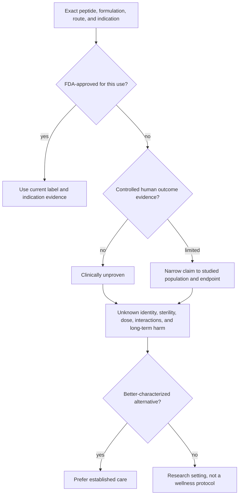

# Experimental peptides

“Peptide” describes a chemical class, not an evidence grade. Approved peptide medicines such as insulin, GLP-1 receptor agonists, and tesamorelin have product-specific manufacturing, dosing, indication, and outcome evidence. BPC-157, TB-500, CJC-1295, MOTS-c, injectable GHK-Cu, and many wellness “stacks” do not inherit that evidence. Compounding eligibility, a prescription, and FDA approval are different legal and evidentiary states.

```mermaid
flowchart TD
  P[Exact peptide, formulation, route, and indication] --> A{FDA-approved for this use?}
  A -->|yes| L[Use current label and indication evidence]
  A -->|no| H{Controlled human outcome evidence?}
  H -->|no| U[Clinically unproven]
  H -->|limited| N[Narrow claim to studied population and endpoint]
  U --> Q[Unknown identity, sterility, dose, interactions, and long-term harm]
  N --> Q
  Q --> ALT{Better-characterized alternative?}
  ALT -->|yes| D[Prefer established care]
  ALT -->|no| T[Research setting, not a wellness protocol]
```

## Strongest fair synthesis

The fair case for experimental peptides is that several have coherent mechanisms and reproducible preclinical activity, and that a regulated compounding channel could offer better identity and sterility than “research use only” vendors. That is a rationale for pharmaceutical development and trials—not evidence of clinical benefit.

BPC-157 has the largest public claim set and the clearest evidentiary mismatch. A 2025 systematic review found 35 preclinical studies and only one qualifying human report: a retrospective, uncontrolled knee-pain series in which 7 of 12 people reported improvement. It found no clinical safety dataset. These data cannot distinguish treatment effect from natural recovery, placebo, selection, co-interventions, or selective reporting.[^vasireddi-2025]

FDA's July 2026 staff review evaluated BPC-157 for ulcerative colitis, not the injury and tendon uses promoted online. FDA staff recommended against adding BPC-157 free base or acetate to the 503A bulks list because identity/characterization, effectiveness, and safety evidence were inadequate; the review also described an inconclusive 53-person randomized ulcerative-colitis study and sparse adverse-event reports with confounding. The outside Pharmacy Compounding Advisory Committee nevertheless voted 8–6, with one abstention, to recommend inclusion. That vote is advisory, is not drug approval, and does not establish safety or efficacy. [FDA meeting materials](https://www.fda.gov/advisory-committees/advisory-committee-calendar/july-23-24-2026-meeting-pharmacy-compounding-advisory-committee-07232026) · [FDA BPC-157 briefing](https://www.fda.gov/media/193343/download)

FDA separately lists BPC-157 and several other bulk substances as presenting potential significant safety risks, including immunogenicity, peptide-related impurities, and inadequate safety information; it reports serious adverse events associated with CJC-1295, including increased heart rate and a systemic vasodilatory reaction. These are regulatory hazard signals, not incidence estimates. [FDA compounding safety-risk list](https://www.fda.gov/drugs/human-drug-compounding/certain-bulk-drug-substances-use-compounding-may-present-significant-safety-risks)

## Adversarial pass: what could overturn or narrow this conclusion

- A well-characterized, independently manufactured product could differ materially from current gray-market material; today's product-quality concern does not prove the molecule itself is ineffective.
- Preclinical convergence can justify trials, and absence of evidence is not proof of zero effect. The present conclusion would change with replicated randomized human trials showing patient-important benefit, adequate dose–response, and safety for a named formulation and indication.
- Compounding through a compliant pharmacy may reduce some contamination risk relative to research vendors. It does not provide the premarket safety, effectiveness, quality, and labeling review of an approved drug.
- FDA staff's negative recommendation and the advisory committee's positive vote are a credible regulatory conflict. Neither adjudicates clinical efficacy; the conflict concerns access under compounding law.
- Online anecdotes and small uncontrolled clinic series could contain true responders, but they cannot identify them or estimate benefit and harm.

## Evidence update — 2026-09-01

> **What changed:** The July 2026 PCAC vote is preserved but explicitly separated from FDA staff's contrary scientific review and from drug approval. The earlier page correctly warned that access is not evidence, but it relied heavily on podcast accounts for trial history and safety. The current conclusion is now anchored to FDA's briefing and a systematic review. Detailed claims about proprietary histories, mechanisms, and coach protocols that could not support clinical action were retired. No retracted source was found in the registry or current search.

## The GLP-1 halo

The marketing environment has a named mechanism worth recording: primary-care internist Lucy McBride observes that unregulated peptides — Wolverine-style stacks, microdosed self-injections bought outside medical settings — are enjoying the limelight earned by GLP-1 receptor agonists, which are FDA-approved peptides with large human trials. The rhetorical move is category borrowing: because one peptide class transformed metabolic medicine, the word peptide is used to imply that compounds with tiny animal studies share its evidentiary status, weaponizing biological plausibility to sell the illusion of control. Her counter-frame is historical: biologically plausible compounds that passed full FDA review (Vioxx, fen-phen) still proved harmful, so plausibility plus testimonial — an influencer's tendinitis improving — cannot substitute for trials, and the underlying problem (often unaddressed loading or adjacent-muscle weakness in an injury) has no peptide shortcut. She allows that some of these molecules may eventually prove genuinely useful for muscle recovery or injury repair; the objection is to present-tense certainty, not future possibility. (@maxlugavere (Max Lugavere) — "Wellness Myths Debunked: How to Navigate 'Optimization Slop' Culture", 2026-08-12, [link](https://www.youtube.com/watch?v=z4A12iaH7I0)) [[lucy-mcbride]] [[health-misinformation-and-media-incentives]]

## Other promoted compounds

- **CJC-1295 and growth-hormone secretagogues:** pathway activation and higher GH/IGF-1 do not establish better sleep, recovery, performance, or healthy aging. Fluid retention, glucose effects, cardiovascular symptoms, and tumor-related uncertainty require compound-specific trials.
- **TB-500 and injectable GHK-Cu:** animal or topical data do not transfer to injected gray-market products. Human injury-outcome and long-term safety evidence is inadequate.
- **MOTS-c:** metabolic activity in cells or animals does not establish a healthy-human performance or longevity indication.
- **Elamipretide:** disease-specific development in mitochondrial disorders cannot be generalized to healthy performance. A named pharmaceutical product is not evidence for compounded “mitochondrial peptide” stacks.

## Practical implications

- **Do not self-inject BPC-157, TB-500, CJC-1295, MOTS-c, injectable GHK-Cu, or multi-peptide stacks for healing, performance, or longevity—strong caution.** No reviewed regimen has established net clinical benefit, and identity, sterility, immunogenicity, interaction, and long-term safety are unresolved.
- **Do not interpret a PCAC compounding recommendation, WADA prohibition, clinician prescription, or 503A/503B status as evidence that a product works—strong.** These systems answer different questions.
- **Prefer approved, indication-matched treatments and rehabilitation.** When no established option exists, enrollment in a registered trial with a characterized product is the evidence-generating path.
- **Treat abrupt cardiopulmonary, allergic, neurologic, or injection-site symptoms after an experimental product as a reason to stop and seek clinical assessment.** Report suspected adverse events through FDA MedWatch.

## Gaps & open questions

- Will FDA adopt, reject, or modify the July 2026 advisory recommendations, and for which exact substances and uses?
- Can any BPC-157 formulation demonstrate replicated benefit for ulcerative colitis or musculoskeletal injury with adequate safety follow-up?
- How often do marketed products match their stated identity, potency, sterility, and storage requirements?
- Which promoted mechanisms imply tumor, glucose, immune, or cardiovascular harms at human exposure?

## Related

[[longevity-clinics-and-evidence]] · [[health-misinformation-and-media-incentives]] · [[supplement-evidence-and-safety]] · [[topical-copper-peptides]] · [[topical-peptides]] · [[thymus-regeneration]] · [[glp-1-receptor-agonists]] · [[myostatin-pathway-inhibition]] · [[ai-guided-therapeutic-design]] · [[replication-and-research-incentives]] · [[aging-model]] · [[practice-playbook]]

## References

[^vasireddi-2025]: Vasireddi N, et al. “Regeneration or Risk? A Systematic Review of BPC-157 for Musculoskeletal Healing.” *Orthopaedic Journal of Sports Medicine*, 2025. [systematic review]. [doi:10.1177/15563316251355551](https://doi.org/10.1177/15563316251355551)
