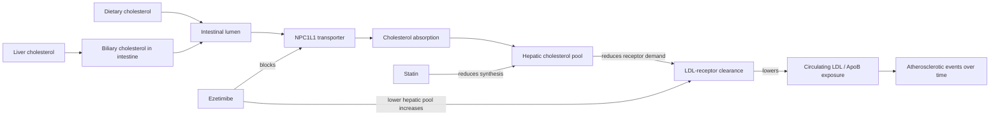

# Ezetimibe

Ezetimibe is an oral cholesterol-absorption inhibitor. It blocks the intestinal transporter NPC1L1, reducing reabsorption of biliary and dietary cholesterol; the liver responds by increasing clearance of circulating LDL particles. This route complements statins, which reduce hepatic cholesterol synthesis, so moderate doses of two drugs can act on separate control points. (@DrBradStanfield (Dr Brad Stanfield) — "'Debunked' $6 Pill Found to Reduce Heart Disease", 2026-07-31, [link](https://www.youtube.com/watch?v=aWi_WGcDyto))

## From surrogate failure to outcome evidence

The ENHANCE trial added ezetimibe to high-dose statin therapy in 720 people with familial hypercholesterolemia. LDL cholesterol fell more, but carotid intima-media thickness did not improve over two years. This was a failure on a surrogate imaging endpoint, not a trial showing no effect on heart attacks; the distinction matters because a surrogate can fail to capture a clinically useful effect. (@DrBradStanfield (Dr Brad Stanfield) — "'Debunked' $6 Pill Found to Reduce Heart Disease", 2026-07-31, [link](https://www.youtube.com/watch?v=aWi_WGcDyto))

IMPROVE-IT subsequently randomized more than 18,000 people after acute coronary syndrome to statin alone or statin plus ezetimibe. Over roughly six years of median follow-up, the seven-year composite-event estimate was 34.7% versus 32.7%, a 2-percentage-point absolute reduction. This is direct secondary-prevention outcome evidence, though the absolute benefit depends on baseline risk and follow-up duration. (@DrBradStanfield (Dr Brad Stanfield) — "'Debunked' $6 Pill Found to Reduce Heart Disease", 2026-07-31, [link](https://www.youtube.com/watch?v=aWi_WGcDyto))

Human loss-of-function variants in NPC1L1 are associated with lower lifelong LDL cholesterol and substantially lower coronary risk. Together with broader genetic, observational, and randomized evidence connecting LDL exposure to atherosclerosis, this supports the transporter's causal pathway. It does not imply that starting a drug in middle age reproduces the full effect of lifelong low exposure. (@DrBradStanfield (Dr Brad Stanfield) — "'Debunked' $6 Pill Found to Reduce Heart Disease", 2026-07-31, [link](https://www.youtube.com/watch?v=aWi_WGcDyto))

In people with established cardiovascular disease, a South Korean trial found moderate-dose statin plus ezetimibe noninferior to high-dose statin alone over three years (major cardiovascular events 9.1% versus 9.9%) and more often achieved LDL below 70 mg/dL. A separate 2026 target trial reported fewer three-year events when treatment aimed below 55 rather than below 70 mg/dL; ezetimibe was commonly needed to reach the lower target. These findings support combination treatment and intensive targets in secondary prevention, not automatic extension of the same target to every primary-prevention patient. (@DrBradStanfield (Dr Brad Stanfield) — "'Debunked' $6 Pill Found to Reduce Heart Disease", 2026-07-31, [link](https://www.youtube.com/watch?v=aWi_WGcDyto))

## Lifetime exposure and the primary-prevention boundary

Atherosclerotic risk reflects both concentration and duration of ApoB-containing particle exposure. Genetic comparisons suggest that a given lifelong LDL difference produces more protection than the same numerical reduction begun later, but short-trial absolute risk reductions should not simply be extrapolated linearly across 30–50 years: competing risks, adherence, changing baseline risk, and treatment effects can all alter the projection. (@DrBradStanfield (Dr Brad Stanfield) — "'Debunked' $6 Pill Found to Reduce Heart Disease", 2026-07-31, [link](https://www.youtube.com/watch?v=aWi_WGcDyto))

The transcript identifies no dedicated randomized trial of ezetimibe for preventing a first cardiovascular event. Brad Stanfield reports personally combining low-dose statin with ezetimibe and targeting LDL below 55 mg/dL for primary prevention, while explicitly describing that choice as ahead of guidelines. This is a named, contrarian preventive position grounded in cumulative-exposure reasoning, not direct primary-prevention ezetimibe outcome evidence. (@DrBradStanfield (Dr Brad Stanfield) — "'Debunked' $6 Pill Found to Reduce Heart Disease", 2026-07-31, [link](https://www.youtube.com/watch?v=aWi_WGcDyto))

## Safety and interpretation

The transcript characterizes gastrointestinal upset as the principal uncommon adverse effect and otherwise describes tolerability as close to placebo. It also reports genetic and observational associations between cholesterol-lowering pathways and lower dementia risk, but emphasizes that the very large genetic estimate is implausibly strong and not proof that ezetimibe prevents dementia. (@DrBradStanfield (Dr Brad Stanfield) — "'Debunked' $6 Pill Found to Reduce Heart Disease", 2026-07-31, [link](https://www.youtube.com/watch?v=aWi_WGcDyto))

## Possible brain effects

Ezetimibe itself cannot cross the blood–brain barrier, but its metabolite ezetimibe glucuronide passes it in small amounts, and animal studies suggest the metabolite interferes with hexokinase and glycosylation of brain proteins, reducing brain inflammation. Neurologists working in dementia care are reported to hold an anecdotal belief that ezetimibe-treated patients show cognitive benefit, and Attia's practice describes preferring low-dose statin plus ezetimibe combinations — with day-one synthesis/absorption testing to identify hyperabsorbers who respond best. This mechanistic-plus-anecdotal picture sits alongside, and does not resolve, the caution above that genetic dementia associations overstate what ezetimibe is proven to do: no randomized cognition trial exists, and the source itself doubts one will be run, suggesting banked serum from completed trials as the realistic test. See [[brain-cholesterol-homeostasis]] for the surrounding brain-lipid system. (@PeterAttiaMD (Peter Attia MD) — "395 – Brain lipidology: understanding APOE, cholesterol homeostasis, Alzheimer’s disease, & more", 2026-06-09, [link](https://www.youtube.com/watch?v=KWNgAyurXFY))

## Practical implications

- **When LDL/ApoB lowering is clinically indicated: discuss ezetimibe as an add-on when statin therapy alone does not reach the agreed target or when a moderate-dose combination is preferable — strong for secondary prevention.** Choose treatment from absolute risk, achieved lipid reduction, tolerability, cost, and patient preference rather than a surrogate result alone. (@DrBradStanfield (Dr Brad Stanfield) — "'Debunked' $6 Pill Found to Reduce Heart Disease", 2026-07-31, [link](https://www.youtube.com/watch?v=aWi_WGcDyto))
- **After starting or changing therapy: recheck lipids and tolerability on a clinician-selected schedule, then periodically — strong in principle; exact cadence is not supplied by this source.** The measured response verifies that the intended exposure reduction occurred. (@DrBradStanfield (Dr Brad Stanfield) — "'Debunked' $6 Pill Found to Reduce Heart Disease", 2026-07-31, [link](https://www.youtube.com/watch?v=aWi_WGcDyto))
- **For primary prevention: do not infer a universal below-55 mg/dL target from secondary-prevention trials — moderate.** Use shared decision-making based on baseline risk and the absence of a dedicated ezetimibe first-event trial; Stanfield's more aggressive personal regimen is a hypothesis-led position. (@DrBradStanfield (Dr Brad Stanfield) — "'Debunked' $6 Pill Found to Reduce Heart Disease", 2026-07-31, [link](https://www.youtube.com/watch?v=aWi_WGcDyto))

## Gaps & open questions

- What is ezetimibe's absolute first-event benefit across primary-prevention risk groups?
- Which patients do better with moderate statin plus ezetimibe than with maximally tolerated statin escalation?
- How closely do genetic estimates of lifelong NPC1L1 reduction predict treatment begun later in life?
- Do very low treatment targets retain favorable net benefit in low-risk people over decades?
- Does ezetimibe affect dementia incidence in randomized outcome data?
- Does the glucuronide metabolite reach brain concentrations in humans sufficient for the anti-inflammatory effects seen in animal studies?

## Related

[[pcsk9-inhibition]] · [[statins-and-glycemic-risk]] · [[brain-cholesterol-homeostasis]] · [[nmr-blood-analysis]] · [[ketogenic-diet-apob-and-atherosclerosis]] · [[inflammaging-and-il-6]] · [[aging-model]] · [[practice-playbook]]
