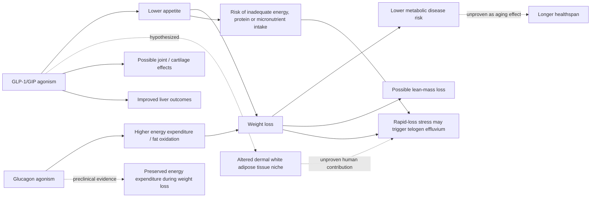

# GLP-1 receptor agonists

> [!important] Evidence update — 2026-08-12
> FDA's January 2026 review found no increased risk of suicidal ideation or behavior and requested removal of that warning from weight-management GLP-1 labels; this supersedes treating suicidality as an established class safety signal. Product-quality risk has moved in the opposite direction: FDA reports dosing errors, fraudulent labels, salt-form concerns, sterility failures, and hundreds of adverse-event reports involving compounded semaglutide or tirzepatide, and advises using compounded versions only when an approved drug cannot meet the patient's medical need. ([FDA suicidality review](https://www.fda.gov/drugs/drug-safety-communications/fda-requests-removal-suicidal-behavior-and-ideation-warning-glucagon-peptide-1-receptor-agonist-glp); [FDA on unapproved GLP-1 products](https://www.fda.gov/drugs/postmarket-drug-safety-information-patients-and-providers/fdas-concerns-unapproved-glp-1-drugs-used-weight-loss))

GLP-1 receptor agonists are established metabolic medicines, not equivalent to the poorly studied peptides sold as generic biohacks. Single agonists primarily engage GLP-1; tirzepatide adds GIP activity; investigational retatrutide adds glucagon-receptor activity, intended to combine appetite suppression with greater fat oxidation and energy expenditure. (@mkaeberlein (Matt Kaeberlein) — "Longevity Science Update: The Biggest Stories in Longevity Medicine — July 2026", 2026-07-31, [link](https://www.youtube.com/watch?v=A0xNnGsGAJg))

## Longevity hypothesis

Human studies show signals across multiple age-related chronic diseases, making longevity benefit plausible through weight loss and risk reduction. Yet no published preclinical experiment discussed here established lifespan extension or slowed biological aging, and calorie-independent effects remain uncertain. Calling these “longevity drugs” is therefore a hypothesis, especially for metabolically healthy people. (@mkaeberlein (Matt Kaeberlein) — "Longevity Science Update: The Biggest Stories in Longevity Medicine — July 2026", 2026-07-31, [link](https://www.youtube.com/watch?v=A0xNnGsGAJg))

The "first longevity drug" framing has now been examined in the aging literature itself, and the examination is unflattering to the phrase. Long-term consequences specifically for aging in healthy people have not been studied; trials of benefits beyond weight loss are being started rather than reported; and the parties most prominently advancing the longevity-drug description are the companies selling the drugs. The mechanistic rationale is nonetheless coherent, since adipose tissue drives many diseases and reducing it plausibly reduces several at once. That is a hypothesis with a plausible pathway and pending data, which is a different epistemic object from a longevity drug. (@TheSheekeyScienceShow (The Sheekey Science Show) — "This years biggest breakthroughs in longevity! (2025)", 2025-12-21, [link](https://www.youtube.com/watch?v=X-Hzyzo1Jpk))

More potent weight loss is not automatically a better outcome. Relevant endpoints include fat versus lean mass, cardiovascular events, tolerability, adherence, and maintenance after withdrawal. Retatrutide’s reported large weight reduction and proposed fat-selective advantage were still awaiting full approval and outcomes evidence in the transcript; internet self-sourcing adds product risk. (@mkaeberlein (Matt Kaeberlein) — "Longevity Science Update: The Biggest Stories in Longevity Medicine — July 2026", 2026-07-31, [link](https://www.youtube.com/watch?v=A0xNnGsGAJg))

Small clinical studies also report liver improvement and cartilage thickening with functional improvement in osteoarthritis, sometimes described as partly independent of weight loss. These are promising indication-specific signals, not proof of anatomical reversal across osteoarthritis or a shared anti-aging mechanism. Retatrutide preserved energy expenditure compared with calorie restriction at similar weight loss in preclinical work; human trials exist for weight outcomes, but definitive evidence that it prevents adaptive metabolic slowing in people remains pending. Gastrointestinal discomfort is a common class adverse effect. (@Physionic (Physionic) — "I analyzed 1,000 Health Studies: Here are 10 Things I Learned", 2026-08-06, [link](https://www.youtube.com/watch?v=sx8MyamJf3g))

Semaglutide reduced measured energy intake by more than one third versus placebo in a controlled comparison, consistent with reduced hunger and greater fullness; a major trial produced about 15% body-weight loss versus 2% with placebo while both groups received lifestyle support. Tirzepatide reduced visceral fat by about 40% in one study, proportionally more than total fat, while semaglutide trials reported CRP reductions around 40% as fat mass fell. These results support appetite-mediated weight and visceral-fat reduction; they do not show that pharmacologically lowering CRP itself causes the clinical benefit. [[visceral-and-ectopic-fat]] [[inflammaging-and-il-6]] (@DrBradStanfield (Dr Brad Stanfield) — "Fastest Way to Lose Visceral Fat Without Starving", 2026-08-04, [link](https://www.youtube.com/watch?v=KljR2O7DqOk)) (@DrBradStanfield (Dr Brad Stanfield) — "Wrong About Inflammation & Heart Disease (new study)", 2026-08-09, [link](https://www.youtube.com/watch?v=tR0ueKzXmZ8))

A dementia signal is emerging on the same evidentiary tier. Observational data favor lower dementia risk in GLP-1 users, but the causal question is whether the drugs act only through weight loss and metabolic improvement—which alone would reduce dementia risk—or additionally through an inflammatory or other weight-independent pathway; healthy-user bias further complicates the association. Memory-disorder specialist Gayatri Devi believes a real advantage exists (extending it tentatively even to metformin), uses GLP-1s in dementia-prevention regimens for high-risk patients where indicated, and expects population obesity decline from GLP-1 uptake to reduce obesity-driven brain disease. That is expert practice opinion plus epidemiology, not trial proof of a neuroprotective mechanism. [[alzheimers-spectrum-and-diagnosis]] (Peter Attia MD — "399 - The evolution of Alzheimer's disease and dementia care | Gayatri Devi, M.D.", 2026-07-13, [link](https://www.youtube.com/watch?v=x7NhqMOwdOM))

A three-person food-cue EEG demonstration found low apparent cue response in one participant taking semaglutide, who also reported less food noise but retained a dessert response after eating. This is consistent with appetite and food-salience effects, but a brief EEG visualization cannot localize a single reward circuit, predict individual eating, or show that medication eliminates conditioned responses. It should not be treated as efficacy evidence alongside randomized weight-loss trials. (@JeremyEthier (Jeremy Ethier) — "I Proved My 6-Pack Abs Diet Works For ANYONE", 2026-07-12, [link](https://www.youtube.com/watch?v=HkrWExj1QNk)) [[satiety-oriented-diet-design]]

## Hair shedding and nutritional adequacy

Newly diagnosed alopecia has been reported more often among GLP-1 users than among users of other diabetes medications, but alopecia is an umbrella outcome and the association does not establish a direct follicle-toxic effect. The best-supported pathway is telogen effluvium after rapid weight loss, potentially amplified when appetite suppression worsens pre-existing dietary inadequacy or reduces energy, protein, and micronutrient intake. Shedding often appears about three months after the initiating stress and commonly improves after weight and intake stabilize. [[hair-loss-diagnosis-and-scalp-health]] (@DrDrayzday (Dr Dray) — "Does Ozempic Cause Hair Loss? New Research Explained", 2026-08-04, [link](https://www.youtube.com/watch?v=0VW43kd63zM))

Dermal white adipose tissue surrounds the follicular niche and participates in structural support, wound healing, and growth-factor signaling. Because GLP-1 therapy changes adipose mass, insulin sensitivity, and inflammatory signaling, altered dermal-fat biology is a plausible additional route to shedding; however, the source explicitly characterizes this route as theoretical and in need of direct study. Acute telogen effluvium may also expose previously subtle androgenetic alopecia, so persistent thinning after the shed does not prove permanent drug injury. (@DrDrayzday (Dr Dray) — "Does Ozempic Cause Hair Loss? New Research Explained", 2026-08-04, [link](https://www.youtube.com/watch?v=0VW43kd63zM))

## Practical implications

Use an approved GLP-1-class drug only for a clinical indication with a prescriber. Review weight, nausea and other adverse effects, dietary adequacy, resistance training, and lean mass or a practical proxy during titration and periodically thereafter; slow dose escalation is used to improve gastrointestinal tolerability. If diffuse shedding develops, do not stop treatment reflexively: review the weight-loss rate, dose, diet, protein and micronutrient adequacy, and hair-loss pattern with the prescriber, and consider registered-dietitian support. Evidence is strong for indicated weight and metabolic outcomes, moderate for rapid weight loss as a telogen-effluvium trigger, hypothesis-level for a dermal-fat mechanism, suggestive for broader healthy-aging benefit, and absent for self-sourced investigational products or longevity microdosing in healthy lean people. (@mkaeberlein (Matt Kaeberlein) — "Longevity Science Update: The Biggest Stories in Longevity Medicine — July 2026", 2026-07-31, [link](https://www.youtube.com/watch?v=A0xNnGsGAJg)) (@DrBradStanfield (Dr Brad Stanfield) — "Fastest Way to Lose Visceral Fat Without Starving", 2026-08-04, [link](https://www.youtube.com/watch?v=KljR2O7DqOk)) (@DrDrayzday (Dr Dray) — "Does Ozempic Cause Hair Loss? New Research Explained", 2026-08-04, [link](https://www.youtube.com/watch?v=0VW43kd63zM))

## Gaps & open questions

- Are benefits independent of reduced energy intake and weight?
- Which regimens best preserve muscle and maintain benefit after discontinuation?
- Do newer multi-agonists improve hard outcomes, not just scale weight?
- Are reported cartilage and liver effects independent of weight loss, and do they change pain, disability, liver events, or need for other treatment?
- Does retatrutide preserve human energy expenditure during and after weight loss without offsetting harms?
- Can validated food-cue measures predict clinical response, or do they merely reflect transient state and task design?
- Is the observed lower dementia risk in GLP-1 users causal, and if so, is any benefit weight-independent (inflammatory or otherwise)?
- What fraction of GLP-1–associated shedding is mediated by weight-loss speed, inadequate intake, a drug-specific effect, or remodeling of dermal white adipose tissue? (@DrDrayzday (Dr Dray) — "Does Ozempic Cause Hair Loss? New Research Explained", 2026-08-04, [link](https://www.youtube.com/watch?v=0VW43kd63zM))

## Related

[[caloric-restriction-and-meal-timing]] · [[experimental-peptides]] · [[alzheimers-spectrum-and-diagnosis]] · [[visceral-and-ectopic-fat]] · [[inflammaging-and-il-6]] · [[satiety-oriented-diet-design]] · [[hair-loss-diagnosis-and-scalp-health]] · [[aging-model]] · [[practice-playbook]]
