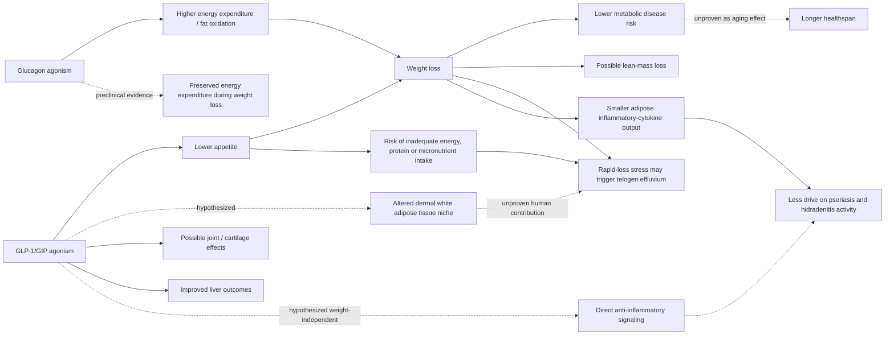
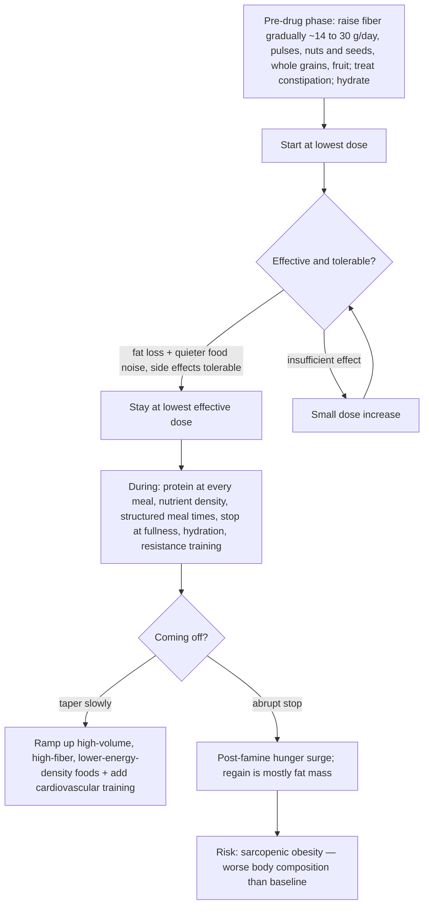
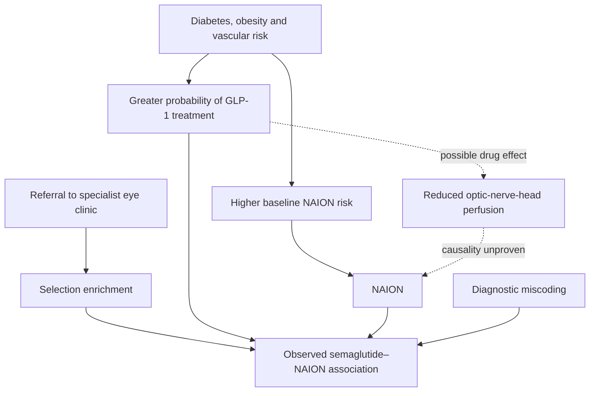

# GLP-1 receptor agonists

> [!important] Evidence update — 2026-08-12
> FDA's January 2026 review found no increased risk of suicidal ideation or behavior and requested removal of that warning from weight-management GLP-1 labels; this supersedes treating suicidality as an established class safety signal. Product-quality risk has moved in the opposite direction: FDA reports dosing errors, fraudulent labels, salt-form concerns, sterility failures, and hundreds of adverse-event reports involving compounded semaglutide or tirzepatide, and advises using compounded versions only when an approved drug cannot meet the patient's medical need. ([FDA suicidality review](https://www.fda.gov/drugs/drug-safety-communications/fda-requests-removal-suicidal-behavior-and-ideation-warning-glucagon-peptide-1-receptor-agonist-glp); [FDA on unapproved GLP-1 products](https://www.fda.gov/drugs/postmarket-drug-safety-information-patients-and-providers/fdas-concerns-unapproved-glp-1-drugs-used-weight-loss))

GLP-1 receptor agonists are established metabolic medicines, not equivalent to the poorly studied peptides sold as generic biohacks. Single agonists primarily engage GLP-1; tirzepatide adds GIP activity; investigational retatrutide adds glucagon-receptor activity, intended to combine appetite suppression with greater fat oxidation and energy expenditure. (@mkaeberlein (Matt Kaeberlein) — "Longevity Science Update: The Biggest Stories in Longevity Medicine — July 2026", 2026-07-31, [link](https://www.youtube.com/watch?v=A0xNnGsGAJg))

```mermaid
flowchart LR
  G[GLP-1/GIP agonism] --> A[Lower appetite]
  R[Glucagon agonism] --> E[Higher energy expenditure / fat oxidation]
  A --> W[Weight loss]
  E --> W
  W --> M[Lower metabolic disease risk]
  W --> L[Possible lean-mass loss]
  A --> N[Risk of inadequate energy, protein or micronutrient intake]
  W --> TE[Rapid-loss stress may trigger telogen effluvium]
  N --> TE
  G -. hypothesized .-> DWAT[Altered dermal white adipose tissue niche]
  DWAT -. unproven human contribution .-> TE
  G --> JOINT[Possible joint / cartilage effects]
  G --> LIVER[Improved liver outcomes]
  R -. preclinical evidence .-> PRES[Preserved energy expenditure during weight loss]
  M -. unproven as aging effect .-> H[Longer healthspan]
  W --> ADI[Smaller adipose inflammatory-cytokine output]
  ADI --> SKIN[Less drive on psoriasis and hidradenitis activity]
  G -. hypothesized weight-independent .-> AI[Direct anti-inflammatory signaling]
  AI -.-> SKIN
```

## Longevity hypothesis

Ben Bikman's contrarian dosing position is that standard obesity doses may oversuppress appetite for some patients and that lower-dose use might reduce carbohydrate craving while preserving food intake. The staged transcript offers no controlled outcome evidence for this proposed microdosing strategy, no validated target population, and no safety or maintenance protocol. It therefore remains investigational practice and does not override product labeling or clinician-led titration. His concern that lean-mass loss can reflect inadequate protein and resistance training rather than direct drug toxicity is mechanistically plausible and consistent with weight loss generally, but it does not eliminate the need to monitor function and nutritional adequacy. (@FoundMyFitness (FoundMyFitness) — "Dr. Ben Bikman: How To Reverse Insulin Resistance Through Diet, Exercise, & Sleep", 2025-07-15, [link](https://www.youtube.com/watch?v=gMyosH19G24)) [[insulin-resistance]]

Human studies show signals across multiple age-related chronic diseases, making longevity benefit plausible through weight loss and risk reduction. Yet no published preclinical experiment discussed here established lifespan extension or slowed biological aging, and calorie-independent effects remain uncertain. Calling these “longevity drugs” is therefore a hypothesis, especially for metabolically healthy people. (@mkaeberlein (Matt Kaeberlein) — "Longevity Science Update: The Biggest Stories in Longevity Medicine — July 2026", 2026-07-31, [link](https://www.youtube.com/watch?v=A0xNnGsGAJg))

The "first longevity drug" framing has now been examined in the aging literature itself, and the examination is unflattering to the phrase. Long-term consequences specifically for aging in healthy people have not been studied; trials of benefits beyond weight loss are being started rather than reported; and the parties most prominently advancing the longevity-drug description are the companies selling the drugs. The mechanistic rationale is nonetheless coherent, since adipose tissue drives many diseases and reducing it plausibly reduces several at once. That is a hypothesis with a plausible pathway and pending data, which is a different epistemic object from a longevity drug. (@TheSheekeyScienceShow (The Sheekey Science Show) — "This years biggest breakthroughs in longevity! (2025)", 2025-12-21, [link](https://www.youtube.com/watch?v=X-Hzyzo1Jpk))

More potent weight loss is not automatically a better outcome. Relevant endpoints include fat versus lean mass, cardiovascular events, tolerability, adherence, and maintenance after withdrawal. Retatrutide’s reported large weight reduction and proposed fat-selective advantage were still awaiting full approval and outcomes evidence in the transcript; internet self-sourcing adds product risk. (@mkaeberlein (Matt Kaeberlein) — "Longevity Science Update: The Biggest Stories in Longevity Medicine — July 2026", 2026-07-31, [link](https://www.youtube.com/watch?v=A0xNnGsGAJg))

Small clinical studies also report liver improvement and cartilage thickening with functional improvement in osteoarthritis, sometimes described as partly independent of weight loss. These are promising indication-specific signals, not proof of anatomical reversal across osteoarthritis or a shared anti-aging mechanism. Retatrutide preserved energy expenditure compared with calorie restriction at similar weight loss in preclinical work; human trials exist for weight outcomes, but definitive evidence that it prevents adaptive metabolic slowing in people remains pending. Gastrointestinal discomfort is a common class adverse effect. (@Physionic (Physionic) — "I analyzed 1,000 Health Studies: Here are 10 Things I Learned", 2026-08-06, [link](https://www.youtube.com/watch?v=sx8MyamJf3g)) Coaching-side commentary reads the same lineage mechanistically — appetite suppression alone (GLP-1), plus satiation and slowed gastric emptying (added GIP), plus glucagon agonism as the only component that raises energy expenditure — and reports trial liver-fat reductions up to about 83%, directly relevant to the steatosis pathway in [[metabolic-liver-disease]]; Dan Garner expects retatrutide to reach regulated, possibly standard-of-care status rather than remaining a gray-market compound. The paired caution from Galpin applies to the whole class of new metabolic drugs: the real risk is side effects on endpoints nobody yet knows to measure, history guaranteeing that some celebrated compound eventually lands with a major harm — an argument for measured, prescriber-supervised use and against self-sourcing. (@drandygalpin (Andy Galpin) — "How to Reach Your Fitness Goals (Hard-to-Grow Muscles, Lose Fat, Busy Schedule & More) | Dan Garner", 2026-08-19, [link](https://www.youtube.com/watch?v=-M50mes3nig))

Semaglutide reduced measured energy intake by more than one third versus placebo in a controlled comparison, consistent with reduced hunger and greater fullness; a major trial produced about 15% body-weight loss versus 2% with placebo while both groups received lifestyle support. Tirzepatide reduced visceral fat by about 40% in one study, proportionally more than total fat, while semaglutide trials reported CRP reductions around 40% as fat mass fell. These results support appetite-mediated weight and visceral-fat reduction; they do not show that pharmacologically lowering CRP itself causes the clinical benefit. On the epicardial depot specifically, semaglutide reduced epicardial fat volume by 9% over 12 months with concurrent weight loss (so the effect is not shown to be weight-independent), and comparative data place the class behind SGLT2 inhibitors for epicardial-fat reduction; the depot-level comparison lives at [[sglt2-inhibitors]]. (@DrBradStanfield (Dr Brad Stanfield) — "$7 Pill Shrinks the Fat Around Your Heart", 2026-07-15, [link](https://www.youtube.com/watch?v=jn-HKoOUd5o)) [[visceral-and-ectopic-fat]] [[inflammaging-and-il-6]] (@DrBradStanfield (Dr Brad Stanfield) — "Fastest Way to Lose Visceral Fat Without Starving", 2026-08-04, [link](https://www.youtube.com/watch?v=KljR2O7DqOk)) (@DrBradStanfield (Dr Brad Stanfield) — "Wrong About Inflammation & Heart Disease (new study)", 2026-08-09, [link](https://www.youtube.com/watch?v=tR0ueKzXmZ8))

A dementia signal is emerging on the same evidentiary tier. Observational data favor lower dementia risk in GLP-1 users, but the causal question is whether the drugs act only through weight loss and metabolic improvement—which alone would reduce dementia risk—or additionally through an inflammatory or other weight-independent pathway; healthy-user bias further complicates the association. Memory-disorder specialist Gayatri Devi believes a real advantage exists (extending it tentatively even to metformin), uses GLP-1s in dementia-prevention regimens for high-risk patients where indicated, and expects population obesity decline from GLP-1 uptake to reduce obesity-driven brain disease. That is expert practice opinion plus epidemiology, not trial proof of a neuroprotective mechanism. [[alzheimers-spectrum-and-diagnosis]] (Peter Attia MD — "399 - The evolution of Alzheimer's disease and dementia care | Gayatri Devi, M.D.", 2026-07-13, [link](https://www.youtube.com/watch?v=x7NhqMOwdOM))

A three-person food-cue EEG demonstration found low apparent cue response in one participant taking semaglutide, who also reported less food noise but retained a dessert response after eating. This is consistent with appetite and food-salience effects, but a brief EEG visualization cannot localize a single reward circuit, predict individual eating, or show that medication eliminates conditioned responses. It should not be treated as efficacy evidence alongside randomized weight-loss trials. (@JeremyEthier (Jeremy Ethier) — "I Proved My 6-Pack Abs Diet Works For ANYONE", 2026-07-12, [link](https://www.youtube.com/watch?v=HkrWExj1QNk)) [[satiety-oriented-diet-design]]

## Pharmacology against the endogenous signal

The drugs copy the shape of the gut hormone GLP-1 but resist breakdown: endogenous GLP-1 acts for minutes, the drugs persist about a week. They slow gastric emptying (prolonging stretch-receptor satiety signaling), increase pancreatic insulin secretion in a glucose-dependent way that limits hypoglycemia risk, and act on hypothalamic appetite control. Ozempic and Wegovy are both semaglutide licensed for different indications (type 2 diabetes and weight loss respectively, the latter slightly higher-dosed); Mounjaro (tirzepatide) adds GIP agonism and produces greater weight loss. The pharmacologic effect is orders of magnitude larger than endogenous signaling — there is no dietary "natural Ozempic" — but the same hormones are released physiologically when fiber reaches colonic L cells and fermentation products stimulate them, which is why a high-fiber diet supports satiety through the identical channel at far smaller amplitude. (@joinzoe (ZOE) — "The Nutrition Doctor: “You’re at risk of becoming malnourished!” How to avoid Ozempic's hidden risks", 2026-06-18, [link](https://www.youtube.com/watch?v=GwZhDggykMQ)) [[dietary-fiber]] [[satiety-oriented-diet-design]]

Beyond appetite, patients report the quieting of "food noise" — persistent, pervasive, sometimes ruminative preoccupation with food that clinicians began recognizing only when the drugs abolished it — as among the most transformative effects; Federica Amati frames the class as brain and fat-loss drugs rather than cosmetic weight-loss drugs, with emerging anti-inflammatory effects and early signals in alcohol, smoking, and gambling addiction. The reverse side of blunted reward circuitry is anhedonia — losing enjoyment of previously enjoyed things — an underdiscussed side effect that has driven some of her patients to stop treatment. Anecdotally, preferences themselves shift (aversion to fatty foods, unfinished alcohol; one documentary participant developed an unexplained appetite for chickpeas, which Amati reads as microbiome-driven hunger signaling via the vagus nerve — a hypothesis, not quantified data). (@joinzoe (ZOE) — "The Nutrition Doctor: “You’re at risk of becoming malnourished!” How to avoid Ozempic's hidden risks", 2026-06-18, [link](https://www.youtube.com/watch?v=GwZhDggykMQ))

## Cosmetic demand, disordered eating, and the insight window

Primary-care internist Lucy McBride reports that requests for GLP-1 prescriptions for cosmetic weight loss — five or ten pounds in a metabolically normal person — are now routine, and treats the request itself as diagnostic material: the useful clinical move is surfacing what is actually being asked (health risk? body image? alcohol-craving control, which some patients have read about?) before prescribing. Her boundary is not moral but physiological: the concern is enabling body dysmorphia or a restrictive eating disorder by handing a patient a substance that suppresses intake — she characterizes that failure mode as essentially forced anorexia (Lugavere's phrase, which she accepts) — and centering a scale number over metabolic, cardiovascular, bone, and muscle health. Residual hunger on treatment is not an indication to escalate dose: hunger and satiety are normal body cues to be listened to, and her stated goal for a patient asking for an increase was, in her words, "My goal is not to castrate you from normal body cues." Adequate protein and lean-mass preservation remain preconditions for calling the outcome good. She simultaneously credits the drug class as arguably the most sophisticated medical technology of her lifetime for patients with true metabolic dysfunction — diabetes, sleep apnea, cardiovascular disease — where it can produce a first-in-decades sense of agency over body and mind. The population-level worry she and Lugavere converge on is cultural: the drugs' ubiquity coincides with social-media body display, making extreme thinness newly attainable and re-normalizing it. (@maxlugavere (Max Lugavere) — "Wellness Myths Debunked: How to Navigate 'Optimization Slop' Culture", 2026-08-12, [link](https://www.youtube.com/watch?v=z4A12iaH7I0)) [[lucy-mcbride]] [[satiety-oriented-diet-design]]

On discontinuation her practice experience converges with the taper-plus-habits framework below from a different mechanism: against regain-is-inevitable headlines, she reports successfully weaning patients, and identifies the predictor as whether the patient used the on-drug window — while food noise was quiet — to examine their relationship with food and adjust habits, rather than treating the drug as a stand-alone fix. This frames the treatment period as a time-limited window for insight and habit construction, the same scaffold logic recorded for ADHD medication on [[adhd-dysregulation-and-rejection-sensitivity]]. It is practice observation, not controlled discontinuation evidence. (@maxlugavere (Max Lugavere) — "Wellness Myths Debunked: How to Navigate 'Optimization Slop' Culture", 2026-08-12, [link](https://www.youtube.com/watch?v=z4A12iaH7I0))

## Discontinuation, side-effect management, and nutritional support

Roughly 50–60% of users stop within a year — by some analyses two-thirds — mainly for gastrointestinal side effects (constipation and nausea foremost; also diarrhea, sometimes paradoxically alternating, reflux, and less often vomiting; rare persistent pain warrants gallbladder/pancreas assessment) and out-of-pocket cost. This corroborates the provisional ~60% one-year discontinuation estimate held at [[evolutionary-mismatch-and-weight-regulation]]. Cost-driven quitting typically means dropping from full dose to zero with no taper, which the source identifies as a major predictor of fat-mass regain. Over 90% of users access the drugs outside any complete support system (dietary, exercise, psychological), often via online pharmacies or the compounded gray market — consistent with the FDA product-quality concerns in the evidence-update banner above. (@joinzoe (ZOE) — "The Nutrition Doctor: “You’re at risk of becoming malnourished!” How to avoid Ozempic's hidden risks", 2026-06-18, [link](https://www.youtube.com/watch?v=GwZhDggykMQ))

Amati's clinical framework — expert practice grounded in trial and real-world side-effect data, not itself validated as a protocol in randomized comparisons — structures use into three phases:

```mermaid
flowchart TD
  PRE[Pre-drug phase: raise fiber gradually ~14 to 30 g/day, pulses, nuts and seeds, whole grains, fruit; treat constipation; hydrate] --> START[Start at lowest dose]
  START --> TITRATE{Effective and tolerable?}
  TITRATE -->|fat loss + quieter food noise, side effects tolerable| HOLD[Stay at lowest effective dose]
  TITRATE -->|insufficient effect| UP[Small dose increase]
  UP --> TITRATE
  HOLD --> DURING[During: protein at every meal, nutrient density, structured meal times, stop at fullness, hydration, resistance training]
  DURING --> OFF{Coming off?}
  OFF -->|taper slowly| VOLUME[Ramp up high-volume, high-fiber, lower-energy-density foods + add cardiovascular training]
  OFF -->|abrupt stop| REBOUND[Post-famine hunger surge; regain is mostly fat mass]
  REBOUND --> SARC[Risk: sarcopenic obesity — worse body composition than baseline]
```

The pre-drug phase targets the gut before the drug arrives: her single biggest advice to people starting is to make the dietary change first, because a prepared gut lowers the likelihood of GI side effects and raises the likelihood of efficacy at a lower dose; one patient's pre-drug diet worked well enough that she deferred the medication. (@joinzoe (ZOE) — "Tim Spector: They're fooling you! The 3 nutrition scams he wants banned | Live Audience Q&A", 2026-06-25, [link](https://www.youtube.com/watch?v=g3J4phCrvvw)) During treatment the logic is nutrient density under a 30–40% intake reduction: micronutrient deficiency is the headline risk (folate and iron cited as common baseline shortfalls; a UK patient on unsupported treatment developed scurvy, and a case report describes severe cognitive decline initially read as possible early-onset dementia that proved to be profound micronutrient deficiency — single cases, illustrating direction of risk rather than incidence). Protein targets rise to about 1.2–1.6 g/kg/day in ZOE's guidance — above standard population recommendations and not established in regulatory labeling for GLP-1 users, so recorded here as investigational practice — delivered food-first (legume + whole-grain combinations, nuts and seeds, soy, fermented dairy, oily fish ~3×/week, eggs and poultry, red meat optional), with a plain protein supplement acceptable during dose escalations; Amati is explicit that protein without resistance training will not preserve muscle, and that observed lean-mass loss usually reflects missing exercise more than protein deficiency. Fatty, high-saturated-fat meals worsen the gastric side effects. Hydration needs deliberate attention because food-derived fluid falls with intake and a dampened thirst drive compounds constipation. Structured, predictable meal times support gut motility; eating past the point of fullness is the trigger for nausea, vomiting, and reflux, so stopping at fullness and adding a nutrient-dense snack a few hours later beats pushing through a meal. (@joinzoe (ZOE) — "The Nutrition Doctor: “You’re at risk of becoming malnourished!” How to avoid Ozempic's hidden risks", 2026-06-18, [link](https://www.youtube.com/watch?v=GwZhDggykMQ))

Body-composition timing refines the lean-mass picture below: per a review cited in the source, the first ~3 months of treatment in patients with obesity produce mostly fat loss, with lean-mass risk (20–40% of total weight lost, spanning muscle and bone) concentrating later and with rapid loss. The failure mode is the unsupported cycle — no diet change, no resistance training, abrupt stop — where regain arrives mostly as fat, yielding sarcopenic obesity: similar or higher fat mass on less muscle and weaker bone, with metabolic risk worse than baseline. The success cases in her practice tapered slowly while ramping high-volume, high-fiber, lower-energy-density eating (re-engaging stomach-stretch and colonic satiety signaling that the drug had substituted for) plus cardiovascular training on top of resistance work; some maintained fat loss two years off-drug. She bounds this: patients with multi-generational obesity and altered hypothalamic wiring may reasonably need the drugs long term, and structured on-off cycling can be legitimate; visceral-fat loss is the component most worth defending. (@joinzoe (ZOE) — "The Nutrition Doctor: “You’re at risk of becoming malnourished!” How to avoid Ozempic's hidden risks", 2026-06-18, [link](https://www.youtube.com/watch?v=GwZhDggykMQ)) [[visceral-and-ectopic-fat]]

The drugs also interact with the gut microbiome bidirectionally: slowed transit changes the microbial environment, diet change during treatment pushes composition in either direction, and early science suggests microbial activity may amplify drug efficacy and tolerability — mechanism-level and preliminary. (@joinzoe (ZOE) — "Tim Spector: They're fooling you! The 3 nutrition scams he wants banned | Live Audience Q&A", 2026-06-25, [link](https://www.youtube.com/watch?v=g3J4phCrvvw)) Tim Spector's policy-level criticism from the same episode: rolling the drugs out at public expense without funded food-behavior change squanders the treatment window and predicts regain — advocacy (including for ZOE's own app) rather than evidence, but consistent with the discontinuation data. (@joinzoe (ZOE) — "Tim Spector: They're fooling you! The 3 nutrition scams he wants banned | Live Audience Q&A", 2026-06-25, [link](https://www.youtube.com/watch?v=g3J4phCrvvw))

## Lean-mass loss and combination strategies

Because appetite suppression reduces total intake rather than selectively mobilizing fat, a share of the weight lost is lean tissue. A synthesis of 22 weight-loss-drug trials described in the source estimated that about one quarter of lost weight was lean mass and three quarters fat, broadly resembling the partition seen with diet-induced and surgical weight loss rather than establishing a GLP-1-specific muscle toxicity; the underlying synthesis has not been independently reviewed here, and scan-derived lean mass is not muscle alone. Two monoclonal antibodies acting on the myostatin/activin pathway are in phase 2 development as add-ons intended to defend that compartment: apitegromab, which blocks activation of the myostatin precursor, and bimagrumab, which blocks the type II activin receptor and also acts directly on adipocytes. Added to tirzepatide, apitegromab preserved lean mass with no difference in fat loss or total weight loss; bimagrumab produced substantial fat loss on its own and the largest fat reduction in combination with semaglutide. The unresolved problem is that muscle *function* endpoints — physical function with apitegromab in non-SMA participants, grip strength with bimagrumab — showed no meaningful benefit, and lean mass includes bone, connective tissue, and water alongside muscle. Resistance training with adequate protein remains the muscle-preserving measure with established functional evidence. See [[myostatin-pathway-inhibition]]. (@DrBradStanfield (Dr Brad Stanfield) — "Everyone is About to Become Lean and Muscly (new evidence)", 2026-06-18, [link](https://www.youtube.com/watch?v=Zit5we5Ss18)) (@Physionic (Physionic) — "The Ultimate Peptide Stack? Gain Muscle, Lose Fat!", 2026-07-23, [link](https://www.youtube.com/watch?v=AvDrlcsdCBg))

## Hair shedding and nutritional adequacy

Newly diagnosed alopecia has been reported more often among GLP-1 users than among users of other diabetes medications, but alopecia is an umbrella outcome and the association does not establish a direct follicle-toxic effect. The best-supported pathway is telogen effluvium after rapid weight loss, potentially amplified when appetite suppression worsens pre-existing dietary inadequacy or reduces energy, protein, and micronutrient intake. Shedding often appears about three months after the initiating stress and commonly improves after weight and intake stabilize. [[hair-loss-diagnosis-and-scalp-health]] (@DrDrayzday (Dr Dray) — "Does Ozempic Cause Hair Loss? New Research Explained", 2026-08-04, [link](https://www.youtube.com/watch?v=0VW43kd63zM))

Dermal white adipose tissue surrounds the follicular niche and participates in structural support, wound healing, and growth-factor signaling. Because GLP-1 therapy changes adipose mass, insulin sensitivity, and inflammatory signaling, altered dermal-fat biology is a plausible additional route to shedding; however, the source explicitly characterizes this route as theoretical and in need of direct study. Acute telogen effluvium may also expose previously subtle androgenetic alopecia, so persistent thinning after the shed does not prove permanent drug injury. (@DrDrayzday (Dr Dray) — "Does Ozempic Cause Hair Loss? New Research Explained", 2026-08-04, [link](https://www.youtube.com/watch?v=0VW43kd63zM))

The same compartment logic applies to [[post-weight-loss-skin-laxity]]. Facial hollowing and loose skin occur after substantial weight loss by multiple routes and therefore should not be labeled a medication-specific lesion without comparative evidence. Rapid loss of supporting fat, possible dermal-white-adipose signaling changes, lower intake, dehydration, and muscle loss may contribute; topical products cannot replace lost volume or remove redundant skin. (@DrDrayzday (Dr Dray) — "Can Skincare Fix Ozempic Face? Dermatologist Explains", 2026-07-29, [link](https://www.youtube.com/watch?v=zURv_nMTUc0))

## Inflammatory skin disease

Adipose tissue is biologically active: beyond storing energy it secretes signaling molecules, including inflammatory cytokines, so excess adipose tissue raises total-body inflammatory burden. In chronic inflammatory skin diseases — psoriasis and hidradenitis suppurativa (HS) most prominently, both strongly associated with obesity and with insulin resistance and cardiovascular comorbidity — that systemic burden fuels disease activity: obesity neither causes these diseases nor does weight loss cure them, but excess adipose tissue makes them more inflamed, more extensive, and more treatment-resistant. This reframes obesity from a coexisting finding to a treatment target within dermatology, which is where GLP-1 medications enter the treatment algorithm. ([[hidradenitis-suppurativa]], [[psoriasis-and-systemic-inflammation]], [[inflammaging-and-il-6]]) (@DrDrayzday (Dr Dray) — "Can Ozempic & Wegovy Improve Your Skin? Skin Benefits of GLP-1s", 2026-08-28, [link](https://www.youtube.com/watch?v=vESsyr2i6iA))

The strongest evidence is in psoriasis. The TOGETHER-PsO phase 3b randomized trial enrolled 274 adults with moderate-to-severe psoriasis plus overweight or obesity and compared a psoriasis biologic (guselkumab) alone against guselkumab plus tirzepatide. At week 36, 27.1% of the combination group achieved the composite of complete psoriasis clearance plus at least 10% weight loss, versus 5.8% with guselkumab alone, and the combination also outperformed guselkumab alone on complete skin clearance considered by itself. Most tellingly, some combination patients achieved total skin clearance without reaching the weight-loss target, which raises the possibility that tirzepatide improves the skin disease independent of weight loss. A parallel TOGETHER trial in psoriatic arthritis with overweight or obesity found the combination superior on its composite of arthritis reduction plus weight reduction, with more combination patients reaching minimal disease activity. Neither trial makes a GLP-1 a stand-alone psoriasis or arthritis treatment; what they support is that treating the metabolic disease alongside the skin disease improves the odds of clearing it. An evidence note on mechanism: the source describes guselkumab as an IL-17-targeted drug, but guselkumab is characterized in its regulatory labeling as an interleukin-23 (p19-subunit) blocker; IL-23 sustains the IL-17-producing T-cell response, so the pathway framing is adjacent while the drug-class attribution in the transcript is imprecise. (@DrDrayzday (Dr Dray) — "Can Ozempic & Wegovy Improve Your Skin? Skin Benefits of GLP-1s", 2026-08-28, [link](https://www.youtube.com/watch?v=vESsyr2i6iA))

For HS the signal is real but a tier lower: retrospective studies, surveys, case series, and systematic review rather than randomized trials. A recent systematic review identified 19 studies totaling about 67,000 patients, with roughly 60% achieving clinical improvement — in disease appearance and extent, quality of life, and inflammatory and metabolic markers — and other literature reviews report improvements in flares, pain, and drainage. The drugs do not clear HS for everyone, but they often improve its most debilitating features, and unlike the psoriasis trial the HS data cannot yet separate benefit from concurrent weight loss. Randomized trials are needed before this becomes an established HS treatment technique. (@DrDrayzday (Dr Dray) — "Can Ozempic & Wegovy Improve Your Skin? Skin Benefits of GLP-1s", 2026-08-28, [link](https://www.youtube.com/watch?v=vESsyr2i6iA))

Two practice boundaries follow. First, indication: the strongest current rationale for a GLP-1 in dermatology is a patient who already has a metabolic indication — obesity, overweight, or a weight-related complication; a weight-independent anti-inflammatory benefit in normal-weight patients is a hypothesis the trials only begin to hint at, not a prescribing basis. Second, dosing and supervision: for skin-disease use the source recommends dermatologists start at the low end and escalate slowly, because debilitating gastrointestinal effects concentrate at higher doses — and notes that direct-to-consumer and med-spa compounding channels frequently start patients at high doses, which is where the more serious gastrointestinal harms are being seen (consistent with the FDA compounding concerns in the evidence-update banner above). These remain long-term treatments for chronic disease, not short clearing courses, and multidisciplinary support — particularly a registered dietitian for protein adequacy and nutritional gaps — remains part of competent use. (@DrDrayzday (Dr Dray) — "Can Ozempic & Wegovy Improve Your Skin? Skin Benefits of GLP-1s", 2026-08-28, [link](https://www.youtube.com/watch?v=vESsyr2i6iA))

## NAION and causal attribution

Nonarteritic anterior ischemic optic neuropathy (NAION) is sudden, usually painless monocular vision loss caused by impaired perfusion of the optic-nerve head. Age, diabetes, hypertension, smoking, and dyslipidemia are risk factors; those same metabolic conditions also make GLP-1 treatment more likely, creating confounding by indication. A retrospective report from a single specialist eye clinic found more NAION diagnoses among semaglutide-exposed patients, but only 37 exposed cases occurred among 16,827 high-risk patients, the design could not establish causality, and manual review in the account found that 40% of records coded as NAION were actually arteritic ischemic optic neuropathy from giant-cell arteritis. The transcript reports subsequent studies as mixed and the biological mechanism as unproven. These data support a rare safety signal requiring surveillance, not the claim that GLP-1 drugs have doubled sudden blindness in the general population. (@DrBradStanfield (Dr Brad Stanfield) — "David Sinclair Says Popular Peptide Causes Blindness", 2026-08-20, [link](https://www.youtube.com/watch?v=C-Twr2WlZCA))

```mermaid
flowchart TD
  MET[Diabetes, obesity and vascular risk] --> RX[Greater probability of GLP-1 treatment]
  MET --> BASE[Higher baseline NAION risk]
  RX -. possible drug effect .-> PERF[Reduced optic-nerve-head perfusion]
  BASE --> NAION[NAION]
  PERF -. causality unproven .-> NAION
  CLINIC[Referral to specialist eye clinic] --> SELECT[Selection enrichment]
  SELECT --> OBS[Observed semaglutide–NAION association]
  RX --> OBS
  NAION --> OBS
  CODE[Diagnostic miscoding] --> OBS
```

The controversy illustrates a general evidence rule: a relative association from a referral clinic cannot be translated into a population-wide doubling without a representative baseline risk, validated diagnoses, control of shared risk factors, and preferably convergent prospective evidence. David Sinclair publicly framed the association as a doubling of sudden blindness caused by GLP-1 drugs; Brad Stanfield's contrary position is that the available studies are too selected, small, and inconsistent to support that causal message, and that alarmist communication may prompt patients to abandon therapies with established metabolic benefit. Stanfield also disclosed that he personally uses low-dose tirzepatide and said he has no financial interest in GLP-1 medicines; his personal use is not efficacy or safety evidence. (@DrBradStanfield (Dr Brad Stanfield) — "David Sinclair Says Popular Peptide Causes Blindness", 2026-08-20, [link](https://www.youtube.com/watch?v=C-Twr2WlZCA))

## Practical implications

Use an approved GLP-1-class drug only for a clinical indication with a prescriber. Review weight, nausea and other adverse effects, dietary adequacy, resistance training, and lean mass or a practical proxy during titration and periodically thereafter; slow dose escalation is used to improve gastrointestinal tolerability. If diffuse shedding develops, do not stop treatment reflexively: review the weight-loss rate, dose, diet, protein and micronutrient adequacy, and hair-loss pattern with the prescriber, and consider registered-dietitian support. Sudden painless vision loss in one eye is an emergency requiring immediate assessment; the unresolved NAION signal supports symptom vigilance and individualized discussion, not preventive discontinuation in an asymptomatic person. Evidence is strong for indicated weight and metabolic outcomes, moderate for rapid weight loss as a telogen-effluvium trigger, mixed and noncausal for NAION, hypothesis-level for a dermal-fat mechanism, suggestive for broader healthy-aging benefit, and absent for self-sourced investigational products or longevity microdosing in healthy lean people. (@mkaeberlein (Matt Kaeberlein) — "Longevity Science Update: The Biggest Stories in Longevity Medicine — July 2026", 2026-07-31, [link](https://www.youtube.com/watch?v=A0xNnGsGAJg)) (@DrBradStanfield (Dr Brad Stanfield) — "Fastest Way to Lose Visceral Fat Without Starving", 2026-08-04, [link](https://www.youtube.com/watch?v=KljR2O7DqOk)) (@DrDrayzday (Dr Dray) — "Does Ozempic Cause Hair Loss? New Research Explained", 2026-08-04, [link](https://www.youtube.com/watch?v=0VW43kd63zM)) (@DrBradStanfield (Dr Brad Stanfield) — "David Sinclair Says Popular Peptide Causes Blindness", 2026-08-20, [link](https://www.youtube.com/watch?v=C-Twr2WlZCA))

Around any indicated course: prepare the gut before starting (several weeks of gradual fiber increase toward guideline intake, constipation resolved, hydration habitual) — investigational practice with a coherent mechanism and expert clinical backing, not randomized protocol evidence. During treatment: protein at every meal from nutrient-dense foods, resistance training as the non-negotiable lean-mass lever, structured meal times, stopping at fullness, and deliberate fluid intake; treat persistent abdominal pain as a prompt for clinical review. If stopping, taper with prescriber support rather than dropping from full dose to zero, and shift toward high-volume, high-fiber eating plus cardiovascular training to defend fat-loss maintenance — observational and clinical-practice evidence only. The 1.2–1.6 g/kg/day protein figure remains investigational practice pending guideline adoption. (@joinzoe (ZOE) — "The Nutrition Doctor: “You’re at risk of becoming malnourished!” How to avoid Ozempic's hidden risks", 2026-06-18, [link](https://www.youtube.com/watch?v=GwZhDggykMQ))

For moderate-to-severe psoriasis or hidradenitis suppurativa coexisting with overweight, obesity, or another metabolic indication: raising GLP-1 therapy with the treating dermatologist and prescriber is evidence-supported as an addition to — never a replacement for — standard skin-directed treatment (randomized-trial evidence for the psoriasis combination; observational for HS). Start-low, go-slow titration and avoidance of high-dose direct-to-consumer compounded products are the safety corollaries. (@DrDrayzday (Dr Dray) — "Can Ozempic & Wegovy Improve Your Skin? Skin Benefits of GLP-1s", 2026-08-28, [link](https://www.youtube.com/watch?v=vESsyr2i6iA))

## Gaps & open questions

- Are benefits independent of reduced energy intake and weight?
- Which regimens best preserve muscle and maintain benefit after discontinuation? In particular, does adding resistance training achieve what adding a myostatin-pathway antibody achieves, at lower cost and risk? No trial appears to have compared them. [[myostatin-pathway-inhibition]]
- Do newer multi-agonists improve hard outcomes, not just scale weight?
- Are reported cartilage and liver effects independent of weight loss, and do they change pain, disability, liver events, or need for other treatment?
- Does retatrutide preserve human energy expenditure during and after weight loss without offsetting harms?
- Can validated food-cue measures predict clinical response, or do they merely reflect transient state and task design?
- Is the observed lower dementia risk in GLP-1 users causal, and if so, is any benefit weight-independent (inflammatory or otherwise)?
- What fraction of GLP-1–associated shedding is mediated by weight-loss speed, inadequate intake, a drug-specific effect, or remodeling of dermal white adipose tissue? (@DrDrayzday (Dr Dray) — "Does Ozempic Cause Hair Loss? New Research Explained", 2026-08-04, [link](https://www.youtube.com/watch?v=0VW43kd63zM))
- Does GLP-1 treatment alter skin laxity independently of the amount and rate of weight loss, age, nutrition, and baseline photodamage?
- How much of the psoriasis, psoriatic-arthritis, and HS improvement on GLP-1 therapy is weight-mediated versus direct anti-inflammatory signaling, and would normal-weight patients with these diseases benefit at all? (@DrDrayzday (Dr Dray) — "Can Ozempic & Wegovy Improve Your Skin? Skin Benefits of GLP-1s", 2026-08-28, [link](https://www.youtube.com/watch?v=vESsyr2i6iA))
- Do randomized trials confirm the retrospective HS improvement signal, and at what dose and duration?
- Does structured dietary preparation before starting actually reduce GI side effects, discontinuation, or effective dose in a randomized design?
- How common and how reversible is treatment-associated anhedonia, and can it be predicted or managed without stopping therapy?
- Do slow-taper, high-volume-diet exit strategies beat abrupt discontinuation on fat-mass regain and sarcopenic-obesity outcomes in controlled studies?
- Does the gut microbiome measurably modify GLP-1 drug efficacy or tolerability in humans?
- What fraction of prescriptions now serve cosmetic rather than metabolic indications, and what are the eating-disorder and bone/muscle outcomes in that population?
- Does semaglutide or another GLP-1-class drug independently increase NAION incidence after diagnostic validation and control for diabetes, obesity, vascular risk, sleep apnea, and referral selection; if so, what is the absolute excess risk and mechanism?

## Related

[[caloric-restriction-and-meal-timing]] · [[dietary-fiber]] · [[evolutionary-mismatch-and-weight-regulation]] · [[federica-amati]] · [[lucy-mcbride]] · [[sglt2-inhibitors]] · [[myostatin-pathway-inhibition]] · [[experimental-peptides]] · [[alzheimers-spectrum-and-diagnosis]] · [[visceral-and-ectopic-fat]] · [[inflammaging-and-il-6]] · [[satiety-oriented-diet-design]] · [[hair-loss-diagnosis-and-scalp-health]] · [[post-weight-loss-skin-laxity]] · [[hidradenitis-suppurativa]] · [[psoriasis-and-systemic-inflammation]] · [[aging-model]] · [[practice-playbook]]
