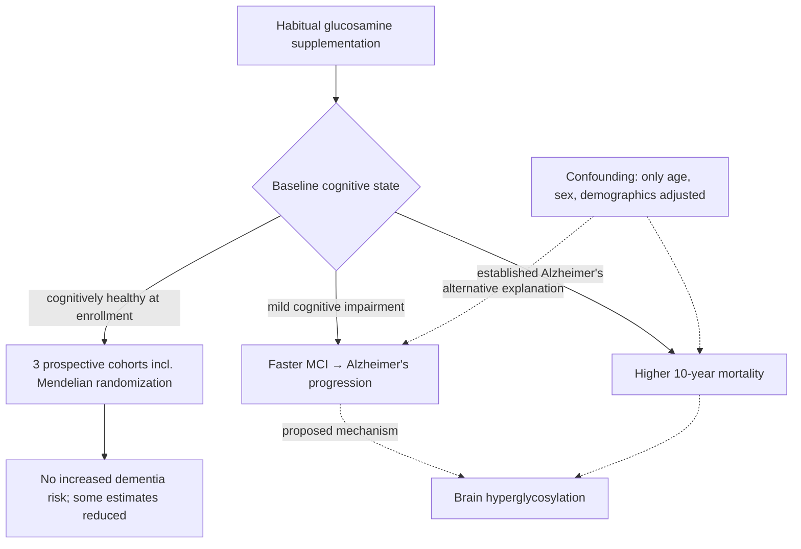

# Glucosamine

Glucosamine is an amino sugar sold widely as a joint supplement for osteoarthritis. Biologically it sits at the entry of the hexosamine pathway, whose end products are attached to proteins as sugar chains (glycosylation); this pathway position, rather than its joint indication, is what has drawn it into Alzheimer's disease research. This page covers the cognitive-safety question raised in 2026; it does not grade glucosamine's joint efficacy, which the source does not address. (@Physionic (Physionic) — "Glucosamine: More Death, More Alzheimer's Disease - New Study!", 2026-07-30, [link](https://www.youtube.com/watch?v=MqZku0O93k8))

## The hyperglycosylation finding

A 2026 Nature Metabolism study (Hawkinson et al., doi:10.1038/s42255-026-01538-4) ran broad molecular surveys — metabolomics, lipidomics, and glycomics — on postmortem brains from Alzheimer's patients versus non-demented controls. Metabolite and lipid profiles were broadly similar between groups, but glycomics showed marked regional differences, and follow-up measurements in extracellular and intracellular brain compartments plus animal experiments converged on glucosamine as the molecule of interest, framing hyperglycosylation as a candidate metabolic driver of the disease. This brain data is cross-sectional: it shows a difference at one point in time, not that supplemental glucosamine caused it. (@Physionic (Physionic) — "Glucosamine: More Death, More Alzheimer's Disease - New Study!", 2026-07-30, [link](https://www.youtube.com/watch?v=MqZku0O93k8))

The same study's longitudinal component produced a timing-dependent split. Among people who already had Alzheimer's disease, daily glucosamine supplement users showed higher mortality over ten years of follow-up than non-users; among people with mild cognitive impairment (MCI) — a pre-dementia stage — glucosamine use showed no mortality association, but was associated with faster progression from MCI to Alzheimer's disease. Critically, the confounder adjustments were limited to age, sex, and demographics, leaving adiposity, frailty, socioeconomic status, education, diet quality, and co-supplementation unaddressed; the mechanistic brain data strengthens the study but does not make the association causal. (@Physionic (Physionic) — "Glucosamine: More Death, More Alzheimer's Disease - New Study!", 2026-07-30, [link](https://www.youtube.com/watch?v=MqZku0O93k8))

## Evidence conflicts

Three earlier prospective cohort studies reach the opposite headline conclusion: habitual glucosamine use was associated with no change or a *reduced* risk of incident dementia, including Alzheimer's disease — one with Mendelian-randomization support (Xu et al. 2022, doi:10.1186/s13195-022-01137-x; Zheng et al. 2023, doi:10.1186/s12916-023-02816-8; Zhou et al. 2023, examining APOE genotype, doi:10.1186/s13195-023-01295-6). The reconciliation offered is population timing: all three excluded people with dementia or MCI at baseline, whereas the 2026 study's cohort analyses concern people already at least at the MCI stage. Read together, the studies are consistent with a state-dependent effect — no detectable harm (possibly benefit) in cognitively healthy users, a possible acceleration once impairment exists — but the harm signal rests on one study with thin confounder adjustment, and reassurance for healthy users would still need more data. This is the source's own synthesis, which it labels a yellow flag for diagnosed MCI or Alzheimer's rather than a general warning; the disagreement between the four studies is recorded here rather than averaged. (@Physionic (Physionic) — "Glucosamine: More Death, More Alzheimer's Disease - New Study!", 2026-07-30, [link](https://www.youtube.com/watch?v=MqZku0O93k8))

## Practical implications

- **Cognitively healthy adults taking glucosamine for joints: no cognition-based change is currently warranted — moderate confidence in the absence of a demonstrated risk, from three cohorts with null-to-protective associations.** Alarmed headlines extrapolate a patient-population finding to everyone. (@Physionic (Physionic) — "Glucosamine: More Death, More Alzheimer's Disease - New Study!", 2026-07-30, [link](https://www.youtube.com/watch?v=MqZku0O93k8))
- **With diagnosed mild cognitive impairment or Alzheimer's disease: treat continued glucosamine as an open risk question and review it with the treating clinician — emerging safety signal; one cohort with limited adjustment plus mechanistic brain data, contradicted by no direct evidence but confirmed by none either.** Stopping a discretionary supplement is low-cost relative to the uncertainty. (@Physionic (Physionic) — "Glucosamine: More Death, More Alzheimer's Disease - New Study!", 2026-07-30, [link](https://www.youtube.com/watch?v=MqZku0O93k8))
- No human-facing action beyond these two follows from the brain-glycomics finding itself; it is a mechanism-level result. (@Physionic (Physionic) — "Glucosamine: More Death, More Alzheimer's Disease - New Study!", 2026-07-30, [link](https://www.youtube.com/watch?v=MqZku0O93k8))

## Gaps & open questions

- Does glucosamine supplementation raise brain glucosamine or protein glycosylation in living humans at supplement doses?
- Does the MCI-progression association survive adjustment for adiposity, frailty, education, diet quality, and co-supplementation?
- Is there truly no risk in cognitively healthy users, or only insufficient follow-up into the impaired state?
- Does APOE genotype modify the association, and in which direction?
- Would deprescribing glucosamine in MCI change progression — the only design that could establish causality?

## Related

[[supplement-evidence-and-safety]] · [[alzheimers-spectrum-and-diagnosis]] · [[cognitive-reserve-and-brain-health]] · [[proactive-health-monitoring]] · [[practice-playbook]]
