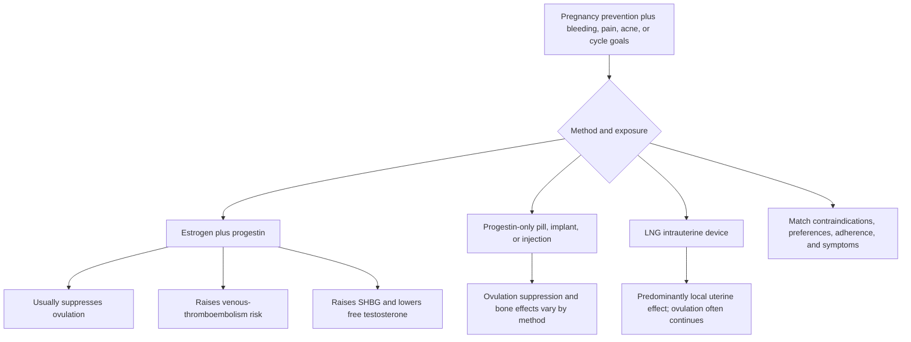

# Hormonal contraception

Hormonal contraceptives prevent pregnancy through method-specific combinations of ovulation suppression, cervical-mucus thickening, and endometrial effects. Combined hormonal contraceptives (CHCs: pill, patch, or ring) contain estrogen plus a progestin; progestin-only pills, implants, injections, and levonorgestrel intrauterine devices differ materially in systemic exposure, ovulation suppression, effectiveness, bleeding pattern, and contraindications. A class-wide claim is therefore rarely an adequate clinical rule. [CDC U.S. Medical Eligibility Criteria (MEC), 2024](https://www.cdc.gov/mmwr/volumes/73/rr/rr7304a1.htm)

## Strongest fair synthesis

The strongest evidence supports effective contraception and several noncontraceptive benefits, including control of heavy or painful bleeding and lower long-term ovarian and endometrial cancer risk with oral contraceptive use. These benefits must be weighed against method-specific harms and the health consequences of unintended pregnancy, not against a no-risk baseline. [NCI oral-contraceptive cancer review](https://www.cancer.gov/about-cancer/causes-prevention/risk/hormones/oral-contraceptives-fact-sheet)

CHCs still carry a clinically relevant venous-thromboembolism (VTE) risk at modern estrogen doses. The prior version over-attributed concern to obsolete high-dose pills. Baseline VTE incidence in healthy reproductive-age nonusers is low, but estrogen-containing methods increase it; pregnancy and especially the postpartum period carry still higher risk. Method eligibility changes materially with current or prior VTE, thrombophilia, smoking at older ages, migraine with aura, severe hypertension, major surgery with immobilization, and other conditions, so current CDC MEC categories—not a generic “low dose” reassurance—should govern selection. [CDC MEC 2024](https://www.cdc.gov/mmwr/volumes/73/rr/rr7304a1.htm)

CHCs reliably lower total and free testosterone and raise sex-hormone-binding globulin, but the downstream sexual effect is heterogeneous. Some users improve because pregnancy anxiety, bleeding, or pain improves; some report lower desire, arousal, lubrication, orgasm, or pain; many report no change. A 2024 review found the literature too heterogeneous and short of placebo-controlled trials for a universal causal claim, while still supporting explicit counseling and method reconsideration when a clear temporal adverse effect occurs.[^casado-espada-2024][^zimmerman-2014]

Bone effects are also method- and age-specific. Depot medroxyprogesterone acetate has the clearest association with reversible bone-mineral-density loss. For adolescent CHC users, prospective evidence suggests slightly less peak bone accrual in some studies, especially with lower estrogen exposure, but fracture consequences and recovery after discontinuation remain uncertain; this is a counseling consideration, not a general contraindication to effective contraception. [CDC MEC 2024](https://www.cdc.gov/mmwr/volumes/73/rr/rr7304a1.htm) · [Goshtasebi et al. meta-analysis](https://pmc.ncbi.nlm.nih.gov/articles/PMC6850432/)

## Adversarial pass: what narrows the conclusion

- The free-testosterone mechanism does not prove that a given person's sexual pain or low desire was caused by contraception; infection, dermatologic disease, pelvic-floor dysfunction, endometriosis, relationship factors, medicines, and mood remain alternatives.
- “Hormonal IUD” does not mean zero systemic exposure or guaranteed ovulation. Most users continue ovulating, but patterns vary by device, dose, and time since insertion.
- Cancer-risk reductions are long-term population averages and do not erase current breast-cancer contraindications or individual thrombotic risk.
- Observational bone differences are vulnerable to baseline activity, nutrition, body size, and indication differences; adult fracture outcomes are not established.

## Attributed positions: Gottfried's benefit–harm ledger

The gynecologist Sara Gottfried offers a sharper-edged reading of combined oral contraceptives than the synthesis above; her positions are recorded here as attributed provenance, several conflicting with the reviewed conclusions, none displacing them. (@hubermanlab (Andrew Huberman) — "Essentials: How to Optimize Female Hormone Health for Vitality & Longevity | Dr. Sara Gottfried", 2026-08-13, [link](https://www.youtube.com/watch?v=wbuPQPu-03Y))

- **Ovarian-cancer benefit via ovulation suppression.** She quantifies the benefit the synthesis already records: about five years of oral-contraceptive use halves ovarian-cancer risk, on the incessant-ovulation logic (nuns with uninterrupted monthly ovulation show higher risk; pregnancy and breastfeeding, which pause ovulation, associate with lower risk). She weighs this heavily because ovarian cancer lacks effective early detection — symptoms (bloating, pelvic-bulk sensations) are vague and overlap with common female GI complaints, and CA-125 plus ultrasound surveillance in higher-risk women still usually catches disease late. She treats prophylactic ovulation suppression in women not needing contraception as a rational question mainstream medicine has answered too eagerly under pharmaceutical influence.
- **Blanket anti-progestin stance.** Her position — synthetic progestins are the same class implicated in WHI harms, and she does not recommend them for any woman except where they provide real freedom — conflicts with the individualized, method-specific CDC MEC framework this page adopts; class-wide condemnation is not supported by the reviewed evidence, which distinguishes progestins, doses, routes, and indications.
- **Systemic-harm list.** She attributes to oral contraceptives micronutrient depletion (magnesium, several B vitamins), microbiome effects with a possible increased risk of inflammatory bowel disease and autoimmune conditions (data she concedes are weaker), a two-to-three-fold rise in hsCRP, and a more rigid HPA axis (less flexible cortisol dynamics). The hsCRP elevation on combined pills is a real, replicated laboratory finding of uncertain clinical meaning; the HPA-rigidity and disease-risk claims are looser and uncited in the transcript.
- **SHBG persistence and free testosterone.** Consistent with the synthesis, she describes SHBG as a sponge for free testosterone, adds a phenotype (possibly androgen-receptor CAG-repeat-related) exquisitely sensitive to the free-testosterone drop — vaginal dryness, lower desire, and in her framing reduced confidence and agency — and cites a study finding SHBG still elevated a year after discontinuation. This parallels Tami Rowen's persistence claim, already flagged-not-adopted above; reversibility remains genuinely uncertain.
- **Clitoral-volume claim.** Her strongest counseling lever — that the pill can shrink the clitoris by up to 20%, undisclosed in routine consent — is recorded as **flagged, not adopted**: the transcript supplies no citation, the underlying literature is thin (small imaging studies), and no functional consequence is established. It should not be repeated as an established harm.
- **Dysmenorrhea alternatives.** For painful periods or acne (indications she considers progestin overprescription), she substitutes cause-directed measures: omega-3s/fish oil and specialized pro-resolving mediators for inflammatory tone, with aspirin during menses — Investigational practice; NSAIDs, not aspirin, are the evidence-based first line for dysmenorrhea, and SPM supplements lack outcome trials ([[omega-3-fatty-acids]]).

## Evidence update — 2026-09-01

> **What changed:** The conclusion remains that contraceptive choice should be individualized, but the old statement that modern clot concern was “mostly” inherited from early high-dose pills was removed. Current CDC guidance confirms that modern estrogen-containing methods still raise VTE risk and require condition-specific eligibility screening. Sexual-function and adolescent-bone claims were narrowed from mechanistic certainty to heterogeneous or observational evidence. The earlier podcast-derived history remains useful as provenance for why these questions entered the wiki, but no longer supports clinical recommendations by itself.

## Practical implications

- **Use the current CDC MEC and shared decision-making to choose a method—strong.** Review pregnancy-prevention priority, bleeding and pain goals, migraine, smoking, blood pressure, thrombotic history, medicines, postpartum status, and personal preference. [CDC MEC 2024](https://www.cdc.gov/mmwr/volumes/73/rr/rr7304a1.htm)
- **Measure blood pressure before starting a CHC and reassess when health conditions change—strong.** Routine thrombophilia or hormone testing is not required for most asymptomatic candidates; targeted testing follows history and guidance. [CDC Selected Practice Recommendations, 2024](https://www.cdc.gov/mmwr/volumes/73/rr/rr7303a1.htm)
- **If new sexual pain or loss of desire begins after a method change, assess competing causes and consider a supervised method change—moderate.** SHBG or testosterone measurement alone does not establish causation or dictate treatment.
- **Do not use ovarian hormone tests obtained during ovulation-suppressing contraception to infer untreated baseline function—strong on mechanism.** Interpretation depends on the exact method and clinical question.
- **For adolescents, preserve access to effective contraception while discussing bone health when CHCs or depot medroxyprogesterone are being considered—moderate.** Weight-bearing activity, adequate nutrition, and the reason for treatment matter more than an isolated density concern.

## Gaps & open questions

- Which baseline features predict adverse versus beneficial sexual effects of each method?
- Do adolescent CHC-associated differences in bone accrual alter adult fracture risk?
- How quickly do endocrine and sexual effects resolve after discontinuation, and is persistent SHBG elevation clinically meaningful?
- Which perimenopausal patients benefit most from ovulation suppression versus menopause-dose hormone therapy?
- Does prophylactic ovulation suppression in women not needing contraception produce net benefit once thrombotic, mood, sexual, and unknown long-term costs are counted against the ovarian-cancer reduction?
- Do the reported hsCRP elevation and HPA-axis changes on combined pills carry any clinical consequence, or are they laboratory findings without outcome correlates?
- Does clitoral or vestibular tissue measurably change on combined pills, and is any change functionally meaningful or reversible?

## Related

[[menopause-hormone-therapy]] · [[perimenopause-assessment-and-testing]] · [[vulvovaginal-anatomy-and-hormone-sensitivity]] · [[genitourinary-syndrome-of-menopause]] · [[low-energy-availability-and-menstrual-function]] · [[sexual-desire-arousal-and-aging]] · [[polycystic-ovary-syndrome]] · [[omega-3-fatty-acids]] · [[tami-rowen]] · [[rena-malik]] · [[sara-gottfried]]

## References

[^casado-espada-2024]: Casado-Espada NM, et al. “Hormonal Contraceptives, Female Sexual Dysfunction, and Managing Strategies.” 2024. [narrative review]. [PubMed](https://pubmed.ncbi.nlm.nih.gov/38515302/)
[^zimmerman-2014]: Zimmerman Y, et al. “The Effect of Combined Oral Contraception on Testosterone Levels in Healthy Women: A Systematic Review and Meta-analysis.” *Human Reproduction Update*, 2014. [systematic review and meta-analysis]. [doi:10.1093/humupd/dmt038](https://doi.org/10.1093/humupd/dmt038)
