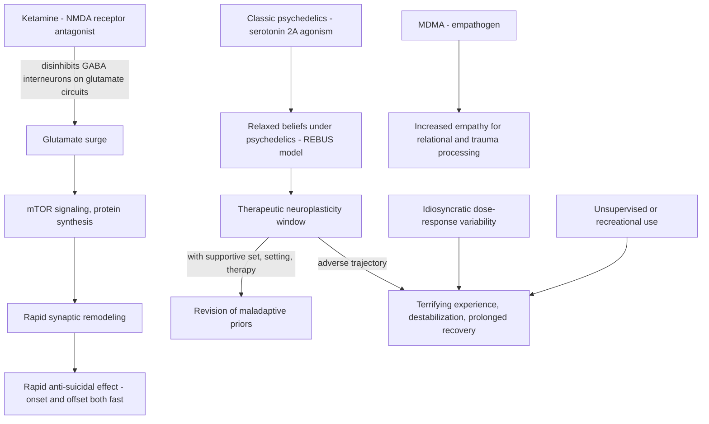

# Ketamine and psychedelic therapy

Ketamine and the classic psychedelics (psilocybin, LSD) plus the empathogen MDMA form a class of rapid-acting, plasticity-inducing psychiatric interventions that differ fundamentally from daily monoamine drugs: a single or short course of administrations can produce effects — sometimes durable, sometimes catastrophic — through an acute window of heightened neuroplasticity rather than through chronic receptor occupancy. Regulatory status is uneven: racemic intravenous ketamine is an approved anesthetic used off-label for depression, intranasal esketamine is FDA-approved for treatment-resistant depression under a monitored-administration program, while psilocybin remains investigational and the FDA declined the 2024 application for MDMA-assisted therapy for PTSD, requesting further trial evidence. (@PeterAttiaMD (Peter Attia MD) — "404 ‒ Mental health beyond neurotransmitters: hormones in psychiatry, psychedelic therapies, & more", 2026-08-17, [link](https://www.youtube.com/watch?v=fs89fhQCfj4))

## Mechanisms

Ketamine antagonizes NMDA receptors on GABA interneurons, disinhibiting glutamate release; the resulting excitatory surge drives mTOR signaling, protein synthesis, and rapid synaptic remodeling. Clinically this produces fast-on, fast-off effects: a patient near hospitalization for uncontainable suicidality can improve dramatically after an infusion, but in the source clinician's experience the depression itself usually does not remit durably, so ketamine functions best as a bridge to a definitive regimen rather than the solution — with occasional true remissions whose attribution (drug, placebo, spontaneous) is unknowable in the individual. Administration is typically intravenous with monitoring at partially dissociative doses; frequency and durability vary widely between patients and centers, and the treatment is time-consuming, expensive, and inconvenient. Ketamine is unrelated to MDMA despite the name resemblance. (@PeterAttiaMD (Peter Attia MD) — "404 ‒ Mental health beyond neurotransmitters: hormones in psychiatry, psychedelic therapies, & more", 2026-08-17, [link](https://www.youtube.com/watch?v=fs89fhQCfj4))

Classic psychedelics act at the serotonin 2A receptor. Robin Carhart-Harris's REBUS model (relaxed beliefs under psychedelics) frames their therapeutic action as a plasticity window in which maladaptive priors — the rigid beliefs underpinning many depressive and anxiety disorders — become revisable, with outcome contingent on set, setting, and the relational or therapeutic response inside the window. This converges mechanistically with hormonal neuroplasticity: estradiol also promotes plasticity through BDNF and glutamatergic signaling ([[neuroendocrine-regulation-of-mood]]). MDMA is characterized as an empathogen, plausibly suited to PTSD involving relational reconciliation. (@PeterAttiaMD (Peter Attia MD) — "404 ‒ Mental health beyond neurotransmitters: hormones in psychiatry, psychedelic therapies, & more", 2026-08-17, [link](https://www.youtube.com/watch?v=fs89fhQCfj4))

## Durability, unpredictability, and harm

The strongest argument for the class and the strongest argument against it come from the same property. A single guided psilocybin session can produce an experience whose effects the recipient regards as permanent — Peter Attia describes an out-of-body re-experiencing of his own childhood from a parent's perspective that durably transformed his gratitude toward his parents a decade later. The same person, with maximal preparation, intention, and therapeutic support, later experienced sessions ranging from neutral to traumatic, including hours of a recurring guillotine vision and a session that took months of recovery, with nothing in set, setting, or dose identifiably different; his therapeutic ketamine session was wholly negative ("Guantanamo Bay for my soul" in his description). Both discussants converge on randomness as the core unsolved problem: response is idiosyncratic, therapeutic windows are narrow, and individual pharmacokinetic variability can be extreme (Attia reports requiring psilocybin doses north of 10 grams where 5 grams is a full standard dose — an n-of-1 illustration that published dose norms do not bound individual exposure needs). A widely shared case report of a woman with reportedly severe decade-long Alzheimer's improving after 5 grams of psilocybin is treated as uninterpretable: no metrics, no imaging, an implausibly long severe-disease course, and an alternative PTSD-regression explanation — a caution against generalizing single miraculous cases to neurodegeneration. (@PeterAttiaMD (Peter Attia MD) — "404 ‒ Mental health beyond neurotransmitters: hormones in psychiatry, psychedelic therapies, & more", 2026-08-17, [link](https://www.youtube.com/watch?v=fs89fhQCfj4))

Recreational and unsupervised use is a distinct, growing harm surface: ketamine is a dissociative anesthetic with mood effects that can go in either direction and addiction potential, and the source clinician characterizes random unsupervised use as playing Russian roulette. The most defensible current indications discussed are treatment-resistant depression (ketamine, as bridge), PTSD (MDMA, pending further trials), and end-of-life existential distress (psilocybin), where a poor baseline shifts the risk–reward calculus; proposed future risk-mitigation strategies (modified molecules, combination pharmacotherapy, refined set-and-setting protocols) remain research directions. (@PeterAttiaMD (Peter Attia MD) — "404 ‒ Mental health beyond neurotransmitters: hormones in psychiatry, psychedelic therapies, & more", 2026-08-17, [link](https://www.youtube.com/watch?v=fs89fhQCfj4))

## The practitioner-optimist position, and a live disagreement on risk framing

Psychiatrist and ketamine-therapy trainer David Rabin represents the enthusiastic clinical wing of this field, and several of his factual points are straightforwardly useful. Ketamine is the currently legal psychedelic route: esketamine is FDA-approved for depression, racemic ketamine has roughly 70 years of anesthetic use (including in pregnancy and pediatric cases), sessions last about an hour, and — a practical differentiator — ketamine can be combined with SSRI antidepressants, whereas classic serotonergic psychedelics risk serotonin syndrome on that background. His central caveat matches the field's: the therapy is most of the treatment. He estimates therapy drives about 80% of durable benefit and warns that drug-only ketamine becomes indefinite re-dosing every two weeks — functionally another maintenance antidepressant — and he generalizes the point: every psychiatric medication studied works better combined with talk therapy, with SSRIs originally intended as 6–12-month stabilization bridges into skill-building rather than lifetime monotherapy. That last framing is his reading of practice history, not a guideline statement. (@maxlugavere (Max Lugavere) — "'You Are Not Your Thoughts!' How to Stop Negative Thoughts Instantly", 2026-07-08, [link](https://www.youtube.com/watch?v=vEY4oGH1x_0))

His stronger claims deserve labeled distance. He characterizes standard care for depression, anxiety, and PTSD as under 30% long-term response, against 50–70% response/remission in MDMA-assisted-therapy trials, and forecasts psychedelics will be remembered as psychiatry's equivalent of antibiotics; he further reports his own study finding trauma-associated epigenetic marks moving toward pre-trauma patterns within three MDMA sessions over 12 weeks — a preliminary, conflict-adjacent finding (he is a paid trainer and psychedelic-therapy advocate) that has not been independently reviewed here, in a field where the FDA found the pivotal MDMA trials insufficient in 2024. **Evidence conflict — how safe is ketamine?** Rabin calls ketamine a very gentle, very safe medicine; the clinician source above calls unsupervised use Russian roulette and documents wholly negative supervised experiences, and a growing recreational-ketamine market adds bladder toxicity and addiction concerns outside clinical settings. The positions partly reconcile on context — Rabin's safety claim concerns supervised, screened, therapist-paired use — but the within-person unpredictability documented above is not answered by his framing, so both are retained. (@maxlugavere (Max Lugavere) — "'You Are Not Your Thoughts!' How to Stop Negative Thoughts Instantly", 2026-07-08, [link](https://www.youtube.com/watch?v=vEY4oGH1x_0)) (@PeterAttiaMD (Peter Attia MD) — "404 ‒ Mental health beyond neurotransmitters: hormones in psychiatry, psychedelic therapies, & more", 2026-08-17, [link](https://www.youtube.com/watch?v=fs89fhQCfj4))

## Positioning relative to contemplative training

A distinct, attributed position on what psychedelics are *for* comes from the contemplative side. Sam Harris — whose meditation practice began after early MDMA and psychedelic experiences at 18 — holds that "psychedelics were indispensable in the beginning in proving to me that the first-person interrogation of the mind was worth doing": the acute experience demonstrates that radically healthier psychological states (unconditional love, unified attention) are possible at all, which the noun "meditation" alone fails to convey to a novice. The structural limitation is impermanence: the drug wears off, the memory can dim like a dream, and using the acute state as the model of the goal invites stringing together peak experiences, each of which is by definition transient. His resolution is that whatever a psychedelic reveals "has got to be mappable into ordinary waking consciousness" — the durable target is a psychological freedom compatible with ordinary, even chaotic states, which he reports contemplative training delivered well enough that he stopped psychedelic use for 25 years. This is expert experiential interpretation, not trial evidence, but it supplies a coherent account of the class's role — demonstration and motivation rather than maintenance therapy — that complements the randomness problem above: a modality whose sessions are unpredictable is better suited to proving a possibility than to sustaining one. The contemplative mechanics it points toward are developed at [[meditation-and-contemplative-training]]. (@hubermanlab (Andrew Huberman) — "Essentials: Using Meditation to Focus, View Consciousness & Expand Your Mind | Dr. Sam Harris", 2026-07-23, [link](https://www.youtube.com/watch?v=LQI8tl8S2PE))

## Practical implications

- **Do not use ketamine or psychedelics recreationally or unsupervised — strong safety position from the source, consistent with the dissociative, unpredictable, and addictive-potential profile.** Negative trajectories occur even under maximal clinical preparation. (@PeterAttiaMD (Peter Attia MD) — "404 ‒ Mental health beyond neurotransmitters: hormones in psychiatry, psychedelic therapies, & more", 2026-08-17, [link](https://www.youtube.com/watch?v=fs89fhQCfj4))
- **For dangerous, treatment-resistant depression: monitored ketamine or approved esketamine may serve as an acute bridge while a definitive regimen is found — moderate for rapid short-term effect; durability is the unresolved limitation.** This is a specialist decision within a monitored program. [[mood-disorder-pharmacology]]
- **If pursuing ketamine treatment: insist on paired psychotherapy rather than infusion-only care — moderate; both practitioner camps here converge that drug-only protocols trend toward indefinite re-dosing, and combination medication-plus-therapy is better supported across psychiatric treatment generally.** Verify SSRI compatibility and screening with the prescriber. (@maxlugavere (Max Lugavere) — "'You Are Not Your Thoughts!' How to Stop Negative Thoughts Instantly", 2026-07-08, [link](https://www.youtube.com/watch?v=vEY4oGH1x_0))
- **Anyone considering a psychedelic should weigh that response is not predictable from preparation, and a person's first positive experience does not forecast subsequent ones — strong caution from documented within-person variability.** Bipolar-spectrum vulnerability and psychosis risk require psychiatric screening.
- **Treat single-case reports of dramatic recovery (including in dementia) as hypothesis-generating only — strong evidential principle.**

## Gaps & open questions

- What predicts a therapeutic versus traumatic trajectory in a given session, given that set, setting, dose, and preparation demonstrably do not fully determine it?
- Does ketamine tachyphylaxis develop with repeated infusions, and what maintenance schedule, if any, sustains benefit?
- How much of psychedelic durability depends on the acute subjective experience versus the plasticity window itself (a question bearing on non-hallucinogenic analogues)?
- Can pharmacological co-administration or molecular modification preserve efficacy while truncating adverse experiences?
- What is the population burden of harm from the expanding recreational-ketamine market?
- Can contemplative training consolidate or substitute for psychedelic-induced insight — i.e., does meditation experience before or after a session change durability or reduce the need for repeat dosing? Unstudied beyond practitioner report.

## Related

[[mood-disorder-pharmacology]] · [[neuroendocrine-regulation-of-mood]] · [[neuromodulators-and-state-control]] · [[addiction-recovery-and-emotional-sobriety]] · [[alzheimers-spectrum-and-diagnosis]] · [[meditation-and-contemplative-training]] · [[sam-harris]] · [[peter-attia]] · [[david-rabin]]
