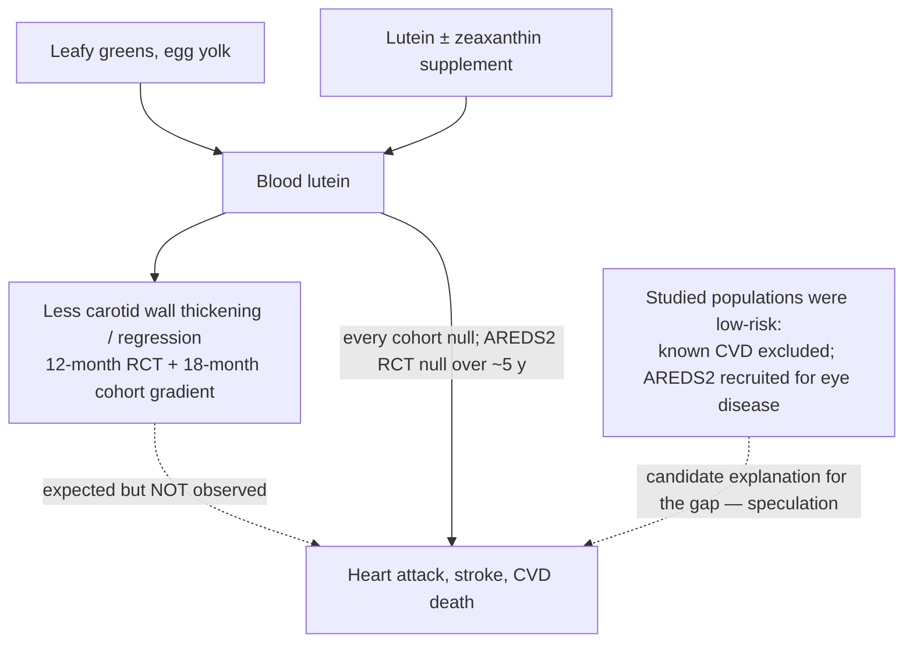

# Lutein

Lutein is a xanthophyll — an oxygenated carotenoid structurally related to the vitamin A family, though without provitamin A activity — concentrated in dark leafy greens such as kale and spinach and, less obviously, in egg yolk. Its best-established biology is ocular: lutein and its isomer zeaxanthin accumulate in the macula, and the AREDS2 formulation containing them is standard care for slowing progression of intermediate age-related macular degeneration. The cardiovascular question is separate, and it is a clean worked example of the wiki's outcome hierarchy: lutein has randomized evidence at an arterial-imaging endpoint and consistently null evidence at the disease-event level. (@Physionic (Physionic) — "1 Year of Lutein: Reversing Arterial Plaque", 2026-07-09, [link](https://www.youtube.com/watch?v=DYedJh6-1jo))

## Arterial-wall evidence

A randomized, double-blind, placebo-controlled trial in Chinese adults with subclinical atherosclerosis (Zou et al. 2014, Br J Nutr, doi:10.1017/S0007114513002730) gave lutein alone or lutein plus lycopene for 12 months and measured carotid intima-media thickness. The lutein-alone arm improved relative to placebo, and the combination arm improved more — the same trial that anchors the lycopene arterial findings on [[tomato-products-and-lycopene]]. The source describes this as regression already underway being accelerated, not merely slowed progression. (@Physionic (Physionic) — "1 Year of Lutein: Reversing Arterial Plaque", 2026-07-09, [link](https://www.youtube.com/watch?v=DYedJh6-1jo))

Observational data agree at the same endpoint. In the Los Angeles Atherosclerosis Study (Dwyer et al. 2001, Circulation), about 500 participants stratified by blood lutein concentration showed an inverse gradient — higher blood lutein, less carotid arterial thickening over 18 months of follow-up, with similar trends in men and women. This is associative: participants were not given lutein, and blood carotenoid level is also a marker of overall diet quality. (@Physionic (Physionic) — "1 Year of Lutein: Reversing Arterial Plaque", 2026-07-09, [link](https://www.youtube.com/watch?v=DYedJh6-1jo))

## The outcome gap

At the disease-event level the record inverts. Across the cohort studies examined in the source — including dietary carotenoids and coronary disease in women (Osganian et al. 2003), plasma carotenoids and myocardial infarction in male physicians (Hak et al. 2003), and carotenoid intake and stroke in men (Ascherio et al. 1999) — no study found a relationship between lutein and heart attack or stroke risk; the null is consistent across every study that looked. The strongest test is randomized: in AREDS2 (2014, JAMA Intern Med), lutein plus zeaxanthin supplementation over about five years produced no separation from placebo in cardiovascular-disease death. (@Physionic (Physionic) — "1 Year of Lutein: Reversing Arterial Plaque", 2026-07-09, [link](https://www.youtube.com/watch?v=DYedJh6-1jo))

Two reconciliations are possible and neither is established. First, population: every null association study enrolled relatively healthy people — known cardiovascular disease was excluded — and AREDS2 recruited for macular degeneration, not cardiovascular risk. The intermediate-endpoint benefit might translate into events only in higher-risk people, who are exactly the ones not studied; the source labels this pure speculation, not a demonstrated subgroup effect. Second, the endpoint itself: intima-media thickness is an anatomical intermediate, not a validated surrogate for events, so an intervention can move it without moving what matters ([[lipoprotein-retention-and-atherogenesis]], [[coronary-ct-angiography]]). The source's summary framing: lutein is not harmful from a cardiovascular standpoint, may act on arterial plaque, and has no currently demonstrated effect on outcomes — probably a mild benefit, if any. (@Physionic (Physionic) — "1 Year of Lutein: Reversing Arterial Plaque", 2026-07-09, [link](https://www.youtube.com/watch?v=DYedJh6-1jo))

## Gaps & open questions

- Does lutein affect cardiovascular events in people at elevated risk or with established disease — the populations excluded from the existing null studies?
- How much of the blood-lutein gradient in cohort data is lutein itself versus the leafy-green dietary pattern it marks?
- Is the intima-media-thickness change durable, dose-dependent, and reproducible outside the single 12-month trial population?
- Would lutein add anything to established ApoB-lowering therapy, or is any arterial effect redundant once particle exposure is treated?

## Practical implications

- **Eat lutein-rich foods — dark leafy greens and eggs — as part of the standard plant-forward pattern; strong for the pattern, not for lutein specifically.** The whole-food route captures whatever benefit exists and carries the rest of the diet-quality signal that supplementation cannot. [[nutrition-evidence-and-personalization]]
- **Do not take lutein supplements for cardiovascular prevention — moderate-strength null evidence.** The one long randomized test (AREDS2, ~5 years) showed no cardiovascular benefit, and no cohort shows an event association; supplementation must not displace lipid, blood-pressure, smoking, and activity management. [[lipoprotein-retention-and-atherogenesis]] [[supplement-evidence-and-safety]] (@Physionic (Physionic) — "1 Year of Lutein: Reversing Arterial Plaque", 2026-07-09, [link](https://www.youtube.com/watch?v=DYedJh6-1jo))
- **Lutein + zeaxanthin for intermediate age-related macular degeneration is a separate, guidance-supported indication.** That decision belongs with an eye-care clinician using the AREDS2 formulation evidence; it does not transfer to cardiovascular use.

## Related

[[tomato-products-and-lycopene]] · [[supplement-evidence-and-safety]] · [[lipoprotein-retention-and-atherogenesis]] · [[nutrition-evidence-and-personalization]] · [[coronary-ct-angiography]] · [[omega-3-fatty-acids]] · [[practice-playbook]]
