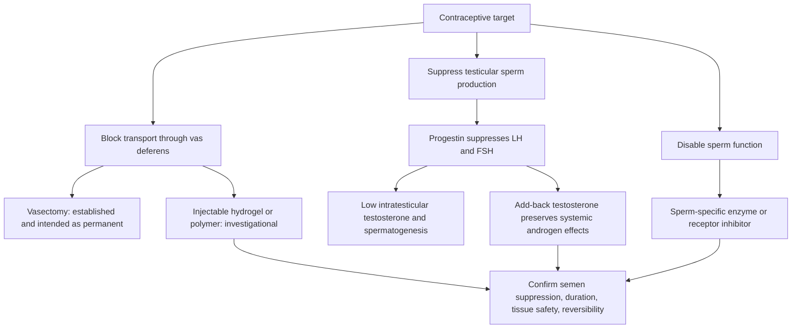

# Male contraception

Male contraception prevents sperm from fertilizing an egg by blocking sperm transport, suppressing sperm production, or disabling sperm function. The engineering problem is demanding: testes normally generate very large numbers of sperm continuously, an intervention is given to a healthy person, contraceptive failure affects a partner, and reversibility must be demonstrated rather than assumed. Condoms and vasectomy are established options; the hormonal gels, injectable polymers, and sperm-specific small molecules discussed here remain investigational. (@RenaMalikMD (Rena Malik, M.D.) — "A Birth Control Gel for Men Could Be Approved Soon (Would You Actually Trust It?)", 2026-08-07, [link](https://www.youtube.com/watch?v=Z0yWylSfND8))

## Hormonal suppression

Systemic testosterone alone suppresses hypothalamic-pituitary signaling and sperm production in many men, but responses vary enough that it is not a reliable contraceptive. A more effective investigational strategy combines a progestin with replacement testosterone: the progestin suppresses luteinizing hormone (LH) and follicle-stimulating hormone (FSH), reducing testicular sperm production, while testosterone add-back aims to prevent low-androgen symptoms such as low libido, fatigue, hot flashes, and mood changes. The daily transdermal nestorone–testosterone gel described in the source had completed phase 2 study; phase 3 efficacy, longer safety, adherence, partner-transfer risk, recovery, and regulatory review remained unresolved. (@RenaMalikMD (Rena Malik, M.D.) — "A Birth Control Gel for Men Could Be Approved Soon (Would You Actually Trust It?)", 2026-08-07, [link](https://www.youtube.com/watch?v=Z0yWylSfND8))

Contraceptive sperm thresholds are not equivalent to absolute sterility. The source identifies at or below 1 million sperm/mL as a current suppression target and characterizes 5 million/mL as retaining meaningful pregnancy risk; pregnancy efficacy depends on both partners and must ultimately be measured in couples rather than inferred only from semen counts. (@RenaMalikMD (Rena Malik, M.D.) — "A Birth Control Gel for Men Could Be Approved Soon (Would You Actually Trust It?)", 2026-08-07, [link](https://www.youtube.com/watch?v=Z0yWylSfND8))

## Nonhormonal approaches

Intra-vas polymers attempt to block sperm passage without cutting the vas deferens. RISUG uses a styrene maleic anhydride polymer with local spermicidal action; reported tolerability was encouraging, but uncertainty about vas damage, scarring, and reversibility limits inference. Newer hydrogels are designed to dissolve after a programmed interval, yet the transcript notes that early studies were small and some results unpublished, so duration and restored fertility require prospective confirmation. Other early oral programs target a retinoic-acid receptor to interrupt sperm production or soluble adenylyl cyclase to leave sperm production intact while preventing function. Their sperm specificity is attractive in principle, not established clinical effectiveness. (@RenaMalikMD (Rena Malik, M.D.) — "A Birth Control Gel for Men Could Be Approved Soon (Would You Actually Trust It?)", 2026-08-07, [link](https://www.youtube.com/watch?v=Z0yWylSfND8))

## Practical implications

- **For current contraception: use an established method and shared decision-making at every sexual encounter or according to the chosen method — strong.** Do not use exogenous testosterone, supplements, heat devices, or an investigational product as contraception. (@RenaMalikMD (Rena Malik, M.D.) — "A Birth Control Gel for Men Could Be Approved Soon (Would You Actually Trust It?)", 2026-08-07, [link](https://www.youtube.com/watch?v=Z0yWylSfND8))
- **Before vasectomy: treat the choice as permanent and discuss future fertility — strong.** Reversal and sperm retrieval are possible in some cases but do not convert vasectomy into reliably reversible contraception. (@RenaMalikMD (Rena Malik, M.D.) — "A Birth Control Gel for Men Could Be Approved Soon (Would You Actually Trust It?)", 2026-08-07, [link](https://www.youtube.com/watch?v=Z0yWylSfND8))
- **If a male hormonal or polymer method becomes available: follow its confirmatory semen-testing and backup-contraception schedule exactly — prospective.** Suppression has an onset and recovery interval; neither absence of symptoms nor one assumed dose proves contraception.

## Gaps & open questions

- Will phase 3 trials establish pregnancy prevention comparable to accepted contraceptives under typical use?
- How completely and how quickly do sperm counts, testicular volume, and fertility recover after prolonged hormonal suppression?
- Can dissolving intra-vas gels avoid fibrosis while producing predictable duration across users?
- How should adverse effects and contraceptive responsibility be shared between partners in trials and practice?

## Related

[[male-fertility-and-exogenous-testosterone]] · [[practice-playbook]]
