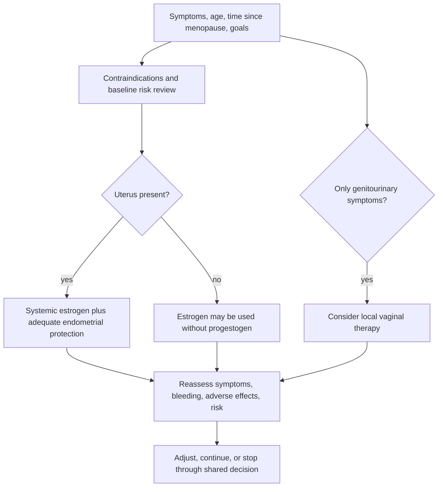

# Menopause hormone therapy

Menopause hormone therapy (MHT) uses estrogen, with endometrial protection when needed, to treat symptoms caused by declining ovarian hormone production. It is not one uniform exposure: molecule, dose, route, timing, uterine status, baseline disease risk, and treatment goal all change the benefit–harm profile. Testosterone is a separate androgen intervention with narrower established indications. (@matt.kaeberlein (Healthspan Medicine) — "The Best Women’s Health Tips on the Planet with Dr. Jennifer Pearlman", 2026-03-20, [link](https://www.youtube.com/watch?v=b_LAI4oG0_w))

## Hormone loss and treatment targets

Estradiol signaling affects thermoregulation and urogenital tissues and also intersects with bone, brain, vasculature, muscle, tendon, and extracellular-matrix biology. Jennifer Pearlman's broader framing is that musculoskeletal aches and tissue dryness are central manifestations of estrogen loss, not merely incidental companions to hot flashes. This is a useful symptom-recognition perspective, but the interview's expansive claims about estrogen preventing multisystem aging are stronger than the clinical-outcome evidence it presents. (@matt.kaeberlein (Healthspan Medicine) — "The Best Women’s Health Tips on the Planet with Dr. Jennifer Pearlman", 2026-03-20, [link](https://www.youtube.com/watch?v=b_LAI4oG0_w))

Systemic estrogen can stimulate the endometrium. A person with a uterus generally needs an adequate progestogen regimen to reduce hyperplasia and cancer risk; progesterone is therefore not merely an optional sleep aid. Local vaginal estrogen addresses genitourinary tissue more directly and should not be conflated with systemic therapy. (@matt.kaeberlein (Healthspan Medicine) — "The Best Women’s Health Tips on the Planet with Dr. Jennifer Pearlman", 2026-03-20, [link](https://www.youtube.com/watch?v=b_LAI4oG0_w))

## Formulation and route matter

Oral estrogen passes through the liver before reaching systemic circulation and can alter coagulation and biliary pathways; transdermal estradiol avoids this first pass. Pearlman therefore generally prefers transdermal estradiol and individualized low-dose initiation, while describing oral or vaginal micronized progesterone according to indication and tolerance. She distinguishes micronized progesterone from medroxyprogesterone acetate and argues that findings from older regimens and populations should not be generalized to all contemporary MHT. These are formulation-specific clinical positions; the transcript does not supply a complete comparative evidence synthesis or make every compounded preparation equivalent to an approved product. (@matt.kaeberlein (Healthspan Medicine) — "The Best Women’s Health Tips on the Planet with Dr. Jennifer Pearlman", 2026-03-20, [link](https://www.youtube.com/watch?v=b_LAI4oG0_w))

The Women's Health Initiative changed prescribing dramatically, but disagreement remains over what its enrolled population and conjugated-estrogen/MPA regimen imply for younger symptomatic women beginning different formulations near menopause. Pearlman estimates that prescribing fell from about 27% in the late 1990s to below 5% and argues that the resulting training gap reinforced under-treatment. Her position is that the trial tested a poorly matched population and regimen for the common near-menopause decision; the counterweight is that limitations in an older trial do not prove broad prevention benefits for newer regimens. The dispute and its evidence boundaries are developed in [[whi-and-menopause-hormone-therapy]]. (@matt.kaeberlein (Healthspan Medicine) — "The Study That Derailed Women's Health And What We're Doing About It (with Dr. Jennifer Pearlman)", 2026-03-08, [link](https://www.youtube.com/watch?v=lQREELkPSIo))

## Testosterone is not routine replacement

Testosterone is biologically important in women, but the interview identifies low sexual desire as the principal current treatment indication and notes the absence of an FDA-approved female testosterone product in the United States. Pearlman also proposes possible effects on arousal, orgasm, muscle, bone, and drive; those broader uses should not be treated as established indications from this source. Excess exposure or conversion to dihydrotestosterone can cause acne, unwanted hair, scalp hair loss, voice deepening, or clitoral enlargement, with some changes potentially irreversible. Her practice of very-low-dose individualized transdermal compounding is a clinician-specific approach, not a standardized protocol. (@matt.kaeberlein (Healthspan Medicine) — "The Best Women’s Health Tips on the Planet with Dr. Jennifer Pearlman", 2026-03-20, [link](https://www.youtube.com/watch?v=b_LAI4oG0_w))

## Practical implications

- **When bothersome vasomotor, sleep-related, or genitourinary symptoms emerge, seek a menopause-specific clinical assessment rather than waiting for one hormone test—strong.** Reassess after initiation or dose change, commonly within weeks to about three months, and promptly investigate unexpected bleeding. (@matt.kaeberlein (Healthspan Medicine) — "The Best Women’s Health Tips on the Planet with Dr. Jennifer Pearlman", 2026-03-20, [link](https://www.youtube.com/watch?v=b_LAI4oG0_w))
- **Before systemic estrogen, document uterine status, contraindications, cardiovascular and thrombotic risk, breast history, route, and an endometrial-protection plan—strong.** Use regulated products when available; formulation labels such as bioidentical do not by themselves establish quality or safety. (@matt.kaeberlein (Healthspan Medicine) — "The Best Women’s Health Tips on the Planet with Dr. Jennifer Pearlman", 2026-03-20, [link](https://www.youtube.com/watch?v=b_LAI4oG0_w))
- **Use the lowest dose that meets the defined therapeutic goal and review benefit and harm at least annually—moderate-to-strong.** Starting low and adjusting gradually can improve tolerability, but treatment should be individualized rather than titrated to a universal youth hormone target. (@matt.kaeberlein (Healthspan Medicine) — "The Best Women’s Health Tips on the Planet with Dr. Jennifer Pearlman", 2026-03-20, [link](https://www.youtube.com/watch?v=b_LAI4oG0_w))
- **Do not add testosterone as a general anti-aging step—moderate-to-strong.** When used for a defined sexual-function indication, monitor symptoms and androgenic adverse effects and avoid supraphysiologic exposure. (@matt.kaeberlein (Healthspan Medicine) — "The Best Women’s Health Tips on the Planet with Dr. Jennifer Pearlman", 2026-03-20, [link](https://www.youtube.com/watch?v=b_LAI4oG0_w))

## Gaps & open questions

- How do contemporary estradiol and micronized-progesterone regimens affect long-term cardiovascular, breast, cognitive, and all-cause outcomes by age and initiation timing?
- Which symptoms and preventive outcomes justify systemic treatment, and which are better addressed locally or nonhormonally?
- What dose and monitoring strategy best balances benefit and androgenic harm for women treated with testosterone?
- How do approved and compounded products compare in delivered dose, variability, safety, and outcomes?

## Related

[[whi-and-menopause-hormone-therapy]] · [[perimenopause-assessment-and-testing]] · [[menopause-related-cognitive-impairment]] · [[ovarian-aging-and-tissue-cryopreservation]] · [[womens-exercise-across-the-lifespan]] · [[jennifer-pearlman]] · [[proactive-health-monitoring]]
