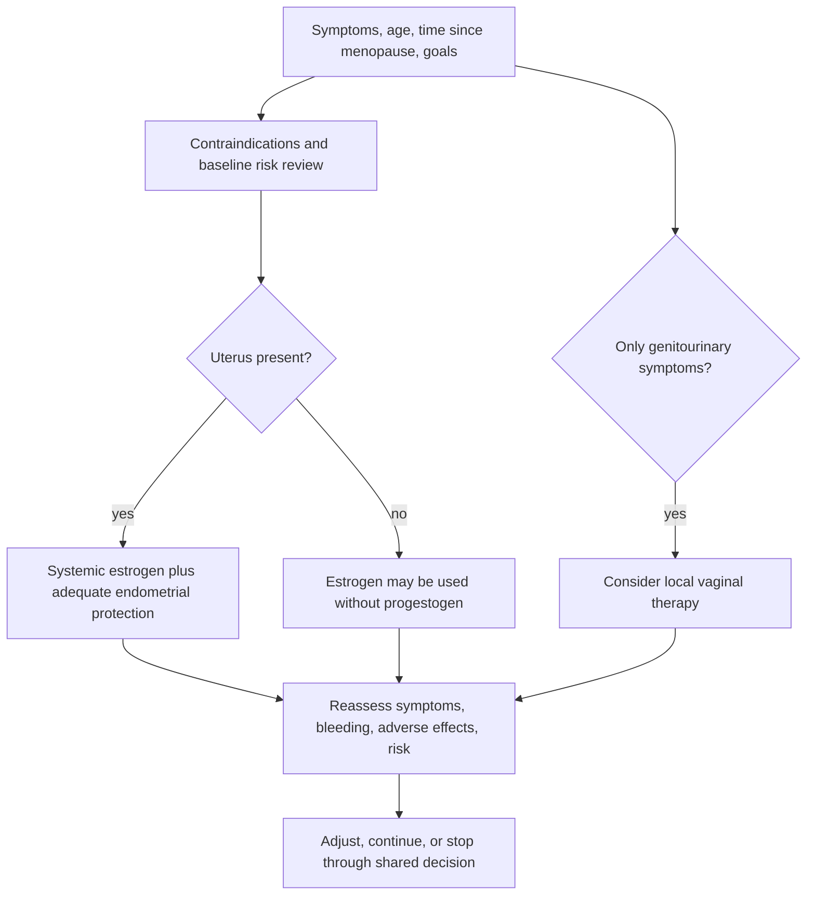
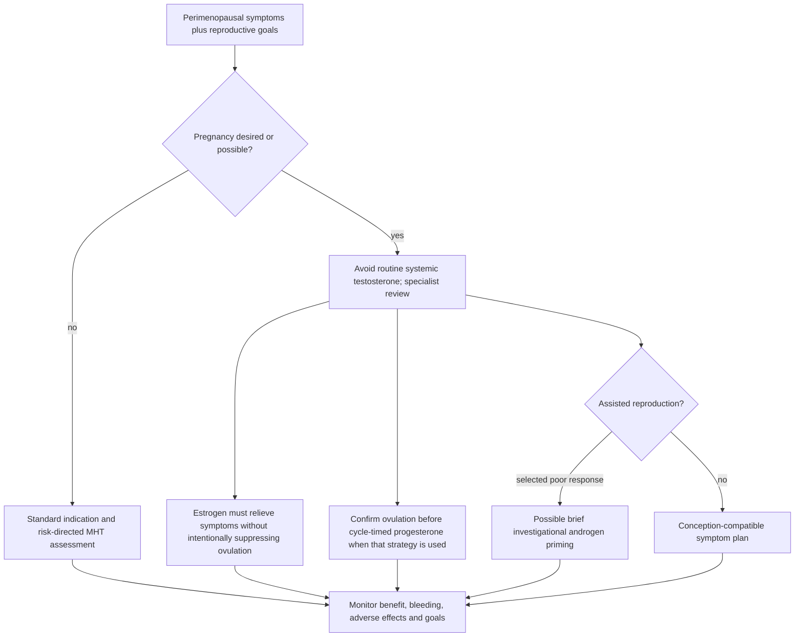

# Menopause hormone therapy

Menopause hormone therapy (MHT) uses estrogen, with endometrial protection when needed, to treat symptoms caused by declining ovarian hormone production. It is not one uniform exposure: molecule, dose, route, timing, uterine status, baseline disease risk, and treatment goal all change the benefit–harm profile. Testosterone is a separate androgen intervention with narrower established indications. (@matt.kaeberlein (Healthspan Medicine) — "The Best Women’s Health Tips on the Planet with Dr. Jennifer Pearlman", 2026-03-20, [link](https://www.youtube.com/watch?v=b_LAI4oG0_w))

```mermaid
flowchart TD
  A[Symptoms, age, time since menopause, goals] --> C[Contraindications and baseline risk review]
  C --> U{Uterus present?}
  U -->|yes| EP[Systemic estrogen plus adequate endometrial protection]
  U -->|no| E[Estrogen may be used without progestogen]
  A --> L{Only genitourinary symptoms?}
  L -->|yes| V[Consider local vaginal therapy]
  EP --> R[Reassess symptoms, bleeding, adverse effects, risk]
  E --> R
  V --> R
  R --> D[Adjust, continue, or stop through shared decision]
```

## Hormone loss and treatment targets

Estradiol signaling affects thermoregulation and urogenital tissues and also intersects with bone, brain, vasculature, muscle, tendon, and extracellular-matrix biology. Jennifer Pearlman's broader framing is that musculoskeletal aches and tissue dryness are central manifestations of estrogen loss, not merely incidental companions to hot flashes. This is a useful symptom-recognition perspective, but the interview's expansive claims about estrogen preventing multisystem aging are stronger than the clinical-outcome evidence it presents. (@matt.kaeberlein (Healthspan Medicine) — "The Best Women’s Health Tips on the Planet with Dr. Jennifer Pearlman", 2026-03-20, [link](https://www.youtube.com/watch?v=b_LAI4oG0_w))

Systemic estrogen can stimulate the endometrium. A person with a uterus generally needs an adequate progestogen regimen to reduce hyperplasia and cancer risk; progesterone is therefore not merely an optional sleep aid. Local vaginal estrogen addresses genitourinary tissue more directly and should not be conflated with systemic therapy. (@matt.kaeberlein (Healthspan Medicine) — "The Best Women’s Health Tips on the Planet with Dr. Jennifer Pearlman", 2026-03-20, [link](https://www.youtube.com/watch?v=b_LAI4oG0_w))

## Formulation and route matter

Oral estrogen passes through the liver before reaching systemic circulation and can alter coagulation and biliary pathways; transdermal estradiol avoids this first pass. Pearlman therefore generally prefers transdermal estradiol and individualized low-dose initiation, while describing oral or vaginal micronized progesterone according to indication and tolerance. She distinguishes micronized progesterone from medroxyprogesterone acetate and argues that findings from older regimens and populations should not be generalized to all contemporary MHT. These are formulation-specific clinical positions; the transcript does not supply a complete comparative evidence synthesis or make every compounded preparation equivalent to an approved product. (@matt.kaeberlein (Healthspan Medicine) — "The Best Women’s Health Tips on the Planet with Dr. Jennifer Pearlman", 2026-03-20, [link](https://www.youtube.com/watch?v=b_LAI4oG0_w))

The Women's Health Initiative changed prescribing dramatically, but disagreement remains over what its enrolled population and conjugated-estrogen/MPA regimen imply for younger symptomatic women beginning different formulations near menopause. In November 2025 FDA requested removal of cardiovascular disease, breast cancer, and probable dementia statements from MHT boxed warnings, and in February 2026 approved revised labeling for an initial six products; endometrial-cancer warning language for systemic estrogen without adequate progestogen remains. This regulatory correction reduces category-wide alarm but does not create a chronic-disease-prevention indication or erase product-specific risks. The dispute and its evidence boundaries are developed in [[whi-and-menopause-hormone-therapy]]. [FDA 2026 labeling update](https://www.fda.gov/news-events/press-announcements/fda-approves-labeling-changes-menopausal-hormone-therapy-products)

## Perimenopause: raising the troughs versus suppressing the axis

Contraceptive-dose and menopause-dose regimens solve different problems. Combined hormonal contraception generally suppresses ovulation and also provides contraception; standard MHT treats menopausal symptoms but is not contraceptive and does not reliably suppress ovulation. In perimenopause, the choice among combined contraception, progestin-only contraception, and MHT depends on pregnancy risk, bleeding pattern, symptoms, cardiovascular and thrombotic risk, and contraindications. The source proposes several specific add-back and sleep regimens, but these were not supported by comparative trials or a current guideline in the transcript and should not be treated as self-directed protocols. Clinicians in the source appropriately reject the universal claim that everyone in perimenopause should use birth control. (@RenaMalikMD (Rena Malik, M.D.) — "Why Your Vagina Doesn't Get 'Loose' From Sex (Despite What Social Media Says)", 2026-07-24, [link](https://www.youtube.com/watch?v=DnbhB-6vy80)) [[hormonal-contraception]] [[perimenopause-assessment-and-testing]]

## Recognizing the wider symptom footprint

Beyond vasomotor and genitourinary symptoms, the compilation catalogs less-recognized estrogen-loss presentations. Formication (crawling sensations under the skin) is attributed to inflammation of cutaneous peripheral nerves; itchy ear canals combine that neural irritability with androgen-decline-related dryness in a highly innervated canal — Mary Claire Haver describes off-label vaginal-estrogen application to the ear canal by Q-tip as effective in her practice, which is investigational practice without trial support. These symptom clusters were captured in the Greene climacteric scoring tradition rather than being new discoveries. Frozen shoulder (adhesive capsulitis) clusters at menopause: Haver cites a Duke University chart-review finding that women on hormone therapy were much less likely to develop it — an observational association she reports could not find an orthopedic-journal home and was published via the Menopause Society. New facial hair, acne, or body-odor change without rising androgen levels is explained by falling estrogen lowering sex hormone binding globulin, so free androgen activity rises even as total androgens decline. (@RenaMalikMD (Rena Malik, M.D.) — "Why Your Vagina Doesn't Get 'Loose' From Sex (Despite What Social Media Says)", 2026-07-24, [link](https://www.youtube.com/watch?v=DnbhB-6vy80))

Midlife weight gain is multi-causal rather than purely hormonal: hormone shifts interact with sleep loss (leptin/ghrelin disruption), hot-flash cortisol surges, alcohol creep, and fat redistribution toward the abdomen even at stable weight. Lauren Streicher's sequencing is to treat sleep and hot flashes first, then diet, alcohol, and activity; she also cites evidence that basal metabolism does not decline appreciably with age until around 60–65, so "slowing metabolism" is the wrong explanation for weight gain in the late 40s. (@RenaMalikMD (Rena Malik, M.D.) — "Why Your Vagina Doesn't Get 'Loose' From Sex (Despite What Social Media Says)", 2026-07-24, [link](https://www.youtube.com/watch?v=DnbhB-6vy80)) [[visceral-and-ectopic-fat]] [[energy-balance-and-calorie-counting]]

## Bioidentical, compounded, and non-hormonal options

"Bioidentical" means structurally matching the body's own hormone, and the FDA-approved estradiol and micronized progesterone products already are bioidentical — no hormone product is harvested from one's own body, and banking one's own hormones is not currently possible. Compounded preparations offer no demonstrated advantage in safety, integration, or outcomes and are less predictably studied. For those who cannot or choose not to use hormones: fezolinetant (Veozah) targets the hypothalamic thermoregulatory reset downstream of estrogen–serotonin change and is described as new, expensive, and short on long-term data but attractive for breast-cancer patients; clonidine and gabapentin stabilize thermoregulation as a side effect. Among supplements, black cohosh — specifically the German-regulated Remifemin formulation — is credited with some hot-flash data; daily food soy (roughly a quarter to half cake of tofu or half a cup of shelled edamame) gives modest hot-flash reduction smaller than estradiol's; seed cycling has no supporting evidence; and the menopause-society review summarized in the source found at best modest effects for the supplement category, with the accompanying warning that clinicians who demonize hormone therapy while selling supplements are a red flag. Symptom-by-symptom substitution, not a single hormone substitute, is the realistic non-hormonal strategy. (@RenaMalikMD (Rena Malik, M.D.) — "Why Your Vagina Doesn't Get 'Loose' From Sex (Despite What Social Media Says)", 2026-07-24, [link](https://www.youtube.com/watch?v=DnbhB-6vy80)) [[supplement-evidence-and-safety]]

Genitourinary syndrome of menopause and local vaginal therapy — including the contested breast-cancer boundary — are covered in [[genitourinary-syndrome-of-menopause]]; claims that starting systemic therapy within roughly ten years of menopause halves cardiovascular risk are not established and are reviewed in [[whi-and-menopause-hormone-therapy]].

## Testosterone is not routine replacement

Testosterone is biologically important in women, but the interview identifies low sexual desire as the principal current treatment indication and notes the absence of an FDA-approved female testosterone product in the United States. Pearlman also proposes possible effects on arousal, orgasm, muscle, bone, and drive; those broader uses should not be treated as established indications from this source. Excess exposure or conversion to dihydrotestosterone can cause acne, unwanted hair, scalp hair loss, voice deepening, or clitoral enlargement, with some changes potentially irreversible. Her practice of very-low-dose individualized transdermal compounding is a clinician-specific approach, not a standardized protocol. (@matt.kaeberlein (Healthspan Medicine) — "The Best Women’s Health Tips on the Planet with Dr. Jennifer Pearlman", 2026-03-20, [link](https://www.youtube.com/watch?v=b_LAI4oG0_w))

Rachel Rubin's broader position is that age-related androgen decline may contribute to libido, energy, urinary symptoms, and a loss of felt function before the final menstrual period, and that clinicians should learn testosterone prescribing as part of a larger estrogen–progestogen–local-hormone toolbox. The transcript supports the care-gap and individualized-treatment argument with clinical experience, not comparative outcome evidence; it does not establish testosterone as replacement for nonspecific “not feeling like myself,” recurrent infection, muscle, brain, heart, or longevity goals. Malik explicitly characterizes brain and cardiovascular prevention as plausible but not proven. This preserves the disagreement between a function-first prescribing stance and indication-limited professional guidance. (@RenaMalikMD (Rena Malik, M.D.) — "Why Testosterone May Matter for Women Far More Than You’ve Been Told", 2026-08-19, [link](https://www.youtube.com/watch?v=lghetVbxKJk))

Across trials summarized in the staged source, testosterone for postmenopausal women with hypoactive sexual desire disorder produced about one additional satisfying sexual event per month. Rena Malik treats this as the clear evidence-backed benefit while classifying cognitive, bone, muscle, and longevity uses as uncertain. She cites a hip-fracture rehabilitation trial and observational mortality associations, but these do not establish general functional or survival benefit, and the transcript does not provide enough trial detail for independent grading. (@RenaMalikMD (Rena Malik, M.D.) — "Can a Clitoral Piercing Make Sex Feel Better? | Tight Foreskin, Testosterone for Women", 2026-07-31, [link](https://www.youtube.com/watch?v=1jlLfaoHTcI))

The source proposes a symptom trial of up to three months and stopping when no benefit is apparent. It also says exogenous testosterone necessarily becomes lifelong because endogenous production shuts down. Those claims sit uneasily together, and permanent dependence after a short physiologic-dose trial is not established by evidence supplied in the transcript. The practical rule is clinician-supervised reassessment and discontinuation when ineffective, not an assumption that initiation commits every patient to lifelong use. (@RenaMalikMD (Rena Malik, M.D.) — "Can a Clitoral Piercing Make Sex Feel Better? | Tight Foreskin, Testosterone for Women", 2026-07-31, [link](https://www.youtube.com/watch?v=1jlLfaoHTcI))

Tami Rowen adds a physiological correction that bounds the "replacement" framing itself: unlike estrogen and progesterone, which fluctuate through perimenopause and then fall sharply, female testosterone declines in the 30s, holds relatively low and steady through the 40s, and does not change through menopause — in her words, "your body from a testosterone perspective does not know when it went through menopause" — and testosterone continues to be produced in the adrenals even without ovaries. Treatment can still be reasonable for a defined indication, but "I'm menopausal so it must be replaced" is not physiology. Her evidence summary for the non-desire outcomes is more negative than the practice patterns it addresses: body-composition trials are neutral (fat may redistribute, weight does not fall); cognition trials are mixed and average to neutral; mood trends positive but with confidence intervals crossing one. On lean mass, levels do not correlate with muscle mass, and supraphysiologic dosing does build muscle — the performance-enhancement effect, not deficiency correction — while Rena Malik counters that hypogonadal men given replacement do gain lean mass, with the exchange resolving into the real disagreement: women lack any clear hypogonadism definition, the cited 15–70 ng/dL "normal" range rests on very few studies using poor assays, and reference data ignore SHBG and the lasting SHBG elevation Rowen attributes to oral contraceptives. Both clinicians endorse taking individual reported benefits seriously despite neutral group averages — the group-data-versus-individual argument recorded at [[tami-rowen]] — while agreeing there is no US female-formulation product and that "should I be on testosterone because of my age/menopause" is the wrong question, as against "here is my symptom; what does the evidence show". This deepens, without overturning, the page's existing position that desire is the one trial-supported indication. (@RenaMalikMD (Rena Malik, M.D.) — "She's Lubricated… But Does She Actually Want Sex? ft. Women's Sexual Health Expert", 2026-08-26, [link](https://www.youtube.com/watch?v=ioXnBzREeis))

Personal-use reports extend beyond the desire indication: Mary Claire Haver describes taking testosterone for genetically low muscle mass alongside protein, creatine, and resistance training, reporting an unexpected libido benefit and manageable androgenic effects (chin hair, acne) requiring ongoing surveillance. This is a clinician's personal experiment, not evidence that testosterone treats sarcopenia; the sexual-desire indication remains the only one with trial support in this corpus. (@RenaMalikMD (Rena Malik, M.D.) — "Why Your Vagina Doesn't Get 'Loose' From Sex (Despite What Social Media Says)", 2026-07-24, [link](https://www.youtube.com/watch?v=DnbhB-6vy80)) [[muscle-strength-and-mortality]]

Reproductive intent changes the treatment problem. Natalie Crawford's position is that daily testosterone should not be used while actively trying to conceive because systemic exposure can disturb ovulation or endometrial conditions and fetal androgen exposure is a concern if pregnancy occurs. She distinguishes this from specialist-directed testosterone priming: a brief, low-dose exposure at a defined point in some IVF cycles for selected patients with low ovarian response. That distinction is mechanistically coherent, but this transcript does not provide comparative trials, a validated priming protocol, or outcome and harm estimates; priming remains investigational practice rather than a general fertility recommendation. (@RenaMalikMD (Rena Malik, M.D.) — "Perimenopause and Still Want Kids? Your HRT Plan May Need to Look Completely Different", 2026-08-12, [link](https://www.youtube.com/watch?v=HFZwBaIVHq4))

```mermaid
flowchart TD
  G[Perimenopausal symptoms plus reproductive goals] --> P{Pregnancy desired or possible?}
  P -->|no| M[Standard indication and risk-directed MHT assessment]
  P -->|yes| T[Avoid routine systemic testosterone; specialist review]
  T --> E[Estrogen must relieve symptoms without intentionally suppressing ovulation]
  T --> O[Confirm ovulation before cycle-timed progesterone when that strategy is used]
  T --> F{Assisted reproduction?}
  F -->|selected poor response| I[Possible brief investigational androgen priming]
  F -->|no| N[Conception-compatible symptom plan]
  M --> R[Monitor benefit, bleeding, adverse effects and goals]
  E --> R
  O --> R
  I --> R
  N --> R
```

Crawford also argues against testosterone pellets in people who may want pregnancy because a pellet cannot be promptly removed or titrated after insertion and supraphysiologic adverse effects may persist while exposure declines. This is a route-specific safety rationale and expert position; the staged source does not quantify comparative pellet harms. Transdermal delivery may permit dose adjustment, but it does not make testosterone biologically inert to the reproductive axis. (@RenaMalikMD (Rena Malik, M.D.) — "Perimenopause and Still Want Kids? Your HRT Plan May Need to Look Completely Different", 2026-08-12, [link](https://www.youtube.com/watch?v=HFZwBaIVHq4))

## Practical implications

- **When bothersome vasomotor, sleep-related, or genitourinary symptoms emerge, seek a menopause-specific clinical assessment rather than waiting for one hormone test—strong.** Reassess after initiation or dose change, commonly within weeks to about three months, and promptly investigate unexpected bleeding. (@matt.kaeberlein (Healthspan Medicine) — "The Best Women’s Health Tips on the Planet with Dr. Jennifer Pearlman", 2026-03-20, [link](https://www.youtube.com/watch?v=b_LAI4oG0_w))
- **When systemic therapy does not control local urinary or genital symptoms, assess specifically for [[genitourinary-syndrome-of-menopause]] rather than assuming systemic exposure treats the tissue—strong.** Local vaginal therapy may still be indicated; this is a target-compartment decision, not evidence that more systemic hormone is needed. (@RenaMalikMD (Rena Malik, M.D.) — "Why Testosterone May Matter for Women Far More Than You’ve Been Told", 2026-08-19, [link](https://www.youtube.com/watch?v=lghetVbxKJk))
- **Before systemic estrogen, document uterine status, contraindications, cardiovascular and thrombotic risk, breast history, route, and an endometrial-protection plan—strong.** Use regulated products when available; formulation labels such as bioidentical do not by themselves establish quality or safety. (@matt.kaeberlein (Healthspan Medicine) — "The Best Women’s Health Tips on the Planet with Dr. Jennifer Pearlman", 2026-03-20, [link](https://www.youtube.com/watch?v=b_LAI4oG0_w))
- **Use the lowest dose that meets the defined therapeutic goal and review benefit and harm at least annually—moderate-to-strong.** Starting low and adjusting gradually can improve tolerability, but treatment should be individualized rather than titrated to a universal youth hormone target. (@matt.kaeberlein (Healthspan Medicine) — "The Best Women’s Health Tips on the Planet with Dr. Jennifer Pearlman", 2026-03-20, [link](https://www.youtube.com/watch?v=b_LAI4oG0_w))
- **Do not add testosterone as a general anti-aging step—moderate-to-strong.** When used for a defined sexual-function indication, monitor symptoms and androgenic adverse effects and avoid supraphysiologic exposure. (@matt.kaeberlein (Healthspan Medicine) — "The Best Women’s Health Tips on the Planet with Dr. Jennifer Pearlman", 2026-03-20, [link](https://www.youtube.com/watch?v=b_LAI4oG0_w))
- **For postmenopausal hypoactive sexual desire disorder, define the target symptom and reassess within about three months — moderate; protocol requires guideline review.** Stop or reconsider treatment when there is no meaningful benefit rather than continuing for speculative cognition, bone, muscle, or longevity effects. (@RenaMalikMD (Rena Malik, M.D.) — "Can a Clitoral Piercing Make Sex Feel Better? | Tight Foreskin, Testosterone for Women", 2026-07-31, [link](https://www.youtube.com/watch?v=1jlLfaoHTcI))
- **Before starting or continuing systemic testosterone during perimenopause, explicitly review pregnancy intentions and contraception with a clinician experienced in both reproductive endocrinology and hormone therapy — strong safety principle; regimen details unreviewed here.** Do not infer that a transdermal product is conception-compatible merely because it is adjustable; do not stop or redesign prescribed therapy without clinician guidance. (@RenaMalikMD (Rena Malik, M.D.) — "Perimenopause and Still Want Kids? Your HRT Plan May Need to Look Completely Different", 2026-08-12, [link](https://www.youtube.com/watch?v=HFZwBaIVHq4))
- **Do not treat testosterone pellets as a first-line fertility-compatible regimen — expert safety position with limited evidence supplied.** Their prolonged, non-titratable exposure is especially poorly matched to changing reproductive plans. (@RenaMalikMD (Rena Malik, M.D.) — "Perimenopause and Still Want Kids? Your HRT Plan May Need to Look Completely Different", 2026-08-12, [link](https://www.youtube.com/watch?v=HFZwBaIVHq4))

## Gaps & open questions

- How do contemporary estradiol and micronized-progesterone regimens affect long-term cardiovascular, breast, cognitive, and all-cause outcomes by age and initiation timing?
- Which symptoms and preventive outcomes justify systemic treatment, and which are better addressed locally or nonhormonally?
- What dose and monitoring strategy best balances benefit and androgenic harm for women treated with testosterone?
- What would a validated female hypogonadism definition look like, given weak reference-range studies, assay problems, and SHBG confounding?
- How do approved and compounded products compare in delivered dose, variability, safety, and outcomes?
- Which symptom-control regimens preserve spontaneous ovulation and pregnancy safety in perimenopausal patients who still want to conceive?
- In which poor-response IVF populations does brief androgen priming improve live birth rather than only oocyte yield, and what are the harms?

## Related

[[whi-and-menopause-hormone-therapy]] · [[perimenopause-assessment-and-testing]] · [[genitourinary-syndrome-of-menopause]] · [[hormonal-contraception]] · [[sexual-desire-arousal-and-aging]] · [[menopause-related-cognitive-impairment]] · [[ovarian-aging-and-tissue-cryopreservation]] · [[oocyte-aneuploidy-and-reproductive-aging]] · [[womens-exercise-across-the-lifespan]] · [[jennifer-pearlman]] · [[tami-rowen]] · [[rena-malik]] · [[proactive-health-monitoring]]
