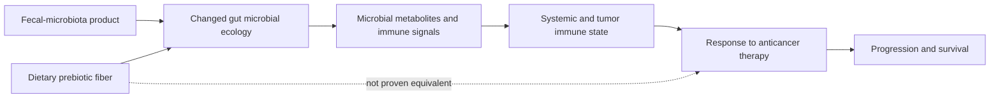

# Microbiome-directed cancer therapy

Microbiome-directed cancer therapy attempts to change gut microbial organisms or functions so that a patient responds better to established anticancer treatment. Investigational approaches include fecal-microbiota-derived oral products and more selective future methods; these are treatment adjuncts for existing cancer, not interchangeable with ordinary probiotics, prebiotic fiber, or do-it-yourself fecal transplantation. (@Physionic (Physionic) — "I analyzed 1,000 Health Studies: Here are 10 Things I Learned", 2026-08-06, [link](https://www.youtube.com/watch?v=sx8MyamJf3g))

## Mechanism and evidence

Three early clinical studies summarized by the source tested microbiome modification across skin, lung, and kidney cancers and reported large-looking response or survival differences. In one very small trial, approximately 80% of the microbiome-product group remained alive at three years while the comparison group had lost approximately 80%; the difference was not statistically significant, illustrating why an extreme point estimate from a small phase I/II study is hypothesis-generating rather than confirmatory. (@Physionic (Physionic) — "I analyzed 1,000 Health Studies: Here are 10 Things I Learned", 2026-08-06, [link](https://www.youtube.com/watch?v=sx8MyamJf3g))

The cross-cancer signal supports further study of immune and treatment-response mechanisms, but it does not establish a generic “better microbiome” or show that dietary fiber produces the same organisms, functions, or cancer outcomes. Fiber remains a reasonable prebiotic component of general nutrition; presenting it as a substitute for the investigational product would cross an unsupported causal bridge. (@Physionic (Physionic) — "I analyzed 1,000 Health Studies: Here are 10 Things I Learned", 2026-08-06, [link](https://www.youtube.com/watch?v=sx8MyamJf3g))

## Practical implications

- **For cancer treatment, use microbiome products only within oncology care or a regulated clinical trial — strong.** The evidence is early and products are not generally available. (@Physionic (Physionic) — "I analyzed 1,000 Health Studies: Here are 10 Things I Learned", 2026-08-06, [link](https://www.youtube.com/watch?v=sx8MyamJf3g))
- **Daily, maintain a varied fiber-rich dietary pattern when compatible with treatment and oncology nutrition advice — strong for general nutrition, unproved for reproducing anticancer microbiome therapy.** The source identifies prebiotic fiber as a present way to support gut ecology while explicitly noting that it has not been shown to reproduce the investigational cancer effect. (@Physionic (Physionic) — "I analyzed 1,000 Health Studies: Here are 10 Things I Learned", 2026-08-06, [link](https://www.youtube.com/watch?v=sx8MyamJf3g))
- **At each treatment review, judge an adjunct by tumor response, progression, survival, adverse events, and interaction with standard therapy—not by microbiome composition alone — strong as an evidentiary rule.** (@Physionic (Physionic) — "I analyzed 1,000 Health Studies: Here are 10 Things I Learned", 2026-08-06, [link](https://www.youtube.com/watch?v=sx8MyamJf3g))

## Gaps & open questions

- Which organisms or microbial functions cause improved treatment response?
- Which cancers, anticancer drugs, and patient microbiomes are responsive?
- Will larger randomized trials reproduce the large early effect estimates and establish safety?
- Can defined consortia, metabolites, phages, or diet deliver the benefit more reproducibly than donor-derived products?

## Related

[[supplement-evidence-and-safety]] · [[nutrition-evidence-and-personalization]] · [[colorectal-cancer-prevention-and-screening]] · [[aging-model]]
