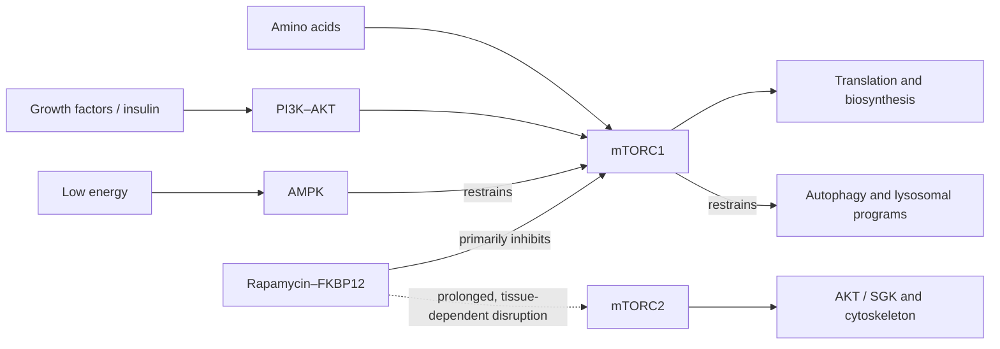

# mTOR and rapamycin

The mechanistic target of rapamycin (mTOR) is a protein kinase that matches cell growth to available resources. Rapamycin (sirolimus) is a prescription macrolide that inhibits part of this network. The central aging hypothesis is not that mTOR is intrinsically harmful: growth, protein synthesis, wound repair, immune-cell expansion, and adaptation to resistance exercise all require anabolic signaling. The hypothesis is that chronically excessive or poorly timed growth signaling can compete with maintenance, while partial or intermittent inhibition might preserve repair without disabling necessary growth.[^liu-2022-mtor]

## Two complexes, different jobs

mTOR exists in two complexes. mTORC1, organized around RAPTOR, integrates amino acids through lysosomal Rag GTPases, growth factors through PI3K–AKT–TSC–RHEB, cellular energy through AMPK, and oxygen or stress signals. It promotes translation through S6 kinase and 4E-BP proteins, lipid and nucleotide synthesis, and ribosome production, while restraining ULK1-dependent autophagy and TFEB-mediated lysosomal programs. mTORC2, organized around RICTOR, regulates AKT, SGK, cytoskeletal organization, and aspects of glucose and lipid metabolism. Acute rapamycin–FKBP12 mainly inhibits mTORC1; prolonged exposure can disrupt mTORC2 assembly in some tissues. “mTOR inhibition” therefore does not specify complex, tissue, depth, or duration.[^liu-2022-mtor]

This network connects directly to [[autophagy-and-lysosomal-quality-control]], [[skeletal-muscle-hypertrophy]], and [[immune-aging-and-rejuvenation]]. A rise in phosphorylated S6 kinase is target-pathway evidence, not proof of improved healthspan; increased autophagy markers are not proof of completed flux.

## Longevity evidence: strong in mice, unproven in humans

In the National Institute on Aging Interventions Testing Program, encapsulated rapamycin begun at 600 days of age extended median and maximal lifespan in genetically heterogeneous mice at three sites. At the age when 90% of controls had died, survival age increased 14% in females and 9% in males.[^harrison-2009] A later dose-ranging experiment found larger median-lifespan gains at a higher dose—26% in females and 23% in males—and clear sex and dose dependence.[^miller-2014] These are replicated animal longevity experiments, not human clinical trials. Differences in disease spectrum, dose exposure, immune environment, and the large fraction of mouse deaths attributable to neoplasia limit translation.

Human trials have tested narrow functions rather than lifespan. In a randomized trial of 218 adults aged at least 65, six weeks of low-dose everolimus (RAD001, a rapamycin analog) before influenza vaccination increased antibody responses by about 20% at the selected doses and reduced the proportion of senescent PD-1-positive T cells; this establishes short-term immune target engagement, not rejuvenation or longer life.[^mannick-2014] A subsequent phase 2a RCT in 264 older adults found that six weeks of low-dose TORC1-inhibitor regimens was associated with fewer self-reported infections over the following year.[^mannick-2018] However, the later program did not validate that promise consistently: a phase 2b trial of RTB101 met its prespecified primary endpoint in a selected high-risk subgroup, but the 1,024-participant phase 3 trial did not reduce laboratory-confirmed respiratory illness, its primary endpoint.[^mannick-2021] The compound, schedules, and endpoints differed; these studies cannot establish a generic anti-aging dose for sirolimus.

The exercise tradeoff now has direct, though exploratory, human evidence. RAPA-EX-01 randomized 40 sedentary adults aged 65–85 to a 13-week home resistance-and-endurance program plus weekly 6 mg sirolimus or placebo. Sirolimus was scheduled 24 hours after the last of three weekly sessions, yet it did not improve chair-stand performance: the adjusted intention-to-treat difference was −2.13 repetitions (95% CI −4.61 to 0.34), sensitivity analyses favored placebo, and the sirolimus arm had 99 total adverse events versus 63 with placebo, including one possibly drug-related pneumonia.[^stanfield-2026] The small sample, simple program, missing final measurements, and lack of muscle pharmacodynamics prevent a general conclusion about every dose or timing strategy. The result nevertheless defeats the assumption that once-weekly dosing or a 24-hour interval is sufficient to protect training adaptation.

## Combination evidence and the interpretation of the mouse result

Rapamycin's mouse effect is now a reference point against which other pathways are tested for independence. Blocking the binding of elastin-derived matrix fragments to their innate-immune receptor extended mouse lifespan on its own, and combining that blockade with rapamycin extended lifespan further than either alone. Additivity is the informative feature: it argues that matrix-fragment-driven inflammation is a route to mortality at least partly separate from nutrient sensing, rather than a redundant entry into the same pathway. It also implies that rapamycin's mouse effect, large as it is, leaves substantial mortality unaddressed. [[extracellular-matrix-aging]] (@TheSheekeyScienceShow (The Sheekey Science Show) — "This years biggest breakthroughs in longevity! (2025)", 2025-12-21, [link](https://www.youtube.com/watch?v=X-Hzyzo1Jpk))

A competing explanation of the mouse-to-human gap deserves recording because it would, if correct, change how the animal evidence above should be weighed. On the minimal-model account, mice are dynamically unstable — their biomarkers show no restoring force toward baseline — while humans are stable, so supplying stabilization to a mouse produces a dramatic effect that the same intervention cannot reproduce in an organism that is already stable. Rapamycin is the specific example offered for why a large mouse lifespan effect coexists with modest human effects. This is a plausible and unreplicated argument resting on autocorrelation analysis of longitudinal biomarker data, and it competes with simpler explanations: the human trials tested vaccine responses, infection rates, and short-term function rather than lifespan, at different doses and durations, so endpoint and exposure mismatch could account for the same pattern. [[aging-dynamics-and-resilience]] [[healthspan-versus-maximum-lifespan]] (@TheSheekeyScienceShow (The Sheekey Science Show) — "the 3 levels of aging therapeutics", 2026-02-08, [link](https://www.youtube.com/watch?v=c-_Pdp5IIvw))

A coarser account of why mTOR inhibition and caloric restriction should work at all treats both as the same reallocation: shifting cells from production toward maintenance, with the recycling and repair systems upregulated at the expense of growth, is on this reading simply beneficial to the organism's overall setup. The reallocation framing gains a specific molecular readout from stochastic aging clocks. Calorie-restricted mice score younger on clocks built to measure accumulated molecular dispersion, not only on conventional clocks — evidence that accumulated noise is modifiable through either reduced damage generation or improved maintenance, and that this class of intervention plausibly acts on it. The direct measurement was made under caloric restriction rather than rapamycin, so applying it to mTOR inhibition rests on the shared-mechanism assumption rather than on data. [[stochastic-aging-and-molecular-noise]] [[caloric-restriction-and-meal-timing]] (@TheSheekeyScienceShow (The Sheekey Science Show) — "How Randomness Drives Aging - DNA Repair, Clocks & Rejuvenation (David Meyer)", 2025-07-04, [link](https://www.youtube.com/watch?v=Buj07nWt7o0))

## Dosing is a biological question, not a settled protocol

Continuous high exposure used for transplantation aims at immunosuppression. Longevity proposals often use lower or intermittent exposure in hopes of inhibiting mTORC1 while allowing recovery and limiting mTORC2 effects, but no schedule has demonstrated longer disability-free survival in healthy people. Blood trough levels describe drug exposure, not tissue-specific mTORC1/mTORC2 inhibition or net benefit. Age, liver function, CYP3A4 and P-glycoprotein interactions, infection risk, vaccination timing, surgery, and co-medications can all change the balance.[^liu-2022-mtor][^fda-sirolimus-2022]

Sirolimus is FDA-approved for prevention of organ rejection in certain kidney-transplant recipients and for lymphangioleiomyomatosis, not for slowing aging. Its label warns of immunosuppression, serious infection and malignancy risk; adverse effects include mouth ulcers, edema, hyperlipidemia, hypertension, impaired wound healing, cytopenias, proteinuria, and noninfectious pneumonitis, with numerous drug and food interactions.[^fda-sirolimus-2022] Toxicity at transplant dosing does not quantify risk from intermittent experimental schedules, but neither can a lower schedule be presumed safe from short trials.

## Practical implications

- **Do not self-prescribe rapamycin for longevity — human benefit is unproven and clinically important harms and interactions are established.** Use for an approved indication belongs under specialist supervision; off-label research use should occur in a registered trial with explicit safety monitoring.
- **Support normal nutrient-sensing cycles with established behaviors — strong clinical evidence for exercise and adequate nutrition, uncertain mTOR mediation.** Resistance training appropriately activates anabolic signaling; recovery and sufficient protein matter, especially with aging. Fasting or protein restriction should not be pursued merely to suppress a pathway when it compromises lean mass or medical safety.
- **Evaluate claims by endpoint and design.** Mouse lifespan, vaccine antibody titers, infection reports, and laboratory-confirmed respiratory illness answer different questions. None yet shows that rapamycin extends human life or healthspan.

## Gaps & open questions

- Can any dose and tissue exposure inhibit TORC1 while preserving function, immunity, healing, glucose regulation, and muscle adaptation, given that weekly 6 mg sirolimus separated by 24 hours from exercise did not do so in RAPA-EX-01?
- Can intermittent treatment improve a prespecified clinical composite such as infection, disability, hospitalization, and cognition in a sufficiently powered older population?
- Which effects require mTORC1 inhibition, which reflect mTORC2 disruption, and which are unrelated to mTOR?
- Do sex, baseline immune state, frailty, genotype, and concomitant drugs materially change benefit or harm?
- Which other pathways are additive with mTOR inhibition in mice, and does additivity identify genuinely independent mortality routes?
- Is the modest human effect explained by species-level dynamic stability, or by dose, duration, and endpoint mismatch in the trials conducted so far?
- Does rapamycin reduce accumulated molecular dispersion as caloric restriction reportedly does in mice, or is the shared growth-to-maintenance framing hiding mechanistically different effects?

## References

[^liu-2022-mtor]: Liu GY, Sabatini DM. “mTOR at the nexus of nutrition, growth, ageing and disease.” *Nature Reviews Molecular Cell Biology* (2020). [mechanistic review]. [PubMed](https://pubmed.ncbi.nlm.nih.gov/31676858/) · [DOI](https://doi.org/10.1038/s41580-019-0199-y)
[^harrison-2009]: Harrison DE, Strong R, Sharp ZD, et al. “Rapamycin fed late in life extends lifespan in genetically heterogeneous mice.” *Nature* (2009). [multisite randomized animal longevity study]. [PubMed](https://pubmed.ncbi.nlm.nih.gov/19587680/) · [DOI](https://doi.org/10.1038/nature08221)
[^miller-2014]: Miller RA, Harrison DE, Astle CM, et al. “Rapamycin-mediated lifespan increase in mice is dose and sex dependent and metabolically distinct from dietary restriction.” *Aging Cell* (2014). [randomized animal longevity study]. [PubMed](https://pubmed.ncbi.nlm.nih.gov/24341993/) · [DOI](https://doi.org/10.1111/acel.12194)
[^mannick-2014]: Mannick JB, Del Giudice G, Lattanzi M, et al. “mTOR inhibition improves immune function in the elderly.” *Science Translational Medicine* (2014). [RCT]. [PubMed](https://pubmed.ncbi.nlm.nih.gov/25540326/) · [DOI](https://doi.org/10.1126/scitranslmed.3009892)
[^mannick-2018]: Mannick JB, Morris M, Hockey HUP, et al. “TORC1 inhibition enhances immune function and reduces infections in the elderly.” *Science Translational Medicine* (2018). [phase 2a RCT]. [PubMed](https://pubmed.ncbi.nlm.nih.gov/29997249/) · [DOI](https://doi.org/10.1126/scitranslmed.aaq1564)
[^mannick-2021]: Mannick JB, Teo G, Bernardo P, et al. “Targeting the biology of ageing with mTOR inhibitors to improve immune function in older adults: phase 2b and phase 3 randomised trials.” *The Lancet Healthy Longevity* (2021). [phase 2b and phase 3 RCTs]. [PubMed](https://pubmed.ncbi.nlm.nih.gov/33977284/) · [DOI](https://doi.org/10.1016/S2666-7568(21)00062-3)
[^stanfield-2026]: Stanfield B, Leroux B, Kaeberlein M, Jones J, Lucas R. “Exercise and Weekly Sirolimus (Rapamycin) in Older Adults: RAPA-EX-01 Randomised, Double-Blind, Placebo-Controlled Trial.” *Journal of Cachexia, Sarcopenia and Muscle* (2026). [exploratory RCT]. [PubMed](https://pubmed.ncbi.nlm.nih.gov/41985884/) · [DOI](https://doi.org/10.1002/jcsm.70274)
[^fda-sirolimus-2022]: U.S. Food and Drug Administration. “RAPAMUNE (sirolimus) Prescribing Information.” (2022). [regulatory prescribing guideline]. [FDA label](https://www.accessdata.fda.gov/drugsatfda_docs/label/2022/021083s069s070%2C021110s087s088lbl.pdf)

## Related

[[aging-model]] · [[autophagy-and-lysosomal-quality-control]] · [[cellular-senescence]] · [[extracellular-matrix-aging]] · [[healthspan-versus-maximum-lifespan]] · [[aging-dynamics-and-resilience]] · [[stochastic-aging-and-molecular-noise]] · [[immune-aging-and-rejuvenation]] · [[skeletal-muscle-hypertrophy]] · [[caloric-restriction-and-meal-timing]] · [[supplement-evidence-and-safety]]
