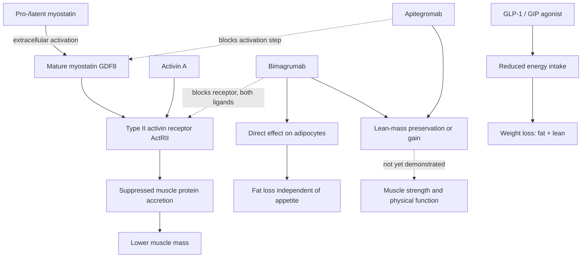

# Myostatin-pathway inhibition

Myostatin (GDF8) is a secreted TGF-beta-family protein that acts as a brake on skeletal-muscle growth: more myostatin signaling, less muscle. Blocking it is therefore an obvious pharmacological route to muscle preservation, and the obvious route has been unusually hard to travel. Direct blockade of mature myostatin historically produced disappointing results, so current agents intervene elsewhere in the pathway. Apitegromab is an antibody that binds the immature precursor (pro/latent) form and prevents its extracellular activation into mature myostatin. Bimagrumab takes a different position entirely: it blocks the type II activin receptor through which myostatin *and* related ligands, notably activin A, signal — a broader blockade that also engages adipose tissue. Neither is a peptide, and neither should be grouped with the unapproved compounds in [[experimental-peptides]]; both are monoclonal antibodies in formal clinical development. (@Physionic (Physionic) — "The Ultimate Peptide Stack? Gain Muscle, Lose Fat!", 2026-07-23, [link](https://www.youtube.com/watch?v=AvDrlcsdCBg))

The clinical motivation is the lean-mass cost of pharmacological weight loss. GLP-1 and dual GLP-1/GIP agonists produce large fat loss through appetite suppression, but a substantial fraction of the weight lost is lean tissue ([[glp-1-receptor-agonists]]). Pairing an appetite-side agent with a muscle-side agent is the stack this literature is testing.

## What the trials show, and the lean-mass/function gap

In the six-month EMBRAZE phase 2 trial, 102 adults with obesity received tirzepatide plus either apitegromab or placebo. Total weight loss was similar, but the apitegromab arm lost about half as much lean mass and roughly 85% rather than 70% of lost weight was fat. That is the intended body-composition result — but lean mass is a mixed compartment, not muscle alone: it includes bone, tendon, ligament, organ tissue, and water. Nor did the extra scan-measured tissue translate into better grip strength or chair-rise performance. The trial therefore supports target activity and lean-mass preservation, not greater strength, capability, or lower frailty. (@DrBradStanfield (Dr Brad Stanfield) — "Everyone is About to Become Lean and Muscly (new evidence)", 2026-06-18, [link](https://www.youtube.com/watch?v=Zit5we5Ss18)) (@Physionic (Physionic) — "The Ultimate Peptide Stack? Gain Muscle, Lose Fat!", 2026-07-23, [link](https://www.youtube.com/watch?v=AvDrlcsdCBg))

Apitegromab's strongest functional evidence comes from a different population: a phase 3 trial in non-ambulatory spinal muscular atrophy, where preserving muscle is the therapeutic goal. There the treated group did better than control on the Hammersmith Functional Motor Scale Expanded. The magnitude deserves attention: the difference was 1.8 points on a 66-point scale. Statistical significance at that size does not establish clinical meaningfulness, though in a progressively weakening disease even small preserved function may matter to patients. Extrapolating a small benefit in a degenerative neuromuscular disease to healthy adults on a weight-loss drug is not warranted — a population-applicability boundary, not a quibble. (@Physionic (Physionic) — "The Ultimate Peptide Stack? Gain Muscle, Lose Fat!", 2026-07-23, [link](https://www.youtube.com/watch?v=AvDrlcsdCBg))

Bimagrumab's profile is broader. In a phase 2 obesity trial comparing bimagrumab alone, semaglutide alone, and the combination, bimagrumab produced substantial fat loss *on its own* — comparable to dedicated fat-loss agents — and the combination produced the largest fat reduction. On the muscle side, bimagrumab alone increased lean mass rather than merely sparing it; combined with a GLP-1 agonist, lean mass declined slightly, resembling the apitegromab pattern. The receptor-level blockade and the direct adipocyte effect plausibly explain the wider action. But the one muscle-function endpoint reported, grip strength, showed no meaningful between-group difference. Preclinical work during development, including blockade of both GDF8 and activin A in obese mice and non-human primates, used more exact muscle measurements and supports genuine direct muscle protection; that is encouraging mechanistic evidence and not a substitute for human functional outcomes. (@Physionic (Physionic) — "The Ultimate Peptide Stack? Gain Muscle, Lose Fat!", 2026-07-23, [link](https://www.youtube.com/watch?v=AvDrlcsdCBg))

The pattern across both agents is consistent and worth naming as the central finding: **body-composition endpoints move, functional endpoints do not (yet).** Physionic's stated position is that the clinical claims currently outrun the evidence — he would want to see notable, not minuscule, improvements in muscle function and size outside a specific degenerating population before treating these as established — while acknowledging the fat-loss results, especially bimagrumab's, as remarkable. Phase 3 trials, being larger, may resolve function questions that phase 2 could not. (@Physionic (Physionic) — "The Ultimate Peptide Stack? Gain Muscle, Lose Fat!", 2026-07-23, [link](https://www.youtube.com/watch?v=AvDrlcsdCBg))

## Adverse effects

Phase 1 and 2 trials are where the adverse-effect profile begins to surface, and the profiles differ by agent. Apitegromab: nausea, fatigue, headaches. Bimagrumab: muscle spasms, diarrhea, and acne; the source reports spasms in most participants, acne in about one third, and LDL-cholesterol increases as large as 17%, followed by a September 2025 pause in one combination-development program over safety signals. Those quantitative safety and program-status claims have transcript provenance here but have not been independently checked against the trial report or sponsor record, so they should not be generalized into incidence estimates beyond the studied regimen. GLP-1 receptor agonists contribute their own class effects, mainly nausea and constipation. Because these are early-phase data, uncommon and long-term harms are not yet characterized — particularly relevant for a pathway with systemic TGF-beta-family signaling roles beyond muscle. (@DrBradStanfield (Dr Brad Stanfield) — "Everyone is About to Become Lean and Muscly (new evidence)", 2026-06-18, [link](https://www.youtube.com/watch?v=Zit5we5Ss18)) (@Physionic (Physionic) — "The Ultimate Peptide Stack? Gain Muscle, Lose Fat!", 2026-07-23, [link](https://www.youtube.com/watch?v=AvDrlcsdCBg))

## Position in the larger system

Myostatin-pathway inhibition targets the same node — muscle mass and strength — that resistance training reaches through mechanotransduction ([[skeletal-muscle-hypertrophy]]), and that node feeds functional reserve and mortality risk in [[aging-model]] ([[muscle-strength-and-mortality]]). The comparison is instructive rather than rhetorical: resistance training has unambiguous, replicated evidence for both muscle mass *and* muscle function, which is precisely the endpoint these antibodies have not yet delivered, and its adverse-effect profile does not include nausea or diarrhea. Where the antibodies could earn a distinct place is in situations training cannot cover — non-ambulatory neuromuscular disease, or lean-mass defense during rapid pharmacological weight loss in someone unable to train adequately. That case is plausible and unproven. (@Physionic (Physionic) — "The Ultimate Peptide Stack? Gain Muscle, Lose Fat!", 2026-07-23, [link](https://www.youtube.com/watch?v=AvDrlcsdCBg))

## Practical implications

- **For preserving muscle during weight loss, resistance training plus adequate protein remains the intervention with established functional benefit — strong.** These antibodies have not shown improved muscle function in people without a degenerative muscle disease, so they do not currently displace training. [[resistance-training]] [[skeletal-muscle-hypertrophy]] (@Physionic (Physionic) — "The Ultimate Peptide Stack? Gain Muscle, Lose Fat!", 2026-07-23, [link](https://www.youtube.com/watch?v=AvDrlcsdCBg))
- **Do not treat a lean-mass result as a muscle result — strong as an interpretive rule.** Lean mass includes bone, connective tissue, organs, and water; a preserved-lean-mass headline in a GLP-1 combination trial is compatible with no muscle or functional benefit. [[energy-balance-and-calorie-counting]] (@Physionic (Physionic) — "The Ultimate Peptide Stack? Gain Muscle, Lose Fat!", 2026-07-23, [link](https://www.youtube.com/watch?v=AvDrlcsdCBg))
- **These are investigational antibodies for the obesity/lean-mass indication; there is no self-directed use — strong.** Both remain in trial development for this purpose, are administered under study protocols, and have early-phase-only safety characterization. Do not source ActRII-blocking or myostatin-targeting products outside a trial or approved indication. [[experimental-peptides]] (@Physionic (Physionic) — "The Ultimate Peptide Stack? Gain Muscle, Lose Fat!", 2026-07-23, [link](https://www.youtube.com/watch?v=AvDrlcsdCBg))

## Gaps & open questions

- Do either agent's body-composition effects convert into strength, power, walking capacity, or fall risk in people without neuromuscular disease? Grip strength and physical function have so far been null.
- Is bimagrumab's independent fat loss durable, and what happens to fat and lean compartments after discontinuation?
- What is the long-term safety of chronic ActRII blockade, given TGF-beta-family signaling in bone, heart, and other tissues?
- Does adding resistance training to a GLP-1 agonist achieve the same lean-mass preservation as adding an antibody, at lower cost and risk? No trial appears to have made this comparison.
- Why does activin A blockade appear necessary for the fuller effect, and does the broader ligand blockade carry proportionally broader risk?
- Do phase 3 trials, being larger, detect the functional differences phase 2 could not — or confirm their absence?

## Related

[[glp-1-receptor-agonists]] · [[skeletal-muscle-hypertrophy]] · [[resistance-training]] · [[muscle-strength-and-mortality]] · [[experimental-peptides]] · [[energy-balance-and-calorie-counting]] · [[aging-model]] · [[practice-playbook]]
