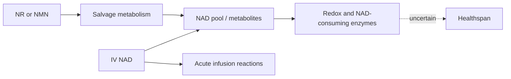

# NAD supplementation and infusion

Nicotinamide adenine dinucleotide (NAD) is a redox cofactor and substrate for multiple enzymes. Oral nicotinamide riboside (NR) and nicotinamide mononucleotide (NMN) aim to raise NAD through precursor metabolism; intravenous NAD introduces a high dose by a different route. Plausibility that a cofactor participates in aging is not evidence that raising it extends life. (@mkaeberlein (Matt Kaeberlein) — "Longevity Science Update: The Biggest Stories in Longevity Medicine — July 2026", 2026-07-31, [link](https://www.youtube.com/watch?v=A0xNnGsGAJg))

## Evidence

In mice, oral precursors can raise NAD when dosed appropriately, but age-related decline appears tissue-specific rather than global. An early NR lifespan result was not reproduced by the larger, three-site Interventions Testing Program; an NMN lifespan experiment used unusually short-lived controls. The defensible conclusion is possible small, context-dependent health effects, not established lifespan extension. (@mkaeberlein (Matt Kaeberlein) — "Longevity Science Update: The Biggest Stories in Longevity Medicine — July 2026", 2026-07-31, [link](https://www.youtube.com/watch?v=A0xNnGsGAJg))

Human uncertainty is greater: blood NAD may not decline with age, tissue-wide decline has not been established, precursor trials are small, and reported effect sizes are generally modest. Oral precursors appear probably safe in available data, but their longevity benefit remains unproven; small athletic studies offer a more plausible performance signal under extreme metabolic demand than they do an anti-aging effect. (@mkaeberlein (Matt Kaeberlein) — "Longevity Science Update: The Biggest Stories in Longevity Medicine — July 2026", 2026-07-31, [link](https://www.youtube.com/watch?v=A0xNnGsGAJg))

The claim that NAD universally declines with age is therefore contested: Kaeberlein describes decline as tissue- and population-specific, while allowing that raising NAD could still help a depleted disease state. Preclinical healthspan findings are mixed and rodent lifespan findings often fail replication; early human work, including Parkinson disease studies, is intriguing but does not establish general prevention. He also flags a hypothesis that very high NMN exposure could be problematic in kidney pathology, which is a caution signal rather than demonstrated clinical harm. (@matt.kaeberlein (Healthspan Medicine) — "Dr. Matt Ranks Longevity Supplements: The Winners and Total Scams", 2026-02-15, [link](https://www.youtube.com/watch?v=mD_DfRDXklc))

IV evidence is weaker and the exposure is more acute. A death soon after an NAD infusion in New York had not yet received a determined causal explanation in the transcript, so NAD itself, contamination, and other causes remained unresolved. Two people described severe chest pressure and shortness of breath during supervised infusions. This establishes a reason for caution, not causation of the reported death. (@mkaeberlein (Matt Kaeberlein) — "Longevity Science Update: The Biggest Stories in Longevity Medicine — July 2026", 2026-07-31, [link](https://www.youtube.com/watch?v=A0xNnGsGAJg))

## Practical implications

Healthy people should not use IV NAD for longevity: benefit evidence is absent and acute physiological reactions are documented. Evidence is insufficient to recommend routine daily NR or NMN for lifespan; anyone considering them should treat benefit as uncertain, use a reputable product, and reassess rather than stacking indefinitely. Lifestyle measures with stronger evidence take priority. (@ABCNewsIndepth (ABC News In-depth) — "The health trends outpacing regulation and putting people at risk | Four Corners Documentary", 2026-07-20, [link](https://www.youtube.com/watch?v=77TTDkR3nbI))

## Gaps & open questions

- Which human tissues lose NAD with age, in whom, and by how much?
- Do precursor-induced changes translate into clinical outcomes?
- What causes the acute cardiopulmonary sensations during infusion?

## Related

[[longevity-clinics-and-evidence]] · [[aging-model]] · [[practice-playbook]]
