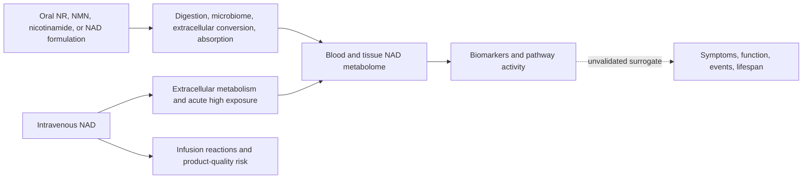

# NAD supplementation and infusion

Nicotinamide adenine dinucleotide (NAD) is essential for redox metabolism and NAD-consuming enzymes; [[nad-metabolism]] covers the biology. Nicotinamide riboside (NR), nicotinamide mononucleotide (NMN), oral NAD products, and intravenous NAD are distinct exposures. Raising a blood NAD metabolite is a pharmacodynamic result, not evidence of better function, fewer disease events, or longer life.

```mermaid
flowchart LR
  ORAL[Oral NR, NMN, nicotinamide, or NAD formulation] --> GUT[Digestion, microbiome, extracellular conversion, absorption]
  IV[Intravenous NAD] --> EXTRA[Extracellular metabolism and acute high exposure]
  GUT --> POOL[Blood and tissue NAD metabolome]
  EXTRA --> POOL
  POOL --> BIO[Biomarkers and pathway activity]
  BIO -. unvalidated surrogate .-> OUT[Symptoms, function, events, lifespan]
  IV --> HARM[Infusion reactions and product-quality risk]
```

## Strongest fair synthesis

NR and NMN reproducibly alter circulating NAD metabolites in short human trials. The best functional signal is the 90-person NICE phase 2 trial in peripheral artery disease: NR 1,000 mg/day for six months improved six-minute-walk distance by 17.6 m versus placebo using a prespecified one-sided 90% confidence procedure, while NR plus resveratrol did not. This is promising disease-specific evidence, not a healthy-aging indication; the small sample, adherence differences, unusual significance framework, and need for replication limit confidence.[^mcdermott-2024]

For NMN, an eight-trial meta-analysis (342 mostly nondiabetic middle-aged or older adults; 14 days to 12 weeks; 250–2,000 mg/day) found no significant benefit for fasting glucose, insulin, HbA1c, insulin resistance, or lipids. Another review found physical-performance changes small and nonsignificant. These results directly oppose general metabolic and performance marketing.[^chen-2024][^wen-2024]

Short exposure studies suggest tolerability rather than long-term safety. In NR-SAFE, 20 people with Parkinson disease received 3,000 mg/day or placebo for four weeks without moderate or severe treatment-related events; the investigators explicitly cautioned that this does not establish long-term safety or efficacy. That dose is trial exposure under monitoring, not a consumer protocol.[^berven-2023]

## Adversarial pass: what falsifies or narrows the case

- Healthy-person outcome trials have not shown prevention of disease, disability, or death. Biomarker changes and blood-NAD increases are not validated surrogates.
- The PAD finding is an unreplicated, small phase 2 result in symptomatic vascular disease; it does not justify routine use in healthy people or prove that resveratrol is broadly harmful.
- A 2026 industry-supported phase 0/1b trial reported that a proprietary oral NAD formulation raised whole-blood intracellular NAD after five days. This falsifies the old page's categorical practical claim that oral NAD can only be dismissed because the intact molecule cannot reach cells. The study does not show that intact NAD entered cells, does not validate ordinary oral NAD products, and measured no clinical benefit.[^renewal-2026]
- Cancer, pregnancy, lactation, kidney disease, and multi-year exposure remain major evidence gaps. Reassuring short trials cannot exclude rare or delayed harms.
- Several prominent NR studies include pathway discoverers, patent holders, or manufacturer support. Industry involvement does not invalidate results, but independent replication is limited.

## Evidence update — 2026-09-01

> **What changed:** The prior categorical transport argument against oral NAD and NMN was too strong and has been retired. Metabolism may involve extracellular conversion, microbiome processing, and formulation-dependent absorption; a new proprietary oral-NAD study changed blood intracellular NAD but no patient outcome. The page now rests its negative healthy-aging conclusion on the absence of clinical benefit, not on an absolute membrane-transport claim. The PAD result is retained as promising historical context but narrowed to a small, disease-specific, unreplicated phase 2 signal. Consumer dosing advice derived from trial exposure was removed because no guideline or outcome evidence admits a healthy-person protocol.

## IV NAD and product quality

No randomized trial establishes IV NAD for wellness, recovery, or longevity. Acute cardiopulmonary symptoms have been reported during infusions, while compounded or clinic-prepared products add sterility, identity, and dosing uncertainty. A theoretical ability to deliver a larger precursor load does not establish a favorable benefit–harm balance. IV NAD therefore remains investigational, not an evidence-based wellness service.

Dietary-supplement identity and content can vary, especially for NMN. Product verification can reduce identity uncertainty but cannot manufacture efficacy. Claims for timing, jet lag, exercise recovery, fertility, pregnancy, lactation, cancer care, or consumer NAD testing lack outcome evidence.

## Practical implications

- **Do not use IV NAD for wellness or longevity outside a clinical trial—strong against routine use.** No patient-important benefit has been demonstrated, while infusion and product-quality risks are real.
- **Do not use NR, NMN, or oral NAD to prevent aging or extend lifespan—moderate-to-strong against a routine protocol.** Human longevity evidence is absent and metabolic meta-analysis is null.
- **Do not infer a consumer dose from short safety trials—strong.** A monitored four-week exposure at 3,000 mg/day in Parkinson disease is not a chronic safe ceiling.
- **Avoid use during pregnancy or lactation and coordinate any use during cancer treatment or serious disease with the treating team—precautionary, because applicable safety data are absent.**
- **Treat blood-NAD testing as investigational.** No validated decision threshold or outcome-improving titration strategy exists.

## Gaps & open questions

- Will the PAD walking result replicate with conventional two-sided inference and adequate adherence?
- Does any NAD precursor improve symptoms, function, infection incidence, disease events, or quality of life in otherwise healthy people?
- What do oral and intravenous products deliver to each tissue, and does any distribution difference matter clinically?
- What are the multi-year safety effects, interaction risks, and cancer-context effects?

## Related

[[nad-metabolism]] · [[nad-precursors-and-healthy-aging]] · [[charles-brenner]] · [[supplement-evidence-and-safety]] · [[inflammaging-and-il-6]] · [[metabolic-liver-disease]] · [[longevity-clinics-and-evidence]] · [[healthspan-versus-maximum-lifespan]] · [[aging-model]] · [[practice-playbook]]

## References

[^mcdermott-2024]: McDermott MM, et al. “Nicotinamide Riboside for Peripheral Artery Disease: The NICE Randomized Clinical Trial.” *Nature Communications*, 2024. [phase 2 RCT]. [doi:10.1038/s41467-024-49092-5](https://doi.org/10.1038/s41467-024-49092-5)
[^chen-2024]: Chen X, et al. “Effect of Nicotinamide Mononucleotide Supplementation on Metabolic Parameters: A Systematic Review and Meta-analysis.” *Current Diabetes Reports*, 2024. [systematic review and meta-analysis]. [doi:10.1007/s11892-024-01557-z](https://doi.org/10.1007/s11892-024-01557-z)
[^wen-2024]: Wen Y, et al. “Nicotinamide Mononucleotide Supplementation and Physical Performance.” *Cureus*, 2024. [systematic review]. [doi:10.7759/cureus.65961](https://doi.org/10.7759/cureus.65961)
[^berven-2023]: Berven H, et al. “Safety and Tolerability of High-dose Nicotinamide Riboside: The NR-SAFE Study.” *Nature Communications*, 2023. [phase 1 RCT]. [doi:10.1038/s41467-023-43514-6](https://doi.org/10.1038/s41467-023-43514-6)
[^renewal-2026]: “RENEWAL-NAD+: Oral NAD Pharmacokinetics and Pharmacodynamics.” 2026. [industry-supported phase 0/1b trial]. [PubMed](https://pubmed.ncbi.nlm.nih.gov/42530810/)
