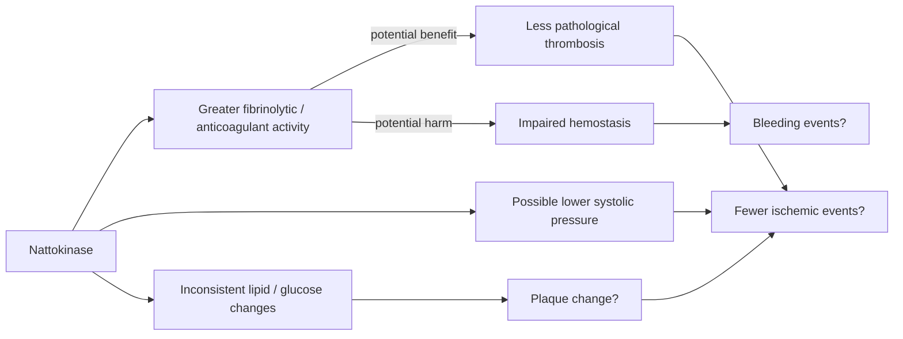

# Nattokinase

Nattokinase is a fibrinolytic enzyme isolated from natto, a food made by fermenting soybeans. Its ability to break down clot-related proteins in laboratory systems supplies a plausible cardiovascular mechanism, but plausibility is not demonstrated prevention of heart attack, stroke, or death. The supplement and whole food are different exposures: natto also supplies protein, fiber, vitamin K2, isoflavones, and fermentation-associated microbes. (@NutritionMadeSimple (Nutrition Made Simple!) — "The Internet is Misleading You on this Popular Supplement (Doctor Explains)", 2026-07-10, [link](https://www.youtube.com/watch?v=qRLiXKRuUCI))

## Mechanism and competing consequences

Fibrinolytic units (FU) express activity against clot-related substrate rather than powder mass. Slower coagulation or greater fibrinolysis could reduce thrombosis, which often converts atherosclerotic plaque into myocardial infarction, but the same shift could increase harm when hemostasis is needed. Anticoagulant activity is therefore bidirectional rather than an intrinsically beneficial biomarker. (@NutritionMadeSimple (Nutrition Made Simple!) — "The Internet is Misleading You on this Popular Supplement (Doctor Explains)", 2026-07-10, [link](https://www.youtube.com/watch?v=qRLiXKRuUCI))

Animal studies report clot dissolution alongside lower blood pressure, cholesterol, and plaque burden, establishing biological activity rather than human benefit. Human trials more consistently alter coagulation measures. At 2,000 FU, blood-pressure results are mixed, with some trials reporting roughly 3–5 mmHg lower systolic pressure and others no significant effect; one 3,600-FU trial reported about 7 mmHg. Lipid, triglyceride, glucose, and dose-response findings are inconsistent. Evidence therefore supports a possible modest blood-pressure effect and action on coagulation, with lower confidence for metabolic markers. (@NutritionMadeSimple (Nutrition Made Simple!) — "The Internet is Misleading You on this Popular Supplement (Doctor Explains)", 2026-07-10, [link](https://www.youtube.com/watch?v=qRLiXKRuUCI))

## Plaque and clinical outcomes

Evidence should be ordered by decision relevance: laboratory measures generate hypotheses; randomized risk-factor or plaque changes strengthen them; controlled trials of heart attack, stroke, disability, and mortality determine net benefit. A retrospective cohort of more than 1,000 users reported large lipid and plaque changes above 10,000 FU but not around 3,600 FU. Because treatment was neither randomized nor placebo-controlled and the result has not been reproduced, it cannot establish causation. (@NutritionMadeSimple (Nutrition Made Simple!) — "The Internet is Misleading You on this Popular Supplement (Doctor Explains)", 2026-07-10, [link](https://www.youtube.com/watch?v=qRLiXKRuUCI))

A randomized placebo-controlled USC trial at 2,000 FU found no change in plaque, arterial properties, blood pressure, or lipids. This weighs against benefit at that dose but does not resolve higher doses. A pilot comparison of 6,000 FU with simvastatin reported plaque reduction in both groups and apparently greater reduction with nattokinase, but roughly thirty participants per arm and no placebo leave major alternative explanations. No adequate trial has shown fewer heart attacks, strokes, or deaths; a small uncontrolled post-stroke report cannot fill that gap. (@NutritionMadeSimple (Nutrition Made Simple!) — "The Internet is Misleading You on this Popular Supplement (Doctor Explains)", 2026-07-10, [link](https://www.youtube.com/watch?v=qRLiXKRuUCI)) [[lipoprotein-retention-and-atherogenesis]]

Small, short studies have not revealed frequent adverse events, while isolated bleeding case reports supply a signal without proving causation. Limited observation cannot establish safety for uncommon hemorrhage, long exposure, perioperative use, or combination therapy. Natto itself is observationally associated with lower cardiovascular mortality after adjustment for measured confounders, but food-pattern confounding remains possible and the association cannot be assigned to nattokinase. Natto's vitamin K can interfere with warfarin management. (@NutritionMadeSimple (Nutrition Made Simple!) — "The Internet is Misleading You on this Popular Supplement (Doctor Explains)", 2026-07-10, [link](https://www.youtube.com/watch?v=qRLiXKRuUCI)) [[nutrition-evidence-and-personalization]]

## Practical implications

- **Do not substitute nattokinase for interventions with stronger cardiovascular evidence — strong decision principle; insufficient nattokinase outcome evidence.** Prefer established dietary and exercise measures and indicated blood-pressure or lipid treatment before considering an unproven plaque supplement. (@NutritionMadeSimple (Nutrition Made Simple!) — "The Internet is Misleading You on this Popular Supplement (Doctor Explains)", 2026-07-10, [link](https://www.youtube.com/watch?v=qRLiXKRuUCI)) [[ezetimibe]]
- **Before any use, review bleeding risk, blood-thinning treatment, and upcoming procedures with a clinician — moderate precaution.** People with a bleeding tendency or taking anticoagulants or antiplatelet drugs should not self-experiment; natto intake requires particular coordination with warfarin. (@NutritionMadeSimple (Nutrition Made Simple!) — "The Internet is Misleading You on this Popular Supplement (Doctor Explains)", 2026-07-10, [link](https://www.youtube.com/watch?v=qRLiXKRuUCI))
- **Do not infer a reliable dose-response from the current 2,000–10,000-plus-FU literature — low evidence.** If use is nevertheless supervised, define an endpoint and review blood pressure and adverse effects after initiation; no evidence-supported routine cadence or preventive dose can yet be specified. (@NutritionMadeSimple (Nutrition Made Simple!) — "The Internet is Misleading You on this Popular Supplement (Doctor Explains)", 2026-07-10, [link](https://www.youtube.com/watch?v=qRLiXKRuUCI))

## Gaps & open questions

- Do sufficiently powered placebo-controlled trials at 6,000–10,000 FU reproduce plaque or blood-pressure effects?
- Does nattokinase reduce ischemic events, and does any reduction outweigh hemorrhage over years?
- How do formulation, enzyme survival, FU assay, concomitant drugs, and participant risk alter response?
- Are natto's associations caused by nattokinase, other components, substitution, or residual confounding?

## Related

[[supplement-evidence-and-safety]] · [[lipoprotein-retention-and-atherogenesis]] · [[ezetimibe]] · [[nutrition-evidence-and-personalization]] · [[aging-model]]
