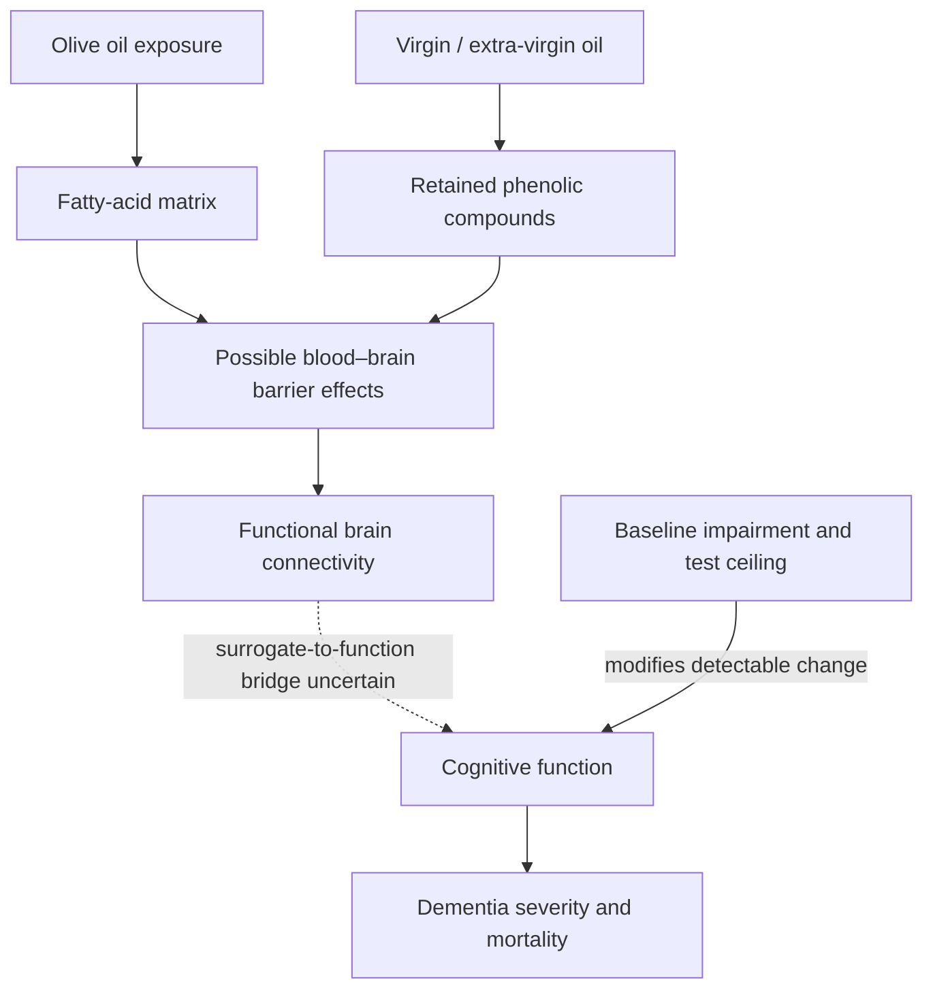

# Olive oil and cognitive aging

Olive oil is a predominantly monounsaturated culinary fat whose less-refined forms retain phenolic compounds. Its possible brain effects must be separated into surrogate changes—such as blood–brain barrier permeability and functional connectivity—measured cognition, dementia severity, and long-term dementia-related mortality. Improvement at one level does not guarantee improvement at the next. (@Physionic (Physionic) — "Your Brain on Olive Oil - Many Studies Later", 2026-08-03, [link](https://www.youtube.com/watch?v=OW8gyDLTt1s))

## Mechanism and evidence

The blood–brain barrier is formed principally by tightly joined endothelial cells, supported by pericytes, astrocytic endfeet, and other elements of the neurovascular unit. It regulates molecular and cellular passage between blood and neural tissue; reduced permeability can therefore be biologically favorable without by itself proving better cognition. In a six-month trial summarized by the source, extra-virgin olive oil improved a permeability measure and brain connectivity, yet three randomized trials found no benefit on the Mini-Mental State Examination (MMSE). (@Physionic (Physionic) — "Your Brain on Olive Oil - Many Studies Later", 2026-08-03, [link](https://www.youtube.com/watch?v=OW8gyDLTt1s))

The apparent conflict may partly reflect measurement and population. Two null trials enrolled cognitively healthy older adults, leaving little room for MMSE improvement, while a study including mild cognitive impairment found a small six-month benefit on the Clinical Dementia Rating (CDR), a measure more specific to dementia severity. Both phenol-depleted refined olive oil and extra-virgin olive oil improved CDR in that comparison, whereas only extra-virgin olive oil improved the reported barrier and connectivity measures. Thus a phenol-independent clinical contribution is possible, but superiority of extra-virgin oil for clinical outcomes remains unproved. (@Physionic (Physionic) — "Your Brain on Olive Oil - Many Studies Later", 2026-08-03, [link](https://www.youtube.com/watch?v=OW8gyDLTt1s))

Long-running observational cohorts associated olive-oil consumption with lower dementia-related mortality after extensive adjustment, including for activity, ancestry, social circumstances, disease history, energy intake, body weight, and dietary factors. This supports compatibility with long-term prevention but cannot eliminate residual confounding or show that olive oil itself caused the association. The overall evidence is therefore moderate for olive oil as part of a healthy dietary pattern, low-to-moderate for small benefits in early cognitive decline, and insufficient for a stand-alone dementia treatment. (@Physionic (Physionic) — "Your Brain on Olive Oil - Many Studies Later", 2026-08-03, [link](https://www.youtube.com/watch?v=OW8gyDLTt1s))

## Practical implications

- **Daily, use olive oil as a replacement for less-favorable fats within a healthy dietary pattern — moderate-to-strong for cardiometabolic pattern quality, low-to-moderate for cognitive benefit.** Most intervention studies summarized used about 30 mL/day, but observational associations appeared at smaller intakes; neither establishes a universal therapeutic dose. (@Physionic (Physionic) — "Your Brain on Olive Oil - Many Studies Later", 2026-08-03, [link](https://www.youtube.com/watch?v=OW8gyDLTt1s))
- **When choosing oil, prefer virgin or extra-virgin oil when cost, taste, and cooking use permit — moderate for retaining phenols, weak for superior clinical cognition.** Do not claim that phenol content alone explains benefit. (@Physionic (Physionic) — "Your Brain on Olive Oil - Many Studies Later", 2026-08-03, [link](https://www.youtube.com/watch?v=OW8gyDLTt1s))
- **For cognitive symptoms, seek clinical assessment rather than self-treating with oil — strong.** Olive oil complements, but does not replace, management of vascular risk, hearing, exercise, sleep, or diagnosed cognitive disease; see [[cognitive-reserve-and-brain-health]]. (@Physionic (Physionic) — "Your Brain on Olive Oil - Many Studies Later", 2026-08-03, [link](https://www.youtube.com/watch?v=OW8gyDLTt1s))

## Gaps & open questions

- Do barrier and connectivity changes predict later cognitive or dementia outcomes?
- Which cognitive stage, genotype, vascular profile, or baseline diet identifies responders?
- Does extra-virgin olive oil outperform a phenol-depleted, calorie-matched oil on clinical endpoints?
- How much of the mortality association reflects substitution, overall Mediterranean-pattern adherence, or residual confounding?

## Related

[[cognitive-reserve-and-brain-health]] · [[nutrition-evidence-and-personalization]] · [[visceral-and-ectopic-fat]] · [[practice-playbook]]
