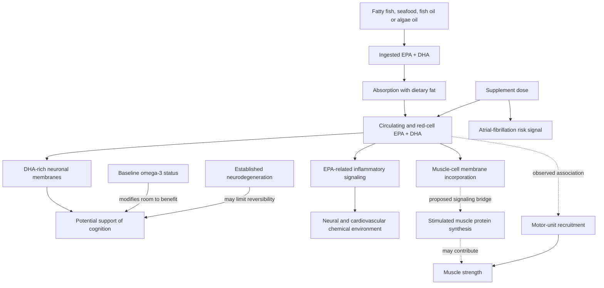

# Omega-3 fatty acids

Long-chain omega-3 fatty acids include docosahexaenoic acid (DHA) and eicosapentaenoic acid (EPA). DHA is a major structural component of neuronal membranes, where membrane composition can affect fluidity, receptor behavior, and cell signaling; EPA is present at lower concentrations in brain tissue and is more closely associated with inflammatory and chemical signaling. This makes supplementation biologically plausible, but plausibility alone does not establish cognitive benefit. (@NutritionMadeSimple (Nutrition Made Simple!) — "Watch This Before You Take Fish Oil (Protect Your Heart)", 2026-08-10, [link](https://www.youtube.com/watch?v=GpzX3NQzmio))

## Mechanism and sources

Fish obtain much of their EPA and DHA ultimately from algae. A cited feeding trial found salmon and algae oil similarly effective at raising blood omega-3 levels, supporting algae oil as a direct alternative rather than a different class of nutrient. Product labels must be read for actual EPA plus DHA: total fish-oil mass can greatly exceed the active long-chain omega-3 dose, and some algae products contain mostly DHA with little EPA. (@NutritionMadeSimple (Nutrition Made Simple!) — "Watch This Before You Take Fish Oil (Protect Your Heart)", 2026-08-10, [link](https://www.youtube.com/watch?v=GpzX3NQzmio))

The route from gut to brain is now described step by step: whether ingested as triglyceride (most supplements) or phospholipid (krill oil), pancreatic lipases cleave the carrier so that free EPA/DHA — or a lysophospholipid still bearing an omega-3 — is absorbed (free fatty acids via the transporter CD36), re-esterified in the enterocyte, packaged into chylomicrons, and released to plasma. After lipase action at muscle and fat, omega-3-bearing phospholipids bind phospholipid transfer protein, and a specific blood–brain-barrier receptor internalizes the lysophospholipid form of DHA or EPA into the brain, where it enters cell membranes or is trafficked by the brain's ApoE-based lipoproteins ([[brain-cholesterol-homeostasis]]). Practically, the ingestion vehicle matters little; verified label content matters more. DHA dominates brain omega-3 content, but EPA is increasingly viewed as required there too, and not everyone converts EPA to DHA. (@PeterAttiaMD (Peter Attia MD) — "395 – Brain lipidology: understanding APOE, cholesterol homeostasis, Alzheimer’s disease, & more", 2026-06-09, [link](https://www.youtube.com/watch?v=KWNgAyurXFY))

Absorption may improve when the supplement is taken with a meal containing fat. The source also describes evidence that adequate B-vitamin status may support transport of omega-3 fatty acids into the brain, but this does not show that adding B vitamins to an already adequate diet improves cognitive outcomes. (@NutritionMadeSimple (Nutrition Made Simple!) — "Watch This Before You Take Fish Oil (Protect Your Heart)", 2026-08-10, [link](https://www.youtube.com/watch?v=GpzX3NQzmio))

## Benefits, modifiers, and harms

Omega-3 exposure can alter skeletal-muscle phospholipid composition because ingested fatty acids become acyl chains in membrane phospholipids. Small interventional studies reported no change in fasting muscle-protein synthesis but a larger synthesis response during amino-acid and insulin exposure after supplementation. A membrane-to-signaling-to-protein-synthesis pathway is plausible, but the studies did not directly demonstrate that complete causal chain, and an inflammation-mediated explanation is also unsettled. (@Physionic (Physionic) — "The Unexpected Muscle Effect of… Omega-3 Fats?", 2026-08-10, [link](https://www.youtube.com/watch?v=r__LqzSrU0c))

Motor-unit measurements add a neural or neuromuscular route: resistance-training studies reported greater post-intervention electrical activity with omega-3 supplementation, correlated with increased force. Across clinical trials summarized separately, the average strength benefit was small, appeared in some data even without exercise, and was seen from roughly 1.4–1.5 g/day combined EPA and DHA. Mechanistic studies used approximately 2–5 g/day, but their small samples and frequent lack of placebo or control groups make them inferior for dosing decisions. (@Physionic (Physionic) — "The Unexpected Muscle Effect of… Omega-3 Fats?", 2026-08-10, [link](https://www.youtube.com/watch?v=r__LqzSrU0c)) (@Physionic (Physionic) — "I analyzed 1,000 Health Studies: Here are 10 Things I Learned", 2026-08-06, [link](https://www.youtube.com/watch?v=sx8MyamJf3g))

A meta-analysis of 58 randomized trials reported modest improvements in several cognitive domains, while other analyses and trials found no clear benefit. The heterogeneity is partly consistent with effect modification: an analysis that was null overall found memory improvement among participants with low baseline omega-3 status, and trials in cognitively healthy people are more consistently favorable than trials in established Alzheimer disease. These subgroup patterns are plausible and useful for decision-making, but they are weaker than a consistently positive primary effect across trials. (@NutritionMadeSimple (Nutrition Made Simple!) — "Watch This Before You Take Fish Oil (Protect Your Heart)", 2026-08-10, [link](https://www.youtube.com/watch?v=GpzX3NQzmio))

Observational fish-intake data place lower Alzheimer and dementia risk around several hundred milligrams of combined EPA and DHA per day, and one trial using 900 mg/day reported cognitive benefit. These data suggest a moderate-intake range rather than proving a universal target, because food associations can reflect the foods displaced, lifestyle differences, and nutrients other than EPA and DHA. (@NutritionMadeSimple (Nutrition Made Simple!) — "Watch This Before You Take Fish Oil (Protect Your Heart)", 2026-08-10, [link](https://www.youtube.com/watch?v=GpzX3NQzmio))

The principal dose-dependent safety concern discussed is atrial fibrillation. Across randomized trials, doses above 1 g/day were associated with roughly a 49–50% relative increase in atrial-fibrillation risk, versus a smaller roughly 12% relative increase below 1 g/day. Relative increases do not state an individual's absolute risk; baseline arrhythmia risk, indication, formulation, and the medical value of prescription high-dose therapy all matter. Prescription omega-3 treatment for a defined cardiovascular indication should therefore not be conflated with over-the-counter use for cognition. (@NutritionMadeSimple (Nutrition Made Simple!) — "Watch This Before You Take Fish Oil (Protect Your Heart)", 2026-08-10, [link](https://www.youtube.com/watch?v=GpzX3NQzmio))

The red-cell omega-3 index captures longer-term EPA and DHA status and can differ between people consuming the same dose. Higher values are observationally associated with lower disease and mortality risk, and one trial found executive-function improvement up to an index around 5%; neither result validates a universal treatment threshold or proves that chasing a higher index improves clinical outcomes. This reinforces the biomarker caution in [[supplement-evidence-and-safety]]. (@NutritionMadeSimple (Nutrition Made Simple!) — "Watch This Before You Take Fish Oil (Protect Your Heart)", 2026-08-10, [link](https://www.youtube.com/watch?v=GpzX3NQzmio)) A separate expert framing places the brain evidence honestly in the hierarchy: observational data link the omega-3 index and low omega-3 status to neurological outcomes, sudden death, and atherosclerotic disease, but level-one randomized evidence is limited to one EPA trial in insulin-resistant, high-risk people with controlled ApoB. Attia's guest lipidologist treats Bill Harris's 8–9% omega-3 index as the point at which cell membranes have the proper omega-3 amount, and regards pushing higher (e.g. 10%) for brain benefit as guesswork justified only by low downside — a plausibility argument, explicitly not guideline-grade, and one to weigh against the dose-dependent atrial-fibrillation signal above. (@PeterAttiaMD (Peter Attia MD) — "395 – Brain lipidology: understanding APOE, cholesterol homeostasis, Alzheimer’s disease, & more", 2026-06-09, [link](https://www.youtube.com/watch?v=KWNgAyurXFY))

## Product quality

EPA and DHA are oxidation-prone. Opaque packaging, protection from heat and light, antioxidant ingredients such as tocopherols, refrigeration when appropriate, and independent testing can reduce product-quality uncertainty. A strongly sour, rotten, or putrid smell or taste is a reason not to use an oil, but sensory screening cannot quantify early oxidation or verify active dose. (@NutritionMadeSimple (Nutrition Made Simple!) — "Watch This Before You Take Fish Oil (Protect Your Heart)", 2026-08-10, [link](https://www.youtube.com/watch?v=GpzX3NQzmio))

## Practical implications

- **At baseline: estimate habitual fatty-fish or seafood intake and review atrial-fibrillation history and risk before supplementing — moderate.** People already consuming ample EPA and DHA have less room to benefit; people with atrial fibrillation or substantial risk should discuss use with a clinician. (@NutritionMadeSimple (Nutrition Made Simple!) — "Watch This Before You Take Fish Oil (Protect Your Heart)", 2026-08-10, [link](https://www.youtube.com/watch?v=GpzX3NQzmio))
- **Daily, if supplementation is chosen: read the EPA-plus-DHA amount rather than total oil mass, take it with a meal containing fat, and avoid assuming that more is better — moderate.** A moderate dose below 1 g/day is the source's risk-conscious general strategy, not a universal prescription; prescribed high doses follow a different clinical decision. (@NutritionMadeSimple (Nutrition Made Simple!) — "Watch This Before You Take Fish Oil (Protect Your Heart)", 2026-08-10, [link](https://www.youtube.com/watch?v=GpzX3NQzmio))
- **With each new bottle and during storage: inspect the product, limit heat and light, and prefer independently tested products — moderate for quality control, weak for a demonstrated clinical-outcome effect.** Do not consume obviously rancid oil. (@NutritionMadeSimple (Nutrition Made Simple!) — "Watch This Before You Take Fish Oil (Protect Your Heart)", 2026-08-10, [link](https://www.youtube.com/watch?v=GpzX3NQzmio))
- **Do not use omega-3 supplementation as the primary dementia-prevention strategy — strong.** Blood-pressure and glucose control, hearing care, and avoiding social isolation act on larger established risk domains; see [[cognitive-reserve-and-brain-health]]. (@NutritionMadeSimple (Nutrition Made Simple!) — "Watch This Before You Take Fish Oil (Protect Your Heart)", 2026-08-10, [link](https://www.youtube.com/watch?v=GpzX3NQzmio))
- **Do not replace resistance training or adequate protein with omega-3 supplements — strong.** If supplementation is already appropriate after dose and atrial-fibrillation review, a small strength benefit is possible, but evidence does not support using the higher 2–5 g/day mechanistic-study doses as a muscle prescription. (@Physionic (Physionic) — "The Unexpected Muscle Effect of… Omega-3 Fats?", 2026-08-10, [link](https://www.youtube.com/watch?v=r__LqzSrU0c))

## Gaps & open questions

- What are the absolute atrial-fibrillation risks at different doses within clinically relevant baseline-risk groups?
- Which baseline omega-3 measures reliably identify cognitive responders, and what threshold should trigger treatment?
- Do DHA-to-EPA ratios materially change long-term cognitive, mood, or cardiovascular outcomes?
- Does treating low omega-3 status prevent dementia, rather than modestly changing cognitive-test performance?
- Which oxidation measures and storage practices predict clinically meaningful harm?
- Does membrane remodeling causally change anabolic signaling, and is the observed strength effect muscular, neural, or both?
- Which ages, baseline omega-3 levels, and training states obtain a clinically meaningful muscle benefit?

## Related

[[cognitive-reserve-and-brain-health]] · [[brain-cholesterol-homeostasis]] · [[supplement-evidence-and-safety]] · [[nutrition-evidence-and-personalization]] · [[performance-nutrition-and-hydration]] · [[practice-playbook]]
