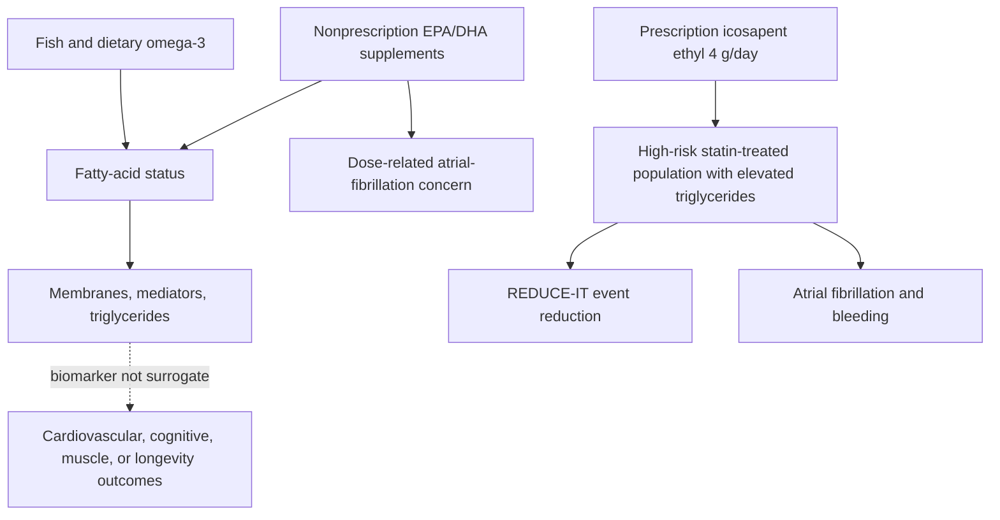

# Omega-3 fatty acids

Omega-3 fatty acids are not one intervention. Alpha-linolenic acid (ALA) is a plant-derived essential fatty acid; eicosapentaenoic acid (EPA) and docosahexaenoic acid (DHA) come mainly from marine foods and supplements; icosapent ethyl is a prescription, highly purified EPA ethyl ester. Evidence from one molecule, dose, formulation, population, or indication does not transfer automatically to another.

```mermaid
flowchart TD
  FOOD[Fish and dietary omega-3] --> STATUS[Fatty-acid status]
  SUPP[Nonprescription EPA/DHA supplements] --> STATUS
  IPE[Prescription icosapent ethyl 4 g/day] --> RX[High-risk statin-treated population with elevated triglycerides]
  STATUS --> BIO[Membranes, mediators, triglycerides]
  BIO -. biomarker not surrogate .-> OUT[Cardiovascular, cognitive, muscle, or longevity outcomes]
  RX --> BENEFIT[REDUCE-IT event reduction]
  RX --> HARM[Atrial fibrillation and bleeding]
  SUPP --> AF[Dose-related atrial-fibrillation concern]
```

## Strongest fair synthesis

For general primary or secondary cardiovascular prevention, increasing long-chain omega-3 intake has little or no effect on all-cause mortality or overall cardiovascular events in the most comprehensive Cochrane synthesis. VITAL similarly found no reduction in its primary composite cardiovascular endpoint with 1 g/day EPA+DHA in generally healthy older adults. These results do not show that fish is unhealthy; they show that ordinary fish-oil capsules should not be sold as a general cardiovascular drug.[^abdelhamid-2020][^vital-2019]

The important exception is prescription icosapent ethyl in a selected high-risk population. REDUCE-IT randomized statin-treated patients with established cardiovascular disease or diabetes plus risk factors and triglycerides of 135–499 mg/dL: the primary composite occurred in 17.2% with icosapent ethyl versus 22.0% with mineral-oil comparator over a median 4.9 years (absolute difference 4.8 percentage points; number needed to treat about 21). Hospitalization for atrial fibrillation or flutter and serious bleeding were more frequent. The 2025 ESC/EAS update therefore says 2 g twice daily should be considered with a statin for high- or very-high-risk patients in this triglyceride range; it does not recommend generic fish oil or self-treatment.[^reduce-it-2019][^esc-2025] [Current FDA label](https://dailymed.nlm.nih.gov/dailymed/lookup.cfm?setid=9c1a2828-1583-4414-ab22-a60480e8e508)

STRENGTH tested 4 g/day EPA+DHA carboxylic acids against corn oil in 13,078 statin-treated high-risk patients and stopped for futility: events were 12.0% versus 12.2%. The divergence means that REDUCE-IT cannot be generalized to high-dose EPA+DHA mixtures.[^strength-2020]

Evidence for cognition, dementia prevention, strength, disuse atrophy, mood, erectile function, and biological aging is weaker or population-specific. Small trials and secondary endpoints can generate hypotheses, but no reviewed evidence admits a healthy-person dose or omega-3-index target for any of these outcomes. DO-HEALTH's epigenetic-clock change is a biomarker result, not added lifespan, and its prefrailty and cancer findings were secondary and require replication. [[biological-age-biomarkers]]

### Bipolar disorder is not an admitted high-dose protocol

One early randomized trial in 30 adults reported improvement after four months of 9.6 g/day fish oil versus olive oil, and the transcript uses it to characterize high-dose omega-3 as a promising adjunct for bipolar disorder. Later synthesis is substantially less favorable: the 2023 VA/DoD guideline found that most trials showed no difference from placebo for manic or depressive symptoms, judged certainty very low because samples were small and results inconsistent and imprecise, and found evidence insufficient to recommend for or against nutritional-supplement augmentation. CANMAT/ISBD lists omega-3 as not recommended for acute mania. The early signal may justify research in a defined bipolar-depression subgroup, but it does not establish the formulation, dose, phase of illness, or benefit–harm balance needed for clinical use. [[mood-disorder-pharmacology]] (@hubermanlab (Andrew Huberman) — "The Science & Treatment of Bipolar Disorder | Huberman Lab Essentials", 2026-07-16, [link](https://www.youtube.com/watch?v=UTB5gAkjevk))[^vadod-bipolar-omega][^canmat-bipolar-omega]

## Adversarial pass: REDUCE-IT and the mineral-oil conflict

The mineral-oil comparator in REDUCE-IT is a credible threat to effect-size interpretation. In the biomarker substudy, the comparator arm's LDL cholesterol rose about 10.9% at 12 months while multiple inflammatory and atherogenic markers worsened; STRENGTH's corn-oil arm did not show the same pattern. This supports the alternative explanation that some of REDUCE-IT's apparent benefit reflects comparator harm.[^ridker-2022]

That concern does not erase the trial. FDA reviewers estimated that LDL-C and hsCRP worsening could explain only a small fraction—about 3% of the observed net clinical benefit—although this estimate is model-dependent and cannot replace a direct neutral-placebo replication. Current 2025 ESC/EAS guidance retained an indication-specific icosapent-ethyl recommendation while explicitly acknowledging formulation, population, and placebo as possible explanations for REDUCE-IT/STRENGTH discordance. The conflict therefore narrows confidence in the magnitude and mechanism, not the existence of an approved, guideline-supported option for the trial-matched population.

Other falsifiers and boundaries:

- Atrial-fibrillation risk rises in several high-dose trials and meta-analyses; absolute harm depends on baseline rhythm risk. One-gram VITAL did not significantly increase incident AF, so a single sharp threshold is not established.
- Bleeding risk matters most with antithrombotic therapy and at prescription exposure; “fish oil always causes dangerous bleeding” is also too broad.
- The omega-3 index is a useful exposure biomarker, but observational associations and assay repeatability do not validate an 8–12% treatment target or prove that raising the index improves outcomes.
- Fish-food associations are confounded by dietary substitution and lifestyle; capsule trials do not test the full food matrix.

## Evidence update — 2026-09-01

> **What changed:** The prior page mixed prescription icosapent ethyl, ordinary EPA/DHA supplements, food, and index-targeted protocols too freely. The current conclusion separates them. The REDUCE-IT mineral-oil criticism is now supported and retained as an unresolved effect-size conflict, while FDA review and 2025 ESC/EAS guidance show that it does not justify discarding the entire icosapent-ethyl result. Podcast-derived sub-1-g/day, 2-g/day index targeting, and 5-g/day preoperative protocols were removed from practical guidance because no applicable guideline or outcome trial admits them for healthy users.

> **2026-09-02 bipolar update:** An episode-derived 9.6-g/day bipolar protocol was reviewed against VA/DoD and CANMAT/ISBD guidance and not admitted. Most later trials were null, certainty is very low, acute-mania guidance recommends against omega-3, and no reviewed source establishes a broadly applicable adjunctive dose. (@hubermanlab (Andrew Huberman) — "The Science & Treatment of Bipolar Disorder | Huberman Lab Essentials", 2026-07-16, [link](https://www.youtube.com/watch?v=UTB5gAkjevk))[^vadod-bipolar-omega][^canmat-bipolar-omega]

## Practical implications

- **Prefer food-pattern guidance over routine capsules for generally healthy people—moderate.** Fish can replace less favorable foods, but supplements have not shown a general mortality or cardiovascular-event benefit.
- **Do not substitute nonprescription fish oil for LDL/ApoB lowering, blood-pressure control, smoking cessation, diabetes care, exercise, or prescribed cardiovascular therapy—strong.**
- **Consider prescription icosapent ethyl only through clinician-guided, indication-matched care—strong for the selected high-risk population.** Review triglycerides despite statin therapy, atrial-fibrillation history, bleeding risk, and antithrombotic medicines.[^esc-2025]
- **Do not use an omega-3 index to self-prescribe a dose or claim biological-age reversal—strong against current protocol admission.** The marker has no validated outcome-improving target.
- **Do not use high-dose omega-3 as a muscle, surgical-preload, dementia, erectile-function, or longevity protocol outside a trial—moderate-to-strong.** Existing evidence is indirect, small, secondary, or mismatched to the proposed population.
- **Do not self-treat bipolar disorder with high-dose fish oil or replace mood-stabilizing care with it—strong against replacement; insufficient evidence for adjunctive use.** The 9.6-g/day early trial is too small and contradicted by the broader later evidence to establish a protocol. (@hubermanlab (Andrew Huberman) — "The Science & Treatment of Bipolar Disorder | Huberman Lab Essentials", 2026-07-16, [link](https://www.youtube.com/watch?v=UTB5gAkjevk))[^vadod-bipolar-omega]

## Gaps & open questions

- Would icosapent ethyl reproduce REDUCE-IT's effect against a demonstrably inert comparator?
- What are dose- and baseline-risk-specific absolute atrial-fibrillation and bleeding effects?
- Can any biomarker identify a group in whom ordinary EPA/DHA supplementation improves a patient-important outcome?
- Do the DO-HEALTH prefrailty and cancer findings replicate in trials powered for those endpoints?
- Does preoperative omega-3 reduce functional loss after real surgery without rhythm or bleeding harm?
- Is there a reproducible bipolar-depression subgroup that benefits from a specified EPA/DHA formulation after baseline status, concomitant treatment, and polarity are controlled?

## Related

[[cognitive-reserve-and-brain-health]] · [[brain-cholesterol-homeostasis]] · [[supplement-evidence-and-safety]] · [[blood-marker-variability-and-reference-change]] · [[nutrition-evidence-and-personalization]] · [[performance-nutrition-and-hydration]] · [[erectile-dysfunction-and-vascular-health]] · [[biological-age-biomarkers]] · [[inflammaging-and-il-6]] · [[lipoprotein-retention-and-atherogenesis]] · [[muscle-strength-and-mortality]] · [[mood-disorder-pharmacology]] · [[practice-playbook]]

## References

[^abdelhamid-2020]: Abdelhamid AS, et al. “Omega-3 Fatty Acids for the Primary and Secondary Prevention of Cardiovascular Disease.” *Cochrane Database of Systematic Reviews*, 2020. [systematic review]. [doi:10.1002/14651858.CD003177.pub5](https://doi.org/10.1002/14651858.CD003177.pub5)
[^vital-2019]: Manson JE, et al. “Marine n−3 Fatty Acids and Prevention of Cardiovascular Disease and Cancer.” *New England Journal of Medicine*, 2019. [RCT]. [doi:10.1056/NEJMoa1811403](https://doi.org/10.1056/NEJMoa1811403)
[^reduce-it-2019]: Bhatt DL, et al. “Cardiovascular Risk Reduction with Icosapent Ethyl for Hypertriglyceridemia.” *New England Journal of Medicine*, 2019. [RCT]. [doi:10.1056/NEJMoa1812792](https://doi.org/10.1056/NEJMoa1812792)
[^esc-2025]: European Society of Cardiology and European Atherosclerosis Society. “2025 Focused Update of the ESC/EAS Guidelines for the Management of Dyslipidaemias.” *European Heart Journal*, 2025. [professional guideline]. [doi:10.1093/eurheartj/ehaf190](https://doi.org/10.1093/eurheartj/ehaf190)
[^strength-2020]: Nicholls SJ, et al. “Effect of High-Dose Omega-3 Fatty Acids vs Corn Oil on Major Adverse Cardiovascular Events.” *JAMA*, 2020. [RCT]. [doi:10.1001/jama.2020.22258](https://doi.org/10.1001/jama.2020.22258)
[^ridker-2022]: Ridker PM, et al. “Effects of Icosapent Ethyl and Mineral Oil on Lipoproteins, Inflammatory Markers, and Biomarkers in REDUCE-IT.” *Circulation*, 2022. [randomized-trial biomarker substudy]. [doi:10.1161/CIRCULATIONAHA.122.059410](https://doi.org/10.1161/CIRCULATIONAHA.122.059410)
[^vadod-bipolar-omega]: U.S. Department of Veterans Affairs and Department of Defense. *VA/DoD Clinical Practice Guideline for Management of Bipolar Disorder*. 2023. [professional guideline; evidence reviewed through 2021]. [guideline](https://www.healthquality.va.gov/guidelines/MH/bd/VA-DOD-CPG-BD-Full-CPGFinal508.pdf)
[^canmat-bipolar-omega]: Keramatian K, Chithra NK, Yatham LN. “The CANMAT and ISBD Guidelines for the Treatment of Bipolar Disorder: Summary and a 2023 Update of Evidence.” *Focus*, 2023. [professional guideline summary]. [doi:10.1176/appi.focus.20230009](https://doi.org/10.1176/appi.focus.20230009)
