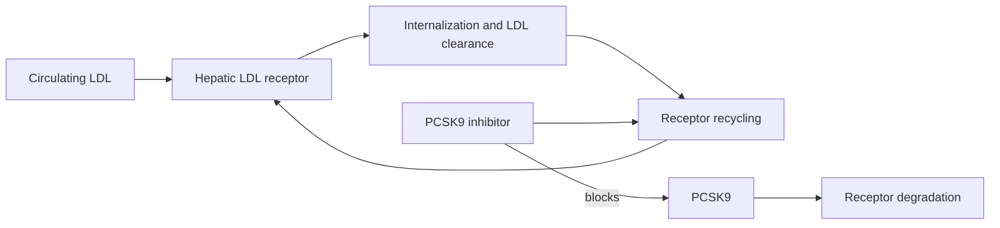

# PCSK9 inhibition

PCSK9 inhibitors lower circulating LDL cholesterol by preserving hepatic LDL receptors. Normally, a liver-cell receptor captures an LDL particle and can recycle to the cell surface; PCSK9 binding instead directs the receptor toward degradation. Blocking PCSK9 increases receptor reuse and clearance of LDL particles. (@mkaeberlein (Matt Kaeberlein) — "Longevity Science Update: The Biggest Stories in Longevity Medicine — July 2026", 2026-07-31, [link](https://www.youtube.com/watch?v=A0xNnGsGAJg))

## Evidence and endpoints

Injectable evolocumab was described as lowering LDL-C and ApoB by roughly 55–60% and has cardiovascular-outcome evidence. The oral inhibitor enlicitide received approval on an LDL-lowering surrogate and appeared to produce a comparable reduction, but the transcript reports that cardiovascular-event results were not yet available. It is reasonable to expect benefit from the same pathway, but biochemical equivalence is not yet direct proof of equivalent clinical outcomes. (@mkaeberlein (Matt Kaeberlein) — "Longevity Science Update: The Biggest Stories in Longevity Medicine — July 2026", 2026-07-31, [link](https://www.youtube.com/watch?v=A0xNnGsGAJg))

PCSK9 inhibition can complement statins and ezetimibe when greater ApoB/LDL reduction is clinically appropriate. Oral delivery may reduce injection barriers, but access, cost, baseline absolute risk, and outcome evidence determine its value; longevity framing should not replace cardiovascular risk assessment. (@mkaeberlein (Matt Kaeberlein) — "Longevity Science Update: The Biggest Stories in Longevity Medicine — July 2026", 2026-07-31, [link](https://www.youtube.com/watch?v=A0xNnGsGAJg))

## Practical implications

Measure lipids on the preventive-care cadence appropriate to individual risk and discuss ApoB-lowering therapy with a clinician when indicated. Recheck response and tolerability after initiation and periodically thereafter. Evidence is strong for LDL reduction and for event reduction with established injectable agents; for a newer oral agent, distinguish its strong surrogate effect from then-pending hard-outcome confirmation. (@mkaeberlein (Matt Kaeberlein) — "Longevity Science Update: The Biggest Stories in Longevity Medicine — July 2026", 2026-07-31, [link](https://www.youtube.com/watch?v=A0xNnGsGAJg))

## Gaps & open questions

- Does oral enlicitide produce the expected reduction in cardiovascular events over long follow-up?
- Which patients gain enough absolute benefit to justify cost and treatment burden?
- How should PCSK9 inhibition be sequenced with statins and ezetimibe across risk groups?

## Related

[[aging-model]] · [[practice-playbook]] · [[glp-1-receptor-agonists]]
