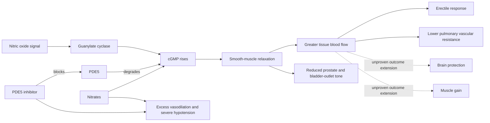

# PDE5 inhibitors

Phosphodiesterase type 5 (PDE5) inhibitors—including sildenafil, tadalafil, and vardenafil—prolong cyclic guanosine monophosphate (cGMP) signaling. Nitric oxide stimulates cGMP production; cGMP lowers smooth-muscle tone; PDE5 terminates that signal by degrading cGMP. Blocking PDE5 therefore amplifies an existing nitric-oxide signal rather than independently creating sexual desire or arousal. In erectile tissue this improves cavernosal relaxation and arterial inflow, while PDE5 expression in pulmonary vessels, the prostate, bladder outlet, and other tissues explains both established non-erectile indications and proposed systemic effects. (@RenaMalikMD (Rena Malik, M.D.) — "Why ED Pills May Protect Your Heart, Brain, and Make You Stronger", 2026-07-13, [link](https://www.youtube.com/watch?v=dLqPxKeYF04))

## Established uses and outcome boundaries

Erectile dysfunction is the best-known use. Sildenafil is also used for pulmonary arterial hypertension, where pulmonary vasodilation can improve exercise capacity and quality of life, and tadalafil is used for lower urinary-tract symptoms associated with benign prostatic hyperplasia by relaxing smooth muscle in the prostate, urethra, and bladder outlet. The transcript describes randomized evidence for tadalafil's urinary-symptom efficacy and smaller studies in chronic prostatitis or chronic pelvic pain, but does not provide enough detail to grade effects or establish the latter as routine treatment. (@RenaMalikMD (Rena Malik, M.D.) — "Why ED Pills May Protect Your Heart, Brain, and Make You Stronger", 2026-07-13, [link](https://www.youtube.com/watch?v=dLqPxKeYF04)) [[erectile-dysfunction-and-vascular-health]]

A related adjacent use is in premature ejaculation with comorbid erectile dysfunction: sexual-medicine specialists describe PDE5 inhibitors as a common first medication there because fear of losing the erection drives rushing to ejaculate, and treating the erectile problem removes that driver; daily tadalafil is additionally described as shortening the refractory period for some men. The panel is explicit that this treats the adjacent erectile issue rather than the ejaculatory set point itself, and a PDE5 inhibitor does not help isolated premature ejaculation without an erectile component. [[premature-ejaculation]] (@RenaMalikMD (Rena Malik, M.D.) — "The #1 Sex Mistake Men Make: Why Lasting Longer Doesn’t Mean Better Sex", 2026-08-14, [link](https://www.youtube.com/watch?v=aJlK0qZD-Xo))

## Cardiovascular, brain, and muscle claims

PDE5 inhibition can improve endothelial signaling and pulmonary hemodynamics, but plausible vascular mechanisms do not prove prevention of heart attack, stroke, dementia, or sarcopenia. The video reports that an observational cohort of men with ED associated PDE5 prescriptions with fewer major adverse cardiovascular events and found a dose-response pattern. Healthier users, more sexual activity, access to care, and prescribing selection could produce some or all of that association. Trials and a meta-analysis in selected heart-failure populations reportedly improved intermediate measures such as exercise capacity, ventricular mass, ejection fraction, or NT-proBNP; these findings are population-specific and do not establish preventive use in healthy adults. (@RenaMalikMD (Rena Malik, M.D.) — "Why ED Pills May Protect Your Heart, Brain, and Make You Stronger", 2026-07-13, [link](https://www.youtube.com/watch?v=dLqPxKeYF04))

For neurological disease, reduced neuroinflammation, oxidative stress, amyloid burden, neuronal loss, and improved post-stroke recovery were primarily preclinical findings. A large pooled human association with lower Alzheimer disease incidence remains observational, variable in study quality, and unsupported by randomized prevention or treatment trials. Likewise, a small short study reporting increased abdominal lean mass during tadalafil treatment and cell experiments involving androgen-receptor or myogenic signaling do not establish PDE5 inhibitors as muscle-building drugs; the observed body-composition change disappeared after treatment stopped, and dose-dependent harms remain uncertain. These are hypotheses for trials, not indications. (@RenaMalikMD (Rena Malik, M.D.) — "Why ED Pills May Protect Your Heart, Brain, and Make You Stronger", 2026-07-13, [link](https://www.youtube.com/watch?v=dLqPxKeYF04))

## Safety and interactions

Headache, flushing, nasal congestion, dyspepsia, and symptomatic blood-pressure reduction are common class effects. The central safety boundary is nitrate co-use: both pathways raise cGMP-mediated vasodilation and can produce profound hypotension. The video cites a Swedish registry association between combined prescriptions and higher mortality and myocardial infarction, but observational data cannot isolate the interaction from the severe cardiovascular disease that prompted nitrate use. Nevertheless, the pharmacological interaction is sufficiently dangerous that PDE5 inhibitors should not be combined with nitrates; emergency clinicians must be told when the last PDE5 inhibitor dose was taken. The transcript mentions drug-specific waiting intervals but this page does not admit them as a protocol because current labeling and emergency guidance were not independently reviewed. (@RenaMalikMD (Rena Malik, M.D.) — "Why ED Pills May Protect Your Heart, Brain, and Make You Stronger", 2026-07-13, [link](https://www.youtube.com/watch?v=dLqPxKeYF04))

## Practical implications

- **Use a PDE5 inhibitor for an established, clinician-confirmed indication and choose the agent around duration, interactions, and goals—strong general principle.** An erection still requires sexual stimulation, and medication does not correct low desire, pain, relationship distress, or every vascular and neurologic cause. (@RenaMalikMD (Rena Malik, M.D.) — "Why ED Pills May Protect Your Heart, Brain, and Make You Stronger", 2026-07-13, [link](https://www.youtube.com/watch?v=dLqPxKeYF04))
- **Never combine a PDE5 inhibitor with nitrate medication—strong safety boundary.** If chest pain occurs after use, seek emergency care and disclose the drug and dose time rather than self-administering a nitrate; exact withholding intervals should follow current product and emergency guidance. (@RenaMalikMD (Rena Malik, M.D.) — "Why ED Pills May Protect Your Heart, Brain, and Make You Stronger", 2026-07-13, [link](https://www.youtube.com/watch?v=dLqPxKeYF04))
- **Do not take PDE5 inhibitors to prevent Alzheimer disease, accelerate stroke recovery, build muscle, or prevent cardiovascular events outside a trial—moderate against routine use because evidence is preclinical, observational, or based on intermediate outcomes.** (@RenaMalikMD (Rena Malik, M.D.) — "Why ED Pills May Protect Your Heart, Brain, and Make You Stronger", 2026-07-13, [link](https://www.youtube.com/watch?v=dLqPxKeYF04))
- **For ED with cardiovascular symptoms or uncertain exercise safety: obtain cardiovascular risk assessment before sexual activity or drug initiation—strong principle; use current professional criteria.** (@RenaMalikMD (Rena Malik, M.D.) — "Why ED Pills May Protect Your Heart, Brain, and Make You Stronger", 2026-07-13, [link](https://www.youtube.com/watch?v=dLqPxKeYF04))

## Gaps & open questions

- Do PDE5 inhibitors reduce cardiovascular events when tested in randomized trials within clearly defined risk groups?
- Can any neuroprotective signal be reproduced in human trials with functional rather than biomarker endpoints?
- Which chronic pelvic-pain phenotypes, if any, respond and with what absolute benefit?
- Are the small body-composition findings reproducible, clinically meaningful, and safe over longer periods?
- How do agent, dose, duration, comorbidity, and co-medication alter systemic benefits and harms?

## Related

[[erectile-dysfunction-and-vascular-health]] · [[premature-ejaculation]] · [[alzheimers-spectrum-and-diagnosis]] · [[proactive-health-monitoring]] · [[male-fertility-and-exogenous-testosterone]] · [[rena-malik]] · [[aging-model]] · [[practice-playbook]]
