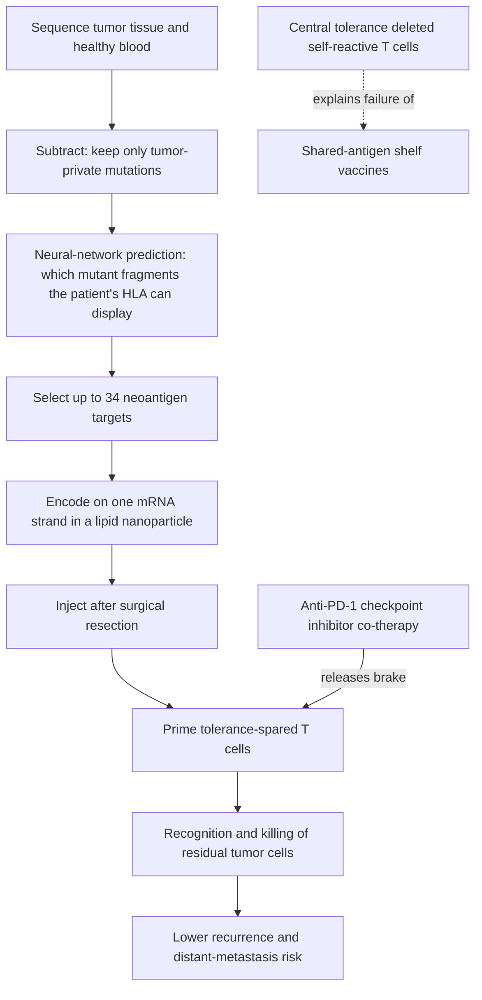

# Personalized neoantigen cancer vaccines

A personalized neoantigen cancer vaccine is a therapeutic (not preventive) immunization built for one patient: the tumor's private mutations are identified by sequencing, the mutant protein fragments most likely to be displayed on the patient's cells are selected computationally, and those targets are delivered — currently as mRNA in a lipid nanoparticle — to train T cells against residual cancer after surgery. In August 2026 this approach produced what its developers describe as the first positive phase 3 trial for an individualized neoantigen therapy and the first for any mRNA-based cancer treatment, in resected high-risk melanoma. (@DrBradStanfield (Dr Brad Stanfield) — "This Vaccine Just Changed Cancer Forever", 2026-08-25, [link](https://www.youtube.com/watch?v=IZlWYAp7g-g))

## Why the immune system can kill cancer but shelf vaccines couldn't

That the immune system can eliminate established cancer has been observed for over a century: spontaneous regressions after severe bacterial infection motivated William Coley's killed-bacteria injections in the 1890s (which helped rare, unpredictable responders and were judged a failure by the field), intravesical BCG — a live tuberculosis vaccine instilled into the bladder from 1976 — remains standard of care for high-risk early bladder cancer, and Steven Rosenberg's tumor-infiltrating-lymphocyte work showed by 1988 that a patient's own expanded T cells could shrink melanoma. Yet the cancer vaccines of the 1990s–2010s failed almost uniformly, with objective tumor response in only about 3.3% of treated patients across the era's trials and four large late-stage failures. (@DrBradStanfield (Dr Brad Stanfield) — "This Vaccine Just Changed Cancer Forever", 2026-08-25, [link](https://www.youtube.com/watch?v=IZlWYAp7g-g))

The mechanistic explanation is central tolerance. During immune development, T cells reactive against the body's own proteins are deleted. Most failed vaccines pointed the immune system at proteins the tumor shares with normal tissue — precisely the targets whose reactive T cells no longer exist. The 2015 reframing: a tumor's own mutations create proteins that exist nowhere else in the body (neoantigens), against which unpurged T cells are still available — but because each tumor's mutations are private, the target list must be rebuilt per patient. (@DrBradStanfield (Dr Brad Stanfield) — "This Vaccine Just Changed Cancer Forever", 2026-08-25, [link](https://www.youtube.com/watch?v=IZlWYAp7g-g))

The display-prediction step is the load-bearing computational element — an epitope the cell cannot present is invisible to T cells — and Moderna's selection algorithm is proprietary and unpublished, which limits independent replication of that step. (@DrBradStanfield (Dr Brad Stanfield) — "This Vaccine Just Changed Cancer Forever", 2026-08-25, [link](https://www.youtube.com/watch?v=IZlWYAp7g-g))

## Evidence trajectory

- **First-in-human (2017):** 13 melanoma patients (5 already metastatic) received personalized RNA vaccines; the eight who were disease-free at vaccination remained recurrence-free for up to 23 months. A Boston group vaccinated six melanoma patients with peptide (protein-fragment) versions; four remained recurrence-free at 25 months, and the two who progressed regressed completely once an anti-PD-1 checkpoint drug was added — an early signal that vaccine and checkpoint blockade are complementary. Uncontrolled, tiny cohorts. (@DrBradStanfield (Dr Brad Stanfield) — "This Vaccine Just Changed Cancer Forever", 2026-08-25, [link](https://www.youtube.com/watch?v=IZlWYAp7g-g))
- **Randomized phase 2 (reported December 2022):** 157 patients with resected melanoma randomized to personalized mRNA vaccine plus pembrolizumab (Keytruda) versus pembrolizumab alone; recurrence risk was reduced by roughly 44%, with later-reported figures of a 49% reduction in recurrence or death and 59% in distant metastasis or death. Randomized but small, with wide uncertainty intervals implied by the size. (@DrBradStanfield (Dr Brad Stanfield) — "This Vaccine Just Changed Cancer Forever", 2026-08-25, [link](https://www.youtube.com/watch?v=IZlWYAp7g-g))
- **Phase 3 (topline, announced 2026-08-19):** 1,137 patients with completely resected stage 2B–4 melanoma at high recurrence risk, double-blind, randomized to vaccine plus pembrolizumab versus pembrolizumab alone. The combination met its endpoint — benefit on top of, not instead of, standard care — with no new safety signals reported. **The effect sizes have not been published**; at this writing the claim rests on a company announcement, so the phase 2 numbers remain the best quantitative estimate and the phase 3 result should be treated as directionally positive, press-release-grade evidence pending peer-reviewed data. The announcement moved Moderna's stock 177% in a day, a measure of expectation rather than of evidence. (@DrBradStanfield (Dr Brad Stanfield) — "This Vaccine Just Changed Cancer Forever", 2026-08-25, [link](https://www.youtube.com/watch?v=IZlWYAp7g-g))

## Applicability boundaries

This is adjuvant treatment for people who had melanoma surgically removed and are at high risk of recurrence — not prevention, not a cure for established metastatic disease, and not yet FDA-approved or publicly available. Melanoma was the strategically easy first target because it is among the most heavily mutated cancers, giving the most neoantigen raw material; whether the approach transfers to lower-mutation-burden tumors is the key open question. Merck and Moderna alone are running nine trials of the therapy — two in melanoma, four in lung cancer (three at phase 3), one in kidney, and two in bladder, one of which pairs the vaccine with BCG, the 1976 immunotherapy. The mechanism argues for generalization; the evidence does not yet. Cost is unknown, and per-patient manufacturing makes it structurally expensive until process innovation catches up. (@DrBradStanfield (Dr Brad Stanfield) — "This Vaccine Just Changed Cancer Forever", 2026-08-25, [link](https://www.youtube.com/watch?v=IZlWYAp7g-g))

The preventive contrast is the HPV vaccine, which blocks the virus behind most cervical cancers; US cervical-cancer deaths have fallen more than 60% in over a decade. Prevention by blocking a viral cause and treatment by targeting private mutations are different strategies that bracket what "cancer vaccine" can mean. (@DrBradStanfield (Dr Brad Stanfield) — "This Vaccine Just Changed Cancer Forever", 2026-08-25, [link](https://www.youtube.com/watch?v=IZlWYAp7g-g))

This page connects to the wiki's immune framework: the approach succeeds precisely where [[immune-recognition-and-trafficking]] says immunotherapy must — supplying a displayable, tolerance-spared target — and it faces the same solid-tumor obstacles (trafficking, immunosuppressive microenvironment) mapped in [[engineered-cell-therapy-for-solid-tumors]]; checkpoint co-therapy addresses the activation-threshold arm. Age-related repertoire narrowing ([[immune-aging-and-rejuvenation]]) is a plausible modifier of who responds, though the source does not address it.

## Practical implications

- **No self-directed action exists — strong.** The therapy is trial-only; eligibility runs through oncology, and trial enrollment is the only access route for resected high-risk melanoma patients today. (@DrBradStanfield (Dr Brad Stanfield) — "This Vaccine Just Changed Cancer Forever", 2026-08-25, [link](https://www.youtube.com/watch?v=IZlWYAp7g-g))
- **HPV vaccination remains the actionable cancer-vaccine decision — strong, established prevention with regulator approval and population mortality decline.** (@DrBradStanfield (Dr Brad Stanfield) — "This Vaccine Just Changed Cancer Forever", 2026-08-25, [link](https://www.youtube.com/watch?v=IZlWYAp7g-g))
- **Established screening and prevention are not displaced — strong.** A positive adjuvant-treatment trial changes nothing about primary prevention or [[colorectal-cancer-prevention-and-screening]]-style early detection.

## Gaps & open questions

- What are the phase 3 hazard ratios, absolute risk differences, and overall-survival effects? Until publication, the headline is unquantified.
- Does efficacy hold in tumors with low mutational burden (pancreatic, prostate, many breast cancers), where neoantigen raw material is scarce?
- How much of the benefit requires checkpoint co-therapy, and does the vaccine add anything as monotherapy?
- Can the display-prediction step be validated independently while the selection algorithm stays proprietary?
- What will manufacturing cost, turnaround time, and payer coverage look like, and will access track the biology or the price?
- How durable is vaccine-induced T-cell protection, and does tumor evolution escape a fixed 34-target set?

## Related

[[immune-recognition-and-trafficking]] · [[engineered-cell-therapy-for-solid-tumors]] · [[immune-aging-and-rejuvenation]] · [[microbiome-directed-cancer-therapy]] · [[multi-cancer-early-detection]] · [[cancer-screening-and-overdiagnosis]] · [[brad-stanfield]] · [[aging-model]]
