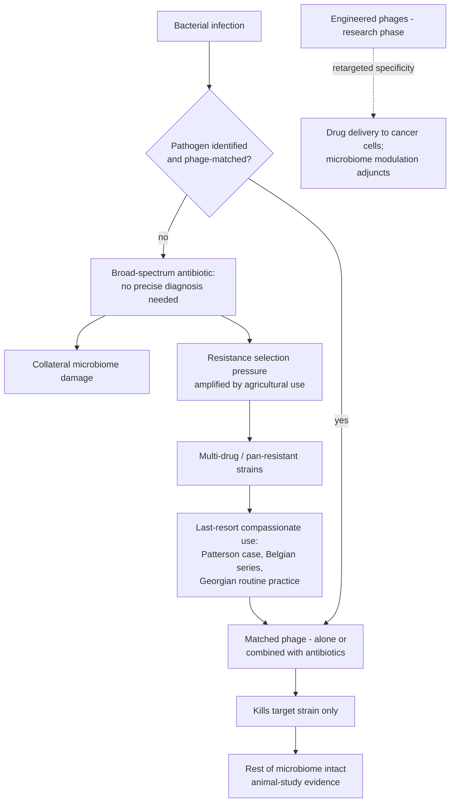

# Phage therapy

Phage therapy treats bacterial infection with bacteriophages — viruses that kill specific bacteria and nothing else (biology at [[gut-virome-and-bacteriophages]]). Its renewed relevance is antimicrobial resistance: antibiotics underpin not just infection treatment but surgery and cancer care, overuse has driven bacteria to evolve resistance — including strains now resistant to every available antibiotic — and the episode's figures are more than a million deaths per year already attributable to untreatable infection (with several million more associated), a projection of ten million per year absent action (exceeding cancer deaths), and an estimated 7,000+ deaths per year in the UK alone. About 70% of global antibiotic use is agricultural (poultry, swine, fish farming), often at low preventative doses that are an ideal resistance incubator; EU rules have tightened over the past decade (no purely preventative use, though one sick animal can justify treating a flock) while much of the world has not followed, making resistance a one-health problem that spreads because bacteria readily transfer resistance genes to one another. These are expert-transmitted figures consistent with the mainstream AMR literature (the ~10 million projection is the widely cited 2050 scenario), not independently verified here. (@joinzoe (ZOE) — "10 million deaths a year! Why did we stop using the one treatment that still works?", 2026-05-21, [link](https://www.youtube.com/watch?v=OLqoYs__A_I))

## A treatment older than antibiotics

Phage therapy predates antibiotics: the bactericidal principle was first observed in Ganges water in the late 19th century (Hankin), phages were isolated by Frederick Twort in 1915 and shortly after by Félix d'Hérelle, who treated patients through the 1920s–40s; phages were sold in UK Boots pharmacies until about the 1960s. Antibiotics displaced them for a structural reason — a simple compound killing broad classes of bacteria requires no diagnosis of the exact organism, while a phage must be matched to its target — and most of the world abandoned the field. The Soviet lineage continued: d'Hérelle trained Georgian scientists, and Georgia (the Eliava tradition) still treats thousands of patients routinely. Clokie's framing of the trade-off: the antibiotic is the broad weapon, the phage a sharpshooter carrying a photo of its one target. (@joinzoe (ZOE) — "10 million deaths a year! Why did we stop using the one treatment that still works?", 2026-05-21, [link](https://www.youtube.com/watch?v=OLqoYs__A_I))

## Evidence for benefit

The evidence base is real but thin by regulatory standards, concentrated in last-resort use:

- **Routine practice in Georgia** — thousands of patients yearly, decades of institutional experience, but not organized as controlled trials exportable to Western regulators. (@joinzoe (ZOE) — "10 million deaths a year! Why did we stop using the one treatment that still works?", 2026-05-21, [link](https://www.youtube.com/watch?v=OLqoYs__A_I))
- **Case series** — the Queen Astrid Military Hospital (Belgium) published its experience treating 100 patients with phages combined with antibiotics (the episode's "last year" reference; the linked paper describes this program). Case series demonstrate feasibility and safety patterns, not comparative efficacy. (@joinzoe (ZOE) — "10 million deaths a year! Why did we stop using the one treatment that still works?", 2026-05-21, [link](https://www.youtube.com/watch?v=OLqoYs__A_I))
- **High-profile compassionate use** — Tom Patterson, a San Diego psychiatrist comatose with a pan-resistant infection acquired in Egypt, recovered after his epidemiologist wife Stephanie Strathdee assembled phage preparations from the US Navy, an institute collection, and private companies. A single dramatic recovery cannot separate phage effect from late-course confounders, but it catalyzed US interest. (@joinzoe (ZOE) — "10 million deaths a year! Why did we stop using the one treatment that still works?", 2026-05-21, [link](https://www.youtube.com/watch?v=OLqoYs__A_I))
- **Microbiome sparing** — in largely animal studies, phage administration removes the target strain while leaving the rest of the community intact, the predicted advantage over broad-spectrum antibiotics ([[food-patterns-and-gut-ecology]] records what broad-spectrum courses do to gut ecology). (@joinzoe (ZOE) — "10 million deaths a year! Why did we stop using the one treatment that still works?", 2026-05-21, [link](https://www.youtube.com/watch?v=OLqoYs__A_I))

What is missing: randomized comparative trials against or alongside standard antibiotics, standardized manufacturing and matching pipelines, and a regulatory pathway that fits a living, evolving, strain-specific product. Clokie's stated goal is exactly this mainstreaming — phages available to GPs alongside antibiotics, used early rather than as a last resort — and she notes the field has struggled for funding because it is perceived as niche and risky. Spector's endorsement is stronger and worth recording as attributed position: he calls phage therapy "pretty much the only approach to counteract the fact that we're running out of antibiotics." (@joinzoe (ZOE) — "10 million deaths a year! Why did we stop using the one treatment that still works?", 2026-05-21, [link](https://www.youtube.com/watch?v=OLqoYs__A_I))

## Engineered phages beyond infection

Because phage targeting is a modular surface-recognition problem, labs are re-engineering it: phages retargeted from bacterial to cancer-cell surface markers could deliver a therapeutic payload selectively (injecting a drug rather than a viral genome), and Clokie's lab has built phages that attach to human gut epithelial cells as delivery vehicles. A second adjunct concept rides on the microbiome–immunotherapy link: a surgeon colleague reportedly predicts lung-cancer treatment response from the patient's gut microbiome, suggesting future phage cocktails could push a gut community into a treatment-receptive state alongside checkpoint-era therapies ([[microbiome-directed-cancer-therapy]] covers the adjacent trial evidence). Both applications are explicitly research-phase — no products exist — and belong to the hypothesis tier. (@joinzoe (ZOE) — "10 million deaths a year! Why did we stop using the one treatment that still works?", 2026-05-21, [link](https://www.youtube.com/watch?v=OLqoYs__A_I))

## Practical implications

- **There is no self-directed phage action: no product to take, no supplier to trust, no preventive routine — and this page exists to say so.** Phage treatment today is clinician-directed compassionate use for otherwise untreatable infection, or care within systems (Georgia, some specialist centers) where it is established practice. (@joinzoe (ZOE) — "10 million deaths a year! Why did we stop using the one treatment that still works?", 2026-05-21, [link](https://www.youtube.com/watch?v=OLqoYs__A_I))
- **If facing a documented multi-drug-resistant infection with failing options: it is legitimate to ask the treating team whether compassionate-use phage therapy is accessible — moderate as an information-seeking step (precedents exist: Belgian series, US case pathway), with feasibility entirely case-dependent.** (@joinzoe (ZOE) — "10 million deaths a year! Why did we stop using the one treatment that still works?", 2026-05-21, [link](https://www.youtube.com/watch?v=OLqoYs__A_I))
- **Support antibiotic stewardship personally — avoid demanding antibiotics for viral illness — strong on general AMR grounds; the transcript supplies the stakes rather than the protocol.** Resistance generated anywhere (including agriculture) degrades everyone's future treatability. (@joinzoe (ZOE) — "10 million deaths a year! Why did we stop using the one treatment that still works?", 2026-05-21, [link](https://www.youtube.com/watch?v=OLqoYs__A_I))

## Gaps & open questions

- Can randomized trials establish where phages beat, equal, or should combine with antibiotics — and can regulation accommodate strain-matched living products?
- How fast do bacteria evolve phage resistance in clinical use, and do phage–antibiotic combinations suppress it (the co-evolutionary arms race cuts both ways)?
- Can matching be industrialized — rapid diagnostics plus curated phage libraries — fast enough for acute infection?
- Does microbiome sparing hold in humans at therapeutic doses, and does it translate into better outcomes than antibiotic courses?
- Do engineered phage delivery vehicles (cancer payloads, epithelial targeting) survive immune clearance and dose-scaling in vivo?
- What did a century of Georgian practice actually accumulate, and how much is recoverable as usable evidence?

## Related

[[gut-virome-and-bacteriophages]] · [[food-patterns-and-gut-ecology]] · [[microbiome-directed-cancer-therapy]] · [[probiotics-prebiotics-and-postbiotics]] · [[immune-recognition-and-trafficking]] · [[personalized-neoantigen-cancer-vaccines]] · [[tim-spector]] · [[practice-playbook]]
