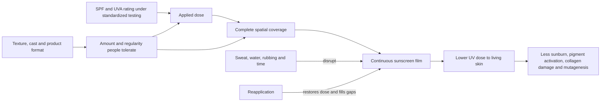

# Photoprotection

Photoprotection reduces ultraviolet (UV) dose through shade, clothing, behavior, and sunscreen. UV reaching living skin can damage DNA, generate reactive species, increase collagen-degrading enzymes, worsen uneven pigmentation, and eventually contribute to photoaging and cancer. Sunscreen performance in daily life therefore depends not only on nominal SPF but on applied amount, spatial coverage, film integrity, sweating, water, rubbing, and time. Reapplication mainly restores a film that has clumped, rubbed off, or developed gaps; filter photodegradation is not usually the dominant reason to reapply. (@LabMuffinBeautyScience (Lab Muffin Beauty Science) — "Debunking this year's top sunscreen myths", 2026-05-23, [link](https://www.youtube.com/watch?v=wATBG1X7HX4)) (@LabMuffinBeautyScience (Lab Muffin Beauty Science) — "I was wrong about sunscreen sticks (kinda)", 2026-07-14, [link](https://www.youtube.com/watch?v=NyWP_a0rICQ))

## From label to protection

SPF is determined at a specified application mass under standardized irradiation; it is not a property guaranteed at any arbitrary real-world dose. The same starting test mass applies across lotions, sticks, powders, and sprays, even though a water-containing lotion becomes lighter after evaporation while a nearly anhydrous stick remains thick. International SPF testing uses standardized sources rather than local sunlight, so an SPF 50 is not inherently converted to SPF 15 by moving a Korean product to Australia. Actual reliability can still differ through laboratory variability, counterfeit supply, heat-damaged imports, formulation integrity, and whether water resistance matches the activity. (@LabMuffinBeautyScience (Lab Muffin Beauty Science) — "I was wrong about sunscreen sticks (kinda)", 2026-07-14, [link](https://www.youtube.com/watch?v=NyWP_a0rICQ)) (@LabMuffinBeautyScience (Lab Muffin Beauty Science) — "Debunking this year's top sunscreen myths", 2026-05-23, [link](https://www.youtube.com/watch?v=wATBG1X7HX4))

High UVA protection matters especially for pigment control. Neither zinc oxide nor titanium dioxide is categorically superior: mineral filters mostly absorb UV and release a very small amount of heat, as organic filters do, while high-UVA organic-filter blends can outperform practical mineral-only films. Visible-light protection comes chiefly from tint pigments such as iron oxides rather than from the mineral/organic identity of the UV filters; tinted products of either type can therefore help visible-light-sensitive hyperpigmentation. This distinction and the safety dispute are developed in [[mineral-and-organic-sunscreens]]. (@LabMuffinBeautyScience (Lab Muffin Beauty Science) — "Debunking this year's top sunscreen myths", 2026-05-23, [link](https://www.youtube.com/watch?v=wATBG1X7HX4))

UV exposure below the threshold of visible redness can still produce characteristic UV-induced DNA mutations, so absence of sunburn is not proof of zero carcinogenic exposure. At the same time, benefit and baseline risk vary with UV index, constitutive skin pigmentation, geography, behavior, and outcome: darker skin provides meaningful natural protection and US evidence has not reliably linked sun exposure to skin cancer in Black populations, but sunscreen may still prevent sunburn, photoaging, and uneven pigment. Acral melanoma is not considered UV-driven, and improving recognition and access to diagnosis addresses late detection more directly than implying that sunscreen on exposed sites prevents all melanoma. Lab Muffin endorses a risk-stratified approach derived from Australian guidance rather than a universal cancer-prevention claim; the transcript also acknowledges that the evidence in darker skin is limited. (@LabMuffinBeautyScience (Lab Muffin Beauty Science) — "Debunking this year's top sunscreen myths", 2026-05-23, [link](https://www.youtube.com/watch?v=wATBG1X7HX4))

## Format-specific performance

Sunscreen sticks trade portability and clean application for two coupled errors: low product payout and discontinuous coverage. In one-person repeated tests across multiple sticks, most products delivered about half or less of the label-test amount after four passes even after visible gaps were corrected; a few soft, high-payout sticks did reach the test amount. Narrow contours helped reach the nose and eye area, wide faces reduced striping, and hard round sticks performed poorly, but day-to-day results varied even with the same trained user. The evidence is useful mechanistic and usability evidence, not a population estimate or direct SPF trial. (@LabMuffinBeautyScience (Lab Muffin Beauty Science) — "I was wrong about sunscreen sticks (kinda)", 2026-07-14, [link](https://www.youtube.com/watch?v=NyWP_a0rICQ))

Counting passes is ambiguous and not formulation-independent: softness, pressure, geometry, skin friction, and the definition of one pass all change dose. UV cameras can reveal missed areas, but they cannot infer SPF because they observe a narrow UVA band, image processing compresses differences, and SPF is nonlinear. Four camera-dark passes can therefore look complete while delivering much less than labeled protection. Lab Muffin's revised contrarian position is that a few soft sticks can deposit enough in four passes, but that this exception does not rescue a universal four-pass rule or make sticks the preferred primary format. (@LabMuffinBeautyScience (Lab Muffin Beauty Science) — "I was wrong about sunscreen sticks (kinda)", 2026-07-14, [link](https://www.youtube.com/watch?v=NyWP_a0rICQ))

A stick may add some product over intact makeup without visibly disturbing it, making it a constrained top-up when the underlying film has not been heavily sweated or washed away. It cannot be assumed to replace a full reapplication after swimming or substantial rubbing. Aerosol sprays pose a different delivery problem: distance and even light wind divert droplets, with cited face tests suggesting only about one seventh of dispensed product may land under ordinary technique; spraying into the hand or very close to skin improves capture. (@LabMuffinBeautyScience (Lab Muffin Beauty Science) — "I was wrong about sunscreen sticks (kinda)", 2026-07-14, [link](https://www.youtube.com/watch?v=NyWP_a0rICQ)) (@LabMuffinBeautyScience (Lab Muffin Beauty Science) — "Debunking this year's top sunscreen myths", 2026-05-23, [link](https://www.youtube.com/watch?v=wATBG1X7HX4))

Claims of six-hour or longer wear lack a standardized long-wear test comparable to US water-resistance testing, which uses defined immersion procedures for 40- or 80-minute claims. Manufacturer testing may be informative, but without a common protocol it does not justify abandoning ordinary reapplication guidance. Dr Dray's precautionary position is to reapply about every two hours while outdoors and after heavy sweating or water activity, even when a product advertises longer wear. (@DrDrayzday (Dr Dray) — "Is Sugar Really Bad for Your Skin? | Dermatologist Q&A", 2026-08-09, [link](https://www.youtube.com/watch?v=c0tYCBtxRO4))

The backs of the hands illustrate a site-specific film problem: washing, gripping, and friction remove sunscreen more often than they do from the face, while cumulative exposure contributes to collagen loss, vessel fragility, actinic keratoses, and [[actinic-purpura-and-aging-skin-fragility]]. Vehicle side windows can reduce UVB more effectively than UVA, so prolonged driving can still deliver photoaging exposure without obvious burning; sunscreen restoration or UPF gloves are practical controls. (@DrDrayzday (Dr Dray) — "Why Do My Hands Bruise So Easily? Dermatologist Explains", 2026-08-06, [link](https://www.youtube.com/watch?v=0o0bMXOL-Lo))

## Practical implications

- **Whenever UV protection is indicated: combine sunscreen with shade, clothing, hats, and behavior — strong.** Choose a broad-spectrum product whose finish permits a generous, even application; product elegance affects adherence and therefore effective dose. Reapply about every two hours during sustained outdoor exposure and after swimming, heavy sweating, or rubbing. (@LabMuffinBeautyScience (Lab Muffin Beauty Science) — "Debunking this year's top sunscreen myths", 2026-05-23, [link](https://www.youtube.com/watch?v=wATBG1X7HX4))
- **For the primary face application: prefer a lotion or cream over a stick or distant spray — moderate, based on standardized-dose logic plus small application experiments.** If a stick is the only workable option, cover every contour repeatedly and understand that a fixed pass count does not guarantee label protection. (@LabMuffinBeautyScience (Lab Muffin Beauty Science) — "I was wrong about sunscreen sticks (kinda)", 2026-07-14, [link](https://www.youtube.com/watch?v=NyWP_a0rICQ))
- **For a makeup-preserving top-up: use a stick only as a limited fallback — weak, based on two-product self-testing.** It is most defensible when the original film remains largely intact; a measured lotion patted on with a sponge is a more complete option. (@LabMuffinBeautyScience (Lab Muffin Beauty Science) — "I was wrong about sunscreen sticks (kinda)", 2026-07-14, [link](https://www.youtube.com/watch?v=NyWP_a0rICQ))
- **For melasma or visible-light-sensitive pigmentation: consider a well-tolerated tinted sunscreen with high UVA protection — moderate.** Iron-oxide tint, not mineral-filter status alone, supplies the relevant visible-light attenuation. (@LabMuffinBeautyScience (Lab Muffin Beauty Science) — "Debunking this year's top sunscreen myths", 2026-05-23, [link](https://www.youtube.com/watch?v=wATBG1X7HX4))
- **For high-UV, sweaty, or water activity: match water resistance and supply chain to the use case — moderate.** Use a genuine, stable product from a reliable seller; do not leave it in a hot car. A lightweight imported daily sunscreen is not automatically weak, but may be poorly matched to hiking, sport, or beach exposure. (@LabMuffinBeautyScience (Lab Muffin Beauty Science) — "Debunking this year's top sunscreen myths", 2026-05-23, [link](https://www.youtube.com/watch?v=wATBG1X7HX4))
- **For exposed hands: apply protection daily when UV exposure is meaningful and restore it after washing or rubbing — strong for lowering UV dose, moderate for preventing skin fragility.** Consider UPF gloves during long drives or outdoor work when repeated sunscreen application is impractical. (@DrDrayzday (Dr Dray) — "Why Do My Hands Bruise So Easily? Dermatologist Explains", 2026-08-06, [link](https://www.youtube.com/watch?v=0o0bMXOL-Lo))

## Gaps & open questions

- How much sunscreen do diverse users deposit with each stick geometry and formula, and how does deposited mass translate to measured protection on irregular facial surfaces?
- Can a standardized, comprehensible stick instruction outperform ambiguous pass counts without making application impractically slow?
- How much protection does scheduled reapplication add when the initial application is already adequate, and which makeup-compatible method restores the most uniform film?
- How should sun-protection advice jointly model UV index, constitutive pigmentation, photoaging and pigment goals, vitamin-D needs, and region-specific skin-cancer risk?
- Which standardized protocol should substantiate long-wear claims under realistic sweat, rubbing, and outdoor exposure?

## Related

[[mineral-and-organic-sunscreens]] · [[topical-retinoids]] · [[skin-barrier-and-moisturization]] · [[procedural-skin-remodeling]] · [[actinic-purpura-and-aging-skin-fragility]] · [[skincare-evidence-and-routine-design]] · [[aging-model]] · [[practice-playbook]]
