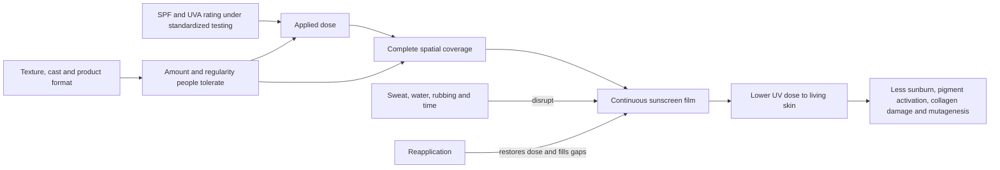
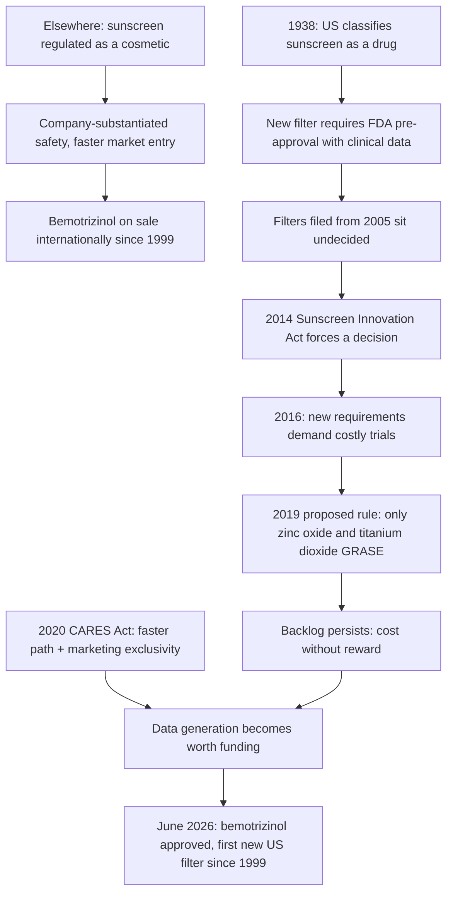

# Photoprotection

Photoprotection reduces ultraviolet (UV) dose through shade, clothing, behavior, and sunscreen. UV reaching living skin can damage DNA, generate reactive species, increase collagen-degrading enzymes, worsen uneven pigmentation, and eventually contribute to photoaging and cancer. Sunscreen performance in daily life therefore depends not only on nominal SPF but on applied amount, spatial coverage, film integrity, sweating, water, rubbing, and time. Reapplication mainly restores a film that has clumped, rubbed off, or developed gaps; filter photodegradation is not usually the dominant reason to reapply. (@LabMuffinBeautyScience (Lab Muffin Beauty Science) — "Debunking this year's top sunscreen myths", 2026-05-23, [link](https://www.youtube.com/watch?v=wATBG1X7HX4)) (@LabMuffinBeautyScience (Lab Muffin Beauty Science) — "I was wrong about sunscreen sticks (kinda)", 2026-07-14, [link](https://www.youtube.com/watch?v=NyWP_a0rICQ))

Layer compatibility is another film-integrity constraint. In a selected observational study summarized by Dr Dray, sunscreen applied over another product accounted for most pilling events and rubbing—especially linear rubbing—was associated with more rolling. The study did not measure post-pilling protection, so the effect size on SPF is unknown; nevertheless, a visibly disrupted film should not be assumed equivalent to the continuous film used in label testing. See [[skincare-pilling-and-film-compatibility]]. (@DrDrayzday (Dr Dray) — "Why Your Skincare Is Pilling (And How to Stop It)", 2026-08-18, [link](https://www.youtube.com/watch?v=NvJ3AIUW9X0))

## From label to protection

```mermaid
flowchart LR
  LABEL[SPF and UVA rating under standardized testing] --> DOSE[Applied dose]
  DOSE --> COVER[Complete spatial coverage]
  COVER --> FILM[Continuous sunscreen film]
  SWEAT[Sweat, water, rubbing and time] -->|disrupt| FILM
  RE[Reapplication] -->|restores dose and fills gaps| FILM
  FILM --> UV[Lower UV dose to living skin]
  UV --> LESS[Less sunburn, pigment activation, collagen damage and mutagenesis]
  FORM[Texture, cast and product format] --> ADHERE[Amount and regularity people tolerate]
  ADHERE --> DOSE
  ADHERE --> COVER
```

SPF is determined at a specified application mass under standardized irradiation; it is not a property guaranteed at any arbitrary real-world dose. The same starting test mass applies across lotions, sticks, powders, and sprays, even though a water-containing lotion becomes lighter after evaporation while a nearly anhydrous stick remains thick. International SPF testing uses standardized sources rather than local sunlight, so an SPF 50 is not inherently converted to SPF 15 by moving a Korean product to Australia. Actual reliability can still differ through laboratory variability, counterfeit supply, heat-damaged imports, formulation integrity, and whether water resistance matches the activity. (@LabMuffinBeautyScience (Lab Muffin Beauty Science) — "I was wrong about sunscreen sticks (kinda)", 2026-07-14, [link](https://www.youtube.com/watch?v=NyWP_a0rICQ)) (@LabMuffinBeautyScience (Lab Muffin Beauty Science) — "Debunking this year's top sunscreen myths", 2026-05-23, [link](https://www.youtube.com/watch?v=wATBG1X7HX4))

Organic and mineral filters both attenuate UV immediately; neither category needs biochemical activation or bonding to skin. The common instruction to apply before exposure is operational: it gives the vehicle time to dry into a more rub-resistant continuous film and encourages application before transit and setup have already delivered UV. Makeup should likewise wait until the sunscreen film has set enough to resist displacement. (@LabMuffinBeautyScience (Lab Muffin Beauty Science) — "Skincare myths I used to believe", 2026-03-04, [link](https://www.youtube.com/watch?v=c5ujp0KftnE))

High UVA protection matters especially for pigment control. Neither zinc oxide nor titanium dioxide is categorically superior: mineral filters mostly absorb UV and release a very small amount of heat, as organic filters do, while high-UVA organic-filter blends can outperform practical mineral-only films. Visible-light protection comes chiefly from tint pigments such as iron oxides rather than from the mineral/organic identity of the UV filters; tinted products of either type can therefore help visible-light-sensitive hyperpigmentation. This distinction and the safety dispute are developed in [[mineral-and-organic-sunscreens]]. (@LabMuffinBeautyScience (Lab Muffin Beauty Science) — "Debunking this year's top sunscreen myths", 2026-05-23, [link](https://www.youtube.com/watch?v=wATBG1X7HX4))

Tint only helps if the user can apply the tested amount in an even film. A one- or two-shade tinted sunscreen that is too dark, pink, orange, or opaque for the wearer can drive underapplication or abandonment. Foundation layered over a dried sunscreen may add visible-light attenuation, but direct comparative protection and film-interaction evidence remain limited; it is a practical fallback rather than a proven equivalent to a well-matched tinted sunscreen. (@LabMuffinBeautyScience (Lab Muffin Beauty Science) — "Products I refuse to use (as a chemist)", 2025-09-08, [link](https://www.youtube.com/watch?v=Lb8DkTzFyYI)) On the film-interaction side the news is reassuring: a recent study described by Dr Dray found that applying foundation or makeup over sunscreen not only did not compromise protection but could enhance overall photoprotection — still no replacement for the sunscreen itself, but evidence that layering on top of a set film is safe and possibly additive. (@DrDrayzday (Dr Dray) — "Anua Azelaic Acid REFORMULATED? Controversy Explained | Derm Q&A", 2026-08-22, [link](https://www.youtube.com/watch?v=1b7nGYAIktw))

Layering and mixing obey opposite rules because only one of them disturbs the film's chemistry. Reapplying with a different sunscreen than the one first applied is fine: there is no clinical concern that the filters of different products degrade each other, and the zebrafish studies occasionally cited for filter interactions do not reflect how finished sunscreens behave. What must never happen is mixing anything *into* a sunscreen before application — another sunscreen, a drop of foundation to tint it, moisturizer to thin it. A single added drop changes the formula's balance and can seriously disrupt the film-forming agents responsible for even distribution of the protective ingredients, easily rendering the product ineffective as UV protection. Two shades from the same brand are still separately tested finished products; matching labels do not establish that their iron-oxide and film-former mixtures preserve labeled protection when blended in the hand. Apply one as a complete film, allow it to set, then layer the other if needed. (@DrDrayzday (Dr Dray) — "Anua Azelaic Acid REFORMULATED? Controversy Explained | Derm Q&A", 2026-08-22, [link](https://www.youtube.com/watch?v=1b7nGYAIktw)) (@DrDrayzday (Dr Dray) — "Does Spironolactone Age Your Skin? The Truth About Collagen", 2026-08-30, [link](https://www.youtube.com/watch?v=q9Vvl_SJVNA))

Photosensitivity is a syndrome category rather than one condition. Medication reactions, autoimmune disease, polymorphic light eruption (PMLE), chronic actinic dermatitis, solar urticaria, and hereditary disorders differ in action spectrum, systemic implications, and treatment. PMLE commonly produces a recurrent itchy eruption after increasing spring or summer exposure and often settles as seasonal exposure continues; broad-spectrum sunscreen, clothing, and exposure management are first-line, while dermatologist-supervised phototherapy can deliberately induce photohardening when ordinary protection is insufficient. Hydroxychloroquine is an off-label option for selected severe or recurrent cases and requires contraindication and retinal-toxicity review; oral fern extract has weaker adjunctive evidence and never replaces surface protection. A 2021 expert review supports layered photoprotection and narrow-band UVB hardening while noting that sunscreen alone may be insufficient; medication and supplement decisions remain clinician-led.[photodermatosis review](https://pmc.ncbi.nlm.nih.gov/articles/PMC8252523/) (@DrDrayzday (Dr Dray) — "Does Spironolactone Age Your Skin? The Truth About Collagen", 2026-08-30, [link](https://www.youtube.com/watch?v=q9Vvl_SJVNA))

Photosensitive systemic disease changes the consequence of underprotection. In lupus, UV exposure can expose or release autoantigens and provoke cutaneous or systemic inflammatory flares; sunscreen is therefore one layer alongside shade, densely woven clothing, broad-brimmed hats, face coverage, and vehicle window film. No single sunscreen has been established as best for lupus. High broad-spectrum/UVA protection and tolerability matter more than a mineral label, and mineral-only products are not intrinsically more protective; direct comparative evidence in photosensitive populations remains limited. (@DrDrayzday (Dr Dray) — "Are Chemical Sunscreens Really Safe? Dermatologist Explains", 2026-08-02, [link](https://www.youtube.com/watch?v=BVnGrOMfeRM))

Indoor fluorescent lighting is a dose question with a photosensitivity exception. Intact fluorescent bulbs are coated, and provided the coating has not worn down they emit only trace UV — not enough to drive wrinkles, sagging, or photoaging from ordinary overhead distance; damaged or cracked bulbs can leak more, and a close desk lamp with a worn bulb deserves more caution than ceiling fixtures. The exception is photosensitive disease: people with lupus and similar conditions can react to fluorescent-bulb emissions. For everyone else, the comparison with solar exposure is the controlling fact — the source's phrasing is that the doses differ like a drop of sand versus an entire beach — so photoaging effort belongs on sun protection, not office lighting. (@DrDrayzday (Dr Dray) — "Dermatologist Answers Your Skincare Questions | AmLactin, Fraxel, Sunscreen & KP", 2026-08-29, [link](https://www.youtube.com/watch?v=YIQdXvlvmgA))

Systemic detection of an organic sunscreen filter after maximal-use application is an exposure finding, not by itself evidence of endocrine injury. Dr Dray's safety position is that endocrine concerns arise mainly from animal experiments using systemic doses unlike normal topical exposure, while decades of human use have not established endocrine harm. This is expert synthesis from the video rather than a new external evidence review; the regulatory and toxicological dispute is retained in [[mineral-and-organic-sunscreens]]. (@DrDrayzday (Dr Dray) — "Are Chemical Sunscreens Really Safe? Dermatologist Explains", 2026-08-02, [link](https://www.youtube.com/watch?v=BVnGrOMfeRM))

UV exposure below the threshold of visible redness can still produce characteristic UV-induced DNA mutations, so absence of sunburn is not proof of zero carcinogenic exposure. At the same time, benefit and baseline risk vary with UV index, constitutive skin pigmentation, geography, behavior, and outcome: darker skin provides meaningful natural protection and US evidence has not reliably linked sun exposure to skin cancer in Black populations, but sunscreen may still prevent sunburn, photoaging, and uneven pigment. Acral melanoma is not considered UV-driven, and improving recognition and access to diagnosis addresses late detection more directly than implying that sunscreen on exposed sites prevents all melanoma. Lab Muffin endorses a risk-stratified approach derived from Australian guidance rather than a universal cancer-prevention claim; the transcript also acknowledges that the evidence in darker skin is limited. (@LabMuffinBeautyScience (Lab Muffin Beauty Science) — "Debunking this year's top sunscreen myths", 2026-05-23, [link](https://www.youtube.com/watch?v=wATBG1X7HX4))

An antioxidant serum worn under sunscreen is an adjunct, not a substitute: sunscreen is not a complete shield, some UV always reaches the skin, and a topical antioxidant may help offset part of that transmitted dose, though antioxidant activity in a finished product is heavily formulation-dependent and unverifiable from the label. On visible light, the practical worry should stay with the sun: untinted sunscreen does not protect against visible light (iron-oxide tint does), visible light contributes to hyperpigmentation particularly in deeper skin tones, and the blue light from device screens is a minuscule dose compared with sunlight — device-screen aging anxiety is not where photoprotection effort belongs. (@DrDrayzday (Dr Dray) — "REMEDY Hydrating Serum Review: Does It Actually Work?", 2026-08-19, [link](https://www.youtube.com/watch?v=VLH7oQHDBk0))

Real-world underapplication is the strongest argument for physical protection. A skin cancer surgeon cites more than 60% of US patients as failing to apply enough sunscreen, reapply, or cover all exposed skin, and reports operating on cancers concentrated in habitually missed zones — behind and around the ears, the back and sides of the neck. His hierarchy therefore places hats, shade, and clothing above sunscreen for his own use (it is impossible to burn in full shade, while burning through sunscreen is routine), with sunscreen as the tool for skin that stays exposed — a preference ordering, not a claim that sunscreen fails when properly used. He also personalizes exposure by minimal erythemal dose: knowing how long one's own skin tolerates midday sun without reddening converts vague sun-caution into a usable threshold for when protection becomes necessary, with the caveat that sub-erythemal exposure still contributes photoaging dose. A cosmetic consequence of chronic unprotected exposure he names on forearms is idiopathic guttate hypomelanosis — small permanent white macules attributed to UV-injured melanocytes; established spots cannot be reversed, only prevented from multiplying and softened in contrast (tanning deepens the contrast). His broader safe-sun-versus-avoidance position and its contested elements live at [[skin-cancer-risk-and-immune-surveillance]] and [[teo-soleymani]]. (@maxlugavere (Max Lugavere) — "The Skin Doctor: Hair Loss, Itchy Skin, Sunscreen Myths, and Anti-Aging Truths", 2026-07-15, [link](https://www.youtube.com/watch?v=99LCstvkNVw))

Oral photoprotection supplements remain outside the evidence bar this page uses for finished sunscreens. Astaxanthin — the carotenoid pigment of salmon and shrimp, and a potent free-radical scavenger in vitro — is promoted by the same surgeon as improving objective skin appearance and showing skin-cancer-reduction signals; he co-founded Sunpowder, an astaxanthin-containing supplement, so these are commercially conflicted claims, and no independent outcome trial establishes any oral supplement as a substitute for surface protection (compare the weaker-adjunct status of oral fern extract above). Dietary carotenoids from food carry no such conflict and fit ordinary nutrition guidance ([[supplement-evidence-and-safety]], [[nutrition-evidence-and-personalization]]). (@maxlugavere (Max Lugavere) — "The Skin Doctor: Hair Loss, Itchy Skin, Sunscreen Myths, and Anti-Aging Truths", 2026-07-15, [link](https://www.youtube.com/watch?v=99LCstvkNVw))

## Format-specific performance

Hybrid sunscreens combine zinc oxide or titanium dioxide with organic filters and can offer a usability middle ground: less mineral-filter cast than many mineral-only products while retaining some mineral content. Whether a particular formula stings less, casts less, or feels lighter is a finished-product and user-specific question, not something the hybrid label guarantees. Mattifying versions may add silica to absorb surface sebum and can feel chalkier or heavier than hydrogel-like daily formulas. Filters such as Uvinul A Plus, Uvinul T 150, Tinosorb M and S, diethylhexyl butamido triazone, Mexoryl SX, and Polysilicone-15 can support broad-spectrum, photostable formulas; their regulatory status and availability differ by jurisdiction ([[mineral-and-organic-sunscreens]]). Cosmetic elegance can improve willingness to apply an adequate film consistently, but the sponsored product review cited here did not measure comparative adherence, labeled protection, counterfeit prevalence, or distributor reliability. (@DrDrayzday (Dr Dray) — "Dermatologist’s TOP Korean Skincare Picks | What’s Actually Worth It?", 2026-08-21, [link](https://www.youtube.com/watch?v=7x1UCXXw6GU))

Sunscreen sticks trade portability and clean application for two coupled errors: low product payout and discontinuous coverage. In one-person repeated tests across multiple sticks, most products delivered about half or less of the label-test amount after four passes even after visible gaps were corrected; a few soft, high-payout sticks did reach the test amount. Narrow contours helped reach the nose and eye area, wide faces reduced striping, and hard round sticks performed poorly, but day-to-day results varied even with the same trained user. The evidence is useful mechanistic and usability evidence, not a population estimate or direct SPF trial. (@LabMuffinBeautyScience (Lab Muffin Beauty Science) — "I was wrong about sunscreen sticks (kinda)", 2026-07-14, [link](https://www.youtube.com/watch?v=NyWP_a0rICQ))

Counting passes is ambiguous and not formulation-independent: softness, pressure, geometry, skin friction, and the definition of one pass all change dose. UV cameras can reveal missed areas, but they cannot infer SPF because they observe a narrow UVA band, image processing compresses differences, and SPF is nonlinear. Four camera-dark passes can therefore look complete while delivering much less than labeled protection. Lab Muffin's revised contrarian position is that a few soft sticks can deposit enough in four passes, but that this exception does not rescue a universal four-pass rule or make sticks the preferred primary format. (@LabMuffinBeautyScience (Lab Muffin Beauty Science) — "I was wrong about sunscreen sticks (kinda)", 2026-07-14, [link](https://www.youtube.com/watch?v=NyWP_a0rICQ))

A stick may add some product over intact makeup without visibly disturbing it, making it a constrained top-up when the underlying film has not been heavily sweated or washed away. It cannot be assumed to replace a full reapplication after swimming or substantial rubbing. Aerosol sprays pose a different delivery problem: distance and even light wind divert droplets, with cited face tests suggesting only about one seventh of dispensed product may land under ordinary technique; spraying into the hand or very close to skin improves capture. (@LabMuffinBeautyScience (Lab Muffin Beauty Science) — "I was wrong about sunscreen sticks (kinda)", 2026-07-14, [link](https://www.youtube.com/watch?v=NyWP_a0rICQ)) (@LabMuffinBeautyScience (Lab Muffin Beauty Science) — "Debunking this year's top sunscreen myths", 2026-05-23, [link](https://www.youtube.com/watch?v=wATBG1X7HX4))

Claims of six-hour or longer wear lack a standardized long-wear test comparable to US water-resistance testing, which uses defined immersion procedures for 40- or 80-minute claims. Manufacturer testing may be informative, but without a common protocol it does not justify abandoning ordinary reapplication guidance. Dr Dray's precautionary position is to reapply about every two hours while outdoors and after heavy sweating or water activity, even when a product advertises longer wear. (@DrDrayzday (Dr Dray) — "Is Sugar Really Bad for Your Skin? | Dermatologist Q&A", 2026-08-09, [link](https://www.youtube.com/watch?v=c0tYCBtxRO4)) Reapplication onto wet skin defeats itself: sunscreen applied over skin wet with sweat or water will not set up into a film, because sunscreen vehicles — even non-water-resistant ones — repel rather than mix with surface water. Patting the skin dry before reapplying restores film formation; water-resistant formulas hold up better during sweating, and alcohol-based gel sunscreens suit sweaty conditions specifically because they dry quickly and let sweat evaporate rather than trapping it under an occlusive cream. (@DrDrayzday (Dr Dray) — "Dermatologist Answers Your Skincare Questions | AmLactin, Fraxel, Sunscreen & KP", 2026-08-29, [link](https://www.youtube.com/watch?v=YIQdXvlvmgA))

Skin oil is one of the film disruptors. Sebum can dissolve certain UV filters and progressively compromise film formers, and sebum on the skin surface oxidizes, which may further shorten a sunscreen's effective life; formulators counter this with polymers and powders designed to withstand oily skin, but for very oily skin sebum remains one more contributor to the need to reapply over time. This is mechanism-level reasoning from an expert source rather than measured protection-loss data. (@DrDrayzday (Dr Dray) — "Can You Mix Azelaic Acid With Anything? Dermatologist Q&A", 2026-08-16, [link](https://www.youtube.com/watch?v=oyQl5MU3pRQ))

The same finished-film rule excludes homemade tallow-and-zinc mixtures and diaper-rash creams. Zinc oxide can agglomerate into microscopic clumps, leaving protection gaps that are not visible to the user; absence of sunburn in one use does not establish broad-spectrum performance. Tallow can be an inactive emollient in a properly labeled and tested sunscreen, but it does not create protection or excuse missing US drug-label elements. Rancidity and stability are additional concerns for informal preparations. (@DrDrayzday (Dr Dray) — "Are Copper Peptides Better Than Vitamin C? Dermatologist Explain", 2026-08-01, [link](https://www.youtube.com/watch?v=YuHLRmJMUzI))

Formulator credentials do not close this testing gap. A prototype's filter percentage, estimated SPF, or initial measurement cannot establish the protection of a stored consumer product because dispersion, film formation, packaging, light and heat stability, preservation, and performance over time remain coupled. For a cancer-prevention product, finished-formula SPF/UVA and stability testing are outcome controls, not optional confirmation of a calculation; a short development timeline, improvised transparent container, or refusal to disclose testing should lower confidence regardless of the maker's title. This is a safety and evidence-appraisal inference from the transcript, not an audit of any named prototype. (@LabMuffinBeautyScience (Lab Muffin Beauty Science) — "Are you falling for these skincare experts?", 2025-08-11, [link](https://www.youtube.com/watch?v=0bRpljNL7ro))

Lip photoprotection presents a formulation and adherence problem of its own. A solid stick must distribute filters uniformly during bulk manufacture and with each pass on the lips; a higher labeled SPF is useful only when the product is broad spectrum, tolerated, and reapplied after eating, drinking, or wear. The transcript proposes manufacturing difficulty as one reason high-SPF lip products are less common, but that causal market explanation is speculative. (@DrDrayzday (Dr Dray) — "TJ Maxx Skincare: Dermatologist Reviews What's Worth Buying", 2026-07-31, [link](https://www.youtube.com/watch?v=bkruuZQ_QTE))

The backs of the hands illustrate a site-specific film problem: washing, gripping, and friction remove sunscreen more often than they do from the face, while cumulative exposure contributes to collagen loss, vessel fragility, actinic keratoses, and [[actinic-purpura-and-aging-skin-fragility]]. Vehicle side windows can reduce UVB more effectively than UVA, so prolonged driving can still deliver photoaging exposure without obvious burning; sunscreen restoration or UPF gloves are practical controls. (@DrDrayzday (Dr Dray) — "Why Do My Hands Bruise So Easily? Dermatologist Explains", 2026-08-06, [link](https://www.youtube.com/watch?v=0o0bMXOL-Lo))

A lightweight daily sunscreen can be comfortable yet lack the substantivity needed for sweat, gardening, exercise, or sustained outdoor movement. Finish and nominal rating therefore do not determine activity fit: water-resistance labeling, film durability, amount, and the feasibility of reapplication must match the exposure. A sponsored reviewer's warning that one lightweight Korean formula seemed better suited to ordinary daily use is a product-specific usability inference, not a measured water-resistance comparison. (@LabMuffinBeautyScience (Lab Muffin Beauty Science) — "I tried cult Korean skincare products so you don't have to (Stylevana AD)", 2025-10-15, [link](https://www.youtube.com/watch?v=c6vcx4LIDGA))

UPF clothing replaces a rubbable, consumable film with a physical barrier and can therefore reduce missed areas and reapplication burden. Real-world protection still depends on coverage and use: breathability, stretch, vents, hand covers, face coverage, a usable hood or visor, and accommodation for hair can make a garment more wearable during heat and exercise. These are adherence features rather than proof that one brand protects better than another garment carrying an applicable UPF rating. (@LabMuffinBeautyScience (Lab Muffin Beauty Science) — "Innovative new beauty favourites (Nooance AD)", 2026-04-25, [link](https://www.youtube.com/watch?v=GBTdWi_2DD0))

## Filter availability and regulation: the bemotrizinol case

Which filters a market can legally sell shapes real-world protection as much as filter chemistry does, and the United States is the outlier case. US law has classified sunscreen as a drug since 1938 on the logic that it prevents disease, requiring FDA pre-approval with clinical safety and effectiveness data for each new filter; most other jurisdictions (the EU, Australia, Japan, New Zealand) regulate sunscreen as a cosmetic, where the company bears responsibility for safety substantiation without drug-style pre-approval. The practical consequence: the US approved no new sunscreen filter from 1999 to 2026, while filters submitted to the FDA from 2005 onward sat undecided for over a decade. The 2014 Sunscreen Innovation Act forced the FDA to act on the backlog, but the action taken was a 2016 set of application requirements demanding costly new clinical trials; the FDA's February 2019 proposed rule then recognized only zinc oxide and titanium dioxide as generally safe and effective, placing the common organic filters in a needs-more-data category. The logjam broke when the 2020 CARES Act replaced the old over-the-counter monograph process and added a marketing-exclusivity reward for companies that generate the required data — under which bemotrizinol's manufacturer completed the studies, yielding US approval on June 9, 2026 (effective August 9, 2026), the first new US filter in over a quarter century. (@DrBradStanfield (Dr Brad Stanfield) — "$12 Sunscreen Beats Every Anti-Aging Cream", 2026-06-25, [link](https://www.youtube.com/watch?v=vYgxQ9BOKng))

```mermaid
flowchart TD
  LAW38[1938: US classifies sunscreen as a drug] --> PRE[New filter requires FDA pre-approval with clinical data]
  COSM[Elsewhere: sunscreen regulated as a cosmetic] --> FAST[Company-substantiated safety, faster market entry]
  FAST --> ABROAD[Bemotrizinol on sale internationally since 1999]
  PRE --> BACKLOG[Filters filed from 2005 sit undecided]
  BACKLOG --> SIA[2014 Sunscreen Innovation Act forces a decision]
  SIA --> REQ[2016: new requirements demand costly trials]
  REQ --> R2019[2019 proposed rule: only zinc oxide and titanium dioxide GRASE]
  R2019 --> STUCK[Backlog persists: cost without reward]
  CARES[2020 CARES Act: faster path + marketing exclusivity] --> INCENT[Data generation becomes worth funding]
  STUCK --> INCENT
  INCENT --> APPR[June 2026: bemotrizinol approved, first new US filter since 1999]
```

Bemotrizinol itself matters because it decouples two properties US consumers previously had to trade off. It is an organic (carbon-based) filter, so it rubs in clear and holds up in water like other organic filters — but its molecular weight of roughly 628 puts it well past the ~500-Dalton rule of thumb above which molecules do not meaningfully penetrate the stratum corneum, so unlike the small-molecule filters (avobenzone, oxybenzone, octocrylene) that FDA maximal-use studies found crossing into blood above the agency's further-testing threshold, it essentially stays on the surface like a mineral filter. It also covers long UVA wavelengths that many US broad-spectrum products under-block and is photostable enough that formulators use it to stabilize less stable filters. It has been marketed internationally since European approval in 1999 with about 25 years of use history. These property claims are as presented by the source, a clinician summarizing the regulatory record, and consistent with the filter's international formulating reputation; this wiki has not independently reviewed the primary absorption or photostability data. The size-selectivity logic parallels the finished-film rules above: what protects is the delivered film, and what absorbs systemically is a molecule-by-molecule property, not a mineral-versus-chemical category property — the safety dispute over absorbed filters is kept at [[mineral-and-organic-sunscreens]]. (@DrBradStanfield (Dr Brad Stanfield) — "$12 Sunscreen Beats Every Anti-Aging Cream", 2026-06-25, [link](https://www.youtube.com/watch?v=vYgxQ9BOKng))

## Practical implications

- **Whenever UV protection is indicated: combine sunscreen with shade, clothing, hats, and behavior — strong.** Choose a broad-spectrum product whose finish permits a generous, even application; product elegance affects adherence and therefore effective dose. Reapply about every two hours during sustained outdoor exposure and after swimming, heavy sweating, or rubbing. (@LabMuffinBeautyScience (Lab Muffin Beauty Science) — "Debunking this year's top sunscreen myths", 2026-05-23, [link](https://www.youtube.com/watch?v=wATBG1X7HX4))
- **Before exposure: apply either mineral or organic sunscreen early enough to form an even, dry film before clothing, movement, or makeup disturbs it — strong film-formation rationale.** The wait is not chemical-filter activation time. (@LabMuffinBeautyScience (Lab Muffin Beauty Science) — "Skincare myths I used to believe", 2026-03-04, [link](https://www.youtube.com/watch?v=c5ujp0KftnE))
- **For the primary face application: prefer a lotion or cream over a stick or distant spray — moderate, based on standardized-dose logic plus small application experiments.** If a stick is the only workable option, cover every contour repeatedly and understand that a fixed pass count does not guarantee label protection. (@LabMuffinBeautyScience (Lab Muffin Beauty Science) — "I was wrong about sunscreen sticks (kinda)", 2026-07-14, [link](https://www.youtube.com/watch?v=NyWP_a0rICQ))
- **For a makeup-preserving top-up: use a stick only as a limited fallback — weak, based on two-product self-testing.** It is most defensible when the original film remains largely intact; a measured lotion patted on with a sponge is a more complete option. (@LabMuffinBeautyScience (Lab Muffin Beauty Science) — "I was wrong about sunscreen sticks (kinda)", 2026-07-14, [link](https://www.youtube.com/watch?v=NyWP_a0rICQ))
- **For melasma, post-inflammatory hyperpigmentation, or other visible-light-sensitive pigmentation: consider a well-tolerated tinted sunscreen with high UVA protection — moderate.** Iron-oxide tint, not mineral-filter status alone, supplies the relevant visible-light attenuation; dermatologic practice now recommends iron-oxide tinted products for PIH and melasma specifically because blue light within visible light is described as a meaningful pigment driver, and UV hits pigmented skin twice — upregulating melanogenesis and generating inflammation. (@LabMuffinBeautyScience (Lab Muffin Beauty Science) — "Debunking this year's top sunscreen myths", 2026-05-23, [link](https://www.youtube.com/watch?v=wATBG1X7HX4)) (@DrDrayzday (Dr Dray) — "Why Your Hyperpigmentation Won’t Go Away | Dermatologist Explains", 2026-08-13, [link](https://www.youtube.com/watch?v=DYqU1VIR3pw))
- **If available tints prevent a full, even application: use an untinted sunscreen you can apply correctly, then consider compatible foundation after the film dries — moderate for sunscreen adherence, limited for equivalence of visible-light protection.** Do not sacrifice tested sunscreen dose to force a poor shade match. (@LabMuffinBeautyScience (Lab Muffin Beauty Science) — "Products I refuse to use (as a chemist)", 2025-09-08, [link](https://www.youtube.com/watch?v=Lb8DkTzFyYI))
- **If minimizing systemic filter absorption matters to you: mineral filters (zinc oxide, titanium dioxide) are the currently shelved option, and bemotrizinol-containing formulas become a US option from August 2026 — moderate; a preference layer, not a safety requirement.** The FDA's own advice is to keep using sunscreen while absorption data on the older organic filters are completed, and detection in blood is not demonstrated harm; do not let filter anxiety reduce applied dose or regularity. (@DrBradStanfield (Dr Brad Stanfield) — "$12 Sunscreen Beats Every Anti-Aging Cream", 2026-06-25, [link](https://www.youtube.com/watch?v=vYgxQ9BOKng)) [[mineral-and-organic-sunscreens]]
- **If cast or texture prevents regular use of a mineral-only sunscreen: test a hybrid mineral-plus-organic formula as an optional compromise — transcript-based usability guidance, not comparative clinical evidence.** Cast, eye sting, and tolerability remain product- and person-specific; confirm that the formula's labeled protection and water resistance fit the exposure. (@DrDrayzday (Dr Dray) — "Dermatologist’s TOP Korean Skincare Picks | What’s Actually Worth It?", 2026-08-21, [link](https://www.youtube.com/watch?v=7x1UCXXw6GU))
- **Before reapplying on sweaty or wet skin: pat the skin dry first — strong film-formation rationale.** Prefer water-resistant products for sustained sweating, and consider an alcohol-based gel format for heavy-sweat conditions. (@DrDrayzday (Dr Dray) — "Dermatologist Answers Your Skincare Questions | AmLactin, Fraxel, Sunscreen & KP", 2026-08-29, [link](https://www.youtube.com/watch?v=YIQdXvlvmgA))
- **For high-UV, sweaty, or water activity: match water resistance and supply chain to the use case — moderate.** Use a genuine, stable product from a reliable seller; do not leave it in a hot car. A lightweight imported daily sunscreen is not automatically weak, but may be poorly matched to hiking, sport, or beach exposure. (@LabMuffinBeautyScience (Lab Muffin Beauty Science) — "Debunking this year's top sunscreen myths", 2026-05-23, [link](https://www.youtube.com/watch?v=wATBG1X7HX4))
- **For exposed hands: apply protection daily when UV exposure is meaningful and restore it after washing or rubbing — strong for lowering UV dose, moderate for preventing skin fragility.** Consider UPF gloves during long drives or outdoor work when repeated sunscreen application is impractical. (@DrDrayzday (Dr Dray) — "Why Do My Hands Bruise So Easily? Dermatologist Explains", 2026-08-06, [link](https://www.youtube.com/watch?v=0o0bMXOL-Lo))
- **For sustained outdoor activity: use comfortable UPF clothing for areas it fully covers — strong physical-barrier principle.** Choose ventilation, mobility, and coverage features that make repeated use realistic; sunscreen remains necessary on exposed skin. (@LabMuffinBeautyScience (Lab Muffin Beauty Science) — "Innovative new beauty favourites (Nooance AD)", 2026-04-25, [link](https://www.youtube.com/watch?v=GBTdWi_2DD0))
- **For lupus or another diagnosed photosensitive disorder: use layered protection whenever exposed and obtain disease-specific clinical advice — strong precaution.** Favor a tolerable broad-spectrum SPF 50+ product, but do not rely on sunscreen alone or assume mineral filters are categorically superior. (@DrDrayzday (Dr Dray) — "Are Chemical Sunscreens Really Safe? Dermatologist Explains", 2026-08-02, [link](https://www.youtube.com/watch?v=BVnGrOMfeRM))
- **For a recurrent itchy sun-triggered eruption: obtain a diagnosis rather than adding supplements empirically—strong diagnosis-first practice.** If PMLE is confirmed, use layered broad-spectrum protection during relevant seasons; discuss supervised spring phototherapy or systemic treatment only when disease burden warrants it. [photodermatosis review](https://pmc.ncbi.nlm.nih.gov/articles/PMC8252523/) (@DrDrayzday (Dr Dray) — "Does Spironolactone Age Your Skin? The Truth About Collagen", 2026-08-30, [link](https://www.youtube.com/watch?v=q9Vvl_SJVNA))
- **Never compound sunscreen at home from tallow, zinc powder, diaper cream, or another base — strong formulation-safety principle.** Use a regulated, labeled finished product with stated broad-spectrum protection and SPF. (@DrDrayzday (Dr Dray) — "Are Copper Peptides Better Than Vitamin C? Dermatologist Explain", 2026-08-01, [link](https://www.youtube.com/watch?v=YuHLRmJMUzI))
- **Never mix anything into sunscreen before applying it — strong formulation-safety principle.** Reapplying with a different sunscreen brand, or layering makeup over the dried film, is fine; dilution in the bottle or on the palm is what destroys film integrity. (@DrDrayzday (Dr Dray) — "Anua Azelaic Acid REFORMULATED? Controversy Explained | Derm Q&A", 2026-08-22, [link](https://www.youtube.com/watch?v=1b7nGYAIktw))
- **Discard expired sunscreen; an expiry of 12/26 covers use through the end of December 2026 — moderate product-safety practice.** Past expiry the preservative system fails, the formula can separate and become more irritating, and contamination becomes possible. (@DrDrayzday (Dr Dray) — "Can Adapalene Cause Facial Fat Loss? Dermatologist Q&A", 2026-08-23, [link](https://www.youtube.com/watch?v=DprHVOUpvaM))
- **Do not use an untested prototype as sunscreen because its maker has scientific credentials or quotes a predicted SPF — strong consequence-sensitive precaution, with transcript-level provenance here.** Require applicable finished-product protection and stability testing; recipe plausibility and a single early measurement do not establish durable broad-spectrum performance. (@LabMuffinBeautyScience (Lab Muffin Beauty Science) — "Are you falling for these skincare experts?", 2025-08-11, [link](https://www.youtube.com/watch?v=0bRpljNL7ro))
- **When a stick is the workable reapplication format: make multiple passes and rub the deposit into a continuous film — limited application evidence.** Portability can improve use during cycling or racing, but skip areas and underapplication remain likely, so a stick is not automatically equivalent to a measured lotion application. (@DrDrayzday (Dr Dray) — "Are Chemical Sunscreens Really Safe? Dermatologist Explains", 2026-08-02, [link](https://www.youtube.com/watch?v=BVnGrOMfeRM))

## Gaps & open questions

- How much sunscreen do diverse users deposit with each stick geometry and formula, and how does deposited mass translate to measured protection on irregular facial surfaces?
- Can a standardized, comprehensible stick instruction outperform ambiguous pass counts without making application impractically slow?
- How much protection does scheduled reapplication add when the initial application is already adequate, and which makeup-compatible method restores the most uniform film?
- How should sun-protection advice jointly model UV index, constitutive pigmentation, photoaging and pigment goals, vitamin-D needs, and region-specific skin-cancer risk?
- Which standardized protocol should substantiate long-wear claims under realistic sweat, rubbing, and outdoor exposure?
- Which filter systems and labeling metrics best predict prevention of systemic flares across lupus phenotypes and skin tones?
- How much visible-light protection does foundation add over sunscreen across pigment types, applied amounts, and realistic wear, and how often does layering disrupt the sunscreen film?
- Which tint ranges permit full labeled-dose application across skin tones, seasons, and undertones?
- Which minimum public testing disclosures best let consumers distinguish an adequately validated sunscreen from a prototype or informal formulation?
- How do finished US bemotrizinol formulations perform on delivered UVA protection, wear, and cost against the established international products, and does the exclusivity reward delay cheap generic access?

## Related

[[mineral-and-organic-sunscreens]] · [[skincare-pilling-and-film-compatibility]] · [[topical-retinoids]] · [[skin-barrier-and-moisturization]] · [[procedural-skin-remodeling]] · [[actinic-purpura-and-aging-skin-fragility]] · [[skincare-evidence-and-routine-design]] · [[cosmetic-product-safety-and-regulatory-gaps]] · [[skin-cancer-risk-and-immune-surveillance]] · [[uv-phototherapy]] · [[aging-model]] · [[practice-playbook]]
