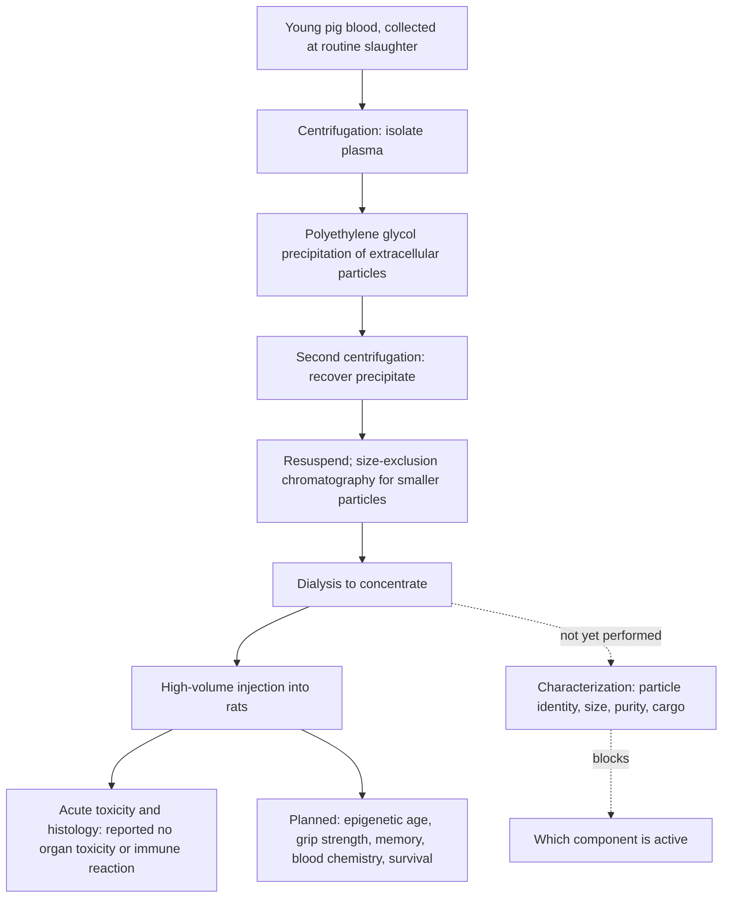

# Plasma-derived extracellular particles

A plasma-derived extracellular-particle preparation is the small-vesicle fraction of blood plasma, concentrated and injected into a recipient. It is the practical embodiment of the addition branch of [[circulating-rejuvenation-signaling]]: rather than removing putative pro-aging factors as [[therapeutic-plasma-exchange]] does, it supplies material from a young donor on the hypothesis that it carries youth-associated signals. The preparation at issue here — abbreviated PEPs, for pig plasma extracellular particles — is derived from young pigs and given to old rats, a cross-species design chosen so that a large donor animal can supply a dose large relative to a small recipient. (@TheSheekeyScienceShow (The Sheekey Science Show) — "Reproducing Rejuvenation: Inside the Pig Plasma Longevity Experiments", 2025-08-22, [link](https://www.youtube.com/watch?v=Q-lS1UMHG1o))

## What is actually in the vial

The preparation is a classical, deliberately non-selective vesicle isolation rather than a purified molecule. Plasma is separated by centrifugation; polyethylene glycol precipitates extracellular particles; a further centrifugation recovers the precipitate, which is resuspended and passed through size-exclusion chromatography to retain the smaller particles; dialysis concentrates the result. The replication group has published this protocol in a peer-reviewed journal with more procedural detail than the original description, on the explicit grounds that some elements of the original were unclear — a direct methodological contribution independent of whether the biological claim holds. (@TheSheekeyScienceShow (The Sheekey Science Show) — "Reproducing Rejuvenation: Inside the Pig Plasma Longevity Experiments", 2025-08-22, [link](https://www.youtube.com/watch?v=Q-lS1UMHG1o))

Two features distinguish this from most vesicle work and both are load-bearing. The dose is very large — considerably more small vesicles than is typical in the field — and the transfer is cross-species. Neither is incidental: the dose is what makes an effect in a recipient of very different body mass plausible, and the species crossing is what would make the underlying signal necessarily conserved rather than species-specific. (@TheSheekeyScienceShow (The Sheekey Science Show) — "Reproducing Rejuvenation: Inside the Pig Plasma Longevity Experiments", 2025-08-22, [link](https://www.youtube.com/watch?v=Q-lS1UMHG1o))

What the vial contains has not been characterized in the replication work so far. The original investigator performed a western blot confirming exosomes were present and a particle-size measurement, without extensive characterization; the replication group has likewise deferred characterization, planning it only if the efficacy experiment shows positive results, with a collaborating specialist in extracellular vesicles to lead it. The preparation may also contain ectosomes and other small particles beyond exosomes. This is the single largest interpretive limitation of the entire line of work: a preparation of unknown composition given at high dose cannot yield a mechanism even if it yields an effect, and negative results would be equally hard to attribute. (@TheSheekeyScienceShow (The Sheekey Science Show) — "Reproducing Rejuvenation: Inside the Pig Plasma Longevity Experiments", 2025-08-22, [link](https://www.youtube.com/watch?v=Q-lS1UMHG1o))

## The safety result that has been established

The first completed replication experiment tested tolerability rather than efficacy, and it answered a specific prediction of failure. Aubrey de Grey had suggested that young rats would die from an immunogenic reaction to injected cross-species material — a reasonable expectation given that a foreign-species protein and vesicle load is exactly the kind of exposure that provokes immune response. Injecting the preparation at the same high dose produced no deaths; the animals gained weight, and histological analysis found no sign of organ toxicity or immune response. (@TheSheekeyScienceShow (The Sheekey Science Show) — "Reproducing Rejuvenation: Inside the Pig Plasma Longevity Experiments", 2025-08-22, [link](https://www.youtube.com/watch?v=Q-lS1UMHG1o))

The claim this supports is narrow and should be held at exactly its size: acute tolerability in a small number of rats. It is explicitly not chronic safety, and repeated dosing over months is a different exposure — one that gives an immune system time to mount an adaptive response against foreign material that a single challenge does not. A failed prediction of acute immunogenicity is nonetheless a real result, because it removes the most obvious reason the whole approach could not work. (@TheSheekeyScienceShow (The Sheekey Science Show) — "Reproducing Rejuvenation: Inside the Pig Plasma Longevity Experiments", 2025-08-22, [link](https://www.youtube.com/watch?v=Q-lS1UMHG1o))

## The efficacy experiment and how it is designed

The rejuvenation experiment is scheduled for June 2026, its timing set by a biological constraint: the protocol requires 25-month-old Sprague-Dawley rats, animals of that age are hard to obtain, and the cohort is therefore being aged in-house at a partner university. Blood will be collected from pigs at routine slaughter — material that would otherwise be discarded. (@TheSheekeyScienceShow (The Sheekey Science Show) — "Reproducing Rejuvenation: Inside the Pig Plasma Longevity Experiments", 2025-08-22, [link](https://www.youtube.com/watch?v=Q-lS1UMHG1o))

The design improves on the original in the two ways that matter most for a replication. Sample size rises from roughly six animals to forty, arranged as four groups of ten: treated and control at 25 months to test reversal in old animals, and treated and control at seven months to test whether the preparation prevents or slows aging in younger ones. The prevention arm is a genuine addition rather than a scale-up — it asks a different question than the original experiment did. Dosing follows the original: a first dose divided across four injections on alternating days, a second dose some months later, with animals followed for five months, at which point the older cohort reaches 30 months. (@TheSheekeyScienceShow (The Sheekey Science Show) — "Reproducing Rejuvenation: Inside the Pig Plasma Longevity Experiments", 2025-08-22, [link](https://www.youtube.com/watch?v=Q-lS1UMHG1o))

Endpoints span three levels, which is the design's main methodological strength. Epigenetic age is measured in blood before and after, through Steve Horvath's foundation — deliberately matching the original measurement route so that a discrepancy cannot be attributed to a different clock. Standard blood chemistry covers liver and kidney enzymes and cholesterol. Function is assessed by grip strength and memory testing at several points. Adding functional readouts to the epigenetic one is what allows the experiment to distinguish a clock movement from a change in the animal, the distinction that [[biological-age-biomarkers]] and [[biological-age-reversal]] insist on. (@TheSheekeyScienceShow (The Sheekey Science Show) — "Reproducing Rejuvenation: Inside the Pig Plasma Longevity Experiments", 2025-08-22, [link](https://www.youtube.com/watch?v=Q-lS1UMHG1o))

If results are positive, animals are to be kept alive rather than sacrificed — the original animals were killed at five months, so no survival data exists — with dosing continued every three months for at least a further twelve months to obtain a lifespan readout. The rationale offered for prioritizing survival is communicative as much as scientific: a large percentage of epigenetic rejuvenation means little to a general audience, while a rat that outlives the maximum lifespan of its species is legible to anyone. The scientific rationale is stronger than the communicative one, since survival is an unambiguous organism-level endpoint that no biomarker can substitute for. (@TheSheekeyScienceShow (The Sheekey Science Show) — "Reproducing Rejuvenation: Inside the Pig Plasma Longevity Experiments", 2025-08-22, [link](https://www.youtube.com/watch?v=Q-lS1UMHG1o))

One sensitivity of replication deserves note because it applies well beyond this experiment: standard rodent chow differs by country in its fat source — lard in the United States, plant oils in Brazil — and a diet difference of that kind can plausibly alter results even when macronutrient composition is matched. This is a concrete illustration of why failed replications are hard to interpret, and it is an argument for pre-specifying and reporting husbandry conditions rather than only protocol steps. (@TheSheekeyScienceShow (The Sheekey Science Show) — "Reproducing Rejuvenation: Inside the Pig Plasma Longevity Experiments", 2025-08-22, [link](https://www.youtube.com/watch?v=Q-lS1UMHG1o))

## The proposed path to humans, and why it warrants caution

The stated plan is a good-laboratory-practice safety study in a specialist Brazilian facility in 2027, followed by a human trial in 2028. The regulatory reasoning given is that Brazilian regulators, following FDA and European practice, normally require testing in two species before a human trial, but that a therapy tested in one species may be used compassionately in patients with a fatal condition who have exhausted other options. (@TheSheekeyScienceShow (The Sheekey Science Show) — "Reproducing Rejuvenation: Inside the Pig Plasma Longevity Experiments", 2025-08-22, [link](https://www.youtube.com/watch?v=Q-lS1UMHG1o))

That route deserves explicit scrutiny rather than restatement. Compassionate-use pathways exist for patients whose condition is imminently fatal and for whom no alternative exists; aging is not such a condition, and a preparation whose composition is uncharacterized, whose mechanism is unknown, and whose efficacy in a single species has not yet been demonstrated is a poor fit for a pathway designed around desperate but bounded clinical decisions. The group's own stated sequencing — safety first, human use only if the rat experiment is positive and the GLP study passes — is the appropriate discipline; the risk is that a compassionate-use door becomes an early entry point for a longevity product before the ordinary evidence exists, which is precisely the pattern documented in [[longevity-clinics-and-evidence]]. Nothing in the current evidence base supports human use of this preparation for aging.

## Practical implications

- **This is not an available or advisable intervention for any person — strong.** The completed human-relevant evidence is zero; the completed animal evidence is acute tolerability in a small rat cohort. Any clinic offering plasma-derived exosome infusions for rejuvenation is selling ahead of the evidence by several years and several experiments.
- **Watch the functional and survival endpoints, not the epigenetic one — strong as an evaluation rule.** If the 2026 experiment reports only a methylation-age change without grip strength, memory, or survival differences, it will have reproduced a biomarker finding, not a rejuvenation.
- **Judge the replication by whether characterization follows — moderate.** Without knowing what the preparation contains, a positive result identifies an effect but no target, and cannot be converted into a scalable therapy.
- **No cadence can be specified.** The dosing schedule described (four injections on alternating days, repeated after some months, then quarterly) is an animal research protocol, not a human regimen.

## Gaps & open questions

- What does the preparation actually contain — which particle classes, what cargo, at what purity — and which component, if any, is active?
- Does the acute tolerability result hold under repeated cross-species dosing over a year or more, where adaptive immunity has time to develop?
- Will the enlarged replication reproduce any part of the reported epigenetic rejuvenation, and at what magnitude?
- Do functional measures (grip strength, memory) move together with any epigenetic change, or dissociate from it?
- Does the preparation slow aging in the seven-month prevention arm, which the original experiment did not test?
- How much do husbandry differences — diet fat source, housing, local rat substrain — contribute to replication success or failure?
- Could an identified active signal be synthesized, given that donor blood cannot scale to a human population?
- Is a compassionate-use route to human exposure appropriate for an intervention targeting aging rather than a specific fatal disease?

## Related

[[circulating-rejuvenation-signaling]] · [[pig-plasma-fraction-rejuvenation]] · [[therapeutic-plasma-exchange]] · [[biological-age-biomarkers]] · [[biological-age-reversal]] · [[replication-and-research-incentives]] · [[longevity-clinics-and-evidence]] · [[experimental-peptides]] · [[healthspan-versus-maximum-lifespan]] · [[longevity-intervention-prioritization]] · [[aging-model]]
