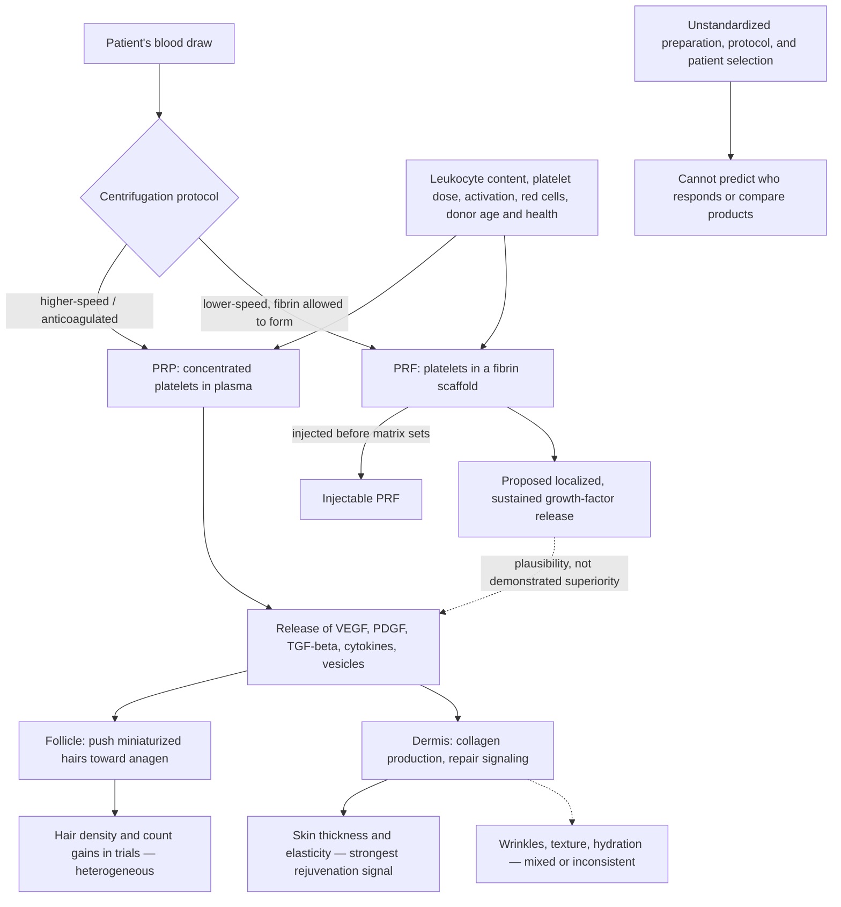

# Platelet-rich plasma and fibrin

Platelet-rich plasma (PRP) and platelet-rich fibrin (PRF) are autologous blood-derived injectables: a small volume of the patient's blood is centrifuged to concentrate platelets, and the preparation is injected back into the tissue to be treated — most often the scalp for androgenetic alopecia or the face for rejuvenation. Platelets do more than clot; they carry biologically active molecules including vascular endothelial growth factor (VEGF), platelet-derived growth factor (PDGF), and TGF-beta, which participate in blood-vessel formation, collagen production, tissue repair, and cellular signaling. Activated platelets additionally release adhesion molecules, cytokines, plasma proteins, and extracellular vesicles, so the injectate is a mixed bag of biological agents rather than a single defined drug — one reason it has been investigated across dermatology, orthopedics, and periodontal disease with unequal evidence in each. (@DrDrayzday (Dr Dray) — "PRP vs PRF: Which Is Better for Hair Loss & Skin Rejuvenation?", 2026-09-01, [link](https://www.youtube.com/watch?v=pa0XPk2UuHA))

## PRP is not one standardized product

The central interpretive problem is that PRP is not one thing. Systems differ in centrifugation steps (one versus two), leukocyte content (retained, enriched, or deliberately removed), platelet concentration, red-cell carryover, and whether platelets are activated before injection; the donor's age and health further vary the growth-factor payload, since older patients probably carry less robust platelet-derived growth-factor levels than younger ones. Two clinics can both advertise "PRP" and inject substantially different products, which makes the trial literature heterogeneous and hard to pool, and makes any single clinic's protocol claim non-transferable. (@DrDrayzday (Dr Dray) — "PRP vs PRF: Which Is Better for Hair Loss & Skin Rejuvenation?", 2026-09-01, [link](https://www.youtube.com/watch?v=pa0XPk2UuHA))

PRF differs by processing: gentler centrifugation conditions allow a fibrin network to form — a three-dimensional protein scaffold that traps platelets and growth factors locally and may release them slowly over time. Injectable PRF (i-PRF) is a liquid variant injected before the fibrin matrix sets. Clinics market PRF as next-generation PRP on the strength of this sustained-release argument, but as Dr Dray puts it, "biologically plausible doesn't mean evidence-based and it doesn't automatically make PRF superior to PRP." (@DrDrayzday (Dr Dray) — "PRP vs PRF: Which Is Better for Hair Loss & Skin Rejuvenation?", 2026-09-01, [link](https://www.youtube.com/watch?v=pa0XPk2UuHA))

## Evidence by indication

**Androgenetic alopecia** is the best-studied dermatologic use. The mechanism is coherent — growth factors may push miniaturized follicles back into the growing phase, converting vellus back toward terminal hair with gains in thickness and density. Randomized-trial syntheses now support a real average effect: a 2024 systematic review and meta-analysis of randomized trials found PRP increased hair density versus placebo; another review found several randomized studies reporting density and hair-count improvements while emphasizing heterogeneity and limited study quality; and a 2025 systematic review of 43 randomized controlled trials in nearly 1,900 participants supported PRP as a potential alopecia treatment while highlighting how much preparation and activation differences matter. The honest summary is not pure hype but not a miracle: response is unpredictable ("it's a bit of a lottery"), some people get nothing, responders need ongoing maintenance sessions, and in some cases treatment is thought to have coincided with worsening of the androgenetic alopecia. None of this substitutes for diagnosis — female pattern loss, telogen effluvium, thyroid or nutritional disease, inflammatory scalp disorders, and autoimmune loss are different diseases with different treatments, and long-standing, extensive androgenetic loss is much less likely to respond than early thinning, a stage-dependence shared with essentially all hair-loss treatments. [[hair-loss-diagnosis-and-scalp-health]] (@DrDrayzday (Dr Dray) — "PRP vs PRF: Which Is Better for Hair Loss & Skin Rejuvenation?", 2026-09-01, [link](https://www.youtube.com/watch?v=pa0XPk2UuHA))

**PRF for hair loss** is increasingly offered but rests on a much less mature base: a 2024 systematic review of injectable PRF for alopecia and facial rejuvenation found promising results across only seven studies and 130 patients, with the authors calling for larger controlled trials with longer follow-up. A clinic claiming PRF will grow hair, or that it is superior to PRP, is claiming beyond the evidence. (@DrDrayzday (Dr Dray) — "PRP vs PRF: Which Is Better for Hair Loss & Skin Rejuvenation?", 2026-09-01, [link](https://www.youtube.com/watch?v=pa0XPk2UuHA))

**Facial rejuvenation** aims not at volume but at supplying factors for collagen production and repair. A 2025 systematic review of PRP and PRF for facial rejuvenation (20 studies, 514 patients) found the strongest evidence for skin thickness and elasticity, more mixed evidence for wrinkles and texture, and particularly inconsistent hydration results; an umbrella review of systematic reviews concluded the evidence for PRP in facial rejuvenation remains insufficient for firm conclusions because underlying studies were small, uncontrolled, or protocol-divergent. There may be a real effect, but who benefits, when, and how much cannot yet be predicted. These treatments will not act as a facelift, replace lost facial volume, or substantially change under-eye hollows. [[procedural-skin-remodeling]] [[visible-skin-and-facial-aging]] (@DrDrayzday (Dr Dray) — "PRP vs PRF: Which Is Better for Hair Loss & Skin Rejuvenation?", 2026-09-01, [link](https://www.youtube.com/watch?v=pa0XPk2UuHA))

**The periorbital area** attracts interest because filler there is risky even in skilled hands and often disappointing over time, so a lower-stakes biological alternative appeals. A 2025 systematic review comparing the two found PRF showed promise for texture, wrinkles, and crepiness while PRP appeared to have stronger evidence for hyperpigmentation — but concluded neither is universally superior, noted that some PRF improvements diminished over time, and emphasized that these injections are not inherently safer than alternatives. Prominent under-eye hollows and dark circles driven by age-related volume and bone loss are structural problems that point toward surgery rather than an in-and-out aesthetic injection. (@DrDrayzday (Dr Dray) — "PRP vs PRF: Which Is Better for Hair Loss & Skin Rejuvenation?", 2026-09-01, [link](https://www.youtube.com/watch?v=pa0XPk2UuHA))

## Which is better, and is either worth the money?

No good-quality research compares PRP and PRF objectively; preparation, protocol, indication, treatment number, injection technique, and patient factors all vary, so the question has no satisfying answer yet, and paying a premium for PRF because it is newer is not evidence-based. The rational consumer position is to treat both as possible adjuncts, not replacements for established therapies — minoxidil, finasteride or dutasteride, spironolactone for hair; evidence-backed topical and procedural care for skin — and to price in maintenance: these are recurring treatments, not one-time fixes. Dr Dray's framing of the field: "the marketing has gotten way ahead of the science." A useful comparison she poses for hair loss is opportunity cost — minoxidil is cheap and established, and whether a minoxidil non-responder (whether from an enzyme-conversion issue or advanced disease) will respond to PRP is unknown, as is whether the money would be better spent on a home low-level light device. [[home-skin-photobiomodulation]] (@DrDrayzday (Dr Dray) — "PRP vs PRF: Which Is Better for Hair Loss & Skin Rejuvenation?", 2026-09-01, [link](https://www.youtube.com/watch?v=pa0XPk2UuHA))

## Practical implications

- **Before any PRP or PRF treatment for hair: establish the hair-loss diagnosis first — strong.** Growth-factor injection is only mechanistically matched to androgenetic (and possibly early, non-scarring) loss; other diagnoses need other treatments. [[hair-loss-diagnosis-and-scalp-health]] (@DrDrayzday (Dr Dray) — "PRP vs PRF: Which Is Better for Hair Loss & Skin Rejuvenation?", 2026-09-01, [link](https://www.youtube.com/watch?v=pa0XPk2UuHA))
- **For diagnosed androgenetic alopecia: treat PRP as an optional adjunct after established treatments, with better prospects in early disease — moderate for a density effect on meta-analytic randomized evidence; unpredictable at the individual level.** Expect maintenance sessions, budget for them, and accept that non-response and even worsening are described. (@DrDrayzday (Dr Dray) — "PRP vs PRF: Which Is Better for Hair Loss & Skin Rejuvenation?", 2026-09-01, [link](https://www.youtube.com/watch?v=pa0XPk2UuHA))
- **For PRF specifically: apply extra skepticism to superiority and next-generation claims — limited evidence (small studies, short follow-up).** Do not pay a premium for PRF over PRP on marketing alone. (@DrDrayzday (Dr Dray) — "PRP vs PRF: Which Is Better for Hair Loss & Skin Rejuvenation?", 2026-09-01, [link](https://www.youtube.com/watch?v=pa0XPk2UuHA))
- **For facial or under-eye rejuvenation: match expectations to the tissue deficit — limited-to-moderate for skin thickness and elasticity; mixed for wrinkles and texture; not a volume treatment.** Structural hollows and volume loss point to filler, fat transfer, or surgery decisions with a qualified clinician, each with its own risks. [[procedures-injectables-and-structural-facial-aging]] (@DrDrayzday (Dr Dray) — "PRP vs PRF: Which Is Better for Hair Loss & Skin Rejuvenation?", 2026-09-01, [link](https://www.youtube.com/watch?v=pa0XPk2UuHA))
- **Before paying, ask four questions — strong consumer practice:** what exactly is being injected and how is it prepared; how many treatments and what maintenance schedule; what evidence supports this specific protocol rather than PRP in general; and what happens if it does not work. (@DrDrayzday (Dr Dray) — "PRP vs PRF: Which Is Better for Hair Loss & Skin Rejuvenation?", 2026-09-01, [link](https://www.youtube.com/watch?v=pa0XPk2UuHA))

## Gaps & open questions

- Which preparation variables — platelet dose, leukocyte content, activation, spin protocol — actually determine clinical response, and can a standardized product be defined?
- Does PRF's fibrin scaffold produce measurably longer local growth-factor exposure in vivo, and does that translate into better outcomes than PRP in any indication?
- How do PRP and PRF compare head-to-head against minoxidil, 5-alpha-reductase inhibitors, and low-level light therapy for androgenetic alopecia, alone and as add-ons?
- Which patients account for the reported cases of androgenetic alopecia worsening after PRP, and what mechanism explains it?
- Do periorbital PRF improvements persist, and on what maintenance interval?
- What is the durability of facial skin-thickness and elasticity gains, and do they translate into patient-important appearance outcomes rather than instrument measurements? [[visible-aging-outcomes-and-evidence]]

## Related

[[hair-loss-diagnosis-and-scalp-health]] · [[procedural-skin-remodeling]] · [[procedures-injectables-and-structural-facial-aging]] · [[visible-skin-and-facial-aging]] · [[visible-aging-outcomes-and-evidence]] · [[topical-visible-aging-interventions]] · [[home-skin-photobiomodulation]] · [[post-weight-loss-skin-laxity]] · [[dr-dray]] · [[practice-playbook]]
