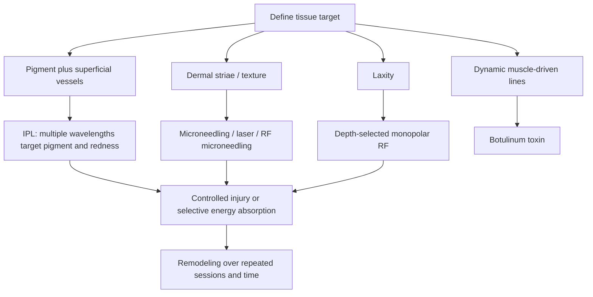

# Procedural skin remodeling

Procedural skin remodeling uses controlled light, thermal, mechanical, or neuromuscular interventions to change pigment, vessels, collagen, texture, laxity, or movement-related lines. The correct device depends on the anatomical target: broad-spectrum intense pulsed light (IPL) is not a laser; microneedling creates controlled mechanical injury; radiofrequency deposits heat at selected depths; and botulinum toxin changes muscle signaling rather than remodeling the dermis. (@DrDrayzday (Dr Dray) — "Is Sugar Really Bad for Your Skin? | Dermatologist Q&A", 2026-08-09, [link](https://www.youtube.com/watch?v=c0tYCBtxRO4)) (@DrDrayzday (Dr Dray) — "Copper Peptides, Hair Loss & Retinol Questions Answered", 2026-08-08, [link](https://www.youtube.com/watch?v=0sxHRZPDvss))

## Match the modality to the target

Poikiloderma combines hyperpigmentation, vascular redness, and dermal atrophy; poikiloderma of Civatte is a sun-associated neck pattern. IPL's broad wavelength range can target both pigment and vascular components, unlike a single-wavelength laser. A commonly described course is three to five sessions roughly four weeks apart, but response and safety depend on skin phenotype, device settings, operator skill, and the contribution of atrophy. (@DrDrayzday (Dr Dray) — "Is Sugar Really Bad for Your Skin? | Dermatologist Q&A", 2026-08-09, [link](https://www.youtube.com/watch?v=c0tYCBtxRO4))

Stretch marks are dermal scars that evolve from an early red stage, striae rubrae, to more mature pale striae albae. Early lesions are generally more modifiable; established white lesions are stubborn. Tretinoin has some support in early lesions, while evidence for hyaluronic acid and Centella is limited and oils or butters have not been shown to prevent or erase striae. Microneedling, lasers, and radiofrequency microneedling act through dermal injury and remodeling and are generally more plausible for established lesions than over-the-counter creams. (@DrDrayzday (Dr Dray) — "Copper Peptides, Hair Loss & Retinol Questions Answered", 2026-08-08, [link](https://www.youtube.com/watch?v=0sxHRZPDvss))

Dual-frequency monopolar radiofrequency systems such as ZERF are intended to heat an upper-to-mid dermal target for texture and a deeper tissue plane for tightening. This proposed depth-selective mechanism is distinct from proof of comparative effectiveness, durability, or value; the source describes use on face, neck, arms, abdomen, and thighs but does not provide controlled outcome data. (@DrDrayzday (Dr Dray) — "Copper Peptides, Hair Loss & Retinol Questions Answered", 2026-08-08, [link](https://www.youtube.com/watch?v=0sxHRZPDvss))

After botulinum toxin injection, strenuous exercise is commonly deferred for about 24 hours and inverted exercise for about 48 hours to reduce concern about unwanted spread to adjacent muscles. The source presents migration as the main rationale and longevity as secondary; the precise magnitude of risk is not established here. (@DrDrayzday (Dr Dray) — "Is Sugar Really Bad for Your Skin? | Dermatologist Q&A", 2026-08-09, [link](https://www.youtube.com/watch?v=c0tYCBtxRO4))

## Practical implications

- **Before a procedure: obtain a diagnosis, define the tissue target, and ask for device name, settings strategy, operator credentials, expected sessions, adverse effects, total cost, and alternatives — strong safety practice.** Do not treat all light devices as lasers or all tightening devices as interchangeable.
- **For poikiloderma: consider clinician-delivered IPL in a multi-session plan — moderate.** A three-to-five-session course spaced about monthly is a source-supported clinical pattern, not a universal prescription.
- **For stretch marks: discuss procedures early if appearance is distressing — moderate for procedural improvement, limited for prevention.** Do not expect moisturizers, oils, or butters to prevent genetically and mechanically driven striae.
- **After botulinum toxin: follow the injector's instructions; absent different advice, avoid strenuous exercise for 24 hours and inversions for 48 hours — limited-to-moderate.** The cadence is precautionary and the evidence strength is not established in the source.

## Gaps & open questions

- How do IPL, vascular/pigment lasers, and combination regimens compare for the components of poikiloderma across skin tones?
- Which stretch-mark procedure produces durable patient-important improvement with the lowest pigment and scarring risk?
- Does dual-frequency monopolar radiofrequency outperform established single-frequency or alternative tightening systems?
- Does early exercise materially change botulinum-toxin spread, clinical effect, or duration in controlled studies?

## Related

[[photoprotection]] · [[topical-retinoids]] · [[skin-barrier-and-moisturization]] · [[skincare-evidence-and-routine-design]] · [[glp-1-receptor-agonists]]
