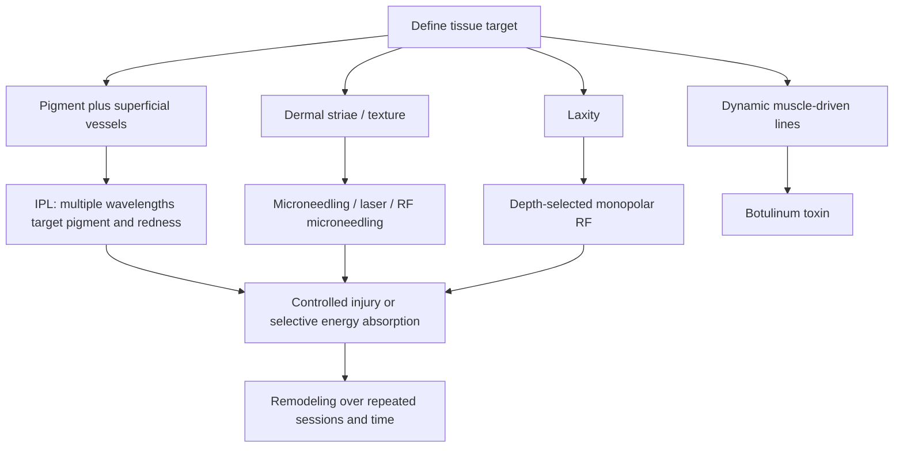

# Procedural skin remodeling

Procedural skin remodeling uses controlled light, thermal, mechanical, or neuromuscular interventions to change pigment, vessels, collagen, texture, laxity, or movement-related lines. The correct device depends on the anatomical target: broad-spectrum intense pulsed light (IPL) is not a laser; microneedling creates controlled mechanical injury; radiofrequency deposits heat at selected depths; and botulinum toxin changes muscle signaling rather than remodeling the dermis. (@DrDrayzday (Dr Dray) — "Is Sugar Really Bad for Your Skin? | Dermatologist Q&A", 2026-08-09, [link](https://www.youtube.com/watch?v=c0tYCBtxRO4)) (@DrDrayzday (Dr Dray) — "Copper Peptides, Hair Loss & Retinol Questions Answered", 2026-08-08, [link](https://www.youtube.com/watch?v=0sxHRZPDvss))

## Match the modality to the target

```mermaid
flowchart TD
  CONCERN[Define tissue target] --> PIG[Pigment plus superficial vessels]
  CONCERN --> STRIA[Dermal striae / texture]
  CONCERN --> LAX[Laxity]
  CONCERN --> DYN[Dynamic muscle-driven lines]
  PIG --> IPL[IPL: multiple wavelengths target pigment and redness]
  STRIA --> MN[Microneedling / laser / RF microneedling]
  LAX --> RF[Depth-selected monopolar RF]
  DYN --> BTX[Botulinum toxin]
  IPL --> HEAL[Controlled injury or selective energy absorption]
  MN --> HEAL
  RF --> HEAL
  HEAL --> REM[Remodeling over repeated sessions and time]
```

Poikiloderma combines hyperpigmentation, vascular redness, and dermal atrophy; poikiloderma of Civatte is a sun-associated neck pattern. IPL's broad wavelength range can target both pigment and vascular components, unlike a single-wavelength laser. A commonly described course is three to five sessions roughly four weeks apart, but response and safety depend on skin phenotype, device settings, operator skill, and the contribution of atrophy. (@DrDrayzday (Dr Dray) — "Is Sugar Really Bad for Your Skin? | Dermatologist Q&A", 2026-08-09, [link](https://www.youtube.com/watch?v=c0tYCBtxRO4))

Stretch marks are dermal scars that evolve from an early red stage, striae rubrae, to more mature pale striae albae. Early lesions are generally more modifiable; established white lesions are stubborn. Tretinoin has some support in early lesions, while evidence for hyaluronic acid and Centella is limited and oils or butters have not been shown to prevent or erase striae. Microneedling, lasers, and radiofrequency microneedling act through dermal injury and remodeling and are generally more plausible for established lesions than over-the-counter creams. (@DrDrayzday (Dr Dray) — "Copper Peptides, Hair Loss & Retinol Questions Answered", 2026-08-08, [link](https://www.youtube.com/watch?v=0sxHRZPDvss))

Dual-frequency monopolar radiofrequency systems such as ZERF are intended to heat an upper-to-mid dermal target for texture and a deeper tissue plane for tightening. This proposed depth-selective mechanism is distinct from proof of comparative effectiveness, durability, or value; the source describes use on face, neck, arms, abdomen, and thighs but does not provide controlled outcome data. (@DrDrayzday (Dr Dray) — "Copper Peptides, Hair Loss & Retinol Questions Answered", 2026-08-08, [link](https://www.youtube.com/watch?v=0sxHRZPDvss))

Ablative fractional resurfacing now includes cold variants. UltraClear is a cold ablative fractional laser that vaporizes the outermost skin layers while stimulating dermal collagen, used for photorejuvenation — fine lines, texture, uneven tone — and some acne scars. Its selling points are safety across skin types and very little downtime, which suits people who cannot step away from forward-facing work to heal; the corresponding caution is that results vary considerably between individuals and not everyone responds well. (@DrDrayzday (Dr Dray) — "Can You Mix Azelaic Acid With Anything? Dermatologist Q&A", 2026-08-16, [link](https://www.youtube.com/watch?v=oyQl5MU3pRQ))

Non-ablative fractional lasers (Fraxel, at 1550 or 1927 nm) and micropulsed 1064 nm Nd:YAG treatments (Laser Genesis) sit at different points on the benefit–risk curve, and the difference is largely melanin. Fractional wavelengths can improve surface texture, pores, and upper-dermal collagen and are well suited to atrophic acne scars; both wavelengths can be used safely in Fitzpatrick phototype IV and higher, but with a much greater likelihood of post-inflammatory hyperpigmentation, managed through operator technique — conservative settings, lower treatment densities, and often a pre-treatment regimen of hydroquinone, tretinoin, or vitamin C that further reduces the risk. The 1064 nm micropulse largely bypasses melanin, so Laser Genesis carries a very low PIH risk while offering modest collagen stimulation and microvascular targeting useful for persistent redness. For a patient without deep wrinkles or atrophic scars who already receives 1064 nm treatments, the incremental benefit of adding fractional resurfacing may not justify the added pigment risk; because these are elective cosmetic procedures, the source's advice is to make the provider quantify their own results — whether they have treated the patient's skin tone, how often they see PIH as a complication, and what the risk is in their hands. (@DrDrayzday (Dr Dray) — "Dermatologist Answers Your Skincare Questions | AmLactin, Fraxel, Sunscreen & KP", 2026-08-29, [link](https://www.youtube.com/watch?v=YIQdXvlvmgA))

Vascular lasers occupy a specific niche in pigment disease. Pulsed dye lasers such as V-Beam target hemoglobin and are the standard tool for telangiectasias and dilated vessels; because melasma has a vascular component, there is some evidence they can help melasma, but the research is conflicting and this is neither standard of care nor first-line. The risk asymmetry dominates the decision: lasers can worsen melasma, particularly at wrong settings, so treatment requires very low fluence and an experienced board-certified dermatologist — especially in deeper skin tones. [[hyperpigmentation-and-dark-spots]] (@DrDrayzday (Dr Dray) — "Can You Mix Azelaic Acid With Anything? Dermatologist Q&A", 2026-08-16, [link](https://www.youtube.com/watch?v=oyQl5MU3pRQ))

Autologous blood-derived injections — platelet-rich plasma (PRP) and platelet-rich fibrin (PRF) — isolate components of the patient's blood and reinject them to stimulate collagen ([[platelet-rich-plasma-and-fibrin]]). Under the eyes they can thicken skin, modestly soften dark circles, and improve texture, crepiness, and elasticity, but they replace nothing: hollows and smile lines driven by lost or displaced fat, bone loss, or volume deficits still require filler or fat transfer, and deep wrinkles present at rest are beyond their reach. Matching the modality to the tissue deficit — collagen quality versus volume — is the decision that matters. (@DrDrayzday (Dr Dray) — "Can Adapalene Really Prevent Wrinkles? Dermatologist Q&A", 2026-08-15, [link](https://www.youtube.com/watch?v=l30kQh-VdwI)) The systematic-review picture for facial use matches the anatomical logic: a 2025 review of 20 studies in 514 patients found the strongest evidence for skin thickness and elasticity, mixed results for wrinkles and texture, and inconsistent hydration findings, while an umbrella review judged the facial-rejuvenation evidence still insufficient for firm conclusions because studies are small, uncontrolled, or protocol-divergent. In the periorbital comparison, PRF showed promise for texture, wrinkles, and crepiness and PRP for hyperpigmentation, with neither universally superior, some PRF gains diminishing over time, and no inherent safety advantage over alternatives; both remain unstandardized preparations whose response cannot be predicted from clinic marketing. (@DrDrayzday (Dr Dray) — "PRP vs PRF: Which Is Better for Hair Loss & Skin Rejuvenation?", 2026-09-01, [link](https://www.youtube.com/watch?v=pa0XPk2UuHA))

Not every lump has a device answer. Lipomas — benign fat-cell growths — are removed only surgically (excision, occasionally liposuction depending on site and extent); no cream, lotion, or gadget removes them at home. Site drives difficulty: a forehead lipoma pops out readily once reached but sits in vascular territory where healing commonly brings extensive bruising that drains into raccoon-eye patterns. (@DrDrayzday (Dr Dray) — "Can Adapalene Really Prevent Wrinkles? Dermatologist Q&A", 2026-08-15, [link](https://www.youtube.com/watch?v=l30kQh-VdwI))

Consumer versions of these modalities carry a risk profile the professional versions manage with settings, cooling, and patient selection. At-home microneedling devices differ in quality and control from office equipment, and unwanted pigmentation is a documented outcome of home use rather than merely a technique failure by individual users; the risk concentrates in melanin-rich skin already inclined toward post-inflammatory hyperpigmentation. At-home IPL devices — often marketed for uneven tone or facial hair removal — can burn the skin and likewise trigger pigmentation, and deeper skin tones warrant particular caution with any light-based consumer device. The mechanism is the same inflammation-to-pigment pathway described in [[hyperpigmentation-and-dark-spots]]: an uncontrolled injury in predisposed skin creates the pigment problem the device was bought to fix. (@DrDrayzday (Dr Dray) — "Why Your Hyperpigmentation Won’t Go Away | Dermatologist Explains", 2026-08-13, [link](https://www.youtube.com/watch?v=DYqU1VIR3pw))

Sebaceous-gland procedures for acne, including laser- or radiofrequency-based systems, attempt to reduce sebum production by thermally injuring the gland. That target is mechanistically relevant to acne but does not establish superiority over medications, durability, suitability for every acne phenotype, or freedom from pigment and scar risk. At-home carbon-dioxide or carboxytherapy masks occupy an earlier evidence tier: small studies suggest possible circulation, wound-healing, and post-laser recovery effects, but evidence is developing and representation across deeper skin tones is limited. (@DrDrayzday (Dr Dray) — "Are Chemical Sunscreens Really Safe? Dermatologist Explains", 2026-08-02, [link](https://www.youtube.com/watch?v=BVnGrOMfeRM))

After botulinum toxin injection, strenuous exercise is commonly deferred for about 24 hours and inverted exercise for about 48 hours to reduce concern about unwanted spread to adjacent muscles. The source presents migration as the main rationale and longevity as secondary; the precise magnitude of risk is not established here. (@DrDrayzday (Dr Dray) — "Is Sugar Really Bad for Your Skin? | Dermatologist Q&A", 2026-08-09, [link](https://www.youtube.com/watch?v=c0tYCBtxRO4))

For photoaged dorsal hands, fractional laser targets pigment and collagen but can cause peeling, redness, and persistent hyperpigmentation, especially with poor skin-tone or setting selection. Office microneedling has broader skin-tone usability and modest downtime but generally requires repeated sessions and does not replace lost deep volume. Biostimulatory fillers such as calcium hydroxylapatite or poly-L-lactic acid can gradually stimulate collagen and obscure prominent veins, but cost, delay, irreversibility, and nodule risk matter in thin hand skin. Fat grafting adds volume with the patient's own tissue but combines harvesting and placement procedures and has unpredictable resorption, swelling, bruising, and asymmetry. [[actinic-purpura-and-aging-skin-fragility]] (@DrDrayzday (Dr Dray) — "Why Do My Hands Bruise So Easily? Dermatologist Explains", 2026-08-06, [link](https://www.youtube.com/watch?v=0o0bMXOL-Lo))

## Practical implications

- **Before a procedure: obtain a diagnosis, define the tissue target, and ask for device name, settings strategy, operator credentials, expected sessions, adverse effects, total cost, and alternatives — strong safety practice.** Do not treat all light devices as lasers or all tightening devices as interchangeable.
- **For poikiloderma: consider clinician-delivered IPL in a multi-session plan — moderate.** A three-to-five-session course spaced about monthly is a source-supported clinical pattern, not a universal prescription.
- **For stretch marks: discuss procedures early if appearance is distressing — moderate for procedural improvement, limited for prevention.** Do not expect moisturizers, oils, or butters to prevent genetically and mechanically driven striae.
- **For melasma with a vascular component: treat pulsed dye laser as a clinician-selected second-line option, low fluence, experienced board-certified operator only — limited/conflicting evidence, with real worsening risk.** (@DrDrayzday (Dr Dray) — "Can You Mix Azelaic Acid With Anything? Dermatologist Q&A", 2026-08-16, [link](https://www.youtube.com/watch?v=oyQl5MU3pRQ))
- **For under-eye hollows or smile lines: match the modality to the deficit — moderate anatomical logic.** PRP/PRF address skin quality (limited-to-moderate systematic-review support for thickness and elasticity; mixed for wrinkles); volume loss needs filler or fat transfer; do not buy collagen stimulation expecting volume replacement, and treat PRF-is-superior marketing as unproven. [[platelet-rich-plasma-and-fibrin]] (@DrDrayzday (Dr Dray) — "PRP vs PRF: Which Is Better for Hair Loss & Skin Rejuvenation?", 2026-09-01, [link](https://www.youtube.com/watch?v=pa0XPk2UuHA))
- **For a lipoma: see a clinician for surgical removal and skip home remedies entirely — strong.** (@DrDrayzday (Dr Dray) — "Can Adapalene Really Prevent Wrinkles? Dermatologist Q&A", 2026-08-15, [link](https://www.youtube.com/watch?v=l30kQh-VdwI))
- **Avoid at-home microneedling and at-home IPL if prone to hyperpigmentation, particularly in melanin-rich skin — strong precaution.** Office use of the same modalities under clinical control is a separate decision; consumer devices add burn and pigment risk without the settings, cooling, and selection that make professional use safer. (@DrDrayzday (Dr Dray) — "Why Your Hyperpigmentation Won’t Go Away | Dermatologist Explains", 2026-08-13, [link](https://www.youtube.com/watch?v=DYqU1VIR3pw))
- **In melanin-rich skin considering fractional laser resurfacing: require an operator experienced with the skin tone, conservative settings and densities, and discuss a pigment-suppressing pre-treatment regimen — moderate for risk reduction; the underlying PIH risk remains real.** Where redness or maintenance-level collagen stimulation is the goal, a 1064 nm micropulsed option carries far lower pigment risk; do not add higher-risk resurfacing without a defined incremental target. (@DrDrayzday (Dr Dray) — "Dermatologist Answers Your Skincare Questions | AmLactin, Fraxel, Sunscreen & KP", 2026-08-29, [link](https://www.youtube.com/watch?v=YIQdXvlvmgA))
- **After botulinum toxin: follow the injector's instructions; absent different advice, avoid strenuous exercise for 24 hours and inversions for 48 hours — limited-to-moderate.** The cadence is precautionary and the evidence strength is not established in the source.
- **For dorsal-hand photoaging or volume loss: select the procedure by target and accept the site-specific healing risk — limited-to-moderate depending on modality and endpoint.** Avoid at-home microneedling; ask an experienced clinician about pigment risk, reversibility, nodule risk, likely sessions, retention, and total cost. (@DrDrayzday (Dr Dray) — "Why Do My Hands Bruise So Easily? Dermatologist Explains", 2026-08-06, [link](https://www.youtube.com/watch?v=0o0bMXOL-Lo))

## Gaps & open questions

- How do IPL, vascular/pigment lasers, and combination regimens compare for the components of poikiloderma across skin tones?
- Which stretch-mark procedure produces durable patient-important improvement with the lowest pigment and scarring risk?
- Does dual-frequency monopolar radiofrequency outperform established single-frequency or alternative tightening systems?
- Does early exercise materially change botulinum-toxin spread, clinical effect, or duration in controlled studies?
- Which dorsal-hand intervention best improves tears, bruising, healing, and patient-important function rather than photographic appearance alone? (@DrDrayzday (Dr Dray) — "Why Do My Hands Bruise So Easily? Dermatologist Explains", 2026-08-06, [link](https://www.youtube.com/watch?v=0o0bMXOL-Lo))
- Do sebaceous-gland devices improve durable acne outcomes versus optimized standard therapy, and which phenotypes and skin tones have the best benefit–harm balance?
- Does adjunctive topical carboxytherapy improve patient-important healing outcomes beyond the mask vehicle after laser procedures?

## Related

[[photoprotection]] · [[topical-retinoids]] · [[skin-barrier-and-moisturization]] · [[skincare-evidence-and-routine-design]] · [[hyperpigmentation-and-dark-spots]] · [[actinic-purpura-and-aging-skin-fragility]] · [[platelet-rich-plasma-and-fibrin]] · [[glp-1-receptor-agonists]]
