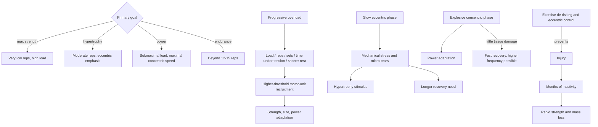
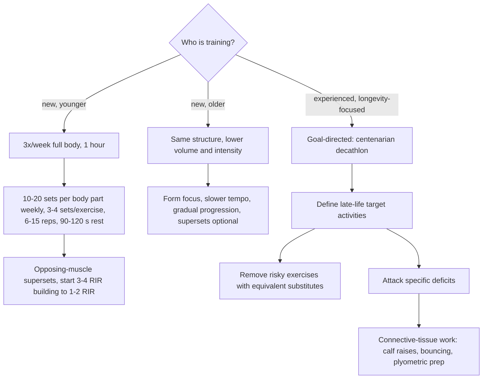

# Resistance training

> [!important] Evidence update — 2026-08-12
> The 2026 ACSM position stand synthesized 137 systematic reviews and shifts the general-health emphasis from complex optimization to consistent participation: train all major muscle groups at least twice weekly; tailor load and volume to the goal; and do not present momentary failure, a particular equipment type, or complex periodization as necessary for the average healthy adult. For optimization, ACSM highlights heavier loading near 80% 1RM for strength, about 10 weekly sets per muscle group for hypertrophy, and fast concentric work with roughly 30–70% 1RM for power. This supersedes the page's stronger source-reported implication that mostly 1–2 RIR and one hard weekly exposure are the default evidence-based prescription. ([ACSM 2026 position-stand summary](https://acsm.org/resistance-training-guidelines-update-2026/))

Resistance training is progressive loading of skeletal muscle to force adaptation in force production (strength), tissue size (hypertrophy), force-times-velocity (power), or fatigue resistance (muscular endurance). Which adaptation dominates depends on how the same underlying levers are set: a powerlifter preparing for competition (maximal strength) and a bodybuilder training for maximal hypertrophy are both lifting heavy in a gym yet doing visibly different things, and most people should sit between those extremes — strength-biased but not one-rep-max training. Three requirements underlie all of it: progressive overload recruiting progressively higher-threshold motor units (spanning type 1 slow-twitch and type 2 fast-twitch fibers), amino-acid substrate for muscle protein synthesis, and time for neurologic adaptation — motor units must learn to fire, synchronize, and be controlled, and the nervous system fatigues even when muscles feel willing. (Peter Attia MD — "Building strength and muscle mass: optimize training & nutrition for longevity (AMA #71 rebroadcast)", 2026-07-06, [link](https://www.youtube.com/watch?v=CqNqfb37gig))

## Progressive overload and intensity

Overload can be progressed through load, reps per set, sets (volume), time under tension, or shorter rest/supersetting — and the safest lever differs by exercise and person: adding weight is fine on a biceps curl but not necessarily on axially loading movements; slow tempo and pauses let a sensitive shoulder keep progressing a dumbbell press with modest loads. A novice can raise total training load (the composite of load, reps, rest, volume) roughly 5–10% per week; an advanced lifter closer to 1%. Beyond roughly 12–15 reps per set the stimulus shifts toward muscular endurance, which is a goal choice rather than an error. (Peter Attia MD — "Building strength and muscle mass: optimize training & nutrition for longevity (AMA #71 rebroadcast)", 2026-07-06, [link](https://www.youtube.com/watch?v=CqNqfb37gig))

Intensity is best managed by reps in reserve (RIR): stopping each set when one or two more reps would be possible captures nearly the same benefit as training to muscular failure with far less risk; failure itself is needed occasionally just to calibrate what 1–2 RIR feels like (learn it with a spotter or on low-consequence exercises). Technical failure — the point where another rep requires form compromise or cheating — arrives earlier and is a reasonable working boundary, though experienced bodybuilders sometimes deliberately train through it. (Peter Attia MD — "Building strength and muscle mass: optimize training & nutrition for longevity (AMA #71 rebroadcast)", 2026-07-06, [link](https://www.youtube.com/watch?v=CqNqfb37gig))

## Contraction phases and power

The concentric phase shortens muscle under force; the eccentric phase lengthens it under force. Eccentric loading can create high mechanical tension and more soreness or microscopic damage, but whether that damage independently drives hypertrophy is contested. Peter Attia's account emphasizes eccentric stress and microtears as the principal growth stimulus, whereas Mike Roberts argues that mechanical tension is primary, cites concentric-only hypertrophy and the poor relationship between soreness and growth, and treats damage mainly as a by-product. The disagreement and its programming consequences are kept in [[muscle-damage-and-hypertrophy]]; [[skeletal-muscle-hypertrophy]] explains the broader cellular pathway. (Peter Attia MD — "Building strength and muscle mass: optimize training & nutrition for longevity (AMA #71 rebroadcast)", 2026-07-06, [link](https://www.youtube.com/watch?v=CqNqfb37gig)) (@drandygalpin (Andy Galpin) — "What Drives Muscle Growth & What Doesn't | Dr. Mike Roberts", 2026-07-08, [link](https://www.youtube.com/watch?v=CoU8-R0Id-g))

Eccentric control remains valuable for maintaining control of the load and training lengthening capacity. The two phases can also be programmed partly independently: explosive pneumatic leg presses ended when output falls below 92% of peak power train the concentric side; heavy trap-bar deadlifts with the bar dropped at the top remove most eccentric work, building strength and power with little soreness and quick recovery in Attia's example. Power training (moving submaximal loads fast) beats traditional slow resistance training for power gains in the cited 13-study review because adaptation is specific to the task. Since power is the first capacity lost with age (see [[muscle-strength-and-mortality]]), some fast-concentric work belongs in every program, placed after a thorough warm-up. (Peter Attia MD — "Building strength and muscle mass: optimize training & nutrition for longevity (AMA #71 rebroadcast)", 2026-07-06, [link](https://www.youtube.com/watch?v=CqNqfb37gig))

## Exercise selection

Compound movements (squat, deadlift, presses, rows — multi-joint) are the foundation for both strength and mass; isolation work is valuable when time permits and typically follows compounds. Compound lifts are also skills: without coordination and control, strength does not translate and injury risk rises, which places them on the capacity-versus-skill map in [[strength-transfer-and-exercise-specificity]]. Bodyweight training can build muscle, especially in beginners, but many bodyweight exercises cannot reach 1 RIR in a hypertrophy-relevant rep range — pull-ups usually can, push-ups for a fit person drift into endurance territory. Machines versus free weights is a false dichotomy for novices: the Belinda Beck LIFTMOR trial taught 65-year-old women who had never touched a weight to deadlift, so with good teaching anything is learnable; machines are simply a legitimate, less intimidating on-ramp. Unilateral (single-leg/arm) work — about half of Attia's own leg-day volume — delivers comparable stimulus at a fraction of the external load while building coordination. (Peter Attia MD — "Building strength and muscle mass: optimize training & nutrition for longevity (AMA #71 rebroadcast)", 2026-07-06, [link](https://www.youtube.com/watch?v=CqNqfb37gig))

## Recovery, frequency, and overtraining

With adequate exercise selection, intensity, and volume, training each body part hard once per week can suffice even for serious bodybuilders; full-body sessions two to three times weekly suit beginners better, with deeper per-muscle-group splits emerging as experience grows (see [[training-frequency-and-hypertrophy]] for the frequency–volume evidence and the tension with daily-training demonstrations). Mike Israetel's attributed protocol is a significant deload or full week off every eighth week plus an annual two-week break; Attia's position is that most patients do not train hard enough to need scheduled deloads — life provides them via travel. The single best overtraining signal he has found is unwillingness to train assessed after warming up (distinct from desk-inertia reluctance before leaving for the gym); supporting signals are persistent unresolving soreness, declining logged performance (after accounting for known cycles such as summer heat), pain that worsens with use, and — for cardio more than lifting — a consistently low HRV with high resting heart rate measured against one's own baseline with an accurate chest-strap or arm-band device rather than wrist optics. Willingness-to-train is only usable once someone has enough experience to distinguish it from never wanting to exercise. Hormones and lifestyle set the ceiling: more testosterone means easier muscle gain in either sex; chronically elevated cortisol is catabolic (Cushing's syndrome is the extreme); harder training demands more sleep; and consistency compounds — alternating good and inconsistent months forfeits most of the gain. (Peter Attia MD — "Building strength and muscle mass: optimize training & nutrition for longevity (AMA #71 rebroadcast)", 2026-07-06, [link](https://www.youtube.com/watch?v=CqNqfb37gig))

## Programming by population

For a younger novice giving six weekly hours, one workable split is three hours of cardio plus three 1-hour full-body gym sessions (Monday/Wednesday/Friday pattern): 10–20 sets per body part per week spread across the sessions, 3–4 sets per exercise, 6–15 reps, 90–120 seconds rest, supersetting opposing muscle groups (chest with back, upper with lower) so the hour stays dense, starting at 3–4 RIR and progressing to 1–2 RIR. Supersets pair a working muscle with a resting, opposing one for time efficiency; pairing synergists (chest with triceps) pre-fatigues supporting muscles and is reserved for deliberate plateau-breaking, such as supersetting biceps curls with pull-ups. Novices who adhere see remarkable early gains. An older novice keeps the same principles at lower volume and intensity, slower tempos, heavy form emphasis, gradual progression, and possibly no supersets; assisted movements (banded pull-ups), bodyweight learning, eccentric-biased loading to keep external weight down, and machines all reduce entry risk, since joint injuries typically come from high load plus fatigue. Someone returning after decades away should act as though they have never trained. (Peter Attia MD — "Building strength and muscle mass: optimize training & nutrition for longevity (AMA #71 rebroadcast)", 2026-07-06, [link](https://www.youtube.com/watch?v=CqNqfb37gig))

The experienced trainee optimizing for longevity shifts from maximizing lifts to backcasting from the marginal decade (the centenarian-decathlon framing): define what you want to be able to do in your last decade, then train the muscles for those tasks. Concretely this means de-risking — Attia dropped conventional deadlifts after concluding the occasional fatigued or distracted rep was an unnecessary risk when hex-bar work, belt squats, and lunges load the same tissue with virtually no axial spine load, explicitly accepting that this trades some size and strength for durability — and attacking deficits, particularly muscle–tendon mismatch: Achilles ruptures typically occur when muscle capacity exceeds connective-tissue capacity in a formerly athletic person's explosive moment, so seemingly boring calf raises and bouncing/plyometric preparation are protective (see [[tendon-adaptation-and-rehabilitation]]). (Peter Attia MD — "Building strength and muscle mass: optimize training & nutrition for longevity (AMA #71 rebroadcast)", 2026-07-06, [link](https://www.youtube.com/watch?v=CqNqfb37gig))

## Women

The principles — rep ranges, RIR, progression, protein — are essentially the same for women; differences are lower-order: different strength-to-weight ratios, greater joint laxity possibly warranting more tempo and eccentric care, and, decisively, the menopausal fall in estrogen and testosterone without hormone therapy elevating sarcopenia rates, which makes resistance training more, not less, important for women. The LIFTMOR trial's heavy-lifting 60-something women improved strength, bone density, and quality of life. (Peter Attia MD — "Building strength and muscle mass: optimize training & nutrition for longevity (AMA #71 rebroadcast)", 2026-07-06, [link](https://www.youtube.com/watch?v=CqNqfb37gig))

The female muscle still responds to conventional strength and hypertrophy programming; the evidence discussed does not justify an entirely different set of methods. Across the lifespan, the reason for emphasis changes: adolescent loading builds bone and skill, perimenopausal work defends muscle quality and metabolic function, and later-life strength and power preserve recovery from slips and daily independence. Menstrual symptoms may justify recovery adjustments, but Smith-Ryan does not recommend routinely cycling resistance intensity by menstrual phase. [[womens-exercise-across-the-lifespan]] (@PeterAttiaMD (Peter Attia MD) — "378 ‒ Women’s health & performance: how training, nutrition, & hormones interact across life stages", 2026-01-05, [link](https://www.youtube.com/watch?v=CDsH60jt34o))

When only about an hour weekly is available for lifting, two 30-minute whole-body sessions can preserve exposure to the major movement patterns, provided the sets supply a genuine progressive stimulus. This is a minimal-dose expert template, not evidence that two sessions are optimal; a third may be preferable during recomposition or pharmacologic weight loss when energy and recovery permit. [[time-efficient-concurrent-training]] (@PeterAttiaMD (Peter Attia MD) — "How Busy Moms Can Build Strength and Cardio Fitness | Abbie Smith-Ryan, Ph.D.", 2026-01-07, [link](https://www.youtube.com/watch?v=9Rxp2a0m8wM))

## Practical implications

- **Train all major muscle groups at least twice weekly with a repeatable progressive program — strong.** Many loads, equipment types, and set structures work. For goal-specific optimization, emphasize heavier loading for strength, roughly 10 weekly sets per muscle group for hypertrophy, and moderate-load fast concentric work for power; training to momentary failure is optional rather than required. The 1–2 RIR, 6–15-repetition, and split-routine templates remain workable expert protocols, not universal requirements. ([ACSM 2026 position-stand summary](https://acsm.org/resistance-training-guidelines-update-2026/))
- **Control every eccentric; add deliberate slow-eccentric or time-under-tension work when joints limit load — moderate mechanistic evidence for hypertrophy, strong injury-prevention rationale.** (Peter Attia MD — "Building strength and muscle mass: optimize training & nutrition for longevity (AMA #71 rebroadcast)", 2026-07-06, [link](https://www.youtube.com/watch?v=CqNqfb37gig))
- **Include weekly explosive-concentric power work at submaximal load after warming up — moderate (13-study review for power specificity, mechanistic aging rationale).** (Peter Attia MD — "Building strength and muscle mass: optimize training & nutrition for longevity (AMA #71 rebroadcast)", 2026-07-06, [link](https://www.youtube.com/watch?v=CqNqfb37gig))
- **Use post-warm-up willingness to train, unresolving soreness, logged-performance decline, and use-worsened pain as back-off signals; compare HRV only to your own accurate baseline — expert heuristic, low formal evidence.** (Peter Attia MD — "Building strength and muscle mass: optimize training & nutrition for longevity (AMA #71 rebroadcast)", 2026-07-06, [link](https://www.youtube.com/watch?v=CqNqfb37gig))
- **From midlife on, audit each exercise's risk–reward yearly and substitute equivalent-stimulus, lower-risk variants (unilateral work, non-axial loading); add direct tendon work if returning to explosive activity — expert protocol with strong injury-avoidance rationale.** (Peter Attia MD — "Building strength and muscle mass: optimize training & nutrition for longevity (AMA #71 rebroadcast)", 2026-07-06, [link](https://www.youtube.com/watch?v=CqNqfb37gig))
- **Support training with roughly 1.6–2.4 g protein/kg/day, hydration, sleep scaled to training load, and stress control — moderate-to-strong; see [[performance-nutrition-and-hydration]] and [[creatine]].** (Peter Attia MD — "Building strength and muscle mass: optimize training & nutrition for longevity (AMA #71 rebroadcast)", 2026-07-06, [link](https://www.youtube.com/watch?v=CqNqfb37gig))

## Gaps & open questions

- Do RIR-based programs match failure training for long-term hypertrophy and strength across training ages, and how accurate is self-estimated RIR?
- What is the minimum effective and optimal power-training dose for older adults, and how much fall or fracture protection does it buy?
- Does deliberate de-risking (dropping axially loaded lifts) measurably reduce injury without meaningful strength cost, or is it over-conservative for most people?
- How should scheduled deloads be triggered — fixed cadence (Israetel) versus readiness signals (Attia) — at recreational training intensities?
- Which sex-specific programming modifications (tempo, eccentric emphasis, volume) actually change injury or hypertrophy outcomes rather than being third-order?

## Related

[[skeletal-muscle-hypertrophy]] · [[muscle-damage-and-hypertrophy]] · [[muscle-strength-and-mortality]] · [[training-frequency-and-hypertrophy]] · [[performance-nutrition-and-hydration]] · [[creatine]] · [[tendon-adaptation-and-rehabilitation]] · [[strength-transfer-and-exercise-specificity]] · [[arm-hypertrophy-specialization]] · [[lunge-biomechanics-and-programming]] · [[trunk-training]] · [[youth-resistance-training]] · [[womens-exercise-across-the-lifespan]] · [[time-efficient-concurrent-training]] · [[shoulder-force-couples-and-exercise-selection]] · [[peter-attia]] · [[aging-model]] · [[practice-playbook]]
