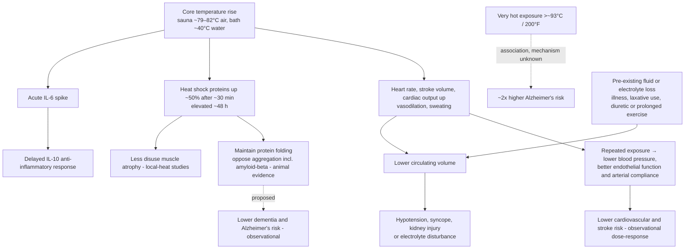

# Sauna and deliberate heat exposure

Deliberate heat exposure — traditional hot-air sauna, hot-water immersion, and related practices — imposes a cardiovascular and cellular stress whose acute physiology overlaps substantially with moderate-intensity exercise: heart rate, stroke volume, and cardiac output rise, peripheral vessels dilate, sweating begins, and blood pressure falls below baseline afterward. In a head-to-head comparison, about 15 minutes of hot sauna produced physiological responses matching about 15 minutes of stationary cycling at 100 watts, during and after the session. This exercise-mimetic framing is the mechanistic anchor for the epidemiology below, and it also bounds the claim: heat mimics moderate cardio, not vigorous training or resistance work, and it cannot load muscle or bone. (@FoundMyFitness (FoundMyFitness) — "Dr. Rhonda Patrick: Maximizing Healthspan with Exercise, Sauna, & Cold Exposure", 2026-01-22, [link](https://www.youtube.com/watch?v=OCddz_0NrEE))

## Mechanisms

Heat shock proteins are the distinctive cellular arm. They are chaperones that keep proteins in their folded three-dimensional conformation and oppose aggregation; sitting in a moderately hot sauna (~163°F / ~73°C) for about 30 minutes raises them roughly 50% over baseline, and they remain elevated about 48 hours. In animal models, elevated heat shock protein expression protects against amyloid-beta-42 aggregation, and local-heat studies in humans report on the order of 40% less muscle atrophy in an immobilized limb. Human genetics adds a dose-consistent association: variants producing a more active HSP70 gene associate with about one year of additional life expectancy per copy. All of this is mechanistic, animal, or genetic-association evidence — it supports plausibility for the dementia and healthspan associations below without proving them. ([[loss-of-proteostasis]] covers the general chaperone system.) (@FoundMyFitness (FoundMyFitness) — "Dr. Rhonda Patrick: Maximizing Healthspan with Exercise, Sauna, & Cold Exposure", 2026-01-22, [link](https://www.youtube.com/watch?v=OCddz_0NrEE))

Heat also reproduces the exercise pattern of an acute IL-6 spike followed by an IL-10-dominated anti-inflammatory response persisting days — the hormetic acute-versus-chronic distinction developed in [[inflammaging-and-il-6]]. (@FoundMyFitness (FoundMyFitness) — "Dr. Rhonda Patrick: Maximizing Healthspan with Exercise, Sauna, & Cold Exposure", 2026-01-22, [link](https://www.youtube.com/watch?v=OCddz_0NrEE))

## Evidence: Finnish cohorts and small trials

The outcome epidemiology comes overwhelmingly from Finnish prospective cohorts (Jari Laukkanen's group), where sauna is culturally ubiquitous. Relative to once-weekly use, 2–3 sessions per week associated with ~22% lower sudden cardiac death, ~24% lower all-cause mortality, ~14% lower stroke risk, and ~24% lower hypertension incidence; 4–7 sessions per week associated with ~63% lower sudden cardiac death, ~40% lower all-cause mortality, ~50% lower cardiovascular mortality, ~61% lower stroke risk, ~46% lower hypertension incidence, and ~65% lower dementia and Alzheimer's risk. Duration mattered as much as frequency: under 10 minutes per session the sudden-cardiac-death association nearly vanished (~8%), with the robust effect appearing above about 19 minutes. The associations survived adjustment for physical activity, lipids, diabetes, and diet, held in a separate cohort of people with type 2 diabetes, and show the dose–response gradient that strengthens (but cannot complete) a causal case. The cohorts are, however, largely middle-aged Finnish men using traditional saunas — generalization to other populations, sexes, and heat modalities is assumed rather than shown, and sauna frequency plausibly tracks unmeasured social and socioeconomic factors. (@FoundMyFitness (FoundMyFitness) — "Dr. Rhonda Patrick: Maximizing Healthspan with Exercise, Sauna, & Cold Exposure", 2026-01-22, [link](https://www.youtube.com/watch?v=OCddz_0NrEE))

Small interventional data corroborate the intermediate endpoints: a Laukkanen trial adding ~15 minutes of 175–179°F sauna after stationary cycling improved cardiorespiratory fitness, blood pressure, and lipid markers beyond exercise alone; single sauna sessions acutely lower blood pressure; and Finnish observational data show exercise-plus-sauna associating with longer life expectancy than exercise alone. These are biomarker and fitness endpoints, not event trials — no randomized sauna trial has measured mortality, cardiovascular events, or dementia. (@FoundMyFitness (FoundMyFitness) — "Dr. Rhonda Patrick: Maximizing Healthspan with Exercise, Sauna, & Cold Exposure", 2026-01-22, [link](https://www.youtube.com/watch?v=OCddz_0NrEE))

## Parameters, modalities, and the hotter-is-not-better boundary

The Finnish cohort parameters are ~174–179°F (79–82°C) with 20–30% humidity from water on rocks, sessions of about 20 minutes, and the dose–response above. Hot baths reproduce much of the physiology: ~104°F (40°C) water, shoulders submerged, about 20 minutes raises brain-derived neurotrophic factor and heat shock proteins and improves blood pressure across a decades-old literature. Infrared saunas reach only ~145°F (63°C) and, in a head-to-head comparison, did not reproduce the cardiovascular responses of hot sauna at matched duration; the working expectation is that roughly doubling the time (about 40–60 minutes) approaches the same effect, but direct evidence at that duration is thin. (@FoundMyFitness (FoundMyFitness) — "Dr. Rhonda Patrick: Maximizing Healthspan with Exercise, Sauna, & Cold Exposure", 2026-01-22, [link](https://www.youtube.com/watch?v=OCddz_0NrEE))

Hotter is not monotonically better. A second Finnish cohort that recorded temperature found frequent sauna use associated with ~60% lower dementia risk overall, but users of extreme temperatures — above roughly 200°F (93°C), up to 212°F — showed about a two-fold *higher* Alzheimer's risk, mechanism unknown. Rhonda Patrick's stated position is that there is no evidence for benefit above ~190°F and some evidence of potential harm, against a social-media culture of escalating sauna temperatures; she personally uses ~180°F. The general hormesis logic applies: the dose that provokes adaptation and the dose that injures are separated by less margin in heat than in most stressors, and the head is directly exposed in a sauna. (@FoundMyFitness (FoundMyFitness) — "Dr. Rhonda Patrick: Maximizing Healthspan with Exercise, Sauna, & Cold Exposure", 2026-01-22, [link](https://www.youtube.com/watch?v=OCddz_0NrEE))

As a recovery modality, heat is an additional physiological load that may increase blood flow, reduce perceived stiffness, or preserve some cardiovascular stimulus when impact exercise is temporarily unavailable. It is not automatically restorative: after prolonged work in heat or a large dehydration burden, sauna can add to the stress bucket and delay subjective recovery. Warm-water immersion also supplies hydrostatic pressure, so its effects cannot be attributed to heat alone. (@FoundMyFitness (FoundMyFitness) — "Dr. Andy Galpin: The Optimal Diet, Supplement, & Recovery Protocol for Peak Performance", 2025-04-28, [link](https://www.youtube.com/watch?v=DwtNC2A8gBk)) [[exercise-recovery-and-readiness]]

## Additive dehydration and electrolyte risk

Heat risk is compositional. Vasodilation lowers effective central blood volume while sweating removes water and electrolytes; pre-existing dehydration, diarrhea or laxative use, diuretics, prolonged exercise, acute illness, or substances that impair judgment or thermoregulation reduce the remaining margin. A 2026 emergency-medicine review groups the resulting syndromes as hypotension or syncope, heat illness, kidney injury, electrolyte disturbance, and neurological or traumatic complications.[^acute-heat-2026] CDC clinical guidance likewise identifies laxatives and diuretics as exposures that can compound heat-related volume depletion and electrolyte imbalance.[^cdc-heat-medications]

A reported Miami Beach death illustrates why each exposure cannot be evaluated in isolation: according to the medical-examiner account relayed in the staged source and contemporaneous reporting, a cleansing regimen, psychoactive drugs, and prolonged sauna exposure contributed to severe dehydration and dangerously low sodium.[^miami-case-2026] The criminal charge was pending at the evidence cutoff and does not itself establish guilt; the safety lesson rests on the additive physiology and the medical-examiner attribution, not on the legal outcome. Norton's broader position is that unsupported wellness claims stop being harmless differences of opinion when they direct people into combinations capable of serious injury or death. (@biolayne1 (Dr. Layne Norton) — "Holistic Treatment Turns Deadly in Miami | What the Fitness | Biolayne", 2026-08-21, [link](https://www.youtube.com/watch?v=c401VoJpdIA)) [[health-misinformation-and-media-incentives]]

## Practical implications

- **If accessible and tolerated, 2–4+ traditional sauna sessions weekly of about 20 minutes at ~174–180°F — moderate for cardiovascular and blood-pressure benefit (dose-responsive cohorts plus small randomized intermediate-endpoint trials); emerging for dementia and mortality (observational only).** Two sessions weekly is the apparent minimum effective dose; benefits scaled up to 4–7 sessions in the cohorts. Sessions under ~10 minutes showed little association. (@FoundMyFitness (FoundMyFitness) — "Dr. Rhonda Patrick: Maximizing Healthspan with Exercise, Sauna, & Cold Exposure", 2026-01-22, [link](https://www.youtube.com/watch?v=OCddz_0NrEE))
- **Treat heat as an addition to exercise, or a partial substitute only for those who cannot train — moderate.** The additive trial and cohort data support exercise-plus-sauna over exercise alone; nothing supports sauna replacing training in people able to train, and heat cannot maintain muscle or bone. (@FoundMyFitness (FoundMyFitness) — "Dr. Rhonda Patrick: Maximizing Healthspan with Exercise, Sauna, & Cold Exposure", 2026-01-22, [link](https://www.youtube.com/watch?v=OCddz_0NrEE))
- **No sauna: hot baths at ~104°F, shoulders down, ~20 minutes are a reasonable substitute; infrared users should plan roughly double the session time — moderate for blood pressure (long trial literature for baths), emerging for the rest.** A pool thermometer in a bathtub with hot-water top-ups is sufficient equipment. (@FoundMyFitness (FoundMyFitness) — "Dr. Rhonda Patrick: Maximizing Healthspan with Exercise, Sauna, & Cold Exposure", 2026-01-22, [link](https://www.youtube.com/watch?v=OCddz_0NrEE))
- **Do not chase extreme temperatures — moderate precaution.** Above ~200°F the only available human association runs the wrong direction (about two-fold Alzheimer's risk), and no evidence supports benefit beyond ~190°F. (@FoundMyFitness (FoundMyFitness) — "Dr. Rhonda Patrick: Maximizing Healthspan with Exercise, Sauna, & Cold Exposure", 2026-01-22, [link](https://www.youtube.com/watch?v=OCddz_0NrEE))
- **Standard heat-safety boundaries apply — strong as general precaution, not sourced from this transcript:** hydrate and replace electrolytes (sweating raises magnesium and other mineral needs), exit with dizziness or nausea, and treat pregnancy, unstable cardiovascular disease, syncope history, alcohol, and medications that impair thermoregulation or blood pressure as reasons for clinician guidance first. (@FoundMyFitness (FoundMyFitness) — "Dr. Rhonda Patrick: Maximizing Healthspan with Exercise, Sauna, & Cold Exposure", 2026-01-22, [link](https://www.youtube.com/watch?v=OCddz_0NrEE))
- **Do not enter a sauna while dehydrated or combine heat with a laxative or parasite-cleansing regimen, diuretic-driven fluid loss, prolonged heat exercise, acute illness, or intoxicating substances—strong physiological and safety guidance.** Restore fluid and electrolyte balance first; medication users should review heat interactions with a clinician rather than stopping prescribed drugs on their own. (@biolayne1 (Dr. Layne Norton) — "Holistic Treatment Turns Deadly in Miami | What the Fitness | Biolayne", 2026-08-21, [link](https://www.youtube.com/watch?v=c401VoJpdIA))[^cdc-heat-medications][^acute-heat-2026]
- **After ordinary training, heat may be used if tolerated; after long or hot sessions, do not add heat reflexively — limited recovery evidence, strong load-management logic.** Rehydrate and judge total thermal strain rather than assuming that more circulation always means faster repair. (@FoundMyFitness (FoundMyFitness) — "Dr. Andy Galpin: The Optimal Diet, Supplement, & Recovery Protocol for Peak Performance", 2025-04-28, [link](https://www.youtube.com/watch?v=DwtNC2A8gBk))

## Gaps & open questions

- No randomized trial has tested sauna against mortality, cardiovascular events, or dementia; the entire outcome layer is Finnish observational data from one research ecosystem.
- Whether the associations generalize to women (most cohorts were men), other cultures, and non-Finnish sauna practices is unmeasured.
- The mechanism of the extreme-temperature Alzheimer's association (direct head heating, cerebrovascular stress, population differences among extreme users) is unknown.
- Infrared sauna at extended durations lacks direct outcome or even robust intermediate-endpoint data; the double-the-time rule is an inference from temperature physics.
- Optimal timing relative to exercise and sleep (evening heat as a sleep aid; post-exercise sessions extending the workout stimulus) has mechanistic support but no comparative trials.
- Whether heat-shock-protein induction in humans translates to measurable proteostasis or neurodegeneration outcomes is untested.
- Quantitative stopping rules for sauna under combined fluid-loss exposures are not established, and adverse-event surveillance is much weaker than benefit epidemiology.

## References

[^acute-heat-2026]: Yanagawa Y, et al. “Acute Heat Exposure-Related Illness: A Unified Emergency Medicine Framework for Hot Baths, Hot Springs, and Saunas.” 2026. [narrative review of acute physiology and emergency presentations]. [PubMed Central](https://pmc.ncbi.nlm.nih.gov/articles/PMC12986314/)
[^cdc-heat-medications]: US Centers for Disease Control and Prevention. “Heat and Medications — Guidance for Clinicians.” 2025. [official clinical guidance]. [CDC](https://www.cdc.gov/heat-health/hcp/clinical-guidance/heat-and-medications-guidance-for-clinicians.html)
[^miami-case-2026]: Jones C. “Doctor charged with manslaughter over a year after woman died during psychedelic retreat in Miami Beach.” *CBS Miami*. 2026. [reporting from arrest warrant and medical-examiner determination]. [CBS Miami](https://www.cbsnews.com/miami/news/miami-beach-doctor-manslaughter-charge-psychedelic-retreat-death/)

## Related

[[exercise-intensity-and-health-outcomes]] · [[cardiorespiratory-fitness]] · [[exercise-recovery-and-readiness]] · [[inflammaging-and-il-6]] · [[loss-of-proteostasis]] · [[deliberate-cold-exposure]] · [[sleep-quality-and-circadian-alignment]] · [[blood-pressure-targets-and-frailty]] · [[health-misinformation-and-media-incentives]] · [[rhonda-patrick]] · [[layne-norton]] · [[aging-model]] · [[practice-playbook]]
