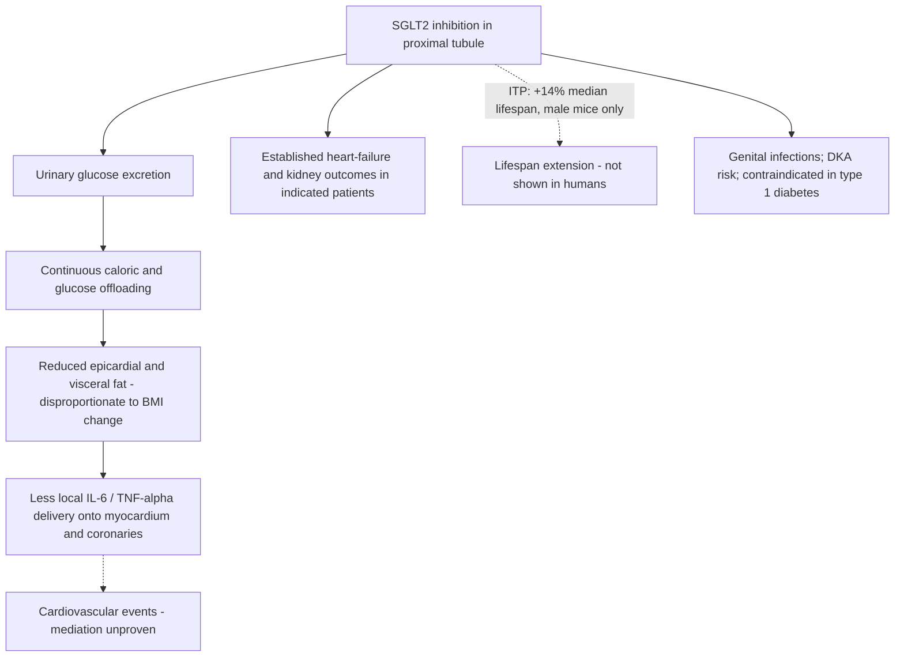

# SGLT2 inhibitors

Sodium–glucose cotransporter-2 (SGLT2) inhibitors block glucose reabsorption in the kidney's proximal tubule, so filtered glucose is excreted in urine rather than returned to blood — colloquially, they make the kidneys pee out sugar. This produces a modest continuous energy loss and glucose lowering without stimulating insulin. They are approved prescription medicines for type 2 diabetes, heart failure, and chronic kidney disease; nothing on this page makes them a general-population supplement. (@DrBradStanfield (Dr Brad Stanfield) — "$7 Pill Shrinks the Fat Around Your Heart", 2026-07-15, [link](https://www.youtube.com/watch?v=jn-HKoOUd5o))

## Epicardial fat: the striking signal

Epicardial fat sits in direct contact with the myocardium and coronary arteries and secretes inflammatory molecules straight onto them; it is the ectopic depot most plausibly coupled to coronary disease (see [[visceral-and-ectopic-fat]] for the depot itself). In the study discussed, SGLT2 inhibitors reduced epicardial fat while body-mass index fell only modestly, suggesting an effect partly independent of weight loss — and in comparative data, SGLT2 inhibitors reduced epicardial fat more than GLP-1 agonists and more than exercise. These are imaging endpoints in indicated (largely diabetic) populations, not proof that shrinking the depot reduces events through that route. (@DrBradStanfield (Dr Brad Stanfield) — "$7 Pill Shrinks the Fat Around Your Heart", 2026-07-15, [link](https://www.youtube.com/watch?v=jn-HKoOUd5o))

Corroborating corpus evidence: SGLT2 inhibitors reduce visceral and pericardial fat in indicated populations and may preserve lean mass; rare serious genital infection is a specific class concern, and the class is contraindicated in type 1 diabetes. (@DrBradStanfield (Dr Brad Stanfield) — "Fastest Way to Lose Visceral Fat Without Starving", 2026-08-04, [link](https://www.youtube.com/watch?v=KljR2O7DqOk))

## The longevity hypothesis

The class attracts longevity attention because the NIA Interventions Testing Program — the multi-site mouse-lifespan program that also validated rapamycin — found an SGLT2 inhibitor extended male mouse lifespan by 14%; the source emphasizes this is mouse data to take with a massive pinch of salt, and the effect was male-only. No human lifespan or healthspan trial exists. The epistemic situation parallels [[mtor-and-rapamycin]] and the GLP-1 "longevity drug" debate: coherent mechanism, real preclinical signal, established benefit only for indicated disease. A personal-use anecdote (Matt Kaeberlein's A1c improvement) is already bounded on [[proactive-health-monitoring]]: movement toward a self-selected biomarker target is not an indication. (@DrBradStanfield (Dr Brad Stanfield) — "$7 Pill Shrinks the Fat Around Your Heart", 2026-07-15, [link](https://www.youtube.com/watch?v=jn-HKoOUd5o))

## Practical implications

Use only for an approved indication with a prescriber — strong for diabetes, heart-failure, and kidney outcomes in those populations, per regulatory labeling. The source prescribes them to diabetic and chronic-kidney-disease patients partly on the epicardial-fat rationale; that added rationale is investigational even where the indication is established. Off-label use for fat reduction or longevity in healthy people is `Investigational practice` with no outcome evidence and real adverse-effect exposure (genital infections; diabetic ketoacidosis risk in susceptible states). Diet, exercise, and sleep remain first-line for epicardial and visceral fat. (@DrBradStanfield (Dr Brad Stanfield) — "$7 Pill Shrinks the Fat Around Your Heart", 2026-07-15, [link](https://www.youtube.com/watch?v=jn-HKoOUd5o))

## Gaps & open questions

- Is the epicardial-fat reduction genuinely weight-independent, and does it mediate any cardiovascular-event benefit?
- Why was the ITP lifespan effect male-only, and does it depend on glycemic state?
- Would SGLT2 inhibition produce net benefit in normoglycemic humans, or do the class harms dominate without hyperglycemia to correct?
- How do SGLT2 inhibitors and GLP-1 agonists compare — or combine — on hard cardiovascular outcomes rather than fat-depot imaging?

## Related

[[visceral-and-ectopic-fat]] · [[glp-1-receptor-agonists]] · [[inflammaging-and-il-6]] · [[mtor-and-rapamycin]] · [[proactive-health-monitoring]] · [[brad-stanfield]] · [[practice-playbook]] · [[aging-model]]
