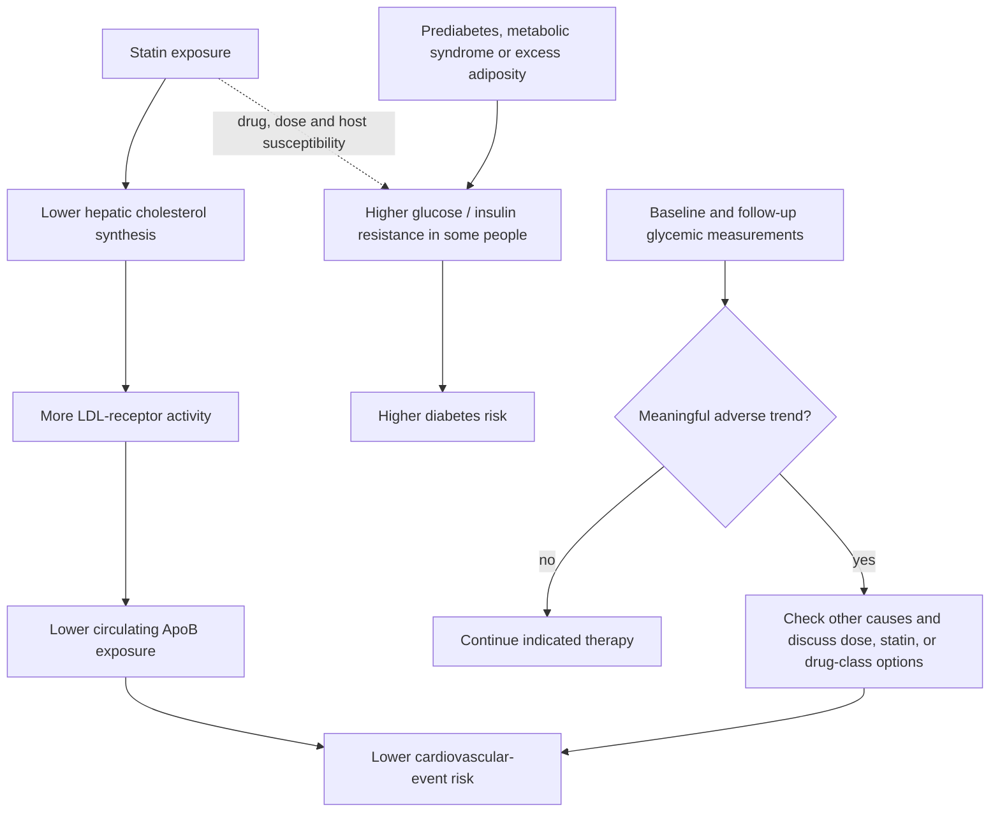

# Statins and glycemic risk

Statins inhibit hepatic HMG-CoA reductase, reduce cholesterol synthesis, increase LDL-receptor activity, and lower circulating atherogenic particles. Their clinical purpose is not merely to improve a lipid number: multiple statins reduce myocardial infarction, stroke, and mortality in randomized trials. A small increase in glucose, insulin resistance, or incident diabetes can nevertheless occur, especially with greater baseline metabolic susceptibility and, generally, more intensive exposure. The appropriate comparison is therefore total cardiovascular benefit versus glycemic harm, not cholesterol reduction versus a laboratory side effect. (@NutritionMadeSimple (Nutrition Made Simple!) — "The Common Pill That Raises your Risk of Diabetes (And How to Avoid it)", 2026-06-04, [link](https://www.youtube.com/watch?v=VLc1_vLZUSk)) [[lipoprotein-retention-and-atherogenesis]]

## Mechanism and decision structure

Hemoglobin A1c estimates average glycemic exposure over roughly three months, so serial change can reveal an individual response that fasting glucose alone misses. A rise after treatment is not automatically causal: weight change, illness, altered activity, diet, measurement variation, anemia, and other influences must be considered. Dechallenge and, when clinically appropriate, an alternative regimen can strengthen an individual causal inference, but a single-person response does not estimate population frequency. (@NutritionMadeSimple (Nutrition Made Simple!) — "The Common Pill That Raises your Risk of Diabetes (And How to Avoid it)", 2026-06-04, [link](https://www.youtube.com/watch?v=VLc1_vLZUSk)) [[proactive-health-monitoring]]

## Heterogeneity within and beyond the class

Statins differ in potency, metabolism, interactions, and apparent glycemic effect. The source presents pitavastatin as an outcome-validated statin that may be milder on glucose metabolism than rosuvastatin or atorvastatin, while emphasizing that the choice remains individualized rather than universally superior. Its illustrative self-experiment—replacing rosuvastatin 5 mg with pitavastatin 2 mg while retaining ezetimibe 10 mg—was followed by A1c returning from 5.5% to 5.2% with LDL-C and non-HDL-C remaining low. This is a clinically coherent dechallenge/substitution observation, not a randomized comparison or a protocol transferable without a prescriber. (@NutritionMadeSimple (Nutrition Made Simple!) — "The Common Pill That Raises your Risk of Diabetes (And How to Avoid it)", 2026-06-04, [link](https://www.youtube.com/watch?v=VLc1_vLZUSk))

Combination therapy can reduce the statin dose required for a given ApoB reduction. [[ezetimibe]] blocks intestinal cholesterol absorption; PCSK9 inhibitors preserve LDL-receptor recycling; bempedoic acid and ezetimibe can serve some people who cannot tolerate statins. These are not interchangeable by mechanism, cost, indication, or outcome evidence, but they create alternatives to simply abandoning risk reduction after an adverse response. Supplements that lower LDL-C or a plaque surrogate do not become equivalent substitutes unless they also demonstrate favorable clinical outcomes and adequate safety. (@NutritionMadeSimple (Nutrition Made Simple!) — "The Common Pill That Raises your Risk of Diabetes (And How to Avoid it)", 2026-06-04, [link](https://www.youtube.com/watch?v=VLc1_vLZUSk)) [[pcsk9-inhibition]] [[nattokinase]]

## Evidence interpretation

The strongest evidence supports statins' net cardiovascular benefit in appropriately selected patients, including populations with diabetes or elevated diabetes risk. Evidence that glycemic effects vary by molecule and person is meaningful but less decisive for selecting one universal statin. The source's distinctive position is that personalization should preserve outcome-proven cardiovascular protection while avoiding an adverse glycemic trade-off when a monitored, evidence-based alternative achieves both aims; stopping treatment and doing nothing would usually be the wrong inference. (@NutritionMadeSimple (Nutrition Made Simple!) — "The Common Pill That Raises your Risk of Diabetes (And How to Avoid it)", 2026-06-04, [link](https://www.youtube.com/watch?v=VLc1_vLZUSk))

## Practical implications

- **Before starting or intensifying therapy: establish cardiovascular indication, ApoB or an appropriate lipid baseline, and glycemic context — strong for risk-based prescribing; moderate for the exact monitoring panel.** Include fasting glucose or A1c when diabetes risk or longitudinal interpretation makes it useful. (@NutritionMadeSimple (Nutrition Made Simple!) — "The Common Pill That Raises your Risk of Diabetes (And How to Avoid it)", 2026-06-04, [link](https://www.youtube.com/watch?v=VLc1_vLZUSk))
- **After initiation or a regimen change: reassess lipids and glycemia after a few months, then periodically according to risk and prior stability — moderate.** Interpret the trend alongside weight, diet, activity, illness, and assay variability rather than reacting to one isolated value. (@NutritionMadeSimple (Nutrition Made Simple!) — "The Common Pill That Raises your Risk of Diabetes (And How to Avoid it)", 2026-06-04, [link](https://www.youtube.com/watch?v=VLc1_vLZUSk))
- **If glycemia worsens: do not stop an indicated statin without a replacement plan — strong decision principle.** Discuss alternative doses, another outcome-validated statin, or combination/nonstatin therapy, then remeasure both atherogenic-particle exposure and glycemia. (@NutritionMadeSimple (Nutrition Made Simple!) — "The Common Pill That Raises your Risk of Diabetes (And How to Avoid it)", 2026-06-04, [link](https://www.youtube.com/watch?v=VLc1_vLZUSk))
- **Do not replace outcome-proven therapy with a supplement solely because it lowers cholesterol or a plaque surrogate — strong evidentiary principle.** Clinical events, harms, formulation, and interactions remain necessary links. (@NutritionMadeSimple (Nutrition Made Simple!) — "The Common Pill That Raises your Risk of Diabetes (And How to Avoid it)", 2026-06-04, [link](https://www.youtube.com/watch?v=VLc1_vLZUSk))

## Gaps & open questions

- Which patient characteristics predict a clinically important glycemic response at low statin doses?
- How much do molecule-specific glycemic differences persist when ApoB lowering is matched?
- Does switching statins reduce long-term diabetes incidence while preserving equivalent cardiovascular protection in susceptible individuals?
- What monitoring cadence detects meaningful change without overreacting to ordinary A1c variation?
- When is low-dose combination therapy preferable to higher-intensity statin monotherapy for primary prevention?

## Related

[[lipoprotein-retention-and-atherogenesis]] · [[ezetimibe]] · [[pcsk9-inhibition]] · [[nattokinase]] · [[proactive-health-monitoring]] · [[supplement-evidence-and-safety]] · [[aging-model]] · [[practice-playbook]]
