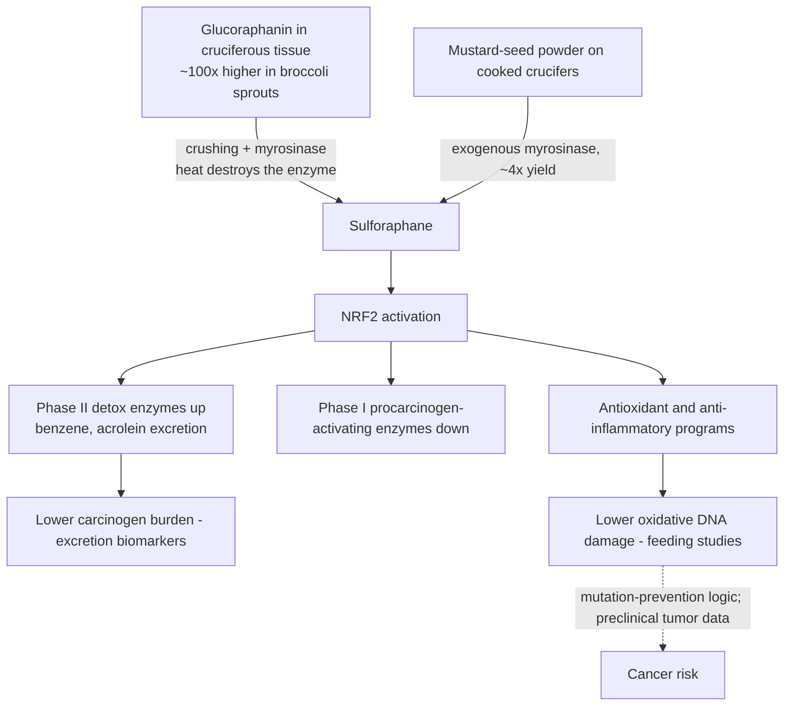

# Sulforaphane and cruciferous vegetables

Sulforaphane is an isothiocyanate formed — not stored — in cruciferous vegetables: the plant holds the precursor glucoraphanin, and crushing or chewing the tissue lets the enzyme myrosinase convert it to sulforaphane. Its claimed importance rests on being among the most potent dietary activators of NRF2, the transcription factor governing hundreds of cytoprotective genes: phase II detoxification enzymes are induced, phase I biotransformation enzymes (which can convert procarcinogens into active carcinogens) are suppressed, and antioxidant and anti-inflammatory programs are upregulated. The human evidence sits almost entirely at the biomarker level — DNA-damage markers, carcinogen excretion, one prostate-cancer surrogate trial — with the cancer-prevention claim carried by preclinical work. (@FoundMyFitness (FoundMyFitness) — "Dr. Rhonda Patrick: Optimizing Longevity with Micronutrients & Vigorous Exercise", 2025-11-05, [link](https://www.youtube.com/watch?v=JelnAdNFL2M))

## Mechanism and human biomarker evidence

Human feeding studies move oxidative-DNA-damage markers: 85 g/day of watercress for 8 weeks lowered oxidative DNA damage about 24%; ~250 g/day of broccoli lowered oxidized DNA lesions about 41%; 300 g/day of Brussels sprouts lowered another oxidative-damage marker roughly 30%. These are whole-food studies, so attribution to sulforaphane specifically (versus fiber, other glucosinolates, or displaced foods) is partial. Detoxification trials are more compound-specific: in polluted-air settings in China, a broccoli-sprout preparation (~40 µmol/day) increased urinary excretion of benzene about 60% within 24 hours, with parallel findings for acrolein — rapid-onset, mechanistically coherent, but excretion biomarkers rather than disease endpoints. In men with low-grade prostate cancer, about 60 mg/day of sulforaphane slowed PSA doubling by about 86% — a surrogate-marker trial in a monitored disease state, not a prevention outcome. Preclinical breadth (prostate, breast, colon models; reduced tumor growth and metastasis) is described as extensive and consistent, and the DNA-damage-to-mutation-to-late-life-cancer chain gives the prevention hypothesis its logic; none of it substitutes for cancer-incidence evidence in humans. (@FoundMyFitness (FoundMyFitness) — "Dr. Rhonda Patrick: Optimizing Longevity with Micronutrients & Vigorous Exercise", 2025-11-05, [link](https://www.youtube.com/watch?v=JelnAdNFL2M)) [[genomic-instability-and-dna-repair]] [[colorectal-cancer-prevention-and-screening]]

## Sources and preparation

Broccoli sprouts carry on the order of 100 times more glucoraphanin than mature broccoli; roughly 45–100 g/day of sprouts approximates the study doses. Cooking destroys myrosinase, so cooked crucifers yield less sulforaphane unless an exogenous enzyme source is added — mustard-seed powder sprinkled on lightly cooked vegetables is described as restoring conversion roughly four-fold. Stabilized sulforaphane supplements exist; supplement-quality and standardization caveats from [[supplement-evidence-and-safety]] apply. (@FoundMyFitness (FoundMyFitness) — "Dr. Rhonda Patrick: Optimizing Longevity with Micronutrients & Vigorous Exercise", 2025-11-05, [link](https://www.youtube.com/watch?v=JelnAdNFL2M))

## Practical implications

- **Eat cruciferous vegetables regularly as part of the plant-forward pattern — strong for the dietary pattern, emerging for sulforaphane-specific chemoprevention.** The whole-food recommendation stands on general dietary evidence; the sulforaphane mechanism is a plausible bonus, not the proven active ingredient. [[nutrition-evidence-and-personalization]]
- **To maximize sulforaphane specifically: raw or lightly cooked crucifers, broccoli sprouts (~45–100 g/day), or mustard-seed powder over cooked vegetables — emerging; biomarker evidence only.** (@FoundMyFitness (FoundMyFitness) — "Dr. Rhonda Patrick: Optimizing Longevity with Micronutrients & Vigorous Exercise", 2025-11-05, [link](https://www.youtube.com/watch?v=JelnAdNFL2M))
- **Investigational practice: sulforaphane supplementation (~40 µmol/day) during high air-pollution or smoke exposure to increase carcinogen excretion — excretion-biomarker trials only; no evidence the extra excretion changes disease risk.** Reducing exposure itself remains the established action ([[environmental-pollution-and-health]]). (@FoundMyFitness (FoundMyFitness) — "Dr. Rhonda Patrick: Optimizing Longevity with Micronutrients & Vigorous Exercise", 2025-11-05, [link](https://www.youtube.com/watch?v=JelnAdNFL2M))
- **Do not use sulforaphane in place of cancer screening or treatment — strong.** The prostate finding is a PSA-kinetics surrogate in monitored low-grade disease; it does not establish treatment or prevention efficacy. [[colorectal-cancer-prevention-and-screening]] [[cancer-screening-and-overdiagnosis]]

## Gaps & open questions

- No randomized or even prospective-cohort evidence ties sulforaphane dose to cancer incidence in humans; the chain stops at biomarkers.
- How much of the whole-food DNA-damage effect is attributable to sulforaphane versus the rest of the cruciferous matrix?
- Does increased carcinogen excretion under pollution exposure translate to any measurable health difference?
- Supplement standardization: how do stabilized-sulforaphane and glucoraphanin-plus-myrosinase products compare with sprouts on delivered dose?
- Does the PSA-doubling effect replicate, and does it change progression-to-treatment or mortality in active-surveillance populations?

## Related

[[nutrition-evidence-and-personalization]] · [[genomic-instability-and-dna-repair]] · [[colorectal-cancer-prevention-and-screening]] · [[environmental-pollution-and-health]] · [[supplement-evidence-and-safety]] · [[rhonda-patrick]] · [[aging-model]] · [[practice-playbook]]
