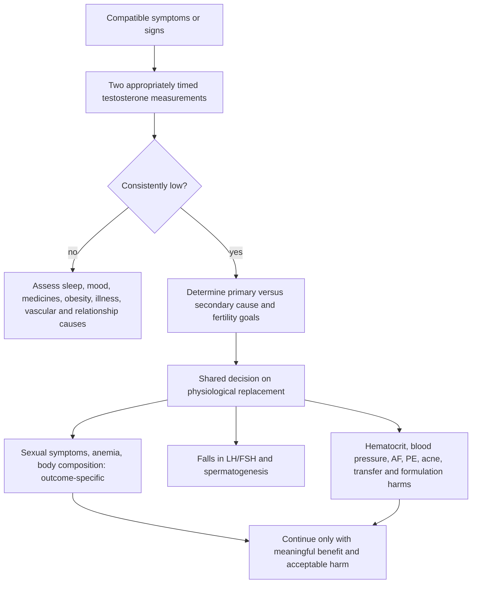

# Testosterone replacement therapy

Testosterone replacement therapy (TRT) is treatment for clinically meaningful androgen deficiency, not a general anti-aging or performance intervention. Symptoms such as low libido, fatigue, mood change, reduced muscle, and erectile difficulty are nonspecific; a defensible diagnosis requires compatible symptoms or signs, repeatedly low appropriately collected testosterone, and evaluation of reversible or secondary causes. [AUA testosterone-deficiency guideline](https://www.auanet.org/documents/Guidelines/PDF/Testosterone%20Website%20Final%280%29.pdf)

## Strongest fair synthesis

For men with symptoms and confirmed low testosterone, TRT can improve sexual symptoms and correct anemia and may improve lean mass and bone density. Benefits are outcome-specific and variable; a normalized laboratory value without patient-important improvement is not treatment success. Evidence does not support TRT for asymptomatic age-related decline, normal testosterone, cardiovascular prevention, or longevity.

TRAVERSE directly addressed a major uncertainty. It randomized 5,246 men aged 45–80 with symptoms, two fasting testosterone values below 300 ng/dL, and pre-existing or high cardiovascular risk to testosterone gel or placebo. Major cardiovascular events occurred in 7.0% versus 7.3% (HR 0.96, 95% CI 0.78–1.17), meeting noninferiority. The result is reassuring for this selected population and gel regimen over roughly three years; it does not establish benefit, lifelong safety, other formulations, supraphysiological dosing, or treatment of men without confirmed hypogonadism.[^traverse-2023]

In February 2025 FDA removed class-wide boxed-warning language about increased major cardiovascular outcomes after reviewing TRAVERSE, retained the limitation of use for age-related hypogonadism, and required class-wide blood-pressure warnings after ambulatory-monitoring studies showed increases. [FDA 2025 labeling change](https://www.fda.gov/drugs/drug-alerts-and-statements/fda-issues-class-wide-labeling-changes-testosterone-products)

## Adversarial pass: harms and applicability

TRAVERSE found more nonfatal arrhythmias requiring intervention (5.2% vs 3.3%), atrial fibrillation (3.5% vs 2.4%), acute kidney injury (2.3% vs 1.5%), and pulmonary embolism in the testosterone group. These were secondary safety findings and need confirmation, but they prevent “cardiovascularly safe” from becoming an unqualified class claim.[^traverse-2023]

The fracture substudy also contradicted a common extrapolation from higher bone density to fewer fractures: clinical fractures at three years were 3.8% with testosterone versus 2.8% with placebo. TRT should not be prescribed as fracture prevention.[^snyder-2024]

Exogenous testosterone suppresses LH, FSH, intratesticular testosterone, and sperm production; anyone who may want fertility needs this discussion before treatment. Erythrocytosis, blood-pressure increase, acne, edema, breast symptoms, worsening sleep-disordered breathing, gel transfer, and formulation-specific peak–trough or injection risks remain relevant. Trial exclusions—such as hematocrit above 50%, severe untreated sleep apnea, severe lower urinary-tract symptoms, and prostate-cancer concerns—limit generalization to those groups.

Commercial and specialty-clinic incentives can favor diagnosis at a borderline number and indefinite treatment. Conversely, historical cardiovascular alarm was also stronger than the best current trial supports. The balanced conclusion is neither class-wide avoidance nor lifestyle prescribing: use a reproducible diagnosis, physiological exposure, explicit goals, and stopping rules.

## Evidence update — 2026-09-01

> **What changed:** The prior page described cardiovascular and prostate evidence as generally reassuring but did not include FDA's 2025 label change, the class-wide blood-pressure warning, TRAVERSE absolute results, or its arrhythmia, kidney, pulmonary-embolism, and fracture signals. Those data now narrow the safety conclusion. Historical discussion of individualized thresholds and formulation preferences is retained as expert provenance, but unsupported symptom cutoffs, receptor “set points,” and podcast-derived regimens were retired from clinical guidance.

## Practical implications

- **Diagnose before treating—strong.** Require compatible symptoms or signs plus two low, appropriately timed total-testosterone measurements; use SHBG/free testosterone and LH/FSH selectively when they resolve a real diagnostic question. Investigate sleep, obesity, medicines, energy deficiency, mood, alcohol, and chronic illness. [AUA guideline](https://www.auanet.org/documents/Guidelines/PDF/Testosterone%20Website%20Final%280%29.pdf)
- **Discuss fertility before the first dose—strong.** Exogenous testosterone is inappropriate when near-term fertility is desired unless a reproductive specialist has designed the plan. [[male-fertility-and-exogenous-testosterone]]
- **Before and during therapy, monitor symptoms, testosterone exposure, hematocrit, blood pressure, and indication-specific prostate, urinary, sleep, and cardiovascular risks—strong.** Exact cadence and stopping thresholds follow the current product label and professional guidance.
- **Do not use TRT to prevent fractures, cardiovascular disease, or aging—strong.** Higher bone density and lean mass do not establish fewer fractures or longer life.
- **Stop, adjust, or revisit the diagnosis when meaningful symptom benefit does not occur or harms emerge—strong.** Escalating a number without benefit is not physiological replacement.

## Gaps & open questions

- Do the arrhythmia, pulmonary-embolism, kidney, and fracture signals replicate, and how do they vary by formulation?
- What are the benefits and harms beyond three years in correctly diagnosed men?
- Which symptoms predict a patient-important response near diagnostic thresholds?
- Can fertility-preserving alternatives match symptom benefit without their own off-label risks?

## Related

[[male-fertility-and-exogenous-testosterone]] · [[neuroendocrine-regulation-of-mood]] · [[erectile-dysfunction-and-vascular-health]] · [[sexual-desire-arousal-and-aging]] · [[visceral-and-ectopic-fat]] · [[obstructive-sleep-apnea]] · [[blood-marker-variability-and-reference-change]] · [[proactive-health-monitoring]] · [[rena-malik]] · [[aging-model]] · [[practice-playbook]]

## References

[^traverse-2023]: Lincoff AM, et al. “Cardiovascular Safety of Testosterone-Replacement Therapy.” *New England Journal of Medicine*, 2023. [RCT]. [doi:10.1056/NEJMoa2215025](https://doi.org/10.1056/NEJMoa2215025)
[^snyder-2024]: Snyder PJ, et al. “Testosterone Treatment and Fractures in Men with Hypogonadism.” *New England Journal of Medicine*, 2024. [RCT substudy]. [doi:10.1056/NEJMoa2308836](https://doi.org/10.1056/NEJMoa2308836)
