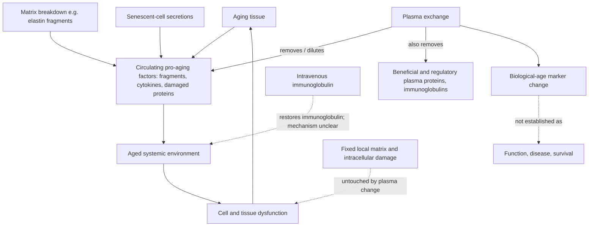

# Therapeutic plasma exchange

Therapeutic plasma exchange (TPE, plasmapheresis) removes a volume of a person's blood plasma and returns the cellular components with a replacement fluid, typically donor plasma or an albumin solution. It is an established procedure in medicine for conditions in which a circulating pathogenic factor — an autoantibody, an abnormal protein, a toxin — drives disease. The longevity hypothesis reuses the machinery for a different claim: that aged plasma carries an accumulated burden of pro-aging factors, and that diluting or replacing it improves the systemic environment in which every cell operates. (@TheSheekeyScienceShow (The Sheekey Science Show) — "This years biggest breakthroughs in longevity! (2025)", 2025-12-21, [link](https://www.youtube.com/watch?v=X-Hzyzo1Jpk))

## What the human trial established

A 2025 trial provides the first controlled human data on TPE with aging biomarkers as the object of study rather than a disease indication. Healthy adults were randomized across four arms: exchange twice weekly, exchange twice weekly plus intravenous immunoglobulin (IVIG), monthly exchange, and placebo. Biological age was assessed with several measurement families — DNA methylation, proteomics, and glycomics — rather than a single clock, which is a methodological strength given how readily one clock can move alone. The best-performing arm was twice-weekly exchange plus IVIG, and biological age fell by an average of 2.6 years after roughly one month of treatment. (@TheSheekeyScienceShow (The Sheekey Science Show) — "This years biggest breakthroughs in longevity! (2025)", 2025-12-21, [link](https://www.youtube.com/watch?v=X-Hzyzo1Jpk))

The endpoint is the limit of the result. A change in composite biological-age estimates is a biomarker outcome, and [[biological-age-biomarkers]] explains why an intervention-induced clock movement is not a validated surrogate for morbidity or mortality. Plasma exchange is also a particularly hard case for clock interpretation: the procedure directly and massively alters the plasma proteome and immunoglobulin content, which are inputs to proteomic and glycomic age estimates, so part of the measured change may be the mechanical consequence of swapping the measured compartment rather than a change in tissue biology. Whether short-term markers persist after treatment stops was not established, and the treatment burden — repeated apheresis sessions — is substantial.

The IVIG finding is the genuinely puzzling one, and it is worth preserving as an open question rather than smoothing over. Removing plasma factors has a straightforward rationale; adding back pooled immunoglobulin does not obviously follow from the dilution hypothesis, and Sheekey states plainly that she did not understand why the combination outperformed exchange alone. Candidate explanations include replacement of immunoglobulins depleted by the exchange itself, independent immunomodulatory effects of IVIG, or an artifact of glycomic and proteomic measures responding to infused immunoglobulin. None is established, and the possibility that the added benefit is partly measurement rather than biology has not been excluded. (@TheSheekeyScienceShow (The Sheekey Science Show) — "This years biggest breakthroughs in longevity! (2025)", 2025-12-21, [link](https://www.youtube.com/watch?v=X-Hzyzo1Jpk))

## Subtraction versus addition

TPE tests one half of a two-sided hypothesis, and the distinction organizes an otherwise confusing literature. Exchange and dilution remove circulating material, so any benefit is attributed to depleting pro-aging factors — the branch developed by Irina and Michael Conboy. The opposing design adds concentrated plasma material from a young donor on the hypothesis that youth-associated signals are what matter. Heterochronic parabiosis, the founding experiment of the field, does both at once and therefore cannot separate them. Because exchange removes beneficial plasma proteins alongside the intended targets — the reason the IVIG result above is puzzling — a demonstration that addition works would imply that exchange is fighting its own mechanism, while a demonstration that removal alone suffices would make donor material unnecessary. Neither has been established in humans. [[circulating-rejuvenation-signaling]] [[plasma-derived-extracellular-particles]] (@TheSheekeyScienceShow (The Sheekey Science Show) — "Reproducing Rejuvenation: Inside the Pig Plasma Longevity Experiments", 2025-08-22, [link](https://www.youtube.com/watch?v=Q-lS1UMHG1o))

## What plasma exchange can and cannot reach

The intervention's mechanistic reach is defined by what circulates. Removing soluble factors can plausibly relieve a cell of adverse signaling — the elastin fragments described in [[extracellular-matrix-aging]] are a concrete example of a measurable, age-rising, pathogenic circulating species that exchange would deplete. But three of the aging processes documented elsewhere in this wiki are physically out of reach: intracellular damage, fixed local matrix that is decades old, and somatic mutation. This places TPE among the interventions that address the environment rather than the accumulated substrate, and the cross-scaffold cardiac experiments in [[extracellular-matrix-aging]] show that the fixed local environment carries part of the aged phenotype on its own.

The framework in [[aging-dynamics-and-resilience]] classifies this kind of intervention as acting on the reversible, dynamic component of aging rather than on cumulative entropic damage — the same category as senolytics, caloric restriction, and cellular reprogramming. Heterochronic parabiosis provides the relevant precedent: connecting old mice to young mice improved their stress markers while leaving entropy markers unchanged. If that classification is right, plasma exchange should be able to restore function and reduce disease risk without altering the underlying accumulation, which predicts benefit that fades after treatment stops and a ceiling on what repeated treatment can achieve. That prediction is testable and currently untested. (@TheSheekeyScienceShow (The Sheekey Science Show) — "the 3 levels of aging therapeutics", 2026-02-08, [link](https://www.youtube.com/watch?v=c-_Pdp5IIvw)) [[healthspan-versus-maximum-lifespan]]

## Burden, risk, and the comparison it invites

TPE is an invasive procedure requiring vascular access and repeated clinic visits, with recognized risks including hypotension, citrate-related electrolyte disturbance, allergic reactions to replacement fluid, coagulation-factor depletion, infection, and access complications. In a patient with a plasma-mediated disease those risks are weighed against a serious illness. In a healthy person seeking longevity benefit, they are weighed against a biomarker change of unproven meaning — a materially different calculation, and one that a clinic offering the procedure has an incentive to present favorably. [[longevity-clinics-and-evidence]] covers that regulatory and commercial gap.

The comparison worth making is with lower-burden approaches to the same target. Sheekey's own preference, offered while discussing low-frequency ultrasound in mice, is that she would rather have a thirty-minute morning bath with low-frequency ultrasound than go to hospital and have her whole plasma diluted. The serious point beneath the aside is that treatment burden is a real term in the value of an intervention, and interventions with equal biomarker effects are not equally worth having. Both remain unproven in humans; the ultrasound work is mouse-only. (@TheSheekeyScienceShow (The Sheekey Science Show) — "This years biggest breakthroughs in longevity! (2025)", 2025-12-21, [link](https://www.youtube.com/watch?v=X-Hzyzo1Jpk))

## Practical implications

- **Use TPE only for an established medical indication under specialist care — strong for indicated disease, absent for longevity.** No completed trial shows that plasma exchange in healthy people improves function, prevents disease, or extends life. (@TheSheekeyScienceShow (The Sheekey Science Show) — "This years biggest breakthroughs in longevity! (2025)", 2025-12-21, [link](https://www.youtube.com/watch?v=X-Hzyzo1Jpk))
- **Do not buy plasma exchange as an anti-aging service on the strength of the 2.6-year figure — the endpoint is a composite biomarker over one month, not health.** Treat that number as a research result about markers, not a claim about years of life. [[biological-age-biomarkers]]
- **If considering it anyway, insist on the same questions asked of any procedure — strong as a decision rule.** What functional or clinical endpoint will be measured, over what interval, by whom, with what stopping rule, and what happens when treatment stops? Ask specifically what happens to the markers three and six months after the last session.
- **Cadence cannot be specified.** The trial compared twice-weekly and monthly schedules over about a month; nothing establishes a maintenance interval, a total course, or whether repeated courses are safe or beneficial in healthy people.

## Gaps & open questions

- Do the biomarker changes persist after treatment ends, and do they correspond to any change in measured physical, cognitive, or immune function?
- How much of the composite biological-age change is direct alteration of the measured plasma compartment rather than a change in tissue biology?
- Why does adding IVIG improve the result, and is the added effect biological or an artifact of infusing immunoglobulin into glycomic and proteomic assays?
- Which specific circulating factors, if any, mediate benefit — and could they be targeted individually at far lower burden and risk?
- Is dilution of harmful factors, replacement with beneficial ones, or a non-specific effect of the procedure responsible?
- Does adding concentrated young-donor plasma material produce effects that removal alone does not, and would that imply exchange partially works against its own mechanism?
- What is the risk profile of repeated apheresis in healthy older adults over years, as opposed to a single course in disease?
- Does removing plasma factors impair beneficial immune surveillance or repair signaling alongside the intended targets?

## Related

[[circulating-rejuvenation-signaling]] · [[plasma-derived-extracellular-particles]] · [[pig-plasma-fraction-rejuvenation]] · [[biological-age-biomarkers]] · [[extracellular-matrix-aging]] · [[aging-dynamics-and-resilience]] · [[healthspan-versus-maximum-lifespan]] · [[immune-aging-and-rejuvenation]] · [[stem-cell-exhaustion]] · [[cellular-senescence]] · [[longevity-clinics-and-evidence]] · [[longevity-intervention-prioritization]] · [[biological-age-reversal]] · [[aging-model]]
