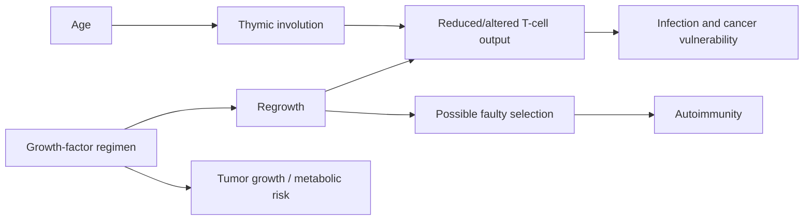

# Thymus regeneration

The thymus supports maturation and selection of T cells, then involutes early in adult life. Regeneration aims to restore both its volume and internal architecture so that immune-cell output improves; increased size alone does not establish correct T-cell education. (@ABCNewsIndepth (ABC News In-depth) — "The health trends outpacing regulation and putting people at risk | Four Corners Documentary", 2026-07-20, [link](https://www.youtube.com/watch?v=77TTDkR3nbI))

## Evidence and risks

Greg Fahy’s small human program used growth hormone with two other drugs and reported MRI evidence of thymic recovery, followed by reported replication plus improvements in strength and lung function. Because the cocktail has systemic actions and the trials are small, improvements cannot yet be attributed specifically to thymus regeneration. Observational associations between better thymic health and cancer outcomes likewise do not establish causality. (@ABCNewsIndepth (ABC News In-depth) — "The health trends outpacing regulation and putting people at risk | Four Corners Documentary", 2026-07-20, [link](https://www.youtube.com/watch?v=77TTDkR3nbI))

Risks arise from mechanism: growth stimulation may accelerate a pre-existing cancer, while structurally incomplete regeneration could mis-educate T cells and promote autoimmunity. These are material uncertainties, not side issues. (@ABCNewsIndepth (ABC News In-depth) — "The health trends outpacing regulation and putting people at risk | Four Corners Documentary", 2026-07-20, [link](https://www.youtube.com/watch?v=77TTDkR3nbI))

## Practical implications

There is no evidence-based anti-aging protocol for routine use. Do not use growth hormone or secretagogue peptides to regenerate the thymus outside a properly monitored trial; evidence is preliminary and cancer, metabolic, and immune risks are plausible. Clinical trials should assess architecture, T-cell repertoire and function, autoimmunity, and malignancy—not MRI volume alone. (@ABCNewsIndepth (ABC News In-depth) — "The health trends outpacing regulation and putting people at risk | Four Corners Documentary", 2026-07-20, [link](https://www.youtube.com/watch?v=77TTDkR3nbI))

## Gaps & open questions

- Does regrowth restore safe, diverse T-cell selection?
- Are reported functional changes caused by the thymus or other drug effects?
- Can thymus-specific growth factors avoid systemic tumor stimulation?

## Related

[[biological-age-reversal]] · [[experimental-peptides]] · [[aging-model]]
