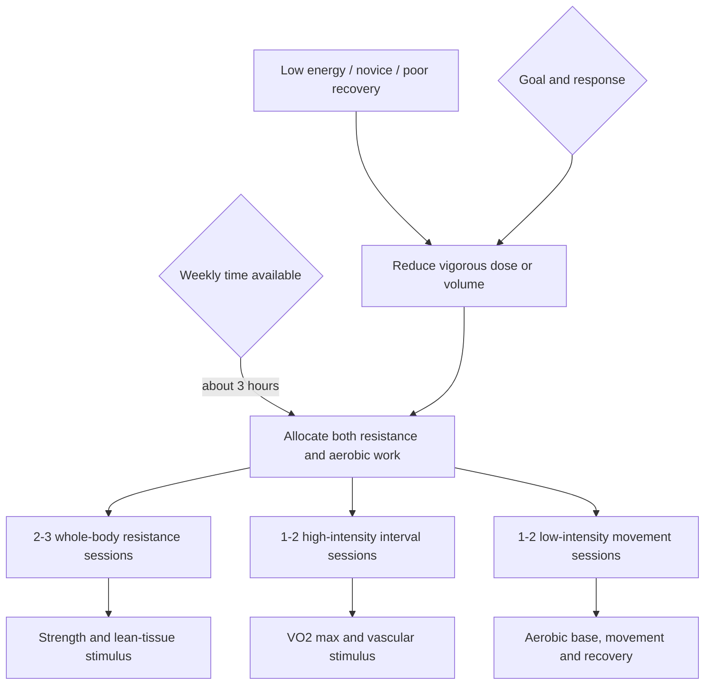

# Time-efficient concurrent training

> [!important] Evidence update — 2026-08-12
> A 2026 umbrella review and newer human trial evidence reinforce that concurrent aerobic and resistance training usually preserves hypertrophy and maximal-strength adaptation; the practically important residual concern is explosive-strength or power development, especially when hard modalities are crowded together. Sequence should therefore follow the priority outcome, while separating demanding sessions when power quality or recovery is limiting. This narrows older blanket warnings about an aerobic–strength “interference effect.” ([PubMed: umbrella review](https://pubmed.ncbi.nlm.nih.gov/41762427/); [human concurrent-training trial](https://doi.org/10.1152/japplphysiol.00642.2025))

Time-efficient concurrent training combines resistance and aerobic work within a small weekly time budget. The design problem is allocation: strength, lean tissue, aerobic base, and high-end cardiorespiratory capacity require different stimuli, while adherence and recovery cap how much intensity can be concentrated. When volume is scarce, intensity carries more of the adaptation burden; when time is abundant, more low-intensity volume can be used without abandoning vigorous work. (@PeterAttiaMD (Peter Attia MD) — "How Busy Moms Can Build Strength and Cardio Fitness | Abbie Smith-Ryan, Ph.D.", 2026-01-07, [link](https://www.youtube.com/watch?v=9Rxp2a0m8wM))

## Minimal-dose structure

A transcript-derived three-hour template assigns two 30-minute whole-body resistance sessions, one or two interval sessions, and the remaining time to low-intensity aerobic work distributed across the week. For recomposition, a third resistance session can replace low-intensity cardio; for a sedentary beginner, one interval day may be exchanged for easier aerobic work. These are starting allocations, not evidence that exactly three hours or a particular ratio is optimal. (@PeterAttiaMD (Peter Attia MD) — "How Busy Moms Can Build Strength and Cardio Fitness | Abbie Smith-Ryan, Ph.D.", 2026-01-07, [link](https://www.youtube.com/watch?v=9Rxp2a0m8wM)) (@PeterAttiaMD (Peter Attia MD) — "378 ‒ Women’s health & performance: how training, nutrition, & hormones interact across life stages", 2026-01-05, [link](https://www.youtube.com/watch?v=CDsH60jt34o))

The resistance example uses major muscle groups, progressive load, six to eight repetitions, about 30 seconds between exercises, and longer rest between rounds to fit a full-body session into 30 minutes. Short rest raises density, but the exact transcript wording around sets is incomplete and the protocol is presented as one laboratory-tested option rather than the only effective format. Exercise selection should permit safe effort under fatigue. (@PeterAttiaMD (Peter Attia MD) — "How Busy Moms Can Build Strength and Cardio Fitness | Abbie Smith-Ryan, Ph.D.", 2026-01-07, [link](https://www.youtube.com/watch?v=9Rxp2a0m8wM))

## Interval mechanism and calibration

The featured interval protocol is six to ten rounds of one minute hard followed by one minute easy, producing 12–20 minutes of interval work before warm-up and cool-down. A practical intensity cue is an effort that could not be sustained much beyond the minute. Heart rate lags behind short work bouts, so immediate heart-rate percentage can mislead; fixed treadmill speed or cycle power and learned rating of perceived exertion are better real-time controls. At-home studies described in the transcript found benefit even when participants did not precisely reach a laboratory target, suggesting feasibility matters more than false precision. (@PeterAttiaMD (Peter Attia MD) — "How Busy Moms Can Build Strength and Cardio Fitness | Abbie Smith-Ryan, Ph.D.", 2026-01-07, [link](https://www.youtube.com/watch?v=9Rxp2a0m8wM))

Intensity is not synonymous with maximal effort every day. A novice improves from almost any new stimulus; a trained person using very little weekly volume must work closer to the threshold required to maintain adaptation. Conversely, low energy availability, soreness, injury, or poor sleep can make a nominally efficient schedule unrecoverable. The useful dose is the hardest repeatable program that still permits technical quality, recovery, and attendance. (@PeterAttiaMD (Peter Attia MD) — "378 ‒ Women’s health & performance: how training, nutrition, & hormones interact across life stages", 2026-01-05, [link](https://www.youtube.com/watch?v=CDsH60jt34o))

## Practical implications

- **Twice weekly: perform about 30 minutes of progressive whole-body resistance work — moderate.** Cover push, pull, knee-dominant, hip-dominant, and trunk or carry patterns; a third session can be added when muscle preservation or recomposition is the priority and recovery is adequate. (@PeterAttiaMD (Peter Attia MD) — "How Busy Moms Can Build Strength and Cardio Fitness | Abbie Smith-Ryan, Ph.D.", 2026-01-07, [link](https://www.youtube.com/watch?v=9Rxp2a0m8wM))
- **Once weekly at first, potentially twice when adapted: perform six to ten one-minute hard intervals with one-minute recovery — moderate for feasibility and fitness, weak for superiority over other interval structures.** Include a warm-up and cool-down and use speed, power, or perceived effort rather than chasing early-interval heart rate. (@PeterAttiaMD (Peter Attia MD) — "How Busy Moms Can Build Strength and Cardio Fitness | Abbie Smith-Ryan, Ph.D.", 2026-01-07, [link](https://www.youtube.com/watch?v=9Rxp2a0m8wM))
- **On one or two additional days: accumulate easy walking, cycling, or other aerobic movement — strong for general activity; uncertain for the optimal dose within a three-hour plan.** Split sessions across more days when that improves adherence. (@PeterAttiaMD (Peter Attia MD) — "How Busy Moms Can Build Strength and Cardio Fitness | Abbie Smith-Ryan, Ph.D.", 2026-01-07, [link](https://www.youtube.com/watch?v=9Rxp2a0m8wM))
- **Every 2–4 weeks: review performance, soreness, energy, and attendance — mechanistically strong, protocol evidence limited.** Add load or intervals only when the current dose is repeatable; reduce vigorous work first when a novice or under-fueled person is not recovering. (@PeterAttiaMD (Peter Attia MD) — "378 ‒ Women’s health & performance: how training, nutrition, & hormones interact across life stages", 2026-01-05, [link](https://www.youtube.com/watch?v=CDsH60jt34o))

## Gaps & open questions

- What resistance-to-aerobic allocation maximizes health outcomes at one, two, or three hours per week?
- Are one-minute intervals superior to shorter or longer work bouts for adherence, safety, or adaptation in midlife women?
- How much low-intensity volume is needed to capture benefits that vigorous intervals do not provide?
- How should concurrent sessions be sequenced to minimize interference when scheduled on the same day?
- What is the minimal effective dose during low energy intake, postpartum recovery, or symptomatic perimenopause?

## Related

[[womens-exercise-across-the-lifespan]] · [[resistance-training]] · [[cardiorespiratory-fitness]] · [[training-frequency-and-hypertrophy]] · [[performance-nutrition-and-hydration]] · [[low-energy-availability-and-menstrual-function]] · [[practice-playbook]]
