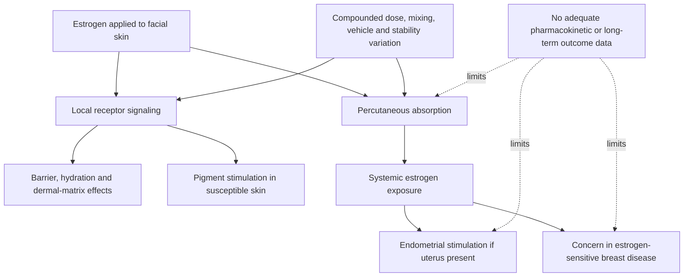

# Topical estrogen for skin aging

Topical facial estrogen means applying estradiol, estriol, a vaginal estrogen product, or a compounded hormone formula to facial skin in an attempt to improve postmenopausal dryness, thickness, elasticity, or wrinkles. Estrogen signaling affects skin, so benefit after estrogen decline is biologically plausible. Plausibility is not a dosing or safety standard: molecule, concentration, vehicle, treated area, barrier integrity, duration, systemic absorption, uterine status, progestogen exposure, and breast-cancer history all matter. (@LabMuffinBeautyScience (Lab Muffin Beauty Science) — "Products I do not use (as a chemist)", 2025-12-23, [link](https://www.youtube.com/watch?v=qPonEF3EVcM))

## Local target, systemic uncertainty

Small, heterogeneous studies provide at most limited evidence that some postmenopausal skin outcomes can improve; they do not establish broad anti-aging efficacy, benefit before menopause, an optimal facial dose, or long-term safety. Much visible aging also reflects ultraviolet injury, pigment biology, repetitive motion, fat and ligament change, and bone remodeling, so a hormone-responsive epidermal or dermal effect cannot address the whole phenotype. Estrogen can also worsen melasma or other hyperpigmentation in susceptible people. (@LabMuffinBeautyScience (Lab Muffin Beauty Science) — "Products I do not use (as a chemist)", 2025-12-23, [link](https://www.youtube.com/watch?v=qPonEF3EVcM))

Route equivalence is the central unresolved problem. Safety experience with a regulated vaginal product for a specific indication cannot be transferred silently to repeated use over the face, where area, vehicle, barrier damage, and exposure differ. A company-cited estriol study with only baseline and 12-week hormone measurements cannot exclude an intervening systemic peak. Reported vaginal bleeding after facial use is a safety signal in the transcript, but its frequency and causality are unknown. (@LabMuffinBeautyScience (Lab Muffin Beauty Science) — "Products I do not use (as a chemist)", 2025-12-23, [link](https://www.youtube.com/watch?v=qPonEF3EVcM))

Compounding adds uncertainty in potency, uniformity, stability, vehicle, and absorption. The transcript describes a telehealth test in which a disclosed breast-cancer history did not prevent rapid prescribing; one anecdotal audit does not quantify platform-wide performance, but it illustrates why prescription status alone is not proof of adequate screening. Jen Gunter's attributed position is that available data cannot define appropriate monitoring and that products should be studied before being sold as broad facial anti-aging therapy. This is a precautionary expert position, not an external guideline review. (@LabMuffinBeautyScience (Lab Muffin Beauty Science) — "Products I do not use (as a chemist)", 2025-12-23, [link](https://www.youtube.com/watch?v=qPonEF3EVcM))

## Practical implications

- **Do not repurpose vaginal estrogen or buy compounded facial estrogen for routine anti-aging on the basis of social-media claims — strong precaution from major evidence and safety gaps.** There is no evidence-based self-treatment cadence.
- **If facial estrogen is being considered for postmenopausal skin symptoms: discuss formulation, uterine status, progestogen need, breast-cancer history, abnormal bleeding, melasma risk, interacting hormone therapy, and alternatives with an appropriately qualified clinician before use — strong safety practice; efficacy remains limited.** Unexpected vaginal bleeding requires prompt clinical evaluation. (@LabMuffinBeautyScience (Lab Muffin Beauty Science) — "Products I do not use (as a chemist)", 2025-12-23, [link](https://www.youtube.com/watch?v=qPonEF3EVcM))
- **For photoaging: begin with daily photoprotection and consider an established topical retinoid when appropriate — moderate-to-strong for defined skin outcomes.** These act on broader non-hormonal pathways and have better characterized use than compounded facial estrogen. [[photoprotection]] [[topical-retinoids]] (@LabMuffinBeautyScience (Lab Muffin Beauty Science) — "Products I do not use (as a chemist)", 2025-12-23, [link](https://www.youtube.com/watch?v=qPonEF3EVcM))

## Gaps & open questions

- What facial dose–exposure curve applies to estradiol and estriol across vehicles, treated areas, barrier states, and menopausal hormone regimens?
- Do adequately powered randomized trials show patient-important benefit beyond hydration and short-term instrument changes?
- What are the rates of abnormal bleeding, endometrial hyperplasia, melasma, breast events, and other harms over years?
- Can non-systemically active estrogen-receptor modulators produce local benefit with demonstrated long-term safety?

## Related

[[menopause-hormone-therapy]] · [[whi-and-menopause-hormone-therapy]] · [[hyperpigmentation-and-dark-spots]] · [[photoprotection]] · [[topical-retinoids]] · [[skincare-evidence-and-routine-design]]
