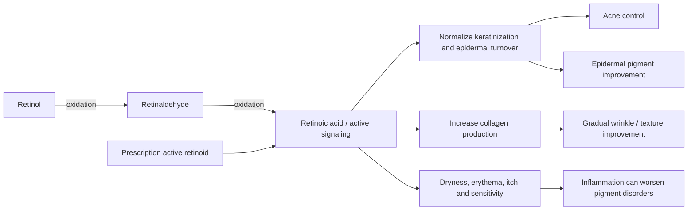

# Topical retinoids

Topical retinoids are vitamin-A derivatives used for acne, photoaging, pigment disorders, and selected disorders of epidermal turnover. Tretinoin and adapalene are active drug forms; cosmetic retinol and retinaldehyde require cutaneous conversion before engaging retinoid signaling. Their useful effects include normalization of follicular keratinization and epidermal turnover and, over longer periods, increased dermal collagen production. (@DrDrayzday (Dr Dray) — "Is Sugar Really Bad for Your Skin? | Dermatologist Q&A", 2026-08-09, [link](https://www.youtube.com/watch?v=c0tYCBtxRO4)) (@DrDrayzday (Dr Dray) — "Copper Peptides, Hair Loss & Retinol Questions Answered", 2026-08-08, [link](https://www.youtube.com/watch?v=0sxHRZPDvss))

## Activation, effects, and irritation

Retinol requires two conversion steps to reach retinoic acid, whereas retinaldehyde requires one. It is tempting to infer that retinaldehyde must therefore be stronger, but conversion count alone does not capture penetration, enzyme kinetics, stability, vehicle, or dose; comparative evidence does not establish general superiority of one cosmetic form. Both can improve photoaging, wrinkles, unwanted spots, and collagen-related endpoints, generally with slower onset and less immediate irritation than prescription retinoids. (@DrDrayzday (Dr Dray) — "Copper Peptides, Hair Loss & Retinol Questions Answered", 2026-08-08, [link](https://www.youtube.com/watch?v=0sxHRZPDvss))

Encapsulation can protect unstable retinal within a finished formula until application, but a liposome claim alone does not establish delivery or comparative efficacy. A sponsored product example combined 0.1% liposomal retinal with PDRN and was personally experienced as gentle with mild peeling; this is product-specific tolerability evidence from one user, not proof that PDRN prevents retinoid dermatitis or that encapsulation makes it clinically superior. See [[topical-pdrn-and-centella]]. (@LabMuffinBeautyScience (Lab Muffin Beauty Science) — "New K-Beauty finds: PDRN, TECA, lip tint and more (AD)", 2026-06-19, [link](https://www.youtube.com/watch?v=HViQVEobv88))

Irritation may emerge only after weeks of apparently easy use. Increasing product count or adding exfoliants raises cumulative challenge even when no chemical incompatibility exists. For acne, persistent disease after partial improvement may reflect insufficient treatment intensity or need for additional therapy rather than purging; true retinoid purging is overstated online and is more reliably encountered with oral isotretinoin than topical retinol. Standard use of adapalene is often daily if tolerated, but an individual's prescribed schedule takes precedence. (@DrDrayzday (Dr Dray) — "Is Sugar Really Bad for Your Skin? | Dermatologist Q&A", 2026-08-09, [link](https://www.youtube.com/watch?v=c0tYCBtxRO4)) (@DrDrayzday (Dr Dray) — "Copper Peptides, Hair Loss & Retinol Questions Answered", 2026-08-08, [link](https://www.youtube.com/watch?v=0sxHRZPDvss))

Melasma has epidermal and dermal components. Retinoids can improve epidermal pigment, thereby revealing persistent deeper pigment that was already present; this apparent worsening is not migration of hidden melasma. By contrast, retinoid dermatitis can genuinely worsen pigmentation through inflammation. Retinoids may also modestly improve early red stretch marks by supporting collagen, but established white striae are less responsive and often require procedural approaches. (@DrDrayzday (Dr Dray) — "Is Sugar Really Bad for Your Skin? | Dermatologist Q&A", 2026-08-09, [link](https://www.youtube.com/watch?v=c0tYCBtxRO4)) (@DrDrayzday (Dr Dray) — "Copper Peptides, Hair Loss & Retinol Questions Answered", 2026-08-08, [link](https://www.youtube.com/watch?v=0sxHRZPDvss))

On chronically sun-damaged, fragile dorsal-hand skin, tretinoin may gradually increase collagen and thickness, lighten mottled photodamage, and reduce formation of actinic keratoses; a direct reduction in bruising is plausible but less firmly established. Adapalene and other retinoids share parts of the signaling mechanism, while cosmetic retinol and retinaldehyde have less direct treatment evidence. Retinoids complement rather than replace [[photoprotection]], and irritation can itself worsen fragility or adherence. [[actinic-purpura-and-aging-skin-fragility]] (@DrDrayzday (Dr Dray) — "Why Do My Hands Bruise So Easily? Dermatologist Explains", 2026-08-06, [link](https://www.youtube.com/watch?v=0o0bMXOL-Lo))

## Practical implications

- **Evening or according to the product/prescription: use the least expensive tolerated retinoid you can sustain — moderate-to-strong for acne and photoaging, depending on agent.** Consistency over months matters more than choosing retinol versus retinaldehyde by conversion-step count.
- **At initiation: start at a tolerable frequency and monitor for delayed redness, itch, burning, and sensitivity — strong safety practice.** Reduce frequency, simplify other actives, and support the [[skin-barrier-and-moisturization|skin barrier]] if irritation develops.
- **After an adequate trial: reassess the diagnosis, dose, adherence, and need for combination therapy if acne remains active — strong.** Do not automatically label recurrent lesions as purging.
- **For melasma: pair tolerable treatment with rigorous [[photoprotection]] and avoid inflammation — moderate.** Deeper pigment may remain after epidermal clearing and may need clinician-directed treatment.
- **For photoaged, fragile dorsal-hand skin: consider a clinician-guided or over-the-counter retinoid only after establishing tolerability — moderate for photoaging, limited for direct bruise reduction.** Use over months, protect the site from UV, and reduce frequency if inflammation develops. (@DrDrayzday (Dr Dray) — "Why Do My Hands Bruise So Easily? Dermatologist Explains", 2026-08-06, [link](https://www.youtube.com/watch?v=0o0bMXOL-Lo))

## Gaps & open questions

- Are matched-dose retinaldehyde formulations clinically superior to matched retinol formulations for any outcome?
- Which introduction schedules best preserve adherence without materially delaying benefit?
- How often does true acne flaring from topical retinoids occur under standardized definitions?
- Which topical retinoid and procedural combinations best treat early versus mature stretch marks?

## Related

[[skin-barrier-and-moisturization]] · [[skincare-evidence-and-routine-design]] · [[topical-pdrn-and-centella]] · [[photoprotection]] · [[procedural-skin-remodeling]] · [[actinic-purpura-and-aging-skin-fragility]] · [[practice-playbook]]
