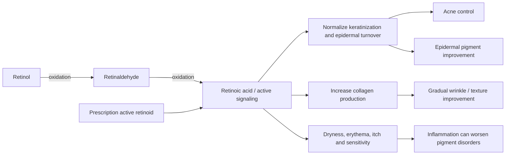

# Topical retinoids

Topical retinoids are vitamin-A derivatives used for acne, photoaging, pigment disorders, and selected disorders of epidermal turnover. Tretinoin and adapalene are active drug forms; cosmetic retinol and retinaldehyde require cutaneous conversion before engaging retinoid signaling. Their useful effects include normalization of follicular keratinization and epidermal turnover and, over longer periods, increased dermal collagen production. (@DrDrayzday (Dr Dray) — "Is Sugar Really Bad for Your Skin? | Dermatologist Q&A", 2026-08-09, [link](https://www.youtube.com/watch?v=c0tYCBtxRO4)) (@DrDrayzday (Dr Dray) — "Copper Peptides, Hair Loss & Retinol Questions Answered", 2026-08-08, [link](https://www.youtube.com/watch?v=0sxHRZPDvss))

## Activation, effects, and irritation

```mermaid
flowchart LR
  OL[Retinol] -->|oxidation| AL[Retinaldehyde]
  AL -->|oxidation| RA[Retinoic acid / active signaling]
  RX[Prescription active retinoid] --> RA
  RA --> TURN[Normalize keratinization and epidermal turnover]
  RA --> COL[Increase collagen production]
  TURN --> ACNE[Acne control]
  TURN --> PIG[Epidermal pigment improvement]
  COL --> WR[Gradual wrinkle / texture improvement]
  RA --> IRR[Dryness, erythema, itch and sensitivity]
  IRR --> PIH[Inflammation can worsen pigment disorders]
```

Retinol requires two conversion steps to reach retinoic acid, whereas retinaldehyde requires one. It is tempting to infer that retinaldehyde must therefore be stronger, but conversion count alone does not capture penetration, enzyme kinetics, stability, vehicle, or dose; comparative evidence does not establish general superiority of one cosmetic form. Both can improve photoaging, wrinkles, unwanted spots, and collagen-related endpoints, generally with slower onset and less immediate irritation than prescription retinoids. (@DrDrayzday (Dr Dray) — "Copper Peptides, Hair Loss & Retinol Questions Answered", 2026-08-08, [link](https://www.youtube.com/watch?v=0sxHRZPDvss))

The mechanism has an anti-cancer face that answers a common lay worry. Accelerated turnover sounds pro-cancer, but retinoic-acid signaling controls differentiation: it drives healthy stem-cell maturation while eliminating cells carrying cumulative DNA damage, which is why retinoids are used to treat actinic damage and selected skin and internal cancers and why long-term use is described as reducing skin-cancer risk. A skin cancer surgeon adds two teaching points from the biopsy literature: skin treated with a retinoid for months shows a biologically younger gene-expression state on before/after biopsy (studies from the 1990s–2000s, relayed rather than independently reviewed here), and benefit accrues with duration because collagen and elastin synthesis are slow — his summary is that the retinoid is the one proven anti-aging medicine of the last 50 years. His conversion-enzyme framing sharpens this page's retinol caveat: over-the-counter retinols are inactive prodrugs, and individuals differ enough in conversion-enzyme activity that the same product peels one user and does nothing for another (he reports no response in his own skin) — so an OTC retinol trial doubles as a cheap conversion test before requesting a prescription retinoid. On photostability he matches the record here: tretinoin is photolabile (hence nighttime application), adapalene is photostable, and OTC adapalene 0.1% at about $19, started pea-sized once weekly with gradual escalation, is his default entry recommendation. The teratogenicity boundary explains the regulatory split: oral retinoids cause severe birth defects, topical actives carry the theoretical class risk and remain prescription drugs, and cosmetic retinols exist largely as the industry's route around that gate. (@maxlugavere (Max Lugavere) — "The Skin Doctor: Hair Loss, Itchy Skin, Sunscreen Myths, and Anti-Aging Truths", 2026-07-15, [link](https://www.youtube.com/watch?v=99LCstvkNVw))

Among treatment topicals for photoaged skin, prescription retinoids hold the strongest comparative position: a review describes them as the most evidence-based and efficacious topicals for improving aging skin, and a 2025 network meta-analysis found strong evidence for retinoids — prescription tretinoin and retinol — for fine wrinkles and hyperpigmentation, with irritation the recognized limitation. This ranking is why popular antioxidant serums such as vitamin C are positioned as optional adjuncts rather than alternatives to sunscreen-plus-retinoid ([[topical-vitamin-c]]). (@DrDrayzday (Dr Dray) — "Do You Actually Need Vitamin C Serum? A Dermatologist Explains", 2026-08-17, [link](https://www.youtube.com/watch?v=WQrwaOFMEzc))

Ester forms sit a further conversion step away and deserve a lower prior. Hydroxypinacolone retinoate (HPR), marketed as a gentler retinoid-like active, is a cosmetic retinol ester with no data substantiating claims that it acts like retinol, retinaldehyde, or prescription retinoids; retinol esters typically do not perform like retinol, and HPR may act mainly as an antioxidant. Marketing it as a retinol equivalent misleads consumers into believing they are buying an ingredient established to improve wrinkles and collagen. (@DrDrayzday (Dr Dray) — "Can You Mix Azelaic Acid With Anything? Dermatologist Q&A", 2026-08-16, [link](https://www.youtube.com/watch?v=oyQl5MU3pRQ)) The "dual retinoid" product category extends this trap: serums pairing retinaldehyde with adapinoid or HPR are, functionally, retinaldehyde serums. Adapinoid and HPR are cosmetic ingredients that resemble retinoids on a label but have not been shown to do what retinol, retinaldehyde, or prescription retinoids (including over-the-counter adapalene) do — the supporting studies are not robust, and adapinoid in particular is not adapalene despite the sound-alike name. Their presence may add some benefit and is no reason to stop a tolerated product, but they are best understood as ingredients that help sell the formula rather than a second retinoid; products built on them get marketed as gentle retinol while doing nothing established to earn the comparison. (@DrDrayzday (Dr Dray) — "Can Adapalene Cause Facial Fat Loss? Dermatologist Q&A", 2026-08-23, [link](https://www.youtube.com/watch?v=DprHVOUpvaM))

Within the prescription-strength tier, tretinoin's gold-standard status rests on data volume rather than demonstrated superiority: it is the oldest topical retinoid, has the most research, and is FDA-approved for photoaging, so it is what a dermatologist will usually prescribe for anti-aging — while anti-aging use of adapalene remains off-label. Rigorous new anti-aging trials of any retinoid are scarce because the commercial motivation and funding are absent. The adapalene anti-aging evidence that does exist tested 0.3% against tretinoin 0.05% in small studies: adapalene was not inferior overall, showed biopsy-verified improvement in collagen production, and was statistically less impressive for wrinkles around the eyes in one study — samples too small for firm conclusions. Dr Dray's case for adapalene rests on three practical advantages: it is established in large studies as less irritating than tretinoin (valuable when inflammation would drive post-inflammatory hyperpigmentation, especially in deeper skin tones); the over-the-counter 0.1% strength makes it far more accessible in the United States; and as a regulated drug its formula is standardized across brands and retailers, unlike cosmetic retinols whose finished-formula quality is opaque — so a non-response reflects the ingredient rather than a possibly bad formula. The 0.1% strength was not the trial concentration, but since lower tretinoin percentages remain effective (if slower), there is no solid reason to assume 0.1% adapalene cannot work; this is extrapolation, labeled as such. (@DrDrayzday (Dr Dray) — "Can Adapalene Really Prevent Wrinkles? Dermatologist Q&A", 2026-08-15, [link](https://www.youtube.com/watch?v=l30kQh-VdwI))

Expected time courses differ by endpoint because they run through different tissue processes. For acne, some reduction in spots is typical by four to six weeks, with clearly noticeable improvement often requiring twelve weeks. For fine lines the wait is on collagen induction: subtle improvement usually emerges over three to six months of consistent use, with maximum collagen building after about a year — a pattern described for any topical retinoid. Cosmetic retinol and retinaldehyde can likewise improve collagen and reduce wrinkle depth but take longer and less predictably, with subtle softening of lines and texture expected somewhere from six months to a year. Because the changes are gradual and often subtle, standardized photographs beat memory for judging response; people frequently report no change until they compare pictures. (@DrDrayzday (Dr Dray) — "Anua Azelaic Acid REFORMULATED? Controversy Explained | Derm Q&A", 2026-08-22, [link](https://www.youtube.com/watch?v=1b7nGYAIktw))

Both tretinoin and 12% ammonium lactate have been shown to improve epidermal and dermal thickness, making either a reasonable option against the epidermal and dermal atrophy of aging skin; the moisturizer-active comparison is developed in [[skin-barrier-and-moisturization]]. (@DrDrayzday (Dr Dray) — "Can You Mix Azelaic Acid With Anything? Dermatologist Q&A", 2026-08-16, [link](https://www.youtube.com/watch?v=oyQl5MU3pRQ))

Cosmetic retinol and retinaldehyde are not substitutes for approved acne or rosacea treatment merely because they share a vitamin-A pathway. Formula stability, controlled release, vehicle hydration, and adherence can matter more than the nominal percentage, and no comparative evidence establishes that a higher percentage or retinaldehyde's shorter conversion pathway necessarily produces a better clinical result. Immediate plumping from a moisturizing vehicle is distinct from the slower collagen-related effect. (@DrDrayzday (Dr Dray) — "Best Retinol & Retinal Products for 2026 | Dermatologist's Top 3", 2026-08-12, [link](https://www.youtube.com/watch?v=8rmIw-F7mNc))

Encapsulation can protect unstable retinal within a finished formula until application, but a liposome claim alone does not establish delivery or comparative efficacy. A sponsored product example combined 0.1% liposomal retinal with PDRN and was personally experienced as gentle with mild peeling; this is product-specific tolerability evidence from one user, not proof that PDRN prevents retinoid dermatitis or that encapsulation makes it clinically superior. See [[topical-pdrn-and-centella]]. (@LabMuffinBeautyScience (Lab Muffin Beauty Science) — "New K-Beauty finds: PDRN, TECA, lip tint and more (AD)", 2026-06-19, [link](https://www.youtube.com/watch?v=HViQVEobv88))

“4% retinal liposome” can describe the percentage of a carrier dispersion rather than 4% retinaldehyde; in the reviewed product it was represented as 0.04% retinal itself. That distinction prevents a 100-fold label-reading error, but neither the carrier percentage nor the source's comparison with a 2% liposomal product establishes twice the delivered dose or superior effect without matched carrier composition, stability, release, and finished-product testing. The reviewer's gentleness and delayed-inflammation warning are useful adherence observations, not comparative efficacy or irritation rates. (@LabMuffinBeautyScience (Lab Muffin Beauty Science) — "I tried cult Korean skincare products so you don't have to (Stylevana AD)", 2025-10-15, [link](https://www.youtube.com/watch?v=c6vcx4LIDGA))

Irritation may emerge only after weeks of apparently easy use. Increasing product count or adding exfoliants raises cumulative challenge even when no chemical incompatibility exists. The irritation hierarchy among agents is less tidy than marketing suggests: despite the widespread belief that cosmetic retinol and retinaldehyde are gentle, some cause substantial redness, dryness, and sensitivity — in Dr Dray's experience more than adapalene — and their irritation characteristically sneaks up a couple of weeks into use, whereas tretinoin irritation tends to appear faster. Vehicle engineering is one escape route: tretinoin in a moisturizing lotion vehicle with hyaluronic acid and collagen (Altreno) is often better tolerated, though not guaranteed. Trifarotene (Aklief) was marketed as less irritating on receptor-specificity grounds, but in clinical practice it bears out as roughly as irritating as other topical retinoids. Tolerability is therefore individual, and switching agents or vehicles is a legitimate strategy rather than a failure. (@DrDrayzday (Dr Dray) — "Can You Mix Azelaic Acid With Anything? Dermatologist Q&A", 2026-08-16, [link](https://www.youtube.com/watch?v=oyQl5MU3pRQ)) For acne, persistent disease after partial improvement may reflect insufficient treatment intensity or need for additional therapy rather than purging; true retinoid purging is overstated online and is more reliably encountered with oral isotretinoin than topical retinol. Standard use of adapalene is often daily if tolerated, but an individual's prescribed schedule takes precedence. (@DrDrayzday (Dr Dray) — "Is Sugar Really Bad for Your Skin? | Dermatologist Q&A", 2026-08-09, [link](https://www.youtube.com/watch?v=c0tYCBtxRO4)) (@DrDrayzday (Dr Dray) — "Copper Peptides, Hair Loss & Retinol Questions Answered", 2026-08-08, [link](https://www.youtube.com/watch?v=0sxHRZPDvss))

Fixed adapalene–benzoyl peroxide combines normalization of follicular keratinization with an antimicrobial, comedolytic acne treatment and reduces a two-product routine to one application. That convenience may improve adherence, but the benzoyl peroxide adds dryness, irritation, and fabric bleaching and does not add a collagen-remodeling or photoaging indication. Its pigment benefit is indirect when better acne control prevents new post-inflammatory lesions. Use for pseudofolliculitis or ingrown hairs is described as off-label practice, not an independently reviewed protocol. [[hyperpigmentation-and-dark-spots]] (@DrDrayzday (Dr Dray) — "Are Copper Peptides Better Than Vitamin C? Dermatologist Explain", 2026-08-01, [link](https://www.youtube.com/watch?v=YuHLRmJMUzI)) The arrival of over-the-counter fixed adapalene 0.1%–benzoyl peroxide 2.5% (Epiduo) in the United States makes the goal-matching explicit. Someone using OTC adapalene purely off-label for photoaging gains nothing by switching: the adapalene concentration is identical, and the added benzoyl peroxide contributes only dryness, irritation, and fabric bleaching with no anti-aging activity. Switching makes sense only from an acne-control perspective — when adapalene alone is not fully controlling acne, or to consolidate a two-product adapalene-plus-benzoyl-peroxide routine into one application. (@DrDrayzday (Dr Dray) — "Can Adapalene Cause Facial Fat Loss? Dermatologist Q&A", 2026-08-23, [link](https://www.youtube.com/watch?v=DprHVOUpvaM)) On access more broadly: there are no official FDA plans to move 0.3% adapalene over the counter alongside 0.1%; the plausible rationale is its greater dryness and irritation, though Dr Dray notes it is far less irritating than the 10% benzoyl peroxide already sold without supervision and regards eventual OTC availability as reasonable — as she does, even more strongly, for [[azelaic-acid]]. (@DrDrayzday (Dr Dray) — "Anua Azelaic Acid REFORMULATED? Controversy Explained | Derm Q&A", 2026-08-22, [link](https://www.youtube.com/watch?v=1b7nGYAIktw))

Before laser hair removal or another irritation-producing procedure, the relevant variable is current barrier tolerance rather than a universal retinoid prohibition. A provider may request a pause—three to seven days was described as a common range—especially for a new, sensitive, or already irritated user, but procedure type and individual healing risk govern the instruction. This is source-described practice and not admitted as a universal schedule. [[scars-and-dermal-remodeling]] (@DrDrayzday (Dr Dray) — "Are Copper Peptides Better Than Vitamin C? Dermatologist Explain", 2026-08-01, [link](https://www.youtube.com/watch?v=YuHLRmJMUzI))

Melasma has epidermal and dermal components. Retinoids can improve epidermal pigment, thereby revealing persistent deeper pigment that was already present; this apparent worsening is not migration of hidden melasma. By contrast, retinoid dermatitis can genuinely worsen pigmentation through inflammation. Retinoids may also modestly improve early red stretch marks by supporting collagen, but established white striae are less responsive and often require procedural approaches. (@DrDrayzday (Dr Dray) — "Is Sugar Really Bad for Your Skin? | Dermatologist Q&A", 2026-08-09, [link](https://www.youtube.com/watch?v=c0tYCBtxRO4)) (@DrDrayzday (Dr Dray) — "Copper Peptides, Hair Loss & Retinol Questions Answered", 2026-08-08, [link](https://www.youtube.com/watch?v=0sxHRZPDvss))

On chronically sun-damaged, fragile dorsal-hand skin, tretinoin may gradually increase collagen and thickness, lighten mottled photodamage, and reduce formation of actinic keratoses; a direct reduction in bruising is plausible but less firmly established. Adapalene and other retinoids share parts of the signaling mechanism, while cosmetic retinol and retinaldehyde have less direct treatment evidence. Retinoids complement rather than replace [[photoprotection]], and irritation can itself worsen fragility or adherence. [[actinic-purpura-and-aging-skin-fragility]] (@DrDrayzday (Dr Dray) — "Why Do My Hands Bruise So Easily? Dermatologist Explains", 2026-08-06, [link](https://www.youtube.com/watch?v=0o0bMXOL-Lo))

Retinoids do not cause facial fat loss. The internet attribution of hollowing or volume loss to retinol, tretinoin, or adapalene is, in Dr Dray's phrase, "guilty by association": facial fat loss is a common feature of ordinary aging, and its onset becomes noticeable at exactly the ages when people are using anti-aging products, so users temporally link the two. The anatomy of age-related volume change belongs to [[visible-skin-and-facial-aging]]; no mechanism or evidence connects topical retinoids to fat-compartment loss. (@DrDrayzday (Dr Dray) — "Can Adapalene Cause Facial Fat Loss? Dermatologist Q&A", 2026-08-23, [link](https://www.youtube.com/watch?v=DprHVOUpvaM))

Photostability is a real but overweighted property. Older tretinoin formulations are photosensitive, with UVA the main driver of degradation; fluorescent indoor lighting emits small amounts of UVA, and strong visible light might contribute, but exposure strength and duration determine whether any of this matters — trace sources such as an appliance indicator light are irrelevant. Newer formulations (Retin-A Micro, Altreno lotion) are photostable. Evening application is conventional because of the degradation issue, yet no clear clinical evidence shows patients lose benefit when older formulations meet daylight; Dr Dray's position is that most people would be better off not fixating on photodegradation at all. (@DrDrayzday (Dr Dray) — "Anua Azelaic Acid REFORMULATED? Controversy Explained | Derm Q&A", 2026-08-22, [link](https://www.youtube.com/watch?v=1b7nGYAIktw))

## Practical implications

- **Evening or according to the product/prescription: use the least expensive tolerated retinoid you can sustain — moderate-to-strong for acne and photoaging, depending on agent.** Consistency over months matters more than choosing retinol versus retinaldehyde by conversion-step count.
- **At initiation: start at a tolerable frequency and monitor for delayed redness, itch, burning, and sensitivity — strong safety practice.** Reduce frequency, simplify other actives, and support the [[skin-barrier-and-moisturization|skin barrier]] if irritation develops.
- **When reading an encapsulated-retinal label: distinguish carrier-complex percentage from active retinaldehyde percentage — strong label-interpretation principle, product-specific efficacy unknown.** Do not rank two products by liposome percentage unless the active content, carrier, stability, and release are comparable. (@LabMuffinBeautyScience (Lab Muffin Beauty Science) — "I tried cult Korean skincare products so you don't have to (Stylevana AD)", 2025-10-15, [link](https://www.youtube.com/watch?v=c6vcx4LIDGA))
- **Before a laser or resurfacing procedure: report retinoid and acid use and follow the treating provider's written pause/restart plan — strong safety practice.** Do not universalize the source-described three-to-seven-day range.
- **At initiation for cosmetic photoaging use: a couple of nights weekly with gradual escalation is a source-described acclimation strategy, not a universally validated protocol.** Apply to clean skin, avoid the nose and mouth corners or protect them with petrolatum, and do not stack retinol, retinaldehyde, and prescription retinoids in pursuit of greater effect; the added exposure is more likely to add irritation than proven benefit. (@DrDrayzday (Dr Dray) — "Best Retinol & Retinal Products for 2026 | Dermatologist's Top 3", 2026-08-12, [link](https://www.youtube.com/watch?v=8rmIw-F7mNc))
- **After an adequate trial: reassess the diagnosis, dose, adherence, and need for combination therapy if acne remains active — strong.** Do not automatically label recurrent lesions as purging.
- **Judge response on endpoint-appropriate timelines, using standardized photographs: acne at 6–12 weeks, fine lines at 3–6 months, maximum collagen effect around a year — moderate; source-described clinical expectations.** Do not abandon a tolerated retinoid for wrinkles before several months of consistent use. (@DrDrayzday (Dr Dray) — "Anua Azelaic Acid REFORMULATED? Controversy Explained | Derm Q&A", 2026-08-22, [link](https://www.youtube.com/watch?v=1b7nGYAIktw))
- **If using OTC adapalene solely for photoaging: do not switch to the fixed adapalene–benzoyl peroxide combination, whose added ingredient contributes irritation and fabric bleaching but no anti-aging effect — moderate; mechanism-based product matching.** Switch only for additional acne control or to consolidate a two-product acne routine. (@DrDrayzday (Dr Dray) — "Can Adapalene Cause Facial Fat Loss? Dermatologist Q&A", 2026-08-23, [link](https://www.youtube.com/watch?v=DprHVOUpvaM))
- **When acne clears: continue the retinoid (or other prescribed maintenance) rather than stopping to chase leftover dark marks — moderate; standard dermatologic maintenance practice.** Acne is a chronic inflammatory disease with activity persisting beneath visually clear skin, and the retinoid simultaneously maintains disease control and treats the residual pigment; confirm intended duration with the prescriber. [[hyperpigmentation-and-dark-spots]] (@DrDrayzday (Dr Dray) — "Why Your Hyperpigmentation Won’t Go Away | Dermatologist Explains", 2026-08-13, [link](https://www.youtube.com/watch?v=DYqU1VIR3pw))
- **If irritation limits a chosen retinoid: switch agent or vehicle rather than abandoning the class — moderate.** Adapalene (including OTC 0.1%) is less irritating than tretinoin in large studies and is a standardized, accessible off-label anti-aging option; moisturizing prescription vehicles are another route; do not assume a cosmetic retinol or an ingredient marketed as HPR is automatically gentler or equivalent. (@DrDrayzday (Dr Dray) — "Can Adapalene Really Prevent Wrinkles? Dermatologist Q&A", 2026-08-15, [link](https://www.youtube.com/watch?v=l30kQh-VdwI)) (@DrDrayzday (Dr Dray) — "Can You Mix Azelaic Acid With Anything? Dermatologist Q&A", 2026-08-16, [link](https://www.youtube.com/watch?v=oyQl5MU3pRQ))
- **For melasma: pair tolerable treatment with rigorous [[photoprotection]] and avoid inflammation — moderate.** Deeper pigment may remain after epidermal clearing and may need clinician-directed treatment.
- **For photoaged, fragile dorsal-hand skin: consider a clinician-guided or over-the-counter retinoid only after establishing tolerability — moderate for photoaging, limited for direct bruise reduction.** Use over months, protect the site from UV, and reduce frequency if inflammation develops. (@DrDrayzday (Dr Dray) — "Why Do My Hands Bruise So Easily? Dermatologist Explains", 2026-08-06, [link](https://www.youtube.com/watch?v=0o0bMXOL-Lo))

## Gaps & open questions

- Are matched-dose retinaldehyde formulations clinically superior to matched retinol formulations for any outcome?
- Which introduction schedules best preserve adherence without materially delaying benefit?
- How often does true acne flaring from topical retinoids occur under standardized definitions?
- Which topical retinoid and procedural combinations best treat early versus mature stretch marks?
- Do nightly use for one year and a lower maintenance frequency thereafter preserve equivalent cosmetic outcomes, and for which formulations?
- Which encapsulation systems preserve retinaldehyde, control release, improve penetration, and reduce clinically meaningful irritation in independent matched-formula trials?
- Does adapalene 0.1% produce the photoaging benefits shown for 0.3%, and over what time course?
- Does HPR have any finished-product evidence for retinoid-signaling effects at cosmetic concentrations?
- Do adapinoid or other retinoid-adjacent cosmetic ingredients produce any measurable clinical effect in finished products?
- Does application timing relative to light exposure change clinical outcomes for photosensitive older tretinoin formulations?

## Related

[[skin-barrier-and-moisturization]] · [[skincare-evidence-and-routine-design]] · [[cosmetic-product-safety-and-regulatory-gaps]] · [[visible-skin-and-facial-aging]] · [[cellulite]] · [[azelaic-acid]] · [[topical-vitamin-c]] · [[topical-copper-peptides]] · [[topical-pdrn-and-centella]] · [[photoprotection]] · [[procedural-skin-remodeling]] · [[hyperpigmentation-and-dark-spots]] · [[scars-and-dermal-remodeling]] · [[actinic-purpura-and-aging-skin-fragility]] · [[skin-cancer-risk-and-immune-surveillance]] · [[teo-soleymani]] · [[practice-playbook]]
