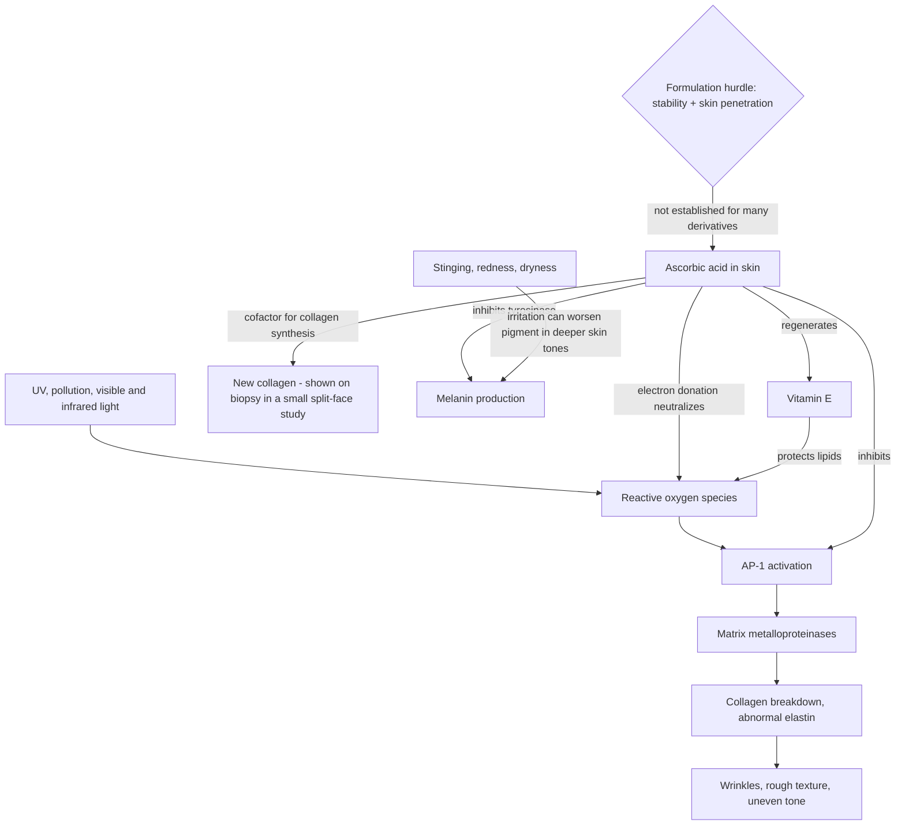

# Topical vitamin C

Topical vitamin C (ascorbic acid) is an antioxidant serum ingredient marketed for photoaging, wrinkles, collagen support, and hyperpigmentation. Ascorbic acid is a water-soluble vitamin naturally present in skin, where it is one component of the antioxidant defense system: it donates electrons to neutralize reactive oxygen species generated by ultraviolet radiation, pollution, infrared, and visible light. It is also a cofactor for the enzymes that form and stabilize collagen, influences collagen-gene expression, reduces collagen-degrading processes, and inhibits tyrosinase, the rate-limiting enzyme of melanin synthesis. Mechanism is therefore not the limiting question; the limits are the size of the clinical evidence base and whether a given finished product delivers stable ascorbic acid into skin. (@DrDrayzday (Dr Dray) — "Do You Actually Need Vitamin C Serum? A Dermatologist Explains", 2026-08-17, [link](https://www.youtube.com/watch?v=WQrwaOFMEzc))

## Evidence and its limits

### Strongest fair synthesis

Randomized controlled studies suggest topical vitamin C can modestly improve wrinkles, texture, or pigmentation over weeks to months. But the base is thin: a 2023 systematic review found seven eligible randomized studies totaling only 139 volunteers, using heterogeneous formulations (3.75%–20%), co-interventions, outcomes, and durations from two weeks to six months. A separate wrinkle review also found only seven studies and called for larger comparative trials. The evidence supports “optional adjunct with possible modest benefit,” not a required product, a universal concentration, or a class-wide claim for every serum.[^correia-2023][^sanabria-2023]

There are no strong head-to-head trials against tretinoin, hydroquinone, niacinamide, or sunscreen, so better than vehicle cannot be upgraded to must-have or equivalent efficacy. For photoaging overall, prescription retinoids have the stronger treatment evidence and sunscreen has the strongest preventive role. [[topical-retinoids]] [[photoprotection]]

### Adversarial pass: what narrows the conclusion

A recurring methodological confound inflates apparent benefit: photoaging trials often require and supply sunscreen to all participants, so a sun-damaged participant's dramatic several-month improvement mixes the serum's effect with newly consistent photoprotection. Split-face placebo-controlled designs (vitamin C on one side, sunscreen on both) can separate the two, but open-label and uncontrolled studies cannot — and even bland moisturization improves apparent tone by increasing water content and light scattering. Before-and-after photographs from such studies should be read against the design, not the abstract. This is a general lesson for appraising topical evidence ([[skincare-evidence-and-routine-design]]). (@DrDrayzday (Dr Dray) — "Do You Actually Need Vitamin C Serum? A Dermatologist Explains", 2026-08-17, [link](https://www.youtube.com/watch?v=WQrwaOFMEzc))

## Formulation, derivatives, and combinations

Pure ascorbic acid is unstable and penetrates skin poorly, so formulation determines whether a labeled concentration yields meaningful exposure. Derivatives may improve stability, but penetration, conversion, and clinical efficacy differ by molecule and finished product; a 2022 review found variable rather than uniformly absent evidence. No ingredient name alone establishes bioavailability or benefit. Vitamin E and ferulic acid can stabilize or complement ascorbic acid in some studied formulations, but combination evidence remains product-specific.[^enescu-2022]

For tetrahexyldecyl ascorbate and ascorbyl tetraisopalmitate, marketing claims exceed robust independent clinical evidence. This does not prove that they cannot work; it means efficacy must be demonstrated for the finished formulation rather than inferred from stability or cell-culture activity.

## Tolerability

Ascorbic acid serums commonly sting and can cause burning, redness, and dryness. Two groups deserve specific caution: people with deeper skin tones targeting dark spots, in whom product irritation directly worsens and entrenches hyperpigmentation ([[hyperpigmentation-and-dark-spots]]), and people with rosacea or otherwise reactive skin, who should not persevere through symptom-aggravating use. Dr Dray's own position is that she does not include vitamin C in her routine, preferring niacinamide as her tolerated antioxidant, while endorsing ascorbic acid as a sensible alternative for people who tolerate it but not niacinamide or retinoids. (@DrDrayzday (Dr Dray) — "Do You Actually Need Vitamin C Serum? A Dermatologist Explains", 2026-08-17, [link](https://www.youtube.com/watch?v=WQrwaOFMEzc))

## Evidence update — 2026-09-01

> **What changed:** The overall conclusion did not change: topical vitamin C is an optional adjunct supported by a small, heterogeneous trial base. The review narrowed categorical claims that only ascorbic acid can work and that derivatives have no human evidence; formulation-specific efficacy remains the correct standard. No evidence supports a universal concentration, daytime schedule, or substitution for retinoids. Irritation remains a practical stopping signal, especially when treating hyperpigmentation.

## Practical implications

- **Do not treat a vitamin C serum as a mandatory routine step — moderate-to-strong.** Prioritize daily sunscreen and, when appropriate and tolerated, a topical retinoid; these have the stronger evidence for the same goals (photoaging, pigment, tone). [[photoprotection]] [[topical-retinoids]] (@DrDrayzday (Dr Dray) — "Do You Actually Need Vitamin C Serum? A Dermatologist Explains", 2026-08-17, [link](https://www.youtube.com/watch?v=WQrwaOFMEzc))
- **If adding one, prefer a finished formulation with product-specific stability and clinical evidence—moderate.** Ingredient name, concentration, packaging, or price alone does not establish delivery or efficacy.
- **Use only on a schedule the skin tolerates; no reviewed outcome evidence makes daytime use mandatory or establishes equivalence to niacinamide or retinoids.**
- **Stop rather than persevere through stinging, redness, or dryness — strong for people with deeper skin tones treating dark spots (irritation worsens pigment) and for rosacea.** (@DrDrayzday (Dr Dray) — "Do You Actually Need Vitamin C Serum? A Dermatologist Explains", 2026-08-17, [link](https://www.youtube.com/watch?v=WQrwaOFMEzc))

## Gaps & open questions

- How does topical vitamin C compare head-to-head with tretinoin, niacinamide, hydroquinone, or sunscreen alone for photoaging and pigmentation?
- Which concentration, pH, and vehicle deliver meaningful ascorbic acid into skin, and how much trial benefit survives subtraction of the enforced-sunscreen effect?
- Do any derivatives penetrate, convert, and act in vivo at cosmetic concentrations?
- Does topical C + E + ferulic meaningfully change skin antioxidant capacity or photoprotection outcomes versus sunscreen alone?
- Are there identifiable responder groups (baseline dietary vitamin C status, photodamage severity, skin tone) for whom benefit is clinically meaningful?

## Related

[[topical-retinoids]] · [[photoprotection]] · [[hyperpigmentation-and-dark-spots]] · [[skincare-evidence-and-routine-design]] · [[topical-copper-peptides]] · [[skin-barrier-and-moisturization]] · [[dr-dray]]

## References

[^correia-2023]: Correia G, Magina S. “Efficacy of Topical Vitamin C in Melasma and Photoaging: A Systematic Review.” *Journal of Cosmetic Dermatology*, 2023. [systematic review]. [doi:10.1111/jocd.15748](https://doi.org/10.1111/jocd.15748)
[^sanabria-2023]: Sanabria B, et al. “Topical Vitamin C and the Skin: Mechanisms of Action and Clinical Applications.” *Journal of Drugs in Dermatology*, 2023. [systematic review]. [doi:10.36849/JDD.7332](https://doi.org/10.36849/JDD.7332)
[^enescu-2022]: Enescu CD, et al. “Vitamin C Derivatives in Cosmetic Formulations.” *Journal of Cosmetic Dermatology*, 2022. [review]. [doi:10.1111/jocd.14465](https://doi.org/10.1111/jocd.14465)
