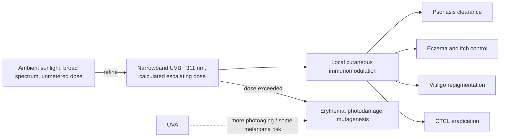

# UV phototherapy

UV phototherapy delivers a controlled wavelength band of ultraviolet light at a calculated, escalating dose to treat inflammatory and neoplastic skin disease. It descends from heliotherapy — deliberate sunlight treatment used since antiquity — refined by two controls ambient sun lacks: wavelength selection (modern practice favors narrowband UVB around 311 nm, avoiding the UVA wavelengths more implicated in photoaging and some melanomas, and the highly mutagenic UVC absent at sea level) and metered dosing, so the exposure lands in the therapeutic window rather than the burn range. The dose-makes-the-poison structure is the whole intervention: the same agent that in excess burns and mutates, at controlled dose immunomodulates. (@maxlugavere (Max Lugavere) — "The Skin Doctor: Hair Loss, Itchy Skin, Sunscreen Myths, and Anti-Aging Truths", 2026-07-15, [link](https://www.youtube.com/watch?v=99LCstvkNVw))

## Mechanism and indications

The working mechanism is local immunomodulation: UVB dampens pathogenic cutaneous immune activity (in vitiligo, the transcript frames it as calming the autoimmune attack on melanocytes; in psoriasis, suppressing the inflammatory drive behind plaques). Established indications described by a practicing dermatologic surgeon:

- **Psoriasis** — the foundational indication; described as exceptionally effective, often clearing patients topicals cannot, without systemic-drug adverse effects ([[psoriasis-and-systemic-inflammation]]).
- **Atopic dermatitis (eczema)** — controls skin symptoms and itch.
- **Vitiligo** — immunomodulatory repigmentation support.
- **Morphea** (localized scleroderma).
- **Chronic pruritus** — refractory itch of several causes ([[chronic-itch-and-pruritus]]).
- **Cutaneous T-cell lymphoma (CTCL)** — UV light is used to eradicate this skin lymphoma, the starkest demonstration that dosed UV can be anti-neoplastic while uncontrolled UV is carcinogenic.

Narrowband UVB photohardening for polymorphic light eruption is covered at [[photoprotection]]; psoralen-plus-UVA (PUVA) carries a different risk profile ([[lichen-simplex-chronicus]]). These indications are standard dermatologic practice relayed through the transcript; comparative efficacy figures, dosing protocols, and long-term carcinogenicity data were not externally reviewed for this page. (@maxlugavere (Max Lugavere) — "The Skin Doctor: Hair Loss, Itchy Skin, Sunscreen Myths, and Anti-Aging Truths", 2026-07-15, [link](https://www.youtube.com/watch?v=99LCstvkNVw))

The intervention is a useful corrective to categorical sun-fear: the same dermatology that warns against UV operates phototherapy units treating dozens of patients weekly. What separates therapy from harm is not the photon but wavelength control and dose control — an argument the source generalizes into his safe-sun-exposure position ([[skin-cancer-risk-and-immune-surveillance]]). (@maxlugavere (Max Lugavere) — "The Skin Doctor: Hair Loss, Itchy Skin, Sunscreen Myths, and Anti-Aging Truths", 2026-07-15, [link](https://www.youtube.com/watch?v=99LCstvkNVw))

## Practical implications

- **For psoriasis or eczema inadequately controlled by topicals: ask a dermatologist about narrowband UVB before or alongside systemic therapy — moderate-to-strong; long-established, guideline-supported modality with a favorable systemic-safety profile.** Requires repeated office visits (typically multiple sessions weekly), which is the main adherence cost.
- **For refractory chronic itch or vitiligo: supervised phototherapy is an established clinician-directed option — moderate.**
- **Do not self-treat with tanning beds or unmetered sun as phototherapy — strong safety principle.** Tanning beds deliver mostly UVA at uncontrolled doses; the therapeutic properties above belong to controlled narrowband dosing.

## Gaps & open questions

- What is the long-term skin-cancer risk of cumulative narrowband UVB in modern dosing regimens, by skin type?
- Can home narrowband UVB units reproduce office efficacy and safety with remote supervision?
- Which chronic-itch phenotypes respond best, and by what mechanism does UVB quiet non-histaminergic itch?

## Related

[[psoriasis-and-systemic-inflammation]] · [[chronic-itch-and-pruritus]] · [[skin-cancer-risk-and-immune-surveillance]] · [[photoprotection]] · [[home-skin-photobiomodulation]] · [[lichen-simplex-chronicus]] · [[teo-soleymani]]
